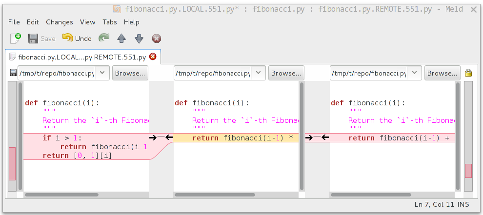

.. _chapter-manual-git:

================
Git the Hard Way
================

If you have no git experience, we recommend you to read the
:ref:`chapter-git_trac` chapter instead. The ``git-trac`` simplifies the
interaction with our git and trac servers.

If you want to contribute using git only, you are at the right place. This
chapter will tell you how to do so, assuming some basic familiarity with git. In
particular, you should have read :ref:`chapter-walkthrough` first.

Randall Munroe has provided a `basic overview <http://xkcd.com/1597/>`_.

We assume that you have a copy of the Sage git repository, for example
by running::

    [user@localhost ~]$ git clone git://github.com/sagemath/sage.git
    [user@localhost ~]$ cd sage
    [user@localhost sage]$ git checkout develop
    [user@localhost sage]$ make

.. _section-git-trac:

The Trac Server
===============

The Sage trac server also holds a copy of the Sage repository, it is
served via the ssh and git protocols. To add it as a remote repository
to your local git repository, use these commands::

    [user@localhost sage]$ git remote add trac git://trac.sagemath.org/sage.git -t master
    [user@localhost sage]$ git remote set-url --push trac git@trac.sagemath.org:sage.git
    [user@localhost sage]$ git remote -v
    origin      git://github.com/sagemath/sage.git (fetch)
    origin      git://github.com/sagemath/sage.git (push)
    trac        git://trac.sagemath.org/sage.git (fetch)
    trac        git@trac.sagemath.org:sage.git (push)

Instead of ``trac`` you can use any local name you want, of course. It
is perfectly fine to have multiple remote repositories for git, think
of them as bookmarks. You can then use ``git pull`` to get changes and
``git push`` to upload your local changes using::

    [user@localhost sage]$ git <push|pull> trac [ARGS]

.. note::

    In the command above we set up the remote to only track the
    ``master`` branch on the trac server (the ``-t master``
    option). This avoids clutter by not automatically downloading all
    branches ever created. But it also means that you will not fetch
    everything that is on trac by default, and you need to explicitly
    tell git which branch you want to get from trac. See the
    :ref:`section-git-checkout` section for examples.

We set up the remote here to perform read-only operations (fetch)
using the git protocol and write operations (push) using the ssh
protocol (specified by the ``git@`` part). To use the ssh protocol you
need to have a trac account and to set up your ssh public key as
described in :ref:`section-trac-ssh-key`. Authentication is necessary
if you want to upload anything to ensure that it really is from you.

If you want to use ssh only, use these commands::

    [user@localhost sage]$ git remote add trac git@trac.sagemath.org:sage.git -t master
    [user@localhost sage]$ git remote -v
    origin      git://github.com/sagemath/sage.git (fetch)
    origin      git://github.com/sagemath/sage.git (push)
    trac        git@trac.sagemath.org:sage.git (fetch)
    trac        git@trac.sagemath.org:sage.git (push)

.. _section-git-checkout:

Checking Out Tickets
--------------------

Trac tickets that are finished or in the process of being worked on
can have a git branch attached to them. This is the "Branch:" field in
the ticket description. The branch name is generally of the form
``u/user/description``, where ``user`` is the name of the user who
made the branch and ``description`` is some free-form short
description (and can include further slashes).

If you want to work with the changes in that remote branch, you must
make a local copy. In particular, git has no concept of directly
working with the remote branch, the remotes are only bookmarks for
things that you can get from/to the remote server. Hence, the first
thing you should do is to get everything from the trac server's branch
into your local repository. This is achieved by::

    [user@localhost sage]$ git fetch trac u/user/description
    remote: Counting objects: 62, done.
    remote: Compressing objects: 100% (48/48), done.
    remote: Total 48 (delta 42), reused 0 (delta 0)
    Unpacking objects: 100% (48/48), done.
    From trac.sagemath.org:sage
    * [new branch]      u/user/description -> FETCH_HEAD

The ``u/user/description`` branch is now temporarily (until you fetch
something else) stored in your local git database under the alias
``FETCH_HEAD``. In the second step, we make it available as a new
local branch and switch to it. Your local branch can have a different
name, for example::

    [user@localhost sage]$ git checkout -b my_branch FETCH_HEAD
    Switched to a new branch 'my_branch'

creates a new branch in your local git repository named ``my_branch``
and modifies your local Sage filesystem tree to the state of the files
in that ticket. You can now edit files and commit changes to your
local branch.

.. _section-git-push:

Pushing Your Changes to a Ticket
--------------------------------

To add your local branch to a trac ticket, you should first decide on
a name on the Sage trac repository.

For read/write permissions on git branches, see
:ref:`section-git_trac-branch-names`

In order to avoid name clashes, you can use
``u/your_username/a_description_of_your_branch`` (the description can contain
slashes, but no spaces). Then:

- **Fill** the ``Branch`` field of the trac ticket with that name.

- **Push** your branch to trac with either::

    [user@localhost sage]$ git push --set-upstream trac HEAD:u/user/description

  if you started the branch yourself and do not follow any other branch,
  or use::

    [user@localhost sage]$ git push trac HEAD:u/user/description

  if your branch already has an upstream branch.

Here, ``HEAD`` means that you are pushing the most recent commit (and, by
extension, all of its parent commits) of the current local branch to the remote
branch.

The ``Branch`` field on the trac ticket can appear in red/green. See
:ref:`section-trac-fields` to learn what it means.

.. _section-git-pull:

Getting Changes
---------------

A common task during development is to synchronize your local copy of
the branch with the branch on trac. In particular, assume you
downloaded somebody else's branch made some suggestions for
improvements on the trac ticket. Now the original author incorporated
your suggestions into his branch, and you want to get the added
changesets to complete your review. Assuming that you originally got
your local branch as in :ref:`section-git-checkout`, you can just
issue::

    [user@localhost sage]$ git pull trac u/user/description
    From trac.sagemath.org:sage
     * branch            u/user/description -> FETCH_HEAD
    Updating 8237337..07152d8
    Fast-forward
     src/sage/tests/cmdline.py      | 3 ++-
     1 file changed, 2 insertions(+), 1 deletions(-)

where now ``user`` is the other developer's trac username and
``description`` is some description that he chose. This command will
download the changes from the originally-used remote branch and merge
them into your local branch. If you haven't published your local
commits yet then you can also rebase them via::

    [user@localhost sage]$ git pull -r trac u/user/description
    From trac.sagemath.org:sage
     * branch            u/user/description -> FETCH_HEAD
    First, rewinding head to replay your work on top of it...
    Applying: my local commit

See :ref:`section-git-merge` section for an in-depth explanation of
merge vs. rebase.

So far, we assumed that there are no conflicts. It is unavoidable in
distributed development that, sometimes, the same location in a source
source file is changed by more than one person. Reconciling these
conflicting edits is explained in the :ref:`section-git_trac-conflict`
section.

.. _section-git-pull-master:

Updating Master
---------------

The ``master`` branch can be updated just like any other branch. However, your
local copy of the master branch should stay **identical** to the trac master
branch.

If you accidentally added commits to your local copy of ``master``, you must
delete them before updating the branch.

One way to ensure that you are notified of potential problems is to use ``git
pull --ff-only``, which will raise an error if a non-trivial merge would be
required::

    [user@localhost sage]$ git checkout master
    [user@localhost sage]$ git pull --ff-only trac master

If this pull fails, then something is wrong with the local copy of the
master branch. To switch to the correct Sage master branch, use::

    [user@localhost sage]$ git checkout master
    [user@localhost sage]$ git reset --hard trac/master

.. _section-git-merge:

Merging and Rebasing
====================

Sometimes, a new version of Sage is released while you work on a git branch.

Let us assume you started ``my_branch`` at commit ``B``. After a while, your
branch has advanced to commit ``Z``, but you updated ``master`` (see
:ref:`section-git-pull-master`) and now your git history looks like this (see
:ref:`section_walkthrough_logs`)::

                     X---Y---Z my_branch
                    /
               A---B---C---D master

How should you deal with such changes? In principle, there are two ways:

* **Rebase:** The first solution is to **replay** commits ``X,Y,Z`` atop of the
  new ``master``. This is called **rebase**, and it rewrites your current
  branch::

      git checkout my_branch
      git rebase -i master

  In terms of the commit graph, this results in::

                             X'--Y'--Z' my_branch
                            /
               A---B---C---D master

  Note that this operation rewrites the history of ``my_branch`` (see
  :ref:`section-git-rewriting-history`). This can lead to problems if somebody
  began to write code atop of your commits ``X,Y,Z``. It is safe otherwise.

  **Alternatively**, you can rebase ``my_branch`` while updating master at the
  same time (see :ref:`section-git-pull`)::

    git checkout my_branch
    git pull -r master

* **Merging** your branch with ``master`` will create a new commit above the two
  of them::

      git checkout my_branch
      git merge master

  The result is the following commit graph::

                     X---Y---Z---W my_branch
                    /           /
               A---B---C-------D master

  - **Pros:** you did not rewrite history (see
    :ref:`section-git-rewriting-history`).The additional commit is then easily
    pushed to the git repository and distributed to your collaborators.

  - **Cons:** it introduced an extra merge commit that would
    not be there had you used rebase.

  **Alternatively**, you can merge ``my_branch`` while updating master at the
  same time (see :ref:`section-git-pull`)::

    git checkout my_branch
    git pull master

**In case of doubt** use merge rather than rebase. There is less risk involved,
and rebase in this case is only useful for branches with a very long history.

Finally, **do nothing unless necessary:** it is perfectly fine for your branch
to be behind ``master``. You can always merge/rebase if/when your branch's name
appears in red on its trac page (see :ref:`section-trac-fields`), or when you
will really need a feature that is only available in the current master.

.. _section-git-mergetool:

Merge Tools
===========

Simple conflicts can be easily solved with git only (see :ref:`section-git_trac-conflict`)

For more complicated ones, a range of specialized programs are
available. Because the conflict marker includes the hash of the most recent
common parent, you can use a three-way diff::

    [alice@laptop]$ git mergetool

    This message is displayed because 'merge.tool' is not configured.
    See 'git mergetool --tool-help' or 'git help config' for more details.
    'git mergetool' will now attempt to use one of the following tools:
    meld opendiff kdiff3 [...] merge araxis bc3 codecompare emerge vimdiff
    Merging:
    fibonacci.py

    Normal merge conflict for 'fibonacci.py':
      {local}: modified file
      {remote}: modified file
    Hit return to start merge resolution tool (meld):

If you don't have a favourite merge tool we suggest you try `meld
<http://meldmerge.org/>`_ (cross-platform). The result looks like the following
screenshot.

The middle file is the most recent common parent; on the right is
Bob's version and on the left is Alice's conflicting version. Clicking
on the arrow moves the marked change to the file in the adjacent
pane.
