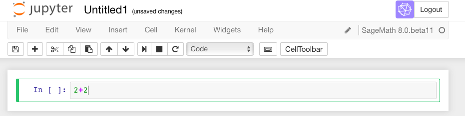
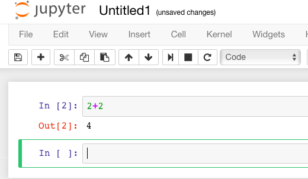
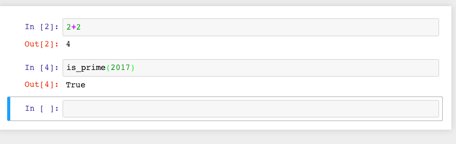
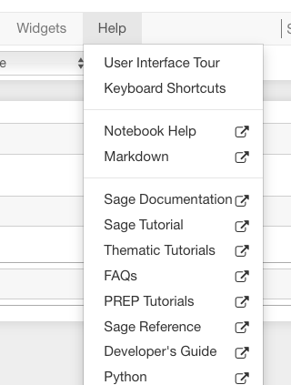
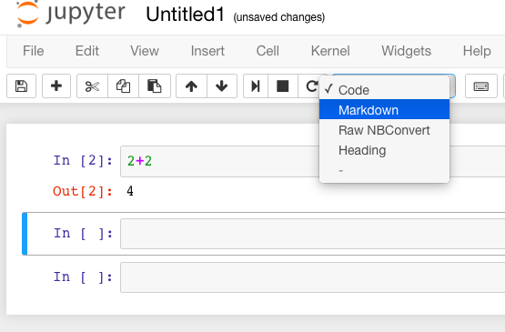
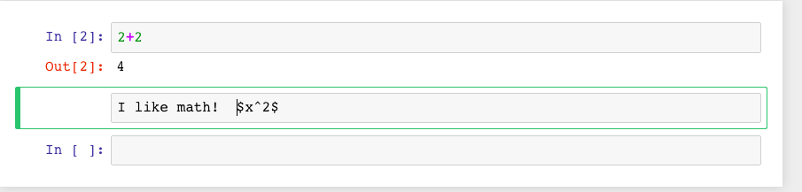
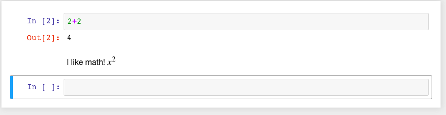
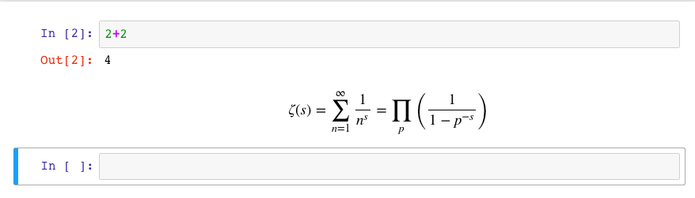

.. -*- coding: utf-8 -*-

.. linkall

.. _prep-intro-tutorial:

Introductory Sage Tutorial
==========================

This `Sage <http://www.sagemath.org>`_ document is the first in a series
of tutorials developed for the MAA PREP Workshop "Sage: Using
Open\-Source Mathematics Software with Undergraduates" (funding provided
by NSF DUE 0817071).  It is licensed under the Creative Commons
Attribution\-ShareAlike 3.0 license (`CC BY\-SA
<http://creativecommons.org/licenses/by-sa/3.0/>`_).

If you are unsure how to log on to a Sage server, start using a local 
installation, or to create a new worksheet, you might find the 
:doc:`prelude on logging in <Logging-On>` helpful.

Otherwise, you can continue with this tutorial, which has the
following sections:

- :ref:`SageCommands`

  - See :ref:`SageJupyterCommands` for the Jupyter notebook

- :ref:`SageFunctions`

- :ref:`SageHelp`

- :ref:`SageAnnotation`

  - See :ref:`JupyterAnnotation` for the Jupyter notebook

This tutorial only introduces the most basic level of functionality.
Later tutorials address topics such as calculus, advanced plotting, and
a wide variety of specific mathematical topics.

.. _SageCommands:

Evaluating Sage Commands
------------------------

.. rubric:: Or, How do I get Sage to do some math?

- See :ref:`SageJupyterCommands` for the Jupyter notebook

.. _SageJupyterCommands:

Evaluating in the Jupyter notebook
~~~~~~~~~~~~~~~~~~~~~~~~~~~~~~~~~~

In a Jupyter worksheet, there are little boxes called *input cells* or
*code cells*. They should be about the width of your browser.

.. image:: media/BlankJupyter.png
    :align: center

To do math in a Jupyter cell, one must do two things.

- First, click inside the cell so that the cell is active (i.e., has a
  bright green border).  This was already the case in the first cell
  above. (If it is blue, the Jupyter notebook is in "command mode").
  Type some math in it.

- Then, there are two options.  A not-very-evident icon that looks like
  the "play" symbol on a recording device can be clicked:

  .. image:: media/RunCellIcon.png
      :align: center

  Or one can use the keyboard shortcut of holding down the :kbd:`Shift` key
  while you press the :kbd:`Enter` key.
  We call this :kbd:`Shift` + :kbd:`Enter`.

Sage prints out its response just below the cell (that's the ``4``
below, so Sage confirms that :math:`2+2=4`).  Note also that Sage has
automatically made a new cell, and made it active, after you evaluated
your first cell.

To do more mathematics, just do the same thing with more cells!

One has to learn a variety of keyboard shortcuts
or click on various menu items to manipulate cells.  There is a help
menu to get you started on this; the Jupyter developers also maintain
`an example notebook <http://nbviewer.jupyter.org/github/ipython/ipython/blob/3.x/examples/Notebook/Index.ipynb>`_
which may assist you.

.. _SageFunctions:

Functions in Sage
-----------------

To start out, let's explore how to define and use functions in Sage.

For a typical mathematical function, it's pretty straightforward to
define it.  Below, we define a function.

.. MATH::

    f(x)=x^2

::

    sage: f(x)=x^2

Since all we wanted was to create the function :math:`f(x)`, Sage just does this and doesn't print anything out back to us.

We can check the definition by asking Sage what ``f(x)`` is:

::

    sage: f(x)
    x^2

If we just ask Sage what ``f`` is (as opposed to ``f(x)``), Sage prints
out the standard mathematical notation for a function that maps a
variable :math:`x` to the value :math:`x^2` (with the "maps to" arrow
:math:`\mapsto` as ``|-->``).

::

    sage: f
    x |--> x^2

We can evaluate :math:`f` at various values.

::

    sage: f(3)
    9

::

    sage: f(3.1)
    9.61000000000000

::

    sage: f(31/10)
    961/100

Notice that the output type changes depending on whether the input had a
decimal; we'll see that again below.

Naturally, we are not restricted to :math:`x` as a variable.  In the
next cell, we define the function :math:`g(y)=2y-1`.

::

    sage: g(y)=2*y-1

However, we need to make sure we do define a function if we use a new
variable.  In the next cell, we see what happens if we try to use a
random input by itself.

::

    sage: z^2
    Traceback (most recent call last):
    ...
    NameError: name 'z' is not defined

This is explained in some detail in following tutorials.  At this point,
it suffices to know using the function notation (like ``g(y)``) tells
Sage you are serious about ``y`` being a variable.

One can also do this with the ``var('z')`` notation below.

::

    sage: var('z')
    z
    sage: z^2
    z^2

This also demonstrates that we can put several commands in one cell,
each on a separate line.  The output of the last command (if any) is
printed as the output of the cell.

Sage knows various common mathematical constants, like :math:`\pi`
(``pi``) and :math:`e`.

::

    sage: f(pi)
    pi^2

::

    sage: f(e^-1)
    e^(-2)

In order to see a numeric approximation for an expression, just type the
expression inside the parentheses of ``N()``.

::

    sage: N(f(pi))
    9.86960440108936

Another option, often more useful in practice, is having the expression
immediately followed by ``.n()`` (note the dot).

::

    sage: f(pi).n()
    9.86960440108936

For now, we won't go in great depth explaining the reasons behind this
syntax, which may be new to you.  For those who are interested, Sage
often uses this type of syntax (known as "object\-oriented") because...

- Sage uses the Python programming language, which uses this syntax,
  'under the hood', and

- Because it makes it easier to distinguish among

 - The mathematical object,

 - The thing you are doing to it, and

 - Any ancillary arguments.

For example, the following numerically evaluates (``n``) the constant
:math:`\pi` (``pi``) to twenty digits (``digits=20``).

::

    sage: pi.n(digits=20)
    3.1415926535897932385

Sage has lots of common mathematical functions built in, like
:math:`\sqrt{x}` (``sqrt(x)``) and :math:`\ln(x)` (``ln(x)`` or
``log(x)``).

::

    sage: log(3)
    log(3)

Notice that there is no reason to numerically evaluate :math:`\log(3)`,
so Sage keeps it symbolic.  The same is true in the next cell -
:math:`2\log(3)=\log(9)`, but there isn't any reason to do that; after
all, depending on what you want, :math:`\log(9)` may be simpler or less
simple than you need.

::

    sage: log(3)+log(3)
    2*log(3)

::

    sage: log(3).n()
    1.09861228866811

Notice again that Sage tries to respect the type of input as much as
possible; adding the decimal tells Sage that we have approximate input
and want a more approximate answer.  (Full details are a little too
complicated for this introduction.)

::

    sage: log(3.)
    1.09861228866811

::

    sage: sqrt(2)
    sqrt(2)

If we want this to look nicer, we can use the ``show`` command.  We'll
see more of this sort of thing below.

.. skip

::

    sage: show(sqrt(2))

.. MATH::

    \sqrt{2}

::

    sage: sqrt(2).n()
    1.41421356237310

Do you remember what :math:`f` does?

::

    sage: f(sqrt(2))
    2

We can also plot functions easily.

::

    sage: plot(f, (x,-3,3))
    Graphics object consisting of 1 graphics primitive

In another tutorial, we will go more in depth with plotting.  Here, note
that the preferred syntax has the variable and endpoints for the
plotting domain in parentheses, separated by commas.

If you are feeling bold, plot the ``sqrt`` function in the next cell
between 0 and 100.

.. _SageHelp:

Help inside Sage
----------------

There are various ways to get help for doing things in Sage.  Here are
several common ways to get help as you are working in a Sage worksheet.

Documentation
~~~~~~~~~~~~~

Sage includes extensive documentation covering thousands of functions,
with many examples, tutorials, and other helps.

- One way to access these is to click the "Help" link at the top right
  of any worksheet, then click your preferred option at the top of the
  help page.

- They are also available any time online at the `Sage website
  <http://www.sagemath.org/help.html>`_, which has many other links, like
  video introductions.

- The `Quick Reference cards <http://wiki.sagemath.org/quickref>`_ are
  another useful tool once you get more familiar with Sage.

Our main focus in this tutorial, though, is help you can immediately
access from within a worksheet, where you don't have to do *any* of
those things.

Tab completion
~~~~~~~~~~~~~~

The most useful help available in the notebook is "tab completion".  The
idea is that even if you aren't one hundred percent sure of the name of
a command, the first few letters should still be enough to help find it.
Here's an example.

- Suppose you want to do a specific type of plot \- maybe a slope field
  plot \- but aren't quite sure what will do it.

- Still, it seems reasonable that the command might start with ``pl``.

- Then one can type ``pl`` in an input cell, and then press the :kbd:`Tab` key
  to see all the commands that start with the letters ``pl``.

Try tabbing after the ``pl`` in the following cell to see all the
commands that start with the letters ``pl``.  You should see that
``plot_slope_field`` is one of them.

.. skip

::

    sage: pl

To pick one, just click on it; to stop viewing them, press the
:kbd:`Escape` key.

You can also use this to see what you can do to an expression or
mathematical object.

- Assuming your expression has a name, type it;

- Then type a period after it,

- Then press tab.

You will see a list pop up of all the things you can do to the expression.

To try this, evaluate the following cell, just to make sure :math:`f` is
defined.

::

    sage: f(x)=x^2

Now put your cursor after the period and press your :kbd:`Tab` key.

.. skip

::

    sage: f.

Again, :kbd:`Escape` should remove the list.

One of the things in that list above was ``integrate``.  Let's try it.

::

    sage: f.integrate(x)
    x |--> 1/3*x^3

Finding documentation
~~~~~~~~~~~~~~~~~~~~~

.. rubric:: Or, Why all the question marks?

In the previous example, you might have wondered why I needed to put
``f.integrate(x)`` rather than just ``f.integrate()``, by analogy with
``sqrt(2).n()``.

To find out, there is another help tool one can use from right inside
the notebook.  Almost all documentation in Sage has extensive examples
that can illustrate how to use the function.

- As with tab completion, type the expression, period, and the name of
  the function.

- Then type a question mark.

- Press tab  *or*  evaluate to see the documentation.

To see how this help works, move your cursor after the question mark
below and press :kbd:`Tab`.

.. skip

::

    sage: f.integrate?

The examples illustrate that the syntax requires ``f.integrate(x)`` and
not just ``f.integrate()``.  (After all, the latter could be ambiguous
if several variables had already been defined).

To stop viewing the documentation after pressing :kbd:`Tab`, you can press the
:kbd:`Escape` key, just like with the completion of options.

If you would like the documentation to be visible longer\-term, you can
*evaluate* a command with the question mark (like below) to access the
documentation, rather than just tabbing.  Then it will stay there until
you remove the input cell.

.. skip

::

    sage: binomial?

Try this with another function!

Finding the source
~~~~~~~~~~~~~~~~~~

There is one more source of help you may find useful in the long run,
though perhaps not immediately.

- One can use *two* question marks after a function name to pull up the
  documentation *and* the source code for the function.

- Again, to see this help, you can either evaluate a cell like below, or
  just move your cursor after the question mark and press tab.

The ability to see the code (the underlying instructions to the
computer) is one of Sage's great strengths.  You can see *all* the code
to *everything* .

This means:

- *You*  can see what Sage is doing.

- Your curious students can see what is going on.

- And if you find a better way to do something, then you can see how to
  change it!

.. skip

::

    sage: binomial??

.. _SageAnnotation:

Annotating with Sage
--------------------

Whether one uses Sage in the classroom or in research, it is usually
helpful to describe to the reader what is being done, such as in the
description you are now reading.

- :ref:`JupyterAnnotation`

.. _JupyterAnnotation:

Jupyter Annotation
~~~~~~~~~~~~~~~~~~

Thanks to a styling language called
`Markdown <http://jupyter-notebook.readthedocs.io/en/latest/examples/Notebook/Working%20With%20Markdown%20Cells.html>`_
and the TeX rendering engine called
`MathJax <http://www.mathjax.org/>`_, you can type much
more in Sage than just Sage commands.  This math\-aware setup makes Sage
perfect for annotating computations.

Jupyter notebook can function as a word processor.
To use this functionality, we create a *Markdown cell* (as opposed to a
*input cell* that contains Sage commands that Sage evaluates).

To do this without the keyboard shortcut, there is a menu for each cell;
select "Markdown".

Now you can type in whatever you want, including mathematics using
LaTeX.

Then evaluate the cell (for instance, with "Shift\-Enter"):

Markdown supports a fair amount of basic formatting, such as bold,
underline, basic lists, and so forth.

It can be fun to type in fairly complicated math, like this:

.. MATH::

   \zeta(s)=\sum_{n=1}^{\infty}\frac{1}{n^s}=\prod_p \left(\frac{1}{1-p^{-s}}\right)\; .

One just types things like:

.. CODE-BLOCK:: latex

   $$\zeta(s)=\sum_{n=1}^{\infty}\frac{1}{n^s}=\prod_p \left(\frac{1}{1-p^{-s}}\right)$$

in a Markdown cell.

Of course, one can do much more, since Sage can execute arbitrary
commands in the `Python <http://www.python.org>`_ programming language,
as well as output nicely formatted HTML, and so on.  If you have enough
programming experience to do things like this, go for it!

.. skip

::

    sage: html("Sage is <a style='text-decoration:line-through'>somewhat</a> <b>really</b> cool! 
(It even does HTML.)
")

.. _Conclusion:

Conclusion
----------

This concludes the introductory tutorial.  Our hope is that now you can
try finding and using simple commands and functions in Sage.  Remember,
help is as close as the notebook, or at `the Sage website
<http://www.sagemath.org>`_.

