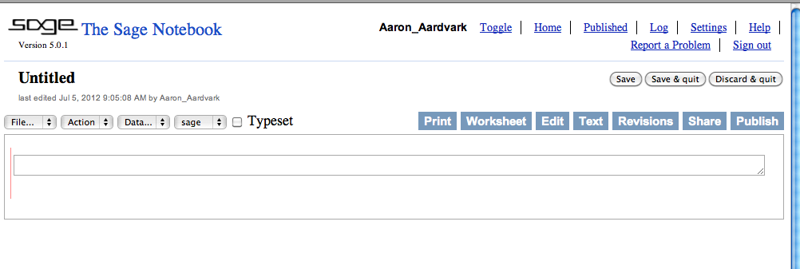
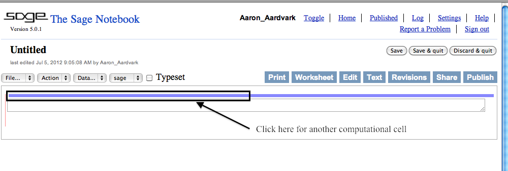

.. -*- coding: utf-8 -*-

.. linkall

Introductory Sage Tutorial
==========================

This `Sage <http://www.sagemath.org>`_ document is the first in a series
of tutorials developed for the MAA PREP Workshop "Sage: Using
Open\-Source Mathematics Software with Undergraduates" (funding provided
by NSF DUE 0817071).  It is licensed under the Creative Commons
Attribution\-ShareAlike 3.0 license (`CC BY\-SA
<http://creativecommons.org/licenses/by-sa/3.0/>`_).

If you are unsure how to log on to a Sage server or to create a new
worksheet, you might find the :doc:`prelude on logging in <Logging-On>`
helpful.  Otherwise, you can continue with this tutorial, which has the
following sections:

- :ref:`SageCommands`

- :ref:`SageFunctions`

- :ref:`SageHelp`

- :ref:`SageAnnotation`

This tutorial only introduces the most basic level of functionality.
Later tutorials address topics such as calculus, advanced plotting, and
a wide variety of specific mathematical topics.

.. _SageCommands:

Evaluating Sage Commands
------------------------

.. rubric:: Or, How do I get Sage to do some math?

In any Sage worksheet, there are little boxes called *input cells* or
*code cells*. They should be about the width of your browser.

Evaluating the content of an input cell is very easy.

- First, click inside the cell so that the cell is active (i.e., has a
  bright blue border).

  .. image:: media/ActiveCell.png
      :align: center

- Then, just below the cell on the left, an "evaluate" link appears;
  clicking this link evaluates the cell.

  .. image:: media/EvaluateCell.png
      :align: center

If you are using the live version of this documentation, try evaluating
the following cell.

::

    sage: 2+2
    4

Sage prints out its response just below the cell (that's the ``4``
above, so Sage confirms that :math:`2+2=4`).  Note also that Sage has
automatically made the next cell active after you evaluated your first
cell.

You can also evaluate a cell using a keyboard shortcut.

- If a cell isn't active (such as below, in the live documentation),
  click in it.

- Then hold down the Shift key while you press the Enter key.

We call this "Shift\-Enter".  Try doing Shift\-Enter with this cell.

::

    sage: factor(2012)
    2^2 * 503

An input cell isn't much use if it can only do one thing, so you can
edit a cell and evaluate it again.  Just click inside, and then make any
changes you wish by typing as usual.

Try changing the number ``2012`` above to ``2011`` and evaluate the cell
to find its factorization (surprised?); then try your own favorite
number.

To do more math, we'll need to be able to create new input cells.  This
is also easy.

- Move your cursor over the space above or below another cell.

- A blue horizontal line as wide as the browser should appear.

- Click on the line to insert a new cell.

If for some reason you need to remove or delete an input cell, just
delete all the text inside of it, and then press backspace in the
now\-empty cell.

Try creating a few new input cells below, doing some arithmetic in those
cells, and then deleting one of the input cells.

.. skip

::

    'Do some arithmetic in me, and make some other cells after me!'

.. _SageFunctions:

Functions in Sage
-----------------

To start out, let's explore how to define and use functions in Sage.

For a typical mathematical function, it's pretty straightforward to
define it.  Below, we define a function.

.. MATH::

    f(x)=x^2

::

    sage: f(x)=x^2

Since all we wanted was to create the function :math:`f(x)`, Sage just does this and doesn't print anything out back to us.

We can check the definition by asking Sage what ``f(x)`` is:

::

    sage: f(x)
    x^2

If we just ask Sage what ``f`` is (as opposed to ``f(x)``), Sage prints
out the standard mathematical notation for a function that maps a
variable :math:`x` to the value :math:`x^2` (with the "maps to" arrow
:math:`\mapsto` as ``|-->``).

::

    sage: f
    x |--> x^2

We can evaluate :math:`f` at various values.

::

    sage: f(3)
    9

::

    sage: f(3.1)
    9.61000000000000

::

    sage: f(31/10)
    961/100

Notice that the output type changes depending on whether the input had a
decimal; we'll see that again below.

Naturally, we are not restricted to :math:`x` as a variable.  In the
next cell, we define the function :math:`g(y)=2y-1`.

::

    sage: g(y)=2*y-1

However, we need to make sure we do define a function if we use a new
variable.  In the next cell, we see what happens if we try to use a
random input by itself.

::

    sage: z^2
    Traceback (most recent call last):
    ...
    NameError: name 'z' is not defined

This is explained in some detail in following tutorials.  At this point,
it suffices to know using the function notation (like ``g(y)``) tells
Sage you are serious about ``y`` being a variable.

One can also do this with the ``var('z')`` notation below.

::

    sage: var('z')
    z
    sage: z^2
    z^2

This also demonstrates that we can put several commands in one cell,
each on a separate line.  The output of the last command (if any) is
printed as the output of the cell.

Sage knows various common mathematical constants, like :math:`\pi`
(``pi``) and :math:`e`.

::

    sage: f(pi)
    pi^2

::

    sage: f(e^-1)
    e^(-2)

In order to see a numeric approximation for an expression, just type the
expression inside the parentheses of ``N()``.

::

    sage: N(f(pi))
    9.86960440108936

Another option, often more useful in practice, is having the expression
immediately followed by ``.n()`` (note the dot).

::

    sage: f(pi).n()
    9.86960440108936

For now, we won't go in great depth explaining the reasons behind this
syntax, which may be new to you.  For those who are interested, Sage
often uses this type of syntax (known as "object\-oriented") because...

- Sage uses the Python programming language, which uses this syntax,
  'under the hood', and

- Because it makes it easier to distinguish among

 - The mathematical object,

 - The thing you are doing to it, and

 - Any ancillary arguments.

For example, the following numerically evaluates (``n``) the constant
:math:`\pi` (``pi``) to twenty digits (``digits=20``).

::

    sage: pi.n(digits=20)
    3.1415926535897932385

Sage has lots of common mathematical functions built in, like
:math:`\sqrt{x}` (``sqrt(x)``) and :math:`\ln(x)` (``ln(x)`` or
``log(x)``).

::

    sage: log(3)
    log(3)

Notice that there is no reason to numerically evaluate :math:`\log(3)`,
so Sage keeps it symbolic.  The same is true in the next cell -
:math:`2\log(3)=\log(9)`, but there isn't any reason to do that; after
all, depending on what you want, :math:`\log(9)` may be simpler or less
simple than you need.

::

    sage: log(3)+log(3)
    2*log(3)

::

    sage: log(3).n()
    1.09861228866811

Notice again that Sage tries to respect the type of input as much as
possible; adding the decimal tells Sage that we have approximate input
and want a more approximate answer.  (Full details are a little too
complicated for this introduction.)

::

    sage: log(3.)
    1.09861228866811

::

    sage: sqrt(2)
    sqrt(2)

If we want this to look nicer, we can use the ``show`` command.  We'll
see more of this sort of thing below.

.. skip

::

    sage: show(sqrt(2))

.. MATH::

    \sqrt{2}

::

    sage: sqrt(2).n()
    1.41421356237310

Do you remember what :math:`f` does?

::

    sage: f(sqrt(2))
    2

We can also plot functions easily.

::

    sage: plot(f, (x,-3,3))
    Graphics object consisting of 1 graphics primitive

In another tutorial, we will go more in depth with plotting.  Here, note
that the preferred syntax has the variable and endpoints for the
plotting domain in parentheses, separated by commas.

If you are feeling bold, plot the ``sqrt`` function in the next cell
between 0 and 100.

.. _SageHelp:

Help inside Sage
----------------

There are various ways to get help for doing things in Sage.  Here are
several common ways to get help as you are working in a Sage worksheet.

Documentation
~~~~~~~~~~~~~

Sage includes extensive documentation covering thousands of functions,
with many examples, tutorials, and other helps.

- One way to access these is to click the "Help" link at the top right
  of any worksheet, then click your preferred option at the top of the
  help page.

- They are also available any time online at the `Sage website
  <http://www.sagemath.org/help.html>`_, which has many other links, like
  video introductions.

- The `Quick Reference cards <http://wiki.sagemath.org/quickref>`_ are
  another useful tool once you get more familiar with Sage.

Our main focus in this tutorial, though, is help you can immediately
access from within a worksheet, where you don't have to do *any* of
those things.

Tab completion
~~~~~~~~~~~~~~

The most useful help available in the notebook is "tab completion".  The
idea is that even if you aren't one hundred percent sure of the name of
a command, the first few letters should still be enough to help find it.
Here's an example.

- Suppose you want to do a specific type of plot \- maybe a slope field
  plot \- but aren't quite sure what will do it.

- Still, it seems reasonable that the command might start with ``pl``.

- Then one can type ``pl`` in an input cell, and then press the tab key
  to see all the commands that start with the letters ``pl``.

Try tabbing after the ``pl`` in the following cell to see all the
commands that start with the letters ``pl``.  You should see that
``plot_slope_field`` is one of them.

.. skip

::

    sage: pl

To pick one, just click on it; to stop viewing them, press the
Escape/esc key.

You can also use this to see what you can do to an expression or
mathematical object.

- Assuming your expression has a name, type it;

- Then type a period after it,

- Then press tab.

You will see a list pop up of all the things you can do to the expression.

To try this, evaluate the following cell, just to make sure :math:`f` is
defined.

::

    sage: f(x)=x^2

Now put your cursor after the period and press your tab key.

.. skip

::

    sage: f.

Again, Escape should remove the list.

One of the things in that list above was ``integrate``.  Let's try it.

::

    sage: f.integrate(x)
    x |--> 1/3*x^3

Finding documentation
~~~~~~~~~~~~~~~~~~~~~

.. rubric:: Or, Why all the question marks?

In the previous example, you might have wondered why I needed to put
``f.integrate(x)`` rather than just ``f.integrate()``, by analogy with
``sqrt(2).n()``.

To find out, there is another help tool one can use from right inside
the notebook.  Almost all documentation in Sage has extensive examples
that can illustrate how to use the function.

- As with tab completion, type the expression, period, and the name of
  the function.

- Then type a question mark.

- Press tab  *or*  evaluate to see the documentation.

To see how this help works, move your cursor after the question mark
below and press tab.

.. skip

::

    sage: f.integrate?

The examples illustrate that the syntax requires ``f.integrate(x)`` and
not just ``f.integrate()``.  (After all, the latter could be ambiguous
if several variables had already been defined).

To stop viewing the documentation after pressing tab, you can press the
Escape key, just like with the completion of options.

If you would like the documentation to be visible longer\-term, you can
*evaluate* a command with the question mark (like below) to access the
documentation, rather than just tabbing.  Then it will stay there until
you remove the input cell.

.. skip

::

    sage: binomial?

Try this with another function!

Finding the source
~~~~~~~~~~~~~~~~~~

There is one more source of help you may find useful in the long run,
though perhaps not immediately.

- One can use *two* question marks after a function name to pull up the
  documentation *and* the source code for the function.

- Again, to see this help, you can either evaluate a cell like below, or
  just move your cursor after the question mark and press tab.

The ability to see the code (the underlying instructions to the
computer) is one of Sage's great strengths.  You can see *all* the code
to *everything* .

This means:

- *You*  can see what Sage is doing.

- Your curious students can see what is going on.

- And if you find a better way to do something, then you can see how to
  change it!

.. skip

::

    sage: binomial??

.. _SageAnnotation:

Annotating with Sage
--------------------

Whether one uses Sage in the classroom or in research, it is usually
helpful to describe to the reader what is being done, such as in the
description you are now reading.

Thanks to `the mini\-word processor TinyMCE
<http://tinymce.moxiecode.com/>`_ and a TeX rendering engine called
`MathJax <http://www.mathjax.org/>`_, you can type much
more in Sage than just Sage commands.  This math\-aware setup makes Sage
perfect for annotating computations.

To use the word processor, we create a *text cell* (as opposed to a
*input cell* that contains Sage commands that Sage evaluates).

To create a text cell, do the following.

- First, move the cursor between two input cells, until the thin blue
  line appears.

- Then hold the Shift key and click on the thin blue line.

  .. image:: media/ClickBlueLine.png
      :align: center

So to create an input cell, one merely clicks, but one "Shift\-Click"s
to create a text cell.  Here is what your text cell will look like.

  .. image:: media/TextEditor.png
      :align: center

In the live documentation, try inserting a text cell between the input
cells below.

.. skip

::

    2+2

.. skip

::

    2+2

TinyMCE makes it easy for format text in many ways.  Try experimenting
with the usual **bold** button, underline button, different text fonts
and colors, ordered and unordered lists, centering, and so on. Some of
the shortcut keys you are familiar with from other word processors may
also work, depending on your system.

There are two other things you can do which take advantage of the
worksheet being on the web.

- It is easy to link to other helpful websites for additional information.

 - While in the editor, highlight a word or two, and then click on the
   little chain link toward the bottom right of the buttons.

 - You can now type in a web address to link to.

 - Be sure to prepend ``http://`` to the address.  Normally, one should
   also select it to appear in a new window (so the Sage session isn't
   interrupted if someone clicks on it).

- You may have already noticed that some of the descriptions above had
  typeset mathematics in them. In fact we can add nearly arbitrary LaTeX
  to our text cells!

 - For instance, it isn't too hard to add things like

    .. MATH::

       \zeta(s)=\sum_{n=1}^{\infty}\frac{1}{n^s}=\prod_p \left(\frac{1}{1-p^{-s}}\right)\; .

 - One just types things like::

       $$\zeta(s)=\sum_{n=1}^{\infty}\frac{1}{n^s}=\prod_p \left(\frac{1}{1-p^{-s}}\right)$$

   in the word processor.

 - Whether this shows up as nicely as possible depends on what fonts you
   have in your browser, but it should be legible.

 - More realistically, we might type ``$f(x)=x^2$`` so that we remember
   that :math:`f(x)=x^2` in this worksheet.

Here is a simpler example.

::

    sage: f(x)=x^2
    sage: f(9)
    81

If :math:`f(x)=x^2`, then :math:`f(9)=81`.

It is simple to edit a text cell; simply double\-click on the text.

If you are in the live version of this tutorial, try double\-clicking on
this text to edit this text cell (or any text cell) to see how we typed
the mathematics!

Of course, one can do much more, since Sage can execute arbitrary
commands in the `Python <http://www.python.org>`_ programming language,
as well as output nicely formatted HTML, and so on.  If you have enough
programming experience to do things like this, go for it!

.. skip

::

    sage: html("Sage is <a style='text-decoration:line-through'>somewhat</a> <b>really</b> cool! 
(It even does HTML.)
")

This concludes the introductory tutorial.  Our hope is that now you can
try finding and using simple commands and functions in Sage.  Remember,
help is as close as the notebook, or at `the Sage website
<http://www.sagemath.org>`_.

