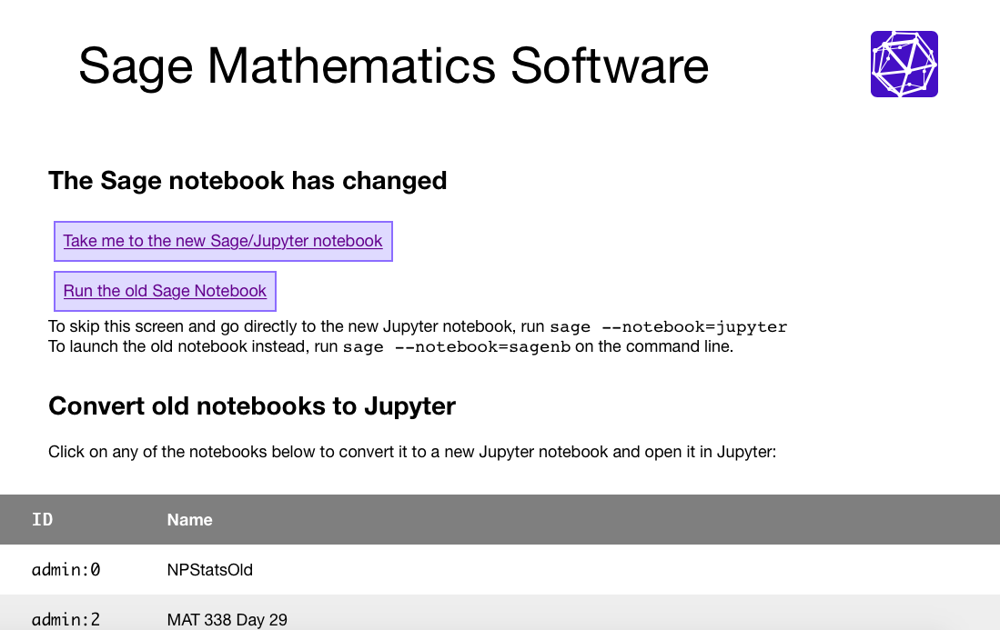
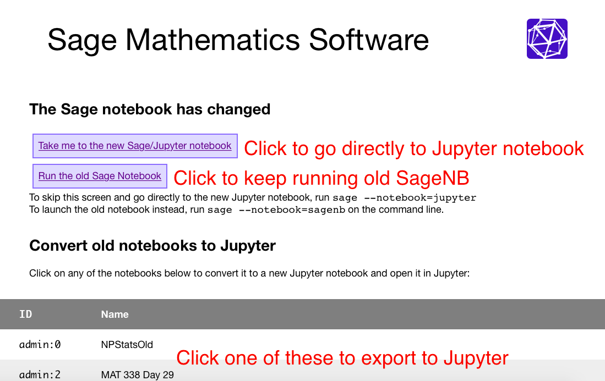
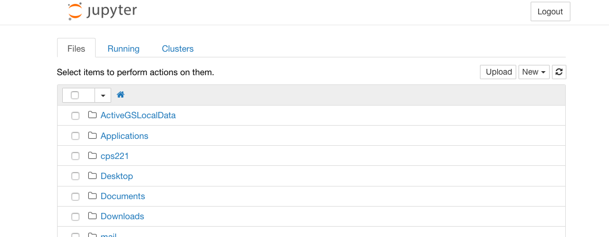
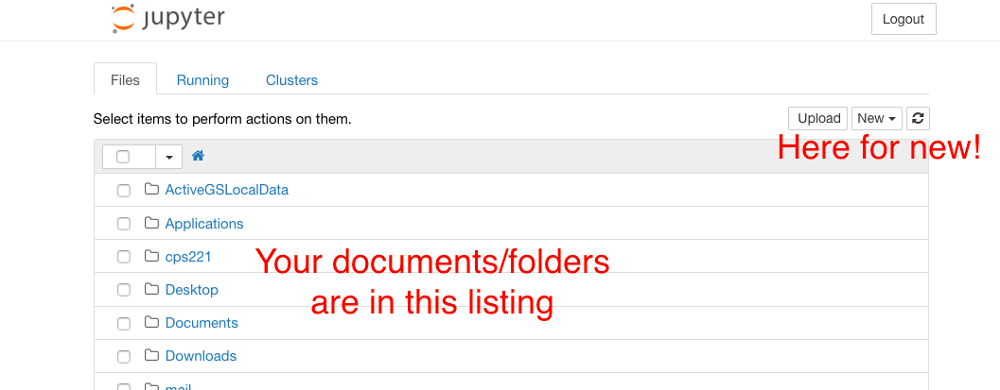
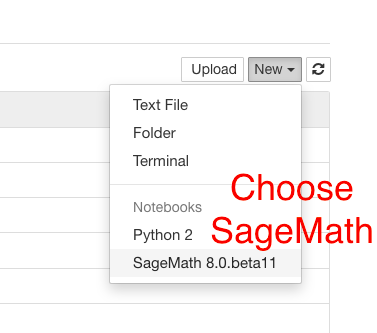
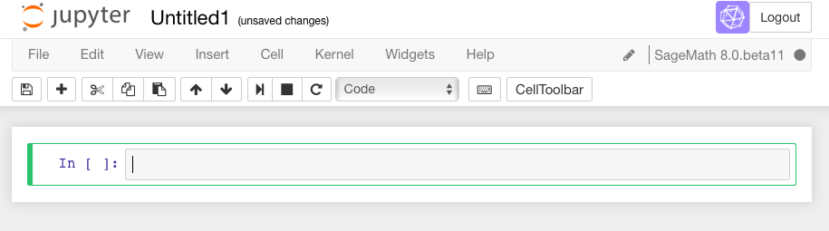

.. -*- coding: utf-8 -*-

.. linkall

.. _prep-logging-on:
.. _logging-on:

Logging on and Making a Worksheet
=================================

This `Sage <http://www.sagemath.org>`_ worksheet is from a series of
tutorials developed for the MAA PREP Workshop "Sage: Using Open\-Source
Mathematics Software with Undergraduates" (funding provided by NSF DUE
0817071).  It is licensed under the Creative Commons
Attribution\-ShareAlike 3.0 license (`CC BY\-SA
<http://creativecommons.org/licenses/by-sa/3.0/>`_).

This document describes how to get into a Sage worksheet in the first
place. If you already feel comfortable with this process, or at least
comfortable enough to see how to actually use Sage, the main content of
the tutorials begins with :doc:`the introductory tutorial
<Intro-Tutorial>`.

There are three main types of worksheets for Sage, all of which have
somewhat similar behavior.

- If you are using the Jupyter notebook or starting Sage from the
  command line, you may see some screens about :ref:`exporting <Export>`.
  We have basic information about this.

- If you are using the CoCalc SageMath worksheets, you will want to
  contact them or read some of their `documentation <https://github.com/sagemathinc/cocalc/wiki/sagews>`_
  for further assistance.

.. _Export:

The Export screen and Jupyter notebook
^^^^^^^^^^^^^^^^^^^^^^^^^^^^^^^^^^^^^^

Starting in Sage 8.0, the default is to provide the Jupyter notebook
for your worksheet experience via an export screen.  When you start
Sage you may see a screen like this.

There are three actions you can take, each of which is highlighted
in the next picture.  Note that if you have no previous worksheets,
the third option to "export" them will not make sense.  

The legacy SageNB has been retired in Sage 9.1.
Please use the Jupyter notebook.  Jupyter will bring you to a screen
that is simply a listing of files in whatever folder Sage has opened in.

If you want to start a worksheet, you will look at the upper right corner
and ask for a new worksheet:

.. NOTE::

   The Jupyter notebook saves your files locally in your normal
   filesystem, as normal file names.  So if you start the notebook
   from a different location than usual, you may have to navigate
   a bit to find your worksheet.

Jupyter will allow you many types of files to open.  To use
SageMath directly, just choose the Sage type; this will ensure that
Jupyter runs using Sage and not pure Python or some other language.

You should now have a worksheet that looks more or less like this.

Now you are ready to begin to :ref:`evaluate Sage commands
<SageCommands>`!
