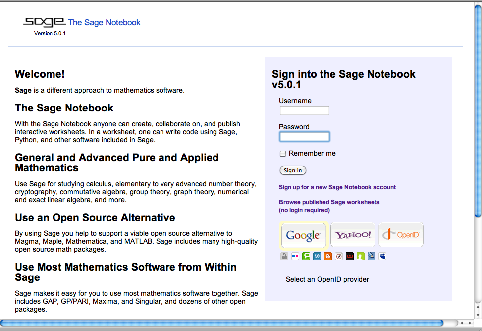
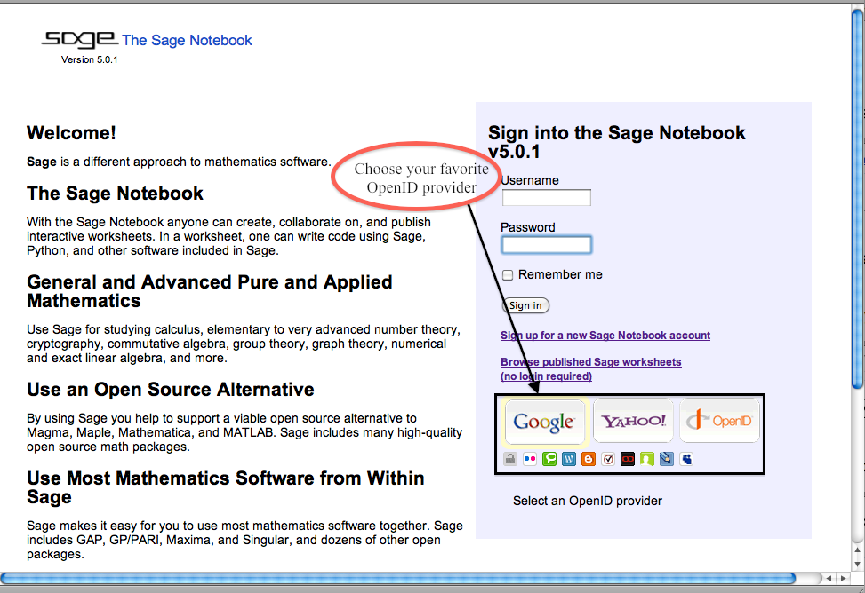
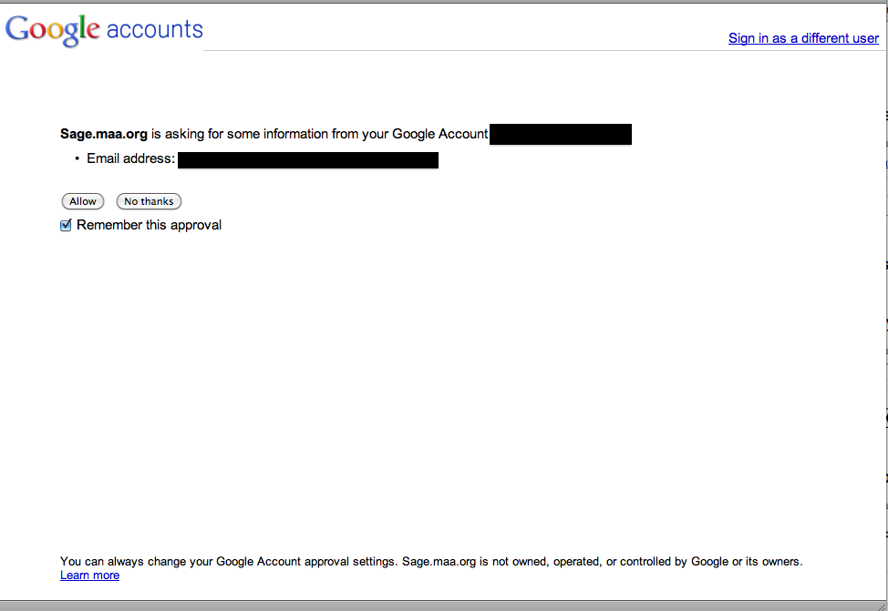
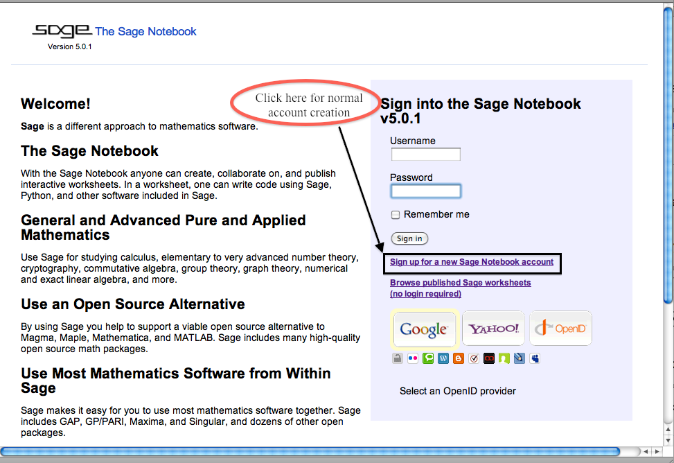
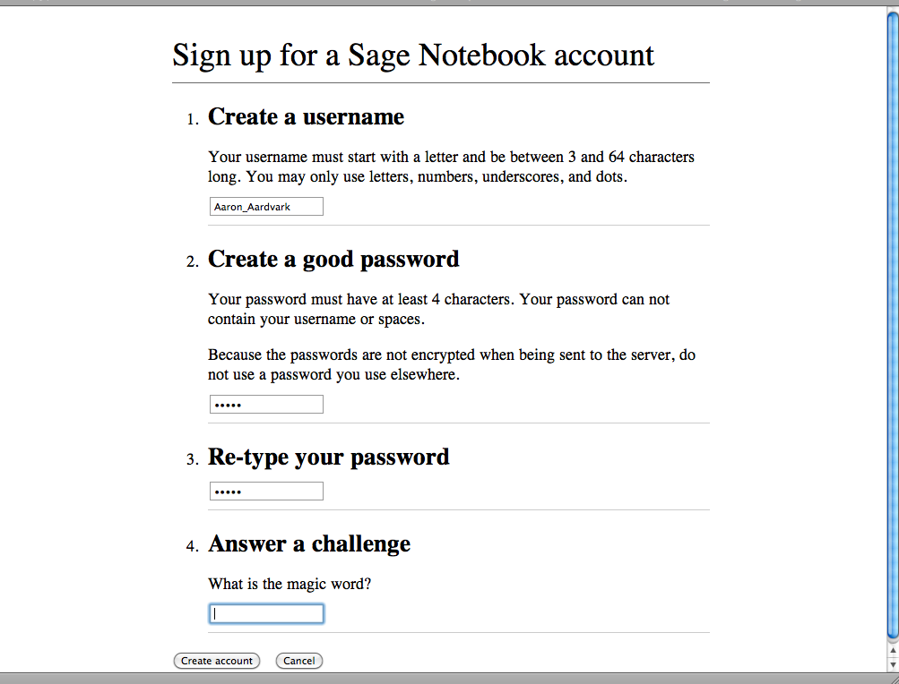
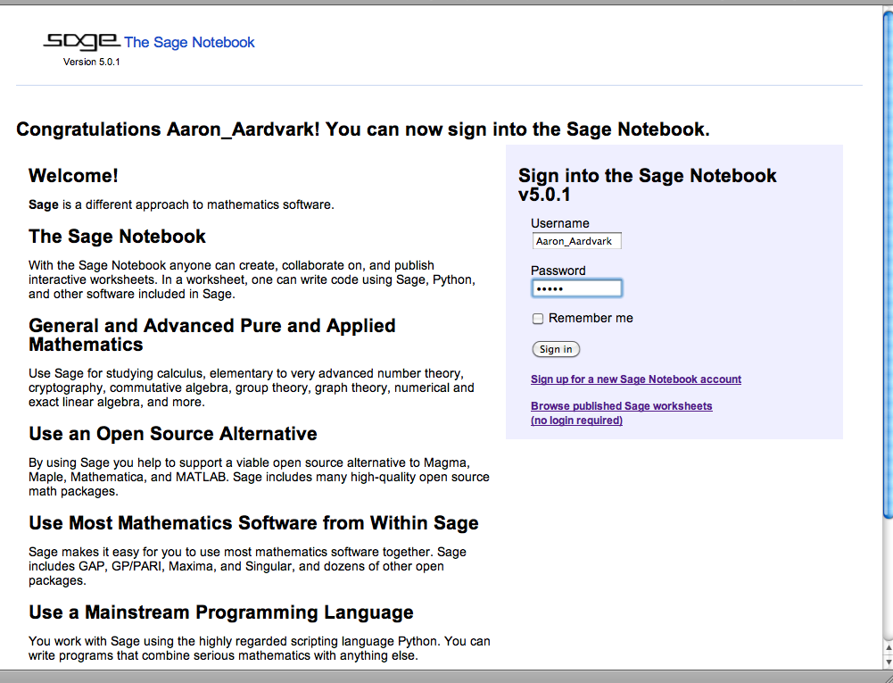
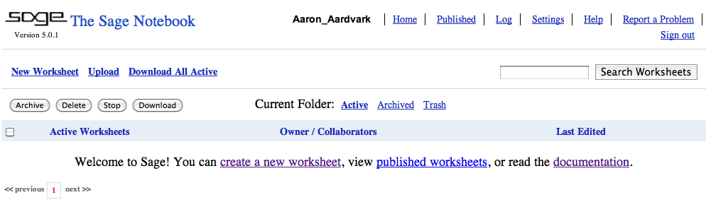
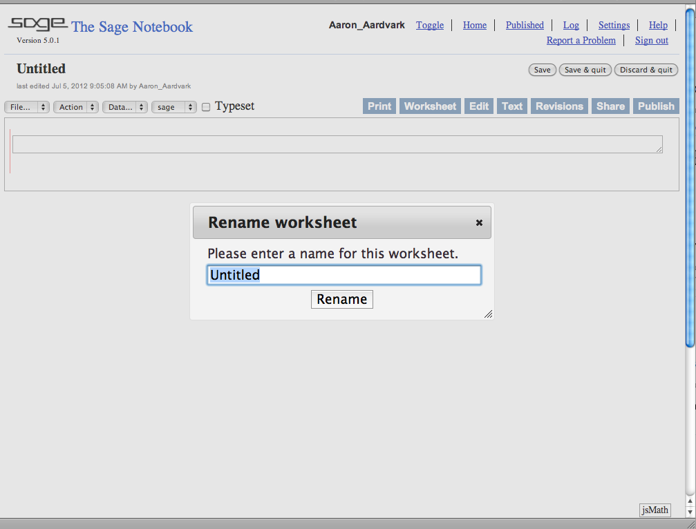
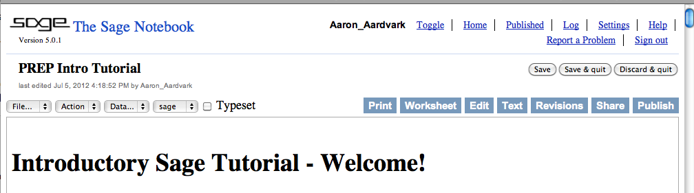

.. -*- coding: utf-8 -*-

.. linkall

.. _prep-logging-on:
.. _logging-on:

Logging on and Making a Worksheet
=================================

This `Sage <http://www.sagemath.org>`_ worksheet is from a series of
tutorials developed for the MAA PREP Workshop "Sage: Using Open\-Source
Mathematics Software with Undergraduates" (funding provided by NSF DUE
0817071).  It is licensed under the Creative Commons
Attribution\-ShareAlike 3.0 license (`CC BY\-SA
<http://creativecommons.org/licenses/by-sa/3.0/>`_).

This document describes how to get into a Sage worksheet in the first
place. If you already feel comfortable with this process, or at least
comfortable enough to see how to actually use Sage, the main content of
the tutorials begins with :doc:`the introductory tutorial
<Intro-Tutorial>`.

There are three main types of worksheets for Sage, all of which have
somewhat similar behavior.

- If you are using the Jupyter notebook or starting Sage from the
  command line, you may see some screens about :ref:`exporting <Export>`.
  We have basic information about this.

- If you are using the CoCalc SageMath worksheets, you will want to
  contact them or read some of their `documentation <https://github.com/sagemathinc/cocalc/wiki/sagews>`_
  for further assistance.

- Further below, we describe the process for logging on and making a
  worksheet in the legacy :ref:`SageNB <SageNB>` server, including:

  - :ref:`logging in <LogOn>` for the first time

  - :ref:`editing a copy <LiveCopy>` of a worksheet someone sent you

  - :ref:`making your own worksheet <FromScratch>` from scratch

.. _Export:

The Export screen and Jupyter notebook
^^^^^^^^^^^^^^^^^^^^^^^^^^^^^^^^^^^^^^

Starting in Sage 8.0, the default is to provide the Jupyter notebook
for your worksheet experience via an export screen.  When you start
Sage you may see a screen like this.

.. image:: media/NotebookExport.png
    :align: center

There are three actions you can take, each of which is highlighted
in the next picture.  Note that if you have no previous worksheets,
the third option to "export" them will not make sense.  

.. image:: media/NotebookExportDetails.png
    :align: center

The legacy SageNB is still a powerful web app, and has some advantages,
but is not longer under active development, so we recommend that new users
start with the Jupyter notebook.  Jupyter will bring you to a screen
that is simply a listing of files in whatever folder Sage has opened in.

.. image:: media/JupyterIntroScreen.png
    :align: center

If you want to start a worksheet, you will look at the upper right corner
and ask for a new worksheet:

.. image:: media/JupyterIntroDetails.png
    :align: center

.. NOTE::

   The Jupyter notebook saves your files locally in your normal
   filesystem, as normal file names.  So if you start the notebook
   from a different location than usual, you may have to navigate
   a bit to find your worksheet.

Jupyter will allow you many types of files to open.  To use
SageMath directly, just choose the Sage type; this will ensure that
Jupyter runs using Sage and not pure Python or some other language.

.. image:: media/FileChoose.png
    :align: center

You should now have a worksheet that looks more or less like this.

.. image:: media/BlankJupyter.png
    :align: center

Now you are ready to begin to :ref:`evaluate Sage commands
<SageCommands>`!

.. _SageNB:

Instructions for SageNB server
^^^^^^^^^^^^^^^^^^^^^^^^^^^^^^

.. _LogOn:

Creating an Account
-------------------

When coming to a Sage server for the first time, it will look something
like this.

You can create an account in three ways.

- Use an :ref:`OpenID <OpenID>` account to verify your account

- Create a login in the :ref:`standard way <Standard>` by creating a
  username and password.

- If you have opened it on your local machine (e.g. from the command
  line or the Mac app), you should be automatically logged in.

.. _OpenID:

OpenID
~~~~~~

With many public Sage servers, you can use an OpenID such as Google,
Yahoo!, and so forth to create an account.

To create an account, just make sure you are logged in with your
verification website, and then click the correct logo of the many on the
lower right.  Then you should come to a page like this.

From there, you should be taken directly to your new notebook, ready to
make your :ref:`first worksheet <FromScratch>`.

.. _Standard:

Standard Account Creation
~~~~~~~~~~~~~~~~~~~~~~~~~

The normal way to create an account is quite straightforward as well.

Just click on the relevant link, and you'll be taken to a page where you
create a new username and password.

In this example, there is a "magic word"; there could be a different
security question as well. In that case, you'll have already been given
the information if you're authorized to be on that server.

In this scenario, you'll be taken back to the main login page, where
you'll need to put in your new login information.

Then you'll be sent to a new notebook, ready to make your :ref:`first
worksheet <FromScratch>`.

Two Usage Scenarios
-------------------

There are two main scenarios when starting with Sage.

- You are running Sage locally or
  going to a Sage server, and just want to start trying some
  mathematics.  We cover this situation :ref:`first <FromScratch>`.

- Someone has given you a link to a published tutorial or other
  worksheet (perhaps one similar to this!) and you would like to try out
  the mathematics there, using your own editable copy of the worksheet.
  We cover this less common situation :ref:`below <LiveCopy>`.

.. NOTE::

   In either scenario, the Sage notebook will be saving your files
   in a "hidden" location not meant for ordinary users and you will
   ordinarily interact with your Sage worksheets only through the
   notebook server.  Please see the
   `reference manual <https://doc.sagemath.org/html/en/reference/notebook/index.html>`_
   for SageNB for more information on how to access all this.

.. _FromScratch:

Starting a New Worksheet from Scratch
~~~~~~~~~~~~~~~~~~~~~~~~~~~~~~~~~~~~~

Sage on a server functions via individual documents called *worksheets*.
If you are sent to one and you want to make a :ref:`live copy
<LiveCopy>`, that is one thing, but usually you will start your Sage
session with just an empty notebook, with no worksheets yet in it.

There are a few things you can do here, but usually you'll want to start
a new worksheet.

.. image:: media/EmptyNotebookGetNew.png
    :align: center

Once you've done this, it should look something like this:

You can leave the name, or call it whatever you like.  Then you should
see your first "cell", the rectangle in this picture.

.. image:: media/FirstCell.png
    :align: center

But at this point you are ready to go on :ref:`evaluate Sage commands
<SageCommands>`!

.. _LiveCopy:

Getting a Live Copy of a Worksheet
~~~~~~~~~~~~~~~~~~~~~~~~~~~~~~~~~~

Occasionally, you'll get started with Sage by someone giving you a link
to a *published worksheet* that someone else has created.  In order to
do math on it, you'll need your *own* copy of the worksheet on the
server.

If you are logged in and have your own copy, it should look like this at
the top:

Except, of course, *your* username will appear!  If you already have a
live copy, you're all set and should start trying it out, possibly
referring to the :doc:`first tutorial <Intro-Tutorial>` for tips.

More likely, you'll need to follow a few steps.

- Take another look at the top of the screen.  Does it look like this?

  .. image:: media/NotLoggedIn.png
      :align: center

  If you already have an account on the server, log in; otherwise, you
  may want to review how to :ref:`get an account <LogOn>`.

- Once you have an account and are logged in, you'll need to go back to
  your original link for the published worksheet. In either event, the
  worksheet should now look like this.

  .. image:: media/LoggedIn.png
      :align: center

- Now just click 'Edit a copy' so that it looks like this!

  .. image:: media/LiveWorksheet.png
      :align: center

Now you're ready to learn how to actually :ref:`evaluate those Sage
commands <SageCommands>`!  Good luck.

