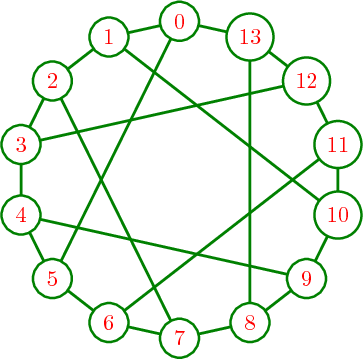

.. -*- coding: utf-8 -*-

.. linkall

Sage Quickstart for Graph Theory and Discrete Mathematics
=========================================================

This `Sage <http://www.sagemath.org>`_ quickstart tutorial was developed
for the MAA PREP Workshop "Sage: Using Open\-Source Mathematics Software
with Undergraduates" (funding provided by NSF DUE 0817071).  It is
licensed under the Creative Commons Attribution\-ShareAlike 3.0 license
(`CC BY\-SA <http://creativecommons.org/licenses/by-sa/3.0/>`_).

As computers are discrete and finite, topics from discrete mathematics
are natural to implement and use.  We'll start with Graph Theory.

Graph Theory
------------

The pre\-defined ``graphs`` object provides an abundance of examples.
Just tab to see!

.. skip

::

    sage: graphs.[tab]

Its companion ``digraphs`` has many built\-in examples as well.

Visualizing a graph is similar to plotting functions.

::

    sage: G = graphs.HeawoodGraph()
    sage: plot(G)
    Graphics object consisting of 36 graphics primitives

Defining your own graph is easy.  One way is the following.

- Put a vertex next to a list (recall this concept from the programming
  tutorial) with a colon, to show its adjacent vertices. For example,
  to put vertex 4 next to vertices 0 and 2, use ``4:[0,2]``.

- Now combine all these in curly braces (in the advanced appendix to the
  programming tutorial, this is called a *dictionary* ).

::

    sage: H=Graph({0:[1,2,3], 4:[0,2], 6:[1,2,3,4,5]})
    sage: plot(H)
    Graphics object consisting of 18 graphics primitives

Adjacency matrices, other graphs, and similar inputs are also recognized.

..
   Comment this out for now.

   There is also a cool Javascript graph editor, due to Radoslav Kirov.
   Check it out!

   .. skip

   ::

       sage: graph_editor()

Graphs have "position" information for location of vertices.  There are
several different ways to compute a layout, or you can compute your own.
Pre\-defined graphs often come with "nice" layouts.

::

    sage: H.set_pos(H.layout_circular())
    sage: plot(H)
    Graphics object consisting of 18 graphics primitives

Vertices can be lots of things, for example the codewords of an
error\-correcting code.

.. note::
   Technical caveat: they need to be "immutable", like Python's tuples.

Here we have a matrix over the integers and a matrix of variables as
vertices.

::

    sage: a=matrix([[1,2],[3,4]])
    sage: var('x y z w')
    (x, y, z, w)
    sage: b=matrix([[x,y],[z,w]])
    sage: a.set_immutable()
    sage: b.set_immutable()
    sage: K=DiGraph({a:[b]})
    sage: show(K, vertex_size=800)

Edges can be labeled.

::

    sage: L=graphs.CycleGraph(5)
    sage: for edge in L.edges():
    ....:     u = edge[0]
    ....:     v = edge[1]
    ....:     L.set_edge_label(u, v, u*v)
    sage: plot(L, edge_labels=True)
    Graphics object consisting of 16 graphics primitives

There are natural connections to other areas of mathematics.  Here we
compute the automorphism group and eigenvalues of the skeleton of a
cube.

::

    sage: C = graphs.CubeGraph(3)
    sage: plot(C)
    Graphics object consisting of 21 graphics primitives

::

    sage: Aut=C.automorphism_group()
    sage: print("Order of automorphism group: {}".format(Aut.order()))
    Order of automorphism group:  48
    sage: print("Group: \n{}".format(Aut)) # random
    Group:
    Permutation Group with generators [('010','100')('011','101'), ('001','010')('101','110'), ('000','001')('010','011')('100','101')('110','111')]

::

    sage: C.spectrum()
    [3, 1, 1, 1, -1, -1, -1, -3]

There is a huge amount of LaTeX support for graphs.  The following
graphic shows an example of what can be done; this is the Heawood graph.

Press 'tab' at the next command to see all the available options.

.. skip

::

    sage: sage.graphs.graph_latex.GraphLatex.set_option?

More Discrete Mathematics
-------------------------

Discrete mathematics is a broad area, and Sage has excellent support for
much of it.  This is largely due to the "sage\-combinat" group.  These
developers previously developed for MuPad (as "mupad\-combinat") but
switched over to Sage shortly before MuPad was sold.

Simple Combinatorics
~~~~~~~~~~~~~~~~~~~~~

Sage can work with basic combinatorial structures like combinations and
permutations.

::

    sage: pets = ['dog', 'cat', 'snake', 'spider']
    sage: C=Combinations(pets)
    sage: C.list()
    [[], ['dog'], ['cat'], ['snake'], ['spider'], ['dog', 'cat'], ['dog', 'snake'], ['dog', 'spider'], ['cat', 'snake'], ['cat', 'spider'], ['snake', 'spider'], ['dog', 'cat', 'snake'], ['dog', 'cat', 'spider'], ['dog', 'snake', 'spider'], ['cat', 'snake', 'spider'], ['dog', 'cat', 'snake', 'spider']]

::

    sage: for a, b in Combinations(pets, 2):
    ....:     print("The {} chases the {}.".format(a, b))
    The dog chases the cat.
    The dog chases the snake.
    The dog chases the spider.
    The cat chases the snake.
    The cat chases the spider.
    The snake chases the spider.

::

    sage: for pair in Permutations(pets, 2):
    ....:     print(pair)
    ['dog', 'cat']
    ['dog', 'snake']
    ['dog', 'spider']
    ['cat', 'dog']
    ['cat', 'snake']
    ['cat', 'spider']
    ['snake', 'dog']
    ['snake', 'cat']
    ['snake', 'spider']
    ['spider', 'dog']
    ['spider', 'cat']
    ['spider', 'snake']

Of course, we often want these for numbers, and these are present as
well.  Some are familiar:

::

    sage: Permutations(5).cardinality()
    120

Others somewhat less so:

::

    sage: D = Derangements([1,1,2,2,3,4,5])
    sage: D.list()[:5]
    [[2, 2, 1, 1, 4, 5, 3], [2, 2, 1, 1, 5, 3, 4], [2, 2, 1, 3, 1, 5, 4], [2, 2, 1, 3, 4, 5, 1], [2, 2, 1, 3, 5, 1, 4]]

And some somewhat more advanced -- in this case, symmetric polynomials.

::

    sage: s = SymmetricFunctions(QQ).schur()
    sage: a = s([2,1])
    sage: a.expand(3)
    x0^2*x1 + x0*x1^2 + x0^2*x2 + 2*x0*x1*x2 + x1^2*x2 + x0*x2^2 + x1*x2^2

Various functions related to this are available as well.

::

    sage: binomial(25,3)
    2300

::

    sage: multinomial(24,3,5)
    589024800

::

    sage: falling_factorial(10,4)
    5040

Do you recognize this famous identity?

::

    sage: var('k,n')
    (k, n)
    sage: sum(binomial(n,k),k,0,n)
    2^n

.. _CryptoEd:

Cryptography (for education)
~~~~~~~~~~~~~~~~~~~~~~~~~~~~~

This is also briefly mentioned in the :doc:`Number theory quickstart
<Number-Theory>`. Sage has a number of good pedagogical resources
for cryptography.

.. skip

::

    sage: # Two objects to make/use encryption scheme
    sage: #
    sage: from sage.crypto.block_cipher.sdes import SimplifiedDES
    sage: sdes = SimplifiedDES()
    sage: bin = BinaryStrings()
    sage: #
    sage: # Convert English to binary
    sage: #
    sage: P = bin.encoding("Encrypt this using S-DES!")
    sage: print("Binary plaintext:  {}\n".format(P))
    sage: #
    sage: # Choose a random key
    sage: #
    sage: K = sdes.list_to_string(sdes.random_key())
    sage: print("Random key:  {}\n".format(K))
    sage: #
    sage: # Encrypt with Simplified DES
    sage: #
    sage: C = sdes(P, K, algorithm="encrypt")
    sage: print("Encrypted:  {}\n".format(C))
    sage: #
    sage: # Decrypt for the round-trip
    sage: #
    sage: plaintxt = sdes(C, K, algorithm="decrypt")
    sage: print("Decrypted:  {}\n".format(plaintxt))
    sage: #
    sage: # Verify easily
    sage: #
    sage: print("Verify encryption/decryption: {}".format(P == plaintxt))
    Binary plaintext:  01000101011011100110001101110010011110010111000001110100001000000111010001101000011010010111001100100000011101010111001101101001011011100110011100100000010100110010110101000100010001010101001100100001

    Random key:  0100000011

    Encrypted:  00100001100001010011000111000110010000011011101011111011100011011111101111110111110010101000010010001101101010101000010011001010100001010111000010001101000011001001111111110100001000010000110001011000

    Decrypted:  01000101011011100110001101110010011110010111000001110100001000000111010001101000011010010111001100100000011101010111001101101001011011100110011100100000010100110010110101000100010001010101001100100001

    Verify encryption/decryption:  True

Coding Theory
~~~~~~~~~~~~~~

Here is a brief example of a linear binary code (group code).

Start with a generator matrix over :math:`\ZZ/2\ZZ`.

::

    sage: G = matrix(GF(2), [[1,1,1,0,0,0,0], [1,0,0,1,1,0,0], [0,1,0,1,0,1,0], [1,1,0,1,0,0,1]])
    sage: C = LinearCode(G)

::

    sage: C.is_self_dual()
    False

::

    sage: D = C.dual_code()
    sage: D
    Linear code of length 7, dimension 3 over Finite Field of size 2

::

    sage: D.basis()
    [(1, 0, 1, 0, 1, 0, 1), (0, 1, 1, 0, 0, 1, 1), (0, 0, 0, 1, 1, 1, 1)]

::

    sage: D.permutation_automorphism_group()
    Permutation Group with generators [(4,5)(6,7), (4,6)(5,7), (2,3)(6,7), (2,4)(3,5), (1,2)(5,6)]

