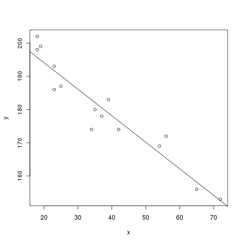

.. -*- coding: utf-8 -*-

.. linkall

Sage Quickstart for Statistics
==============================

This `Sage <http://www.sagemath.org>`_ quickstart tutorial was developed
for the MAA PREP Workshop "Sage: Using Open\-Source Mathematics Software
with Undergraduates" (funding provided by NSF DUE 0817071).  It is
licensed under the Creative Commons Attribution\-ShareAlike 3.0 license
(`CC BY\-SA <http://creativecommons.org/licenses/by-sa/3.0/>`_).

Although Sage began as a project in algebra and geometry, it has many
functions for statistics and finance. Particularly due to the `R project
<http://www.r-project.org>`_ being a component of Sage, we have very
powerful statistical techniques at our disposal.

Basic Descriptive Statistics
----------------------------

Some basic statistical functions are built right in.

::

    sage: mean([1,2,3,5])
    11/4

::

    sage: std([1,2,2,4,5,6,8]) # The standard deviation
    sqrt(19/3)

Once we get beyond such things, there are usually several ways to
accomplish things -- which can be complicated, but also powerful.

Distributions
-------------

Let's generate a random sample from a given type of continuous
distribution using native Python random generators.

- We use the simplest method of generating random elements from a log
  normal distribution with (normal) mean 2 and :math:`\sigma=3`.

- Notice that there is really no way around making some kind of loop.

::

    sage: my_data=[lognormvariate(2,3) for i in range(10)]
    sage: my_data # random
    [13.189347821530054, 151.28229284782799, 0.071974845847761343, 202.62181449742425, 1.9677158880100207, 71.959830176932542, 21.054742855786007, 3.9235315623286406, 4129.9880239483346, 16.41063858663054]

We can check whether the mean of the log of the data is close to 2.

::

    sage: mean([log(item) for item in my_data]) # random
    3.0769518857697618

Here is an example using the `Gnu scientific library
<http://www.gnu.org/software/gsl/>`_ under the hood.

- Let ``dist`` be the variable assigned to a continuous Gaussian/normal
  distribution with standard deviation of 3.

- Then we use the ``.get_random_element()`` method ten times, adding 2
  each time so that the mean is equal to 2.

::

    sage: dist=RealDistribution('gaussian',3)
    sage: my_data=[dist.get_random_element()+2 for _ in range(10)]
    sage: my_data # random
    [3.18196848067, -2.70878671264, 0.445500746768, 0.579932075555, -1.32546445128, 0.985799587162, 4.96649083229, -1.78785287243, -3.05866866979, 5.90786474822]

For now, it's a little annoying to get histograms of such things
directly. Here, we get a larger sampling of this distribution and
plot a histogram with 10 bins.

::

    sage: my_data2 = [dist.get_random_element()+2 for _ in range(1000)]
    sage: T = stats.TimeSeries(my_data)
    sage: T.plot_histogram(normalize=False,bins=10)
    Graphics object consisting of 10 graphics primitives

To access discrete distributions, we access another part of Sage which
has statistics built in: `Scipy <http://www.scipy.org>`_.

- We have to ``import`` this module.

- We use ``binom_dist`` to denote the binomial distribution with 20 trials
  and 5% expected failure rate.

- The ``.pmf(x)`` method gives the probability of :math:`x` failures,
  which we then plot in a bar chart for :math:`x` from 0 to 20.
  (Don't forget that ``range(21)`` means all integers from *zero to twenty*.)

::

    sage: import scipy.stats
    sage: binom_dist = scipy.stats.binom(20,.05)
    sage: bar_chart([binom_dist.pmf(x) for x in range(21)])
    Graphics object consisting of 1 graphics primitive

The ``bar_chart`` function performs some of the duties of histograms.

Scipy's statistics can do other things too.  Here, we find the median
(as the fiftieth percentile) of an earlier data set.  (We use a Python
``int`` to work around a bug in Numpy.)

::

    sage: scipy.stats.scoreatpercentile(my_data, int(50)) # random
    0.51271641116183286

The key thing to remember here is to look at the documentation!

- Particularly for Scipy, not everything in Sage is "wrapped" with an
  easy command, so you may have to do some experimentation.

- Improving this documentation would be a great way to get students
  involved.

Using R from within Sage
------------------------

There are several other pieces of Sage that have statistical
capabilities, but by far the most important is the `R project
<http://www.r-project.org>`_ , which is the industry and academic
standard for statistical analysis of *all* kinds.

There are several ways to access R.

- One of the easiest is to just put ``r()`` around things you want to
  make into statistical objects, and then ...

- Use R commands via ``r.method()`` to pass them on to Sage for further
  processing.

The following example of the Kruskal\-Wallis test comes directly from
the examples in ``r.kruskal_test?`` in the notebook.

::

    sage: x=r([2.9, 3.0, 2.5, 2.6, 3.2]) # normal subjects
    sage: y=r([3.8, 2.7, 4.0, 2.4])      # with obstructive airway disease
    sage: z=r([2.8, 3.4, 3.7, 2.2, 2.0]) # with asbestosis
    sage: a = r([x,y,z]) # make a long R vector of all the data
    sage: b = r.factor(5*[1]+4*[2]+5*[3]) # create something for R to tell which subjects are which
    sage: a; b # show them
     [1] 2.9 3.0 2.5 2.6 3.2 3.8 2.7 4.0 2.4 2.8 3.4 3.7 2.2 2.0
     [1] 1 1 1 1 1 2 2 2 2 3 3 3 3 3
    Levels: 1 2 3

.. skip

::

    sage: r.kruskal_test(a,b) # do the KW test!
        Kruskal-Wallis rank sum test

    data:  sage17 and sage33
    Kruskal-Wallis chi-squared = 0.7714, df = 2, p-value = 0.68

Looks like we can't reject the null hypothesis here.

The best way to use R seriously is to simply ask each individual cell to
evaluate completely in R, using a so\-called "percent directive".  Here
is a sample linear regression from John Verzani's `simpleR
<http://cran.r-project.org/doc/contrib/Verzani-SimpleR.pdf>`_ text.
Notice that R also uses the ``#`` symbol to indicate comments.

.. skip

::

    sage: %r
    ...   x = c(18,23,25,35,65,54,34,56,72,19,23,42,18,39,37) # ages of individuals
    ...   y = c(202,186,187,180,156,169,174,172,153,199,193,174,198,183,178) # maximum heart rate of each one
    ...   png() # turn on plotting
    ...   plot(x,y) # make a plot
    ...   lm(y ~ x) # do the linear regression
    ...   abline(lm(y ~ x)) # plot the regression line
    ...   dev.off()     # turn off the device so it plots
    Call:
    lm(formula = y ~ x)

    Coefficients:
    (Intercept)            x
       210.0485      -0.7977

    null device
              1

To get a whole worksheet to evaluate in R (and be able to ignore the
``%``), you could also drop down the ``r`` option in the menu close to
the top which currently has ``sage`` in it.

(There is also yet another Python interface to R called the `rpy2
<http://rpy.sourceforge.net/rpy2.html>`_ interface, but we do not currently
recommend its use with Sage.)
