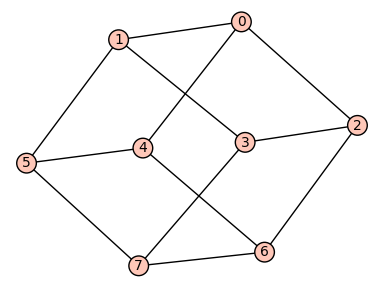
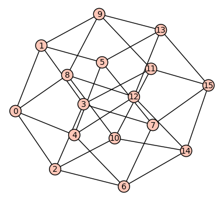
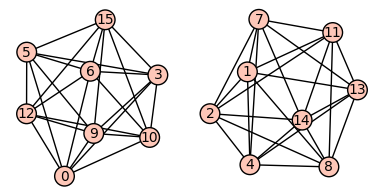

.. linkall

========
`n`-Cube
========

This section provides some examples on Chapter 2 of Stanley's book
[Stanley2013]_, which deals with `n`-cubes, the Radon transform, and
combinatorial formulas for walks on the `n`-cube.

The vertices of the `n`-cube can be described by vectors in
`\mathbb{Z}_2^n`. First we define the addition of two vectors
`u,v \in \mathbb{Z}_2^n` via the following distance::

    sage: def dist(u,v):
    ....:     h = [(u[i]+v[i])%2 for i in range(len(u))]
    ....:     return sum(h)

The distance function measures in how many slots two vectors in
`\mathbb{Z}_2^n` differ::

    sage: u = (1,0,1,1,1,0)
    sage: v = (0,0,1,1,0,0)
    sage: dist(u,v)
    2

Now we are going to define the `n`-cube as the graph with vertices
in `\mathbb{Z}_2^n` and edges between vertex `u` and vertex `v` if
they differ in one slot, that is, the distance function is 1::

    sage: def cube(n):
    ....:     G = Graph(2**n)
    ....:     vertices = Tuples([0,1],n)
    ....:     for i in range(2**n):
    ....:         for j in range(2**n):
    ....:             if dist(vertices[i],vertices[j]) == 1:
    ....:                 G.add_edge(i,j)
    ....:     return G

We can plot the `3` and `4`-cube::

   sage: cube(3).plot()
   Graphics object consisting of 21 graphics primitives

::

   sage: cube(4).plot()
   Graphics object consisting of 49 graphics primitives

Next we can experiment and check Corollary 2.4 in Stanley's book, which
states the `n`-cube has `n` choose `i` eigenvalues equal to `n-2i`::

    sage: G = cube(2)
    sage: G.adjacency_matrix().eigenvalues()
    [2, -2, 0, 0]

    sage: G = cube(3)
    sage: G.adjacency_matrix().eigenvalues()
    [3, -3, 1, 1, 1, -1, -1, -1]

    sage: G = cube(4)
    sage: G.adjacency_matrix().eigenvalues()
    [4, -4, 2, 2, 2, 2, -2, -2, -2, -2, 0, 0, 0, 0, 0, 0]

It is now easy to slightly vary this problem and change the edge
set by connecting vertices `u` and `v` if their distance is 2
(see Problem 4 in Chapter 2)::

    sage: def cube_2(n):
    ....:     G = Graph(2**n)
    ....:     vertices = Tuples([0,1],n)
    ....:     for i in range(2**n):
    ....:         for j in range(2**n):
    ....:             if dist(vertices[i],vertices[j]) == 2:
    ....:                 G.add_edge(i,j)
    ....:     return G

    sage: G = cube_2(2)
    sage: G.adjacency_matrix().eigenvalues()
    [1, 1, -1, -1]

    sage: G = cube_2(4)
    sage: G.adjacency_matrix().eigenvalues()
    [6, 6, -2, -2, -2, -2, -2, -2, 0, 0, 0, 0, 0, 0, 0, 0]

Note that the graph is in fact disconnected. Do you understand why?

::

    sage: cube_2(4).plot()
    Graphics object consisting of 65 graphics primitives

