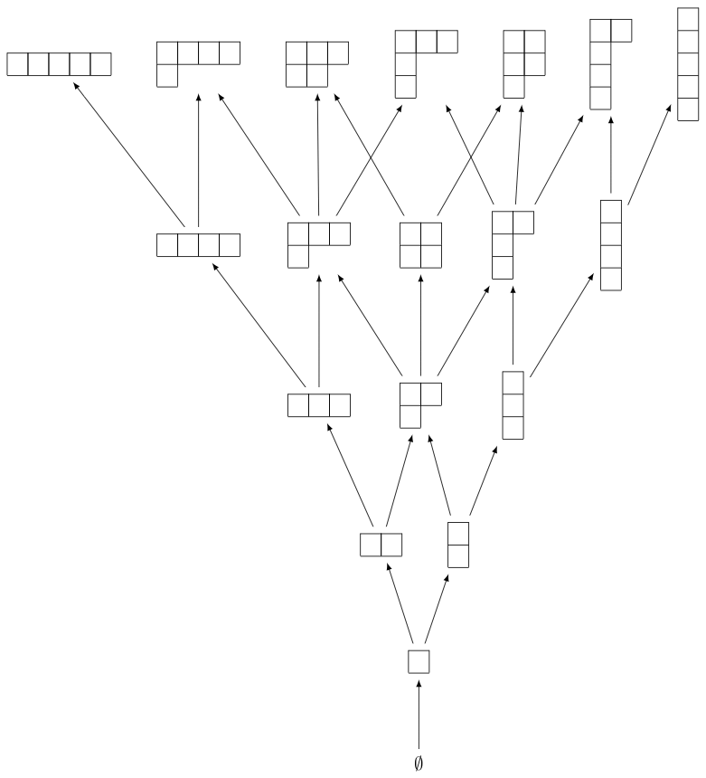

.. linkall

=====================================
Young's lattice and the RSK algorithm
=====================================

This section provides some examples on Young's lattice and the RSK
(Robinson-Schensted-Knuth) algorithm explained in Chapter 8 of Stanley's
book [Stanley2013]_.

Young's Lattice
---------------

We begin by creating the first few levels of Young's lattice `Y`. For
this, we need to define the elements and the order relation for the poset,
which is containment of partitions::

    sage: level = 6
    sage: elements = [b for n in range(level) for b in Partitions(n)]
    sage: ord = lambda x,y: y.contains(x)
    sage: Y = Poset((elements,ord), facade=True)
    sage: H = Y.hasse_diagram()

The resulting image looks best when ``dot2tex`` is installed::

    sage: view(H)  # not tested

We can now define the up and down operators `U` and `D` on `\QQ Y`. First we do
so on partitions, which form a basis for `\QQ Y`::

    sage: QQY = CombinatorialFreeModule(QQ,elements)

    sage: def U_on_basis(la):
    ....:     covers = Y.upper_covers(la)
    ....:     return QQY.sum_of_monomials(covers)

    sage: def D_on_basis(la):
    ....:     covers = Y.lower_covers(la)
    ....:     return QQY.sum_of_monomials(covers)

As a shorthand, one also can write the above as::

    sage: U_on_basis = QQY.sum_of_monomials * Y.upper_covers
    sage: D_on_basis = QQY.sum_of_monomials * Y.lower_covers

Here is the result when we apply the operators to the partition `(2,1)`::

    sage: la = Partition([2,1])
    sage: U_on_basis(la)
    B[[2, 1, 1]] + B[[2, 2]] + B[[3, 1]]
    sage: D_on_basis(la)
    B[[1, 1]] + B[[2]]

Now we define the up and down operator on `\QQ Y`::

    sage: U = QQY.module_morphism(U_on_basis)
    sage: D = QQY.module_morphism(D_on_basis)

We can check the identity `D_{i+1} U_i - U_{i-1} D_i = I_i` explicitly on
all partitions of `i=3`::

    sage: for p in Partitions(3):
    ....:     b = QQY(p)
    ....:     assert D(U(b)) - U(D(b)) == b

We can also check that the coefficient of `\lambda \vdash n` in
`U^n(\emptyset)` is equal to the number of standard Young tableaux
of shape `\lambda`::

    sage: u = QQY(Partition([]))
    sage: for i in range(4):
    ....:     u = U(u)
    sage: u
    B[[1, 1, 1, 1]] + 3*B[[2, 1, 1]] + 2*B[[2, 2]] + 3*B[[3, 1]] + B[[4]]

For example, the number of standard Young tableaux of shape `(2,1,1)` is `3`::

    sage: StandardTableaux([2,1,1]).cardinality()
    3

We can test this in general::

    sage: for la in u.support():
    ....:     assert u[la] == StandardTableaux(la).cardinality()

We can also check this against the hook length formula (Theorem 8.1)::

    sage: def hook_length_formula(p):
    ....:     n = p.size()
    ....:     return factorial(n) // prod(p.hook_length(*c) for c in p.cells())

    sage: for la in u.support():
    ....:     assert u[la] == hook_length_formula(la)

RSK Algorithm
-------------

Let us now turn to the RSK algorithm. We can verify Example 8.12 as follows::

    sage: p = Permutation([4,2,7,3,6,1,5])
    sage: RSK(p)
    [[[1, 3, 5], [2, 6], [4, 7]], [[1, 3, 5], [2, 4], [6, 7]]]

The tableaux can also be displayed as tableaux::

    sage: P,Q = RSK(p)
    sage: P.pp()
    1  3  5
    2  6
    4  7
    sage: Q.pp()
    1  3  5
    2  4
    6  7

The inverse RSK algorithm is implemented as follows::

    sage: RSK_inverse(P,Q, output='permutation')
    [4, 2, 7, 3, 6, 1, 5]

We can verify that the RSK algorithm is a bijection::

    sage: def check_RSK(n):
    ....:     for p in Permutations(n):
    ....:          assert RSK_inverse(*RSK(p), output='permutation') == p
    sage: for n in range(5):
    ....:     check_RSK(n)

