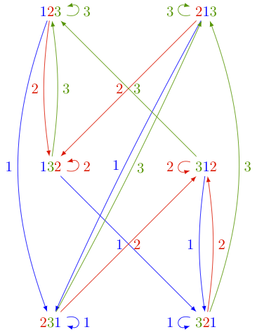

.. linkall

===================
The Tsetlin library
===================

Introduction
------------

In this section, we study a simple random walk (or Markov chain),
called the *Tsetlin library*. It will give us the opportunity to see
the interplay between combinatorics, linear algebra, representation
theory and computer exploration, without requiring heavy theoretical
background. I hope this encourages everyone to play around with
this or similar systems and investigate their properties!
Formal theorems and proofs can be found in the references at the
end of this section.

It has been known for several years that the theory of group
representations can facilitate the study of systems whose evolution
is random (Markov chains), breaking them down into simpler systems.
More recently it was realized that generalizing this (namely
replacing the invertibility axiom for groups by other axioms)
explains the behavior of other particularly simple Markov chains
such as the Tsetlin library.

The Tsetlin library
-------------------

Consider a bookshelf in a library containing `n` distinct books. When
a person borrows a book and then returns it, it gets placed back on the
shelf to the right of all books. This is what we naturally do with our
pile of shirts in the closet: after use and cleaning, the shirt is placed
on the top of its pile. Hence the most popular books/shirts will more
likely appear on the right/top of the shelf/pile.

This type of organization has the advantage of being self-adaptive:

- The books most often used accumulate on the right and thus can easily
  be found.
- If the use changes over time, the system adapts.

In fact, this type of strategy is used not only in everyday life, but also
in computer science. The natural questions that arise are:

- *Stationary distribution*: To which state(s) does the system converge to? This,
  among other things, is used to evaluate the average access time to
  a book.
- *The rate of convergence*: How fast does the system adapt to a changing
  environment .

Let us formalize the description. The Tsetlin library is a discrete Markov
chain (discrete time, discrete state space) described by:

- The state space `\Omega_n` is given by the set of all permutations of the
  `n` books.
- The transition operators are denoted by `\partial_i \colon \Omega_n \to \Omega_n`.
  When `\partial_i` is applied to a permutation `\sigma`, the number `i` is moved
  to the end of the permutation.
- We assign parameters `x_i \ge 0` for all `1\le i\le n` with
  `\sum_{i=1}^n x_i = 1`. The parameter `x_i` indicates the probability of
  choosing the operator `\partial_i`.

Transition graph and matrix
---------------------------

One can depict the action of the operators `\partial_i` on the state
space `\Omega_n` by a digraph. The following picture shows the action
of `\partial_1, \partial_2, \partial_3` on `\Omega_3`:

The above picture can be reproduced in Sage as follows::

    sage: P = Poset(([1,2,3],[]))

This is the antichain poset. Its linear extensions are all permutations of `\{1,2,3\}`::

    sage: L = P.linear_extensions()
    sage: L
    The set of all linear extensions of Finite poset containing 3 elements
    sage: L.list()
    [[3, 2, 1], [3, 1, 2], [1, 3, 2], [1, 2, 3], [2, 1, 3], [2, 3, 1]]

The graph is produced via::

    sage: G = L.markov_chain_digraph(labeling='source'); G
    Looped multi-digraph on 6 vertices
    sage: view(G)  # not tested

We can now look at the transition matrix and see whether we notice anything about
its eigenvalue and eigenvectors::

    sage: M = L.markov_chain_transition_matrix(labeling='source')
    sage: M
    [-x0 - x1       x2        0        0       x2        0]
    [      x1 -x0 - x2       x1        0        0        0]
    [       0        0 -x0 - x1       x2        0       x2]
    [      x0        0       x0 -x1 - x2        0        0]
    [       0        0        0       x1 -x0 - x2       x1]
    [       0       x0        0        0       x0 -x1 - x2]

This matrix is normalized so that all columns add to 0. So we need to
add `(x_0 + x_1 + x_2)` times the `6\times 6` identity matrix to get the
probability matrix::

    sage: x = M.base_ring().gens()
    sage: Mt = (x[0]+x[1]+x[2])*matrix.identity(6)+M
    sage: Mt
    [x2 x2  0  0 x2  0]
    [x1 x1 x1  0  0  0]
    [ 0  0 x2 x2  0 x2]
    [x0  0 x0 x0  0  0]
    [ 0  0  0 x1 x1 x1]
    [ 0 x0  0  0 x0 x0]

Since the `x_i` are formal variables, we need to compute the eigenvalues and
eigenvectors in the symbolic ring ``SR``::

    sage: Mt.change_ring(SR).eigenvalues()
    [x2, x1, x0, x0 + x1 + x2, 0, 0]

Do you see any pattern? In fact, if you start playing with bigger values of `n` (the size
of the underlying permutations), you might observe that there is an eigenvalue for
every subset `S` of `\{1,2,\ldots,n\}` and the multiplicity is given by a derangement
number `d_{n-|S|}`. Derangment numbers count permutations without fixed point.
For the eigenvectors we obtain::

    sage: Mt.change_ring(SR).eigenvectors_right()
    [(x2, [(1, 0, -1, 0, 0, 0)], 1),
     (x1, [(0, 1, 0, 0, -1, 0)], 1),
     (x0, [(0, 0, 0, 1, 0, -1)], 1),
     (x0 + x1 + x2,
      [(1,
        (x0 + x1)/(x0 + x2),
        x0/x1,
        (x0^2 + x0*x1)/(x1^2 + x1*x2),
        (x0^2 + x0*x1)/(x0*x2 + x2^2),
        (x0^2 + x0*x1)/(x1*x2 + x2^2))], 1),
     (0, [(1, 0, -1, 0, -1, 1), (0, 1, -1, 1, -1, 0)], 2)]

The stationary distribution is the eigenvector of eigenvalues `1=x_0+x_1+x_2`. Do you see a pattern?

.. TOPIC:: Optional exercices: Study of the transition operators and graph

    Instead of using the methods that are already in Sage, try to build the
    state space `\Omega_n` and the transition operators `\partial_i` yourself as follows.

    #.  For technical reasons, it is most practical in Sage to label the `n` books in the library by
        `0,1,\cdots,n-1`, and to represent each state in the Markov chain by a permutation
        of the set `\{0,\dots,n-1\}` as a tuple. Construct the state space `\Omega_n` as::

            sage: list(map(tuple, Permutations(range(3))))
            [(0, 1, 2), (0, 2, 1), (1, 0, 2), (1, 2, 0), (2, 0, 1), (2, 1, 0)]

    #.  Write a function ``transition_operator(sigma, i)`` which implements the operator
        `\partial_i` which takes as input a tuple ``sigma`` and integer `i \in \{1,2,\ldots,n\}`
        and outputs a new tuple. It might be useful to extract subtuples
        (``sigma[i:j]``) and concatenation.

    #.  Write a function ``tsetlin_digraph(n)`` which constructs the
        (multi digraph) as described as shown above. This can be achieved using
        :class:`DiGraph`.

    #.  Verify for which values of `n` the digraph is strongly connected
        (i.e., you can go from any vertex to any other vertex by going in the direction of the
        arrow). This indicates whether the Markov chain is irreducible.

Conclusion
----------

The Tsetlin library was studied from the viewpoint of monoids in [Bidigare1997]_
and [Brown2000]_. Precise statements of the eigenvalues and the stationary distribution
of the probability matrix as well as proofs of the statements are given in these papers.
Generalizations of the Tsetlin library from the antichain to
arbitrary posets was given in [AKS2013]_.

.. [Bidigare1997] Thomas Patrick Bidigare. *Hyperplane arrangement
    face algebras and their associated Markov chains*. ProQuest LLC,
    Ann Arbor, MI, 1997.  Thesis (Ph.D.) University of Michigan.

.. [Brown2000] Kenneth S. Brown. *Semigroups, rings, and Markov
   chains*. J. Theoret.  Probab., 13(3):871-938, 2000.

.. [AKS2013] Arvind Ayyer, Steven Klee, Anne Schilling.
    *Combinatorial Markov chains on linear extensions*
    J. Algebraic Combinatorics,
    :doi:`10.1007/s10801-013-0470-9`, :arxiv:`1205.7074`.
