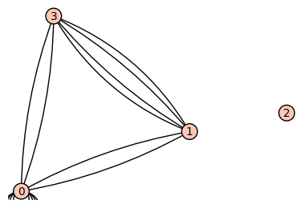

.. linkall

===============
Walks in graphs
===============

This section provides some examples on Chapter 1 of Stanley's book
[Stanley2013]_.

We begin by creating a graph with 4 vertices::

    sage: G = Graph(4)
    sage: G
    Graph on 4 vertices

This graph has no edges yet::

    sage: G.vertices(sort=True)
    [0, 1, 2, 3]
    sage: G.edges(sort=True)
    []

Before we can add edges, we need to tell Sage that our graph can
have loops and multiple edges.::

    sage: G.allow_loops(True)
    sage: G.allow_multiple_edges(True)

Now we are ready to add our edges by specifying a tuple of vertices that
are connected by an edge. If there are multiple edges, we need to add
the tuple with multiplicity.::

    sage: G.add_edges([(0,0),(0,0),(0,1),(0,3),(1,3),(1,3)])

Now let us look at the graph!
::

    sage: G.plot()
    Graphics object consisting of 11 graphics primitives

We can construct the adjacency matrix::

    sage: A = G.adjacency_matrix()
    sage: A
    [2 1 0 1]
    [1 0 0 2]
    [0 0 0 0]
    [1 2 0 0]

The entry in row `i` and column `j` of the `\ell`-th power of `A` gives
us the number of paths of length `\ell` from vertex `i` to vertex `j`.
Let us verify this::

    sage: A**2
    [6 4 0 4]
    [4 5 0 1]
    [0 0 0 0]
    [4 1 0 5]

There are 4 paths of length 2 from vertex `0` to vertex `1`: take either loop
at `0` and then the edge `(0, 1)` (2 choices) or take the edge `(0, 3)` and
then either of the two edges `(3, 1)` (two choices)::

    sage: (A**2)[0,1]
    4

To count the number of closed walks, we can also look at the sum of the
`\ell`-th powers of the eigenvalues. Even though the eigenvalues are not
integers, we find that the sum of their squares is an integer::

    sage: A.eigenvalues()
    [0, -2, 0.5857864376269049?, 3.414213562373095?]
    sage: sum(la**2 for la in A.eigenvalues())
    16.00000000000000?

We can achieve the same by looking at the trace of the `\ell`-th power
of the matrix::

    sage: (A**2).trace()
    16

