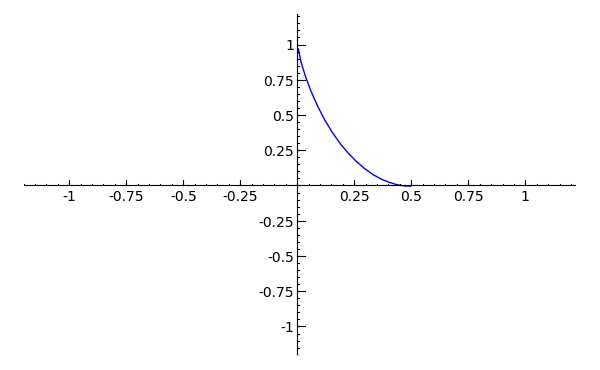
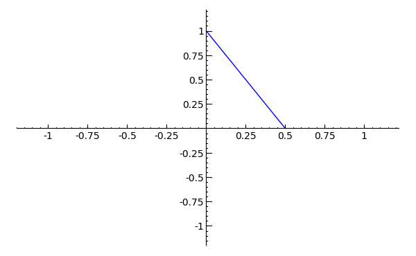
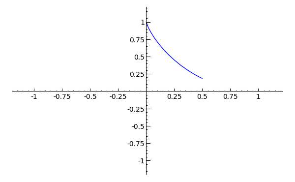
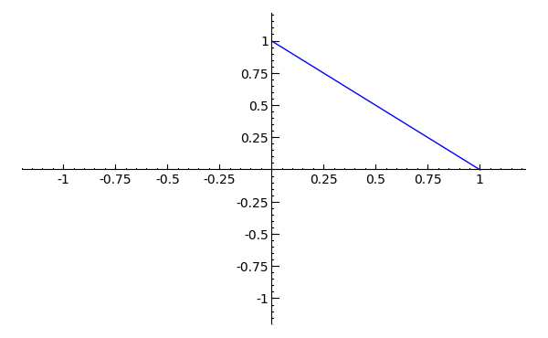
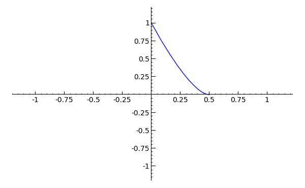

.. -*- coding: utf-8 -*-

.. _coding_theory:

======================
Sage and Coding Theory
======================

.. MODULEAUTHOR:: David Joyner and Robert Miller (2008), edited by Ralf Stephan

This brief paper surveys recent work in Sage on implementing algorithms
to compute with linear block codes.

Included in Sage is the group theory package GAP [GAP]_ and GUAVA [GUAVA]_, GAP's coding
theory package. All of GUAVA's functions can be accessed within Sage.

General coding theory functions
===============================

Many of the following coding theory functions are pure Python and do not
call GUAVA:

#. ``LinearCode`` class definition; ``LinearCodeFromVectorspace`` conversion
   function.

   EXAMPLES:

   ::

         sage: MS = MatrixSpace(GF(2),4,7)
         sage: G  = MS([[1,1,1,0,0,0,0], [1,0,0,1,1,0,0],
         ....:           [0,1,0,1,0,1,0], [1,1,0,1,0,0,1]])
         sage: C  = LinearCode(G)
         sage: C
         Linear code of length 7, dimension 4 over Finite Field of size 2
         sage: C.base_ring()
         Finite Field of size 2
         sage: C.dimension()
         4
         sage: C.length()
         7
         sage: C.minimum_distance()
         3
         sage: C.spectrum()
         [1, 0, 0, 7, 7, 0, 0, 1]
         sage: C.weight_distribution()
         [1, 0, 0, 7, 7, 0, 0, 1]

   This function also enables you to create your own code functions. The
   following function implements the hexacode.

   ::

       def Hexacode():
           """
           This function returns the [6,3,4] hexacode over GF(4).
           It is an extremal (Hermitian) self-dual Type IV code.

           EXAMPLES:

               sage: C = Hexacode()       # known bug
               sage: C.minimum_distance() # known bug
               4

           """
           F = GF(4,"z")
           z = F.gen()
           MS = MatrixSpace(F, 3, 6)
           G = MS([[1, 0, 0, 1, z, z ],\
                   [0, 1, 0, z, 1, z ],\
                   [0, 0, 1, z, z, 1 ]])
           return LinearCode(G)

#. The ``spectrum`` (weight distribution), ``minimum_distance`` programs
   (calling Steve Linton's C programs in GAP),
   ``characteristic_function`` (as in [vanLint]_), and several implementations of
   the Duursma zeta function (``zeta_polynomial``, ``zeta_function``,
   ``chinen_polynomial``, for example),

   ::

         sage: C = codes.HammingCode(3,GF(2))
         sage: C.zeta_polynomial()
         2/5*T^2 + 2/5*T + 1/5
         sage: C = best_known_linear_code(6,3,GF(2)) # known bug
         sage: C.minimum_distance()                  # known bug
         3
         sage: C.zeta_polynomial()                   # known bug
         2/5*T^2 + 2/5*T + 1/5

#. ``gen_mat``, ``check_mat``, ``decode``, ``dual_code``,
   ``extended_code``, ``binomial_moment`` for LinearCode.

   The i-th binomial moment of the :math:`[n,k,d]_q`-code :math:`C` is

   .. math:: B_i(C) = \sum_{S, |S|=i} \frac{q^{k_S}-1}{q-1}

   where :math:`k_S` is the dimension of the shortened code
   :math:`C_{J-S}`, :math:`J=[1,2,...,n]`.

   EXAMPLES:

   ::

           sage: C = codes.HammingCode(3,GF(2))
           sage: C.binomial_moment(2)
           0
           sage: C.binomial_moment(3)    # known bug
           0
           sage: C.binomial_moment(4)    # long time
           35
           sage: C = codes.HammingCode(3,GF(2))
           sage: MS = MatrixSpace(GF(2),1,7)
           sage: F = GF(2); a = F.gen()
           sage: v1 = [a,a,F(0),a,a,F(0),a]
           sage: C.decode(v1) # known bug
           (1, 0, 0, 1, 1, 0, 1)

   Decoding, at the moment, merely uses syndrome decoding via GUAVA.

#. Boolean-valued functions such as "==", ``is_self_dual``,
   ``is_self_orthogonal``, ``is_permutation_automorphism``,

#. permutation methods: ``automorphism_group_binary_code``,
   ``is_permutation_automorphism``, ``standard_form``,
   ``module_composition_factors``.

   This latter function simply calls up the MeatAxe record from GAP.

   EXAMPLES:

   ::

           sage: C = codes.HammingCode(3,GF(2))
           sage: G = C.automorphism_group_binary_code(); G # known bug
           Permutation Group with generators [(2,3)(5,7), (2,5)(3,7),
                              (2,3,7,5)(4,6), (2,4)(6,7), (1,2)(3,4)]
           sage: G.order() # known bug
           168
           sage: C = codes.HammingCode(3,GF(2))
           sage: C.generator_matrix() # known bug
           [1 0 0 1 0 1 0]
           [0 1 0 1 0 1 1]
           [0 0 1 1 0 0 1]
           [0 0 0 0 1 1 1]
           sage: C.redundancy_matrix() # known bug
           [1 1 0]
           [1 1 1]
           [1 0 1]
           [0 1 1]
           sage: C.standard_form()[0].generator_matrix() # known bug
           [1 0 0 0 1 1 0]
           [0 1 0 0 1 1 1]
           [0 0 1 0 1 0 1]
           [0 0 0 1 0 1 1]
           sage: MS = MatrixSpace(GF(2),4,8)
           sage: G  = MS([[1,0,0,0,1,1,1,0],[0,1,1,1,0,0,0,0],  # known bug
           ....:          [0,0,0,0,0,0,0,1],[0,0,0,0,0,1,0,0]]) # known bug
           sage: C  = codes.LinearCode(G)                       # known bug
           sage: gp = C.automorphism_group_binary_code()        # known bug
           sage: C.module_composition_factors(gp)               # known bug
           [ rec(
             field := GF(2),
             isMTXModule := true,
             dimension := 1,
             generators := [ [ [ Z(2)^0 ] ], [ [ Z(2)^0 ] ], [ [ Z(2)^0 ] ],
                 [ [ Z(2)^0 ] ], [ [ Z(2)^0 ] ], [ [ Z(2)^0 ] ] ],
             smashMeataxe := rec(
                 algebraElement :=
                  [ [ [ 5, 3 ], [ 5, 3 ] ], [ Z(2)^0, Z(2)^0, 0*Z(2), Z(2)^0,
                         0*Z(2), Z(2)^0, Z(2)^0, Z(2)^0 ] ],
                 algebraElementMatrix := [ [ 0*Z(2) ] ],
                 characteristicPolynomial := x_1,
                 charpolFactors := x_1,
                 nullspaceVector := [ Z(2)^0 ],
                 ndimFlag := 1 ),
             IsIrreducible := true ), rec(
             field := GF(2),
             isMTXModule := true,
             dimension := 1,
             generators := [ [ [ Z(2)^0 ] ], [ [ Z(2)^0 ] ], [ [ Z(2)^0 ] ],
                 [ [ Z(2)^0 ] ], [ [ Z(2)^0 ] ], [ [ Z(2)^0 ] ] ],
             smashMeataxe := rec(
                 algebraElement :=
                  [ [ [ 5, 2 ], [ 1, 2 ] ], [ 0*Z(2), 0*Z(2), 0*Z(2), 0*Z(2),
                         Z(2)^0, 0*Z(2), Z(2)^0, 0*Z(2) ] ],
                 algebraElementMatrix := [ [ 0*Z(2) ] ],
                 characteristicPolynomial := x_1,
                 charpolFactors := x_1,
                 nullspaceVector := [ Z(2)^0 ],
                 ndimFlag := 1 ),
             IsIrreducible := true ), rec(
             field := GF(2),
             isMTXModule := true,
             dimension := 1,
             generators := [ [ [ Z(2)^0 ] ], [ [ Z(2)^0 ] ], [ [ Z(2)^0 ] ],
                 [ [ Z(2)^0 ] ], [ [ Z(2)^0 ] ], [ [ Z(2)^0 ] ] ],
             smashMeataxe := rec(
                 algebraElement :=
                  [ [ [ 4, 2 ], [ 7, 4 ] ], [ 0*Z(2), Z(2)^0, Z(2)^0, 0*Z(2),
                         Z(2)^0, Z(2)^0, Z(2)^0, Z(2)^0 ] ],
                 algebraElementMatrix := [ [ 0*Z(2) ] ],
                 characteristicPolynomial := x_1,
                 charpolFactors := x_1,
                 nullspaceVector := [ Z(2)^0 ],
                 ndimFlag := 1 ),
             IsIrreducible := true ), rec(
             field := GF(2),
             isMTXModule := true,
             dimension := 1,
             generators := [ [ [ Z(2)^0 ] ], [ [ Z(2)^0 ] ], [ [ Z(2)^0 ] ],
                 [ [ Z(2)^0 ] ], [ [ Z(2)^0 ] ], [ [ Z(2)^0 ] ] ],
             smashMeataxe := rec(
                 algebraElement :=
                  [ [ [ 4, 6 ], [ 1, 6 ] ], [ 0*Z(2), Z(2)^0, Z(2)^0, 0*Z(2),
                         Z(2)^0, 0*Z(2), Z(2)^0, Z(2)^0 ] ],
                 algebraElementMatrix := [ [ Z(2)^0 ] ],
                 characteristicPolynomial := x_1+Z(2)^0,
                 charpolFactors := x_1+Z(2)^0,
                 nullspaceVector := [ Z(2)^0 ],
                 ndimFlag := 1 ),
             IsIrreducible := true ) ]

#. design-theoretic methods: ``assmus_mattson_designs`` (implementing
   the Assmus-Mattson Theorem).

   **Theorem 1.** (Assmus and Mattson Theorem. par. 8.4, page 303 of [HP]_) Let
   :math:`A_0, A_1, ..., A_n` be the weight distribution of the
   codewords in a binary linear :math:`[n , k, d]` code :math:`C`, and
   let [1]_ :math:`A_0^\perp, A_1^\perp, ..., A_n^\perp` be the weight
   distribution of the codewords in its dual :math:`[n,n-k, d^\perp]`
   code :math:`C^\perp`. Fix a :math:`t`, :math:`0<t<d`, and let

   .. math:: s = |\{ i\ |\ A_i^\perp \not= 0, 0<i\leq n-t\, \}|.

   Assume :math:`s\leq d-t`.

   -  If :math:`A_i\not= 0` and :math:`d\leq i\leq n` then
      :math:`C_i = \{ c \in C\ |\ wt(c) = i\}` holds a simple t-design.

   -  If :math:`A_i^\perp\not= 0` and :math:`d^\perp\leq i\leq n-t` then
      :math:`C_i^\perp = \{ c \in C* \ |\ wt(c) = i\}` holds a simple
      :math:`t`-design.

   Some of the terms in the above theorem are recalled below (see for
   details). A **block design** is a pair :math:`(X,B)`, where :math:`X`
   is a non-empty finite set of :math:`v>0` elements called **points**,
   and :math:`B` is a non-empty finite multiset of size :math:`b` whose
   elements are called **blocks**, such that each block is a non-empty
   finite multiset of :math:`k` points. :math:`A` design without
   repeated blocks is called a **simple** block design. If every subset
   of points of size :math:`t` is contained in exactly :math:`\lambda`
   blocks the the block design is called a
   :math:`\mathbf{t-(v,k,\lambda)}` **design** (or simply a
   :math:`t`-design when the parameters are not specfied). When
   :math:`\lambda=1` then the block design is called a
   :math:`\mathbf{S(t,k,v)}` **Steiner system**.

   In the Assmus and Mattson Theorem, :math:`X` is the set
   :math:`\{1,2,...,n\}` of coordinate locations and
   :math:`B = \{supp(c)\ |\ c \in C_i\}` is the set of supports of the
   codewords of :math:`C` of weight :math:`i`. Therefore, the parameters
   of the :math:`t`-design for :math:`C_i` are

   .. math::

      \begin{aligned}
      t &=   {\rm  given},\\
      v &=       n,\\
      k &=       i,\ \    \text{(this $k$ is not to be confused with $\dim(C)$!)},\\
      b &=       A_i,\\
      \lambda &= b*\frac{\binom{k}{t}}{\binom{v}{t}} \end{aligned}

   (by Theorem 8.1.6, p. 294, in [HP]_).

   Setting the ``mode="verbose"`` option prints out the values of the
   parameters.

   The first example below means that the binary :math:`[24,12,8]`-code
   :math:`C` has the property that the (support of the) codewords of
   weight 8 (resp, 12, 16) form a 5-design. Similarly for its dual code
   :math:`C^\perp` (of course :math:`C=C^\perp` in this case, so this
   info is extraneous). The test fails to produce 6-designs (ie, the
   hypotheses of the theorem fail to hold, not that the 6-designs
   definitely don't exist). The command
   ``assmus_mattson_designs(C,5,mode="verbose")`` returns the same value
   but prints out more detailed information.

   The second example below illustrates the blocks of the
   :math:`5`-:math:`(24, 8, 1)` design (i.e., the :math:`S(5,8,24)`
   Steiner system).

   EXAMPLES:

   ::

          sage: C = codes.ExtendedBinaryGolayCode()    #  example 1
          sage: C.assmus_mattson_designs(5)
          ['weights from C: ',
          [8, 12, 16, 24],
          'designs from C: ',
          [[5, (24, 8, 1)], [5, (24, 12, 48)], [5, (24, 16, 78)], [5, (24, 24, 1)]],
          'weights from C*: ',
          [8, 12, 16],
          'designs from C*: ',
          [[5, (24, 8, 1)], [5, (24, 12, 48)], [5, (24, 16, 78)]]]
          sage: C.assmus_mattson_designs(6)
          0
          sage: X = range(24)#  example 2
          sage: blocks = [c.support() for c in C if hamming_weight(c)==8] # known bug
          sage: len(blocks)                                               # known bug
          759

The method ``automorphism_group_binary_code`` is actually an interface
to an extremely fast implementation written by the second author. It
uses an open-source implementation of permutation backtracking, written
by Robert Miller and developed into a Sage module called NICE. This
package is described more fully in [Miller1]_.

A permutation :math:`g \in S_n` of the fixed basis gives rise to a
permutation of the vectors, or words, in :math:`GF(2)^n`, sending
:math:`(w_i)` to :math:`(w_{g(i)})`. The **(permutation) automorphism
group** of the code :math:`C` is the set of permutations of the indices
that bijectively map :math:`C` to itself. Sage uses a partition
refinement algorithm to compute the automorphism group of any binary
code. In future work, this will be extended to other base rings.

Native constructions
====================

Sage contains GUAVA but most of GUAVA's functions have not been
implemented in Python, so they must be called via the GAP interface.
(See the _`GUAVA manual`: https://code.google.com/p/guava-libraries/
for details on the syntax of GUAVA.)

In addition, here are some of the special codes implemented natively in
Python:

-  ``BCHCode`` - A 'Bose-Chaudhuri-Hockenghem code' (or BCH code, for short)
   is the largest possible cyclic code of length :math:`n` over field
   :math:`F=GF(q)`, whose generator polynomial has zeros (contained in)
   :math:`\{\alpha^{b},\alpha^{b+1},\ldots \alpha^{b+\delta-2}\}`, where :math:`\alpha` is a primitive
   :math:`n^{th}` root of unity in the splitting field :math:`GF(q^m)`,
   :math:`b` is an integer :math:`0\leq b\leq n-\delta+1` and :math:`m`
   is the multiplicative order of :math:`q` modulo :math:`n`.

   SEEALSO: :wikipedia:`BCH_code`

   EXAMPLES:

   ::

         sage: FF.<a> = GF(3^2,"a")
         sage: x = PolynomialRing(FF,"x").gen()
         sage: L = [b.minpoly() for b in [a,a^2,a^3]]; g = LCM(L)
         sage: f = x^(8)-1
         sage: g.divides(f)
         True
         sage: C = codes.CyclicCode(8,g); C
         Linear code of length 8, dimension 4 over Finite Field of size 3
         sage: C.minimum_distance()
         4
         sage: C = codes.BCHCode(8,3,GF(3),1); C
         Linear code of length 8, dimension 4 over Finite Field of size 3
         sage: C.minimum_distance()
         4
         sage: C = codes.BCHCode(8,5,GF(3)); C
         Linear code of length 8, dimension 3 over Finite Field of size 3
         sage: C.minimum_distance()
         5

-  ``BinaryGolayCode``, ``ExtendedBinaryGolayCode``, ``TernaryGolayCode``, - the
   well-known "extremal" Golay codes: :wikipedia:`Golay_code`

   EXAMPLES:

   ::

         sage: C = codes.ExtendedBinaryGolayCode()
         sage: C
         Linear code of length 24, dimension 12 over Finite Field of size 2
         sage: C.minimum_distance()
         8
         sage: C.is_self_dual()
         True
         sage: C = codes.TernaryGolayCode()
         sage: C
         Linear code of length 11, dimension 6 over Finite Field of size 3
         sage: C.minimum_distance()
         5

-  Cyclic codes - ``CyclicCodeFromGeneratingPolynomial`` (= ``CyclicCode``),
   ``CyclicCodeFromCheckPolynomial``: :wikipedia:`Cyclic_code`

   EXAMPLES:

   ::

         sage: P.<x> = PolynomialRing(GF(3),"x")
         sage: g = x-1
         sage: C = codes.CyclicCodeFromGeneratingPolynomial(4,g); C
         Linear code of length 4, dimension 3 over Finite Field of size 3
         sage: P.<x> = PolynomialRing(GF(4,"a"),"x")
         sage: g = x^3+1
         sage: C = codes.CyclicCodeFromGeneratingPolynomial(9,g); C
         Linear code of length 9, dimension 6 over Finite Field in a of size 2^2
         sage: P.<x> = PolynomialRing(GF(2),"x")
         sage: g = x^3+x+1
         sage: C = codes.CyclicCodeFromGeneratingPolynomial(7,g); C
         Linear code of length 7, dimension 4 over Finite Field of size 2
         sage: C.generator_matrix()
         [1 1 0 1 0 0 0]
         [0 1 1 0 1 0 0]
         [0 0 1 1 0 1 0]
         [0 0 0 1 1 0 1]
         sage: g = x+1
         sage: C = codes.CyclicCodeFromGeneratingPolynomial(4,g); C
         Linear code of length 4, dimension 3 over Finite Field of size 2
         sage: C.generator_matrix()
         [1 1 0 0]
         [0 1 1 0]
         [0 0 1 1]
         sage: P.<x> = PolynomialRing(GF(3),"x")
         sage: C = codes.CyclicCodeFromCheckPolynomial(4,x + 1); C
         Linear code of length 4, dimension 1 over Finite Field of size 3
         sage: C = codes.CyclicCodeFromCheckPolynomial(4,x^3 + x^2 + x + 1); C
         Linear code of length 4, dimension 3 over Finite Field of size 3
         sage: C.generator_matrix()
         [2 1 0 0]
         [0 2 1 0]
         [0 0 2 1]

-  ``DuadicCodeEvenPair``, ``DuadicCodeOddPair`` - Constructs the "even" (resp.
   "odd") pair of duadic codes associated to a "splitting" :math:`S_1`,
   :math:`S_2` of :math:`n`. This is a special type of cyclic code whose
   generator is determined by :math:`S_1`, :math:`S_2`. See chapter 6 in [HP]_.

   EXAMPLES:

   ::

         sage: from sage.coding.code_constructions import is_a_splitting
         sage: n = 11; q = 3
         sage: C = Zmod(n).cyclotomic_cosets(q); C
         [[0], [1, 3, 4, 5, 9], [2, 6, 7, 8, 10]]
         sage: S1 = C[1]
         sage: S2 = C[2]
         sage: is_a_splitting(S1,S2,11)
         True
         sage: codes.DuadicCodeOddPair(GF(q),S1,S2)
         (Linear code of length 11, dimension 6 over Finite Field of size 3,
          Linear code of length 11, dimension 6 over Finite Field of size 3)

   This is consistent with Theorem 6.1.3 in [HP]_.

-  ``HammingCode`` - the well-known Hamming code.

   The :math:`r^{th}` Hamming code over :math:`F=GF(q)` is an
   :math:`[n,k,d]` code with length :math:`n=(q^r-1)/(q-1)`, dimension
   :math:`k=(q^r-1)/(q-1) - r` and minimum distance :math:`d=3`. The
   parity check matrix of a Hamming code has rows consisting of all
   nonzero vectors of length r in its columns, modulo a scalar factor so
   no parallel columns arise. A Hamming code is a single
   error-correcting code.

   SEEALSO: :wikipedia:`Hamming_code`

   EXAMPLES:

   ::

         sage: codes.HammingCode(3,GF(2))
         Linear code of length 7, dimension 4 over Finite Field of size 2
         sage: C = codes.HammingCode(3,GF(3)); C
         Linear code of length 13, dimension 10 over Finite Field of size 3
         sage: C.minimum_distance()
         3
         sage: C = codes.HammingCode(3,GF(4,'a')); C
         Linear code of length 21, dimension 18 over Finite Field in a of size 2^2

-  ``LinearCodeFromCheckMatrix`` - for specifing the code using the check
   matrix instead of the generator matrix.

   A linear :math:`[n,k]`-code :math:`C` is uniquely determined by its
   generator matrix :math:`G` and check matrix :math:`H`. These objects
   and morphisms fit into the following short exact sequence,

   .. math::

      0 \rightarrow
          {\mathbf{F}}^k \stackrel{G}{\rightarrow}
          {\mathbf{F}}^n \stackrel{H}{\rightarrow}
          {\mathbf{F}}^{n-k} \rightarrow
          0.

   Here, "short exact" means (a) the arrow :math:`G` is injective, i.e.,
   :math:`G` is a full-rank :math:`k\times n` matrix, (b) the arrow
   :math:`H` is surjective, and (c)
   :math:`{\rm image}(G)={\rm kernel}(H)`.

   EXAMPLES:

   ::

         sage: C = codes.HammingCode(3,GF(2))
         sage: H = C.parity_check_matrix(); H   # known bug
         [1 0 0 1 1 0 1]
         [0 1 0 1 0 1 1]
         [0 0 1 1 1 1 0]
         sage: codes.LinearCodeFromCheckMatrix(H) == C # known bug
         True
         sage: C = codes.HammingCode(2,GF(3))
         sage: H = C.parity_check_matrix(); H                    # known bug
         [1 0 2 2]
         [0 1 2 1]
         sage: codes.LinearCodeFromCheckMatrix(H) == C # known bug
         True
         sage: C = codes.RandomLinearCode(10,5,GF(4,"a"))
         sage: H = C.parity_check_matrix()
         sage: codes.LinearCodeFromCheckMatrix(H) == C # known bug
         True

-  ``QuadraticResidueCodeEvenPair``, ``QuadraticResidueCodeOddPair``: Quadratic
   residue codes of a given odd prime length and base ring either don't
   exist at all or occur as 4-tuples - a pair of "odd-like" codes and a
   pair of "even-like" codes. If :math:`n > 2` is prime then (Theorem
   6.6.2 in [HP]_) a QR code exists over :math:`GF(q)` if and only if
   :math:`q` is a quadratic residue :math:`\pmod n`. Here they are
   constructed as "even-like" (resp., "odd-like") duadic codes
   associated the splitting :math:`(Q,N) \pmod n`, where :math:`Q` is
   the set of non-zero quadratic residues and :math:`N` is the
   non-residues.

   ``QuadraticResidueCode`` (a special case) and
   ``ExtendedQuadraticResidueCode`` are included as well.

   EXAMPLES:

   ::

         sage: codes.QuadraticResidueCodeEvenPair(17,GF(13))
         (Linear code of length 17, dimension 8 over Finite Field of size 13,
          Linear code of length 17, dimension 8 over Finite Field of size 13)
         sage: codes.QuadraticResidueCodeEvenPair(17,GF(2))
         (Linear code of length 17, dimension 8 over Finite Field of size 2,
          Linear code of length 17, dimension 8 over Finite Field of size 2)
         sage: codes.QuadraticResidueCodeEvenPair(13,GF(9,"z"))
         (Linear code of length 13, dimension 6 over Finite Field in z of size 3^2,
          Linear code of length 13, dimension 6 over Finite Field in z of size 3^2)
         sage: C1 = codes.QuadraticResidueCodeEvenPair(7,GF(2))[0]
         sage: C1.is_self_orthogonal()
         True
         sage: C2 = codes.QuadraticResidueCodeEvenPair(7,GF(2))[1]
         sage: C2.is_self_orthogonal()
         True
         sage: C3 = codes.QuadraticResidueCodeOddPair(17,GF(2))[0]
         sage: C4 = codes.QuadraticResidueCodeEvenPair(17,GF(2))[1]
         sage: C3 == C4.dual_code()
         True

   This is consistent with Theorem 6.6.9 and Exercise 365 in [HP]_.

-  ``RandomLinearCode`` - Repeatedly applies Sage's ``random_element``
   applied to the ambient ``MatrixSpace`` of the generator matrix until a
   full rank matrix is found.

-  ``ReedSolomonCode`` - Also called a "generalized Reed-Solomon code" (the
   "narrow" RS codes codes are also cyclic codes; they are part of GUAVA
   but have not been ported over to natice Python/Sage yet). Given a
   finite field :math:`\mathbb{F}` of order :math:`q`, let :math:`n` and
   :math:`k` be chosen such that :math:`1 \leq k \leq n \leq q`. Pick
   :math:`n` distinct elements of :math:`\mathbb{F}`, denoted
   :math:`\{ x_1, x_2, ... , x_n \}`. Then, the codewords are obtained
   by evaluating every polynomial in :math:`\mathbb{F}[x]` of degree less
   than :math:`k` at each :math:`x_i`:

   .. math::

      C = \left\{ \left( f(x_1), f(x_2), ..., f(x_n) \right)\ |\  f \in \mathbb{F}[x],
           {\rm deg}(f)<k \right\}.

   :math:`C` is a :math:`[n, k, n-k+1]` code. (In particular, :math:`C`
   is MDS [2]_.)

   INPUT:

   -  ``n`` : the length

   -  ``k`` : the dimension

   -  ``F`` : the base ring

   -  ``pts`` : (optional) list of :math:`n` points in :math:`\mathbb{F}` (if
      omitted then Sage  picks :math:`n` of them in the order given to
      the elements of :math:`\mathbb{F}`)

   EXAMPLES:

   ::

         sage: C = codes.ReedSolomonCode(6,4,GF(7)); C
         Linear code of length 6, dimension 4 over Finite Field of size 7
         sage: C.minimum_distance()
         3
         sage: F.<a> = GF(3^2,"a")
         sage: pts = [0,1,a,a^2,2*a,2*a+1]
         sage: len(Set(pts)) == 6 # to make sure there are no duplicates
         True
         sage: C = codes.ReedSolomonCode(6,4,F,pts); C
         Linear code of length 6, dimension 4 over Finite Field in a of size 3^2
         sage: C.minimum_distance()
         3

-  ``ToricCode`` - Let :math:`P` denote a list of lattice points in
   :math:`\mathbb{Z}^d` and let :math:`T` denote a listing of all points in
   :math:`(\mathbb{F}^x )^d`. Put :math:`n=|T|` and let :math:`k` denote the
   dimension of the vector space of functions
   :math:`V = Span \{x^e \ |\ e \in P\}`. The associated toric code
   :math:`C` is the evaluation code which is the image of the evaluation
   map :math:`eval_T : V \rightarrow \mathbb{F}^n`, where :math:`x^e` is the
   multi-index notation.

   EXAMPLES:

   ::

         sage: C = codes.ToricCode([[0,0],[1,0],[2,0],[0,1],[1,1]],GF(7))
         sage: C
         Linear code of length 36, dimension 5 over Finite Field of size 7
         sage: C.minimum_distance()
         24
         sage: P = [ [0,0],[1,1],[1,2],[1,3],[1,4],[2,1],[2,2],[2,3],[3,1],[3,2],[4,1]]
         sage: C = codes.ToricCode(P, GF(8,"a"))
         sage: C
         Linear code of length 49, dimension 11 over Finite Field in a of size 2^3

   This is in fact a :math:`[49,11,28]` code over :math:`GF(8)`. If you
   type next ``C.minimum_distance()`` and wait overnight (!), you will
   get 28.

-  ``WalshCode`` - a binary linear :math:`[2^m,m,2^{m-1}]` code related to
   Hadamard matrices. :wikipedia:`Walsh_code`

   EXAMPLES:

   ::

          sage: C = codes.WalshCode(4); C
          Linear code of length 16, dimension 4 over Finite Field of size 2
          sage: C.minimum_distance()
          8

Bounds
======

Regarding bounds on coding theory parameters, this module implements:

-  ``best_known_linear_code_www`` (interface with codetables.de since A.
   Brouwer's online tables have been disabled). Explains the
   construction of the best known linear code over :math:`GF(q)` with
   length :math:`n` and dimension :math:`k`, courtesy of the www page
   http://www.codetables.de/.

   INPUT:

   -  ``n`` - integer, the length of the code

   -  ``k`` - integer, the dimension of the code

   -  ``F`` - finite field, whose field order must be in [2, 3, 4, 5, 7,
      8, 9]

   -  ``verbose`` - bool (default=False), print verbose mesSage

   EXAMPLES:

   ::

         sage: L = codes.best_known_linear_code_www(72, 36, GF(2)) # known bug
         sage: print L                                             # known bug
         Construction of a linear code [72,36,15] over GF(2):
         [1]:  [73, 36, 16] Cyclic Linear Code over GF(2)
               CyclicCode of length 73 with generating polynomial x^37 + x^36
               + x^34 + x^33 + x^32 + x^27 + x^25 + x^24 + x^22 + x^21 + x^19
               + x^18 + x^15 + x^11 + x^10 + x^8 + x^7 + x^5 + x^3 + 1
         [2]:  [72, 36, 15] Linear Code over GF(2)
                    Puncturing of [1] at 1
         last modified: 2002-03-20

-  ``bounds_minimum_distance`` which call tables in GUAVA (updated May
   2006) created by Cen Tjhai instead of the online internet tables. It
   simply returns the GAP record for that code:

   ::

       sage: print bounds_minimum_distance(10,5,GF(2)) # known bug
       rec(
         n := 10,
         k := 5,
         q := 2,
         references := rec(
              ),
         construction :=
          [ <Operation "ShortenedCode">, [ [ <Operation "UUVCode">, [ [
                             <Operation "DualCode">,
                             [ [ <Operation "RepetitionCode">, [ 8, 2 ] ] ] ],
                         [ <Operation "UUVCode">,
                             [ [ <Operation "DualCode">,
                             [ [ <Operation "RepetitionCode">, [ 4, 2 ] ] ] ],
                               [ <Operation "RepetitionCode">, [ 4, 2 ] ] ] ] ] ],
                               [ 1, 2, 3, 4, 5, 6 ] ] ],
         lowerBound := 4,
         lowerBoundExplanation :=
          [ "Lb(10,5)=4, by shortening of:",
            "Lb(16,11)=4, by the u|u+v construction applied to C1 [8,7,2] and C2 [8,4,4]: ",
             "Lb(8,7)=2, dual of the repetition code",
             "Lb(8,4)=4, by the u|u+v construction applied to C1 [4,3,2] and C2 [4,1,4]: ",
             "Lb(4,3)=2, dual of the repetition code", "Lb(4,1)=4, repetition code"
            ],
         upperBound := 4,
         upperBoundExplanation := [ "Ub(10,5)=4, by the Griesmer bound" ] )

-  ``codesize_upper_bound(n,d,q)``, for the best known (as of May, 2006)
   upper bound :math:`A(n,d)` for the size of a code of length
   :math:`n`, minimum distance :math:`d` over a field of size :math:`q`.

   EXAMPLES:

   ::

       sage: codesize_upper_bound(10, 3, 2) # known bug
       85

   This means that there is a :math:`(10,85,3)` binary (non-linear)
   code. Since :math:`85>2^6`, this is a better code that a
   :math:`[10,6,3]` binary (linear) code, assuming one exists. Let's use
   ``best_known_linear_code_www`` to find out:

   ::

       sage: L = best_known_linear_code_www(10, 6, GF(2)) # known bug
       sage: print L                                      # known bug
       Construction of a linear code
       [10,6,3] over GF(2):
       [1]:  [4, 1, 4] Cyclic Linear Code over GF(2)
            RepetitionCode of length 4
       [2]:  [4, 3, 2] Cyclic Linear Code over GF(2)
            Dual of the RepetitionCode of length 4
       [3]:  [8, 4, 4] Quasicyclic of degree 2 Linear Code over GF(2)
            PlotkinSum of [2] and [1]
       [4]:  [8, 7, 2] Cyclic Linear Code over GF(2)
            Dual of the RepetitionCode of length 8
       [5]:  [16, 11, 4] Linear Code over GF(2)
            PlotkinSum of [4] and [3]
       [6]:  [15, 11, 3] Linear Code over GF(2)
            Puncturing of [5] at 1
       [7]:  [10, 6, 3] Linear Code over GF(2)
            Shortening of [6] at { 11 .. 15 }

       last modified: 2001-01-30

   Not only does a :math:`[10,6,3]` binary linear code exist, the value
   :math:`d=3` is the minimum distance is best known for :math:`n=10`,
   :math:`k=6`.

-  ``dimension_upper_bound(n,d,q)``, an upper bound
   :math:`B(n,d)=B_q(n,d)` for the dimension of a linear code of length
   :math:`n`, minimum distance :math:`d` over a field of size :math:`q`.

   EXAMPLES:

   ::

       sage: codes.bounds.dimension_upper_bound(10, 3, 2)
       6

   This was established in the example above.

-  ``gilbert_lower_bound(n,q,d)``, a lower bound for number of elements
   in the largest code of minimum distance :math:`d` in
   :math:`\mathbb{F}_q^n`.

-  ``gv_info_rate(n,delta,q)``, namely :math:`log_q(GLB)/n`, where GLB
   is the Gilbert lower bound above and ``delta`` :math:`= d/n`.

   Let

   .. math:: R = R(C) = \frac{k}{n},

   which measures the information rate of the code, and

   .. math:: \delta = \delta(C) = \frac{d}{n},

   which measures the error correcting ability of the code. Let
   :math:`\Sigma_q` denote the set of all
   :math:`(\delta,R)\in [0,1]^2` such that there exists a sequence
   :math:`C_i`, :math:`i=1,2,...`, of
   :math:`[n_i,k_i,d_i]`-codes for which
   :math:`\lim_{i\rightarrow \infty} d_i/n_1=\delta` and
   :math:`\lim_{i\rightarrow \infty} k_i/n_i=R`.

   The following theorem describes information-theoretical limits on how
   "good" a linear code can be.

   **Theorem 2** (Manin [SS]_, chapter 1). There exists a continuous decreasing function

   .. math:: \alpha_q:[0,1]\rightarrow [0,1],

   such that

   -  :math:`\alpha_q` is strictly decreasing on
      :math:`[0,{\frac{q-1}{q}}]`,

   -  :math:`\alpha_q(0)=1`,

   -  if :math:`{\frac{q-1}{q}}\leq x\leq 1` then :math:`\alpha_q(x)=0`,

   -  :math:`\Sigma_q=\{(\delta,R)\in [0,1]^2\ |\ 0\leq R\leq \alpha_q(\delta)\}`.

   Not a single value of :math:`\alpha_q(x)` is known for
   :math:`0<x<{\frac{q-1}{q}}`! It is not known whether or not the
   maximum value of the bound, :math:`R= \alpha_q(\delta)` is attained
   by a sequence of linear codes. It is not known whether or not
   :math:`\alpha_q(x)` is differentiable for
   :math:`0<x<{\frac{q-1}{q}}`, nor is it known if :math:`\alpha_q(x)`
   is convex on :math:`0<x<{\frac{q-1}{q}}`. However, the following
   estimate is known.

   **Theorem 3** (Gilbert-Varshamov, [SS]_ chapter 1). We have

   .. math:: \alpha_q(x)\geq 1- x\log_q(q-1)-x\log_q(x)-(1-x)\log_q(1-x).

   In other words, for each fixed :math:`\epsilon >0`, there exists an
   :math:`(n,k,d)`-code :math:`C` (which may depend on :math:`\epsilon`)
   with

   .. math::

      \begin{aligned}
      R(C)+\delta(C) \geq
      &1- \delta(C)\log_q({\frac{q-1}{q}})-\delta(C)\log_q(\delta(C))\\
      &-(1-\delta(C))\log_q(1-\delta(C))-\epsilon.\\
      \end{aligned}

   The curve
   :math:`(\delta, 1- \delta\log_q({\frac{q-1}{q}})-\delta\log_q(\delta)-
   (1-\delta)\log_q(1-\delta)))` is called the **Gilbert-Varshamov
   curve**.

-  ``gv_bound_asymp(delta,q)``, asymptotic analog of the Gilbert lower
   bound.

   ::

       Sage : f = lambda x: gv_bound_asymp(x,2)
       Sage : plot(f,0,1/2)

    Figure 1: Plot of the Gilbert-Varshamov curve using Sage (i.e., ``y = gv_bound_asymp(x, 2)``).

-  ``plotkin_upper_bound(n,q,d)``

-  ``plotkin_bound_asymp(delta,q)``, asymptotic analog of the Plotkin
   upper bound.

    Figure 2: Plot using Sage of ``y = plotkin_bound_asymp(x, 2)``.

-  ``griesmer_upper_bound(n,q,d)``, the Griesmer upper bound.

-  ``elias_upper_bound(n,q,d)``, the Elias upper bound.

-  ``elias_bound_asymp(delta,q)``, asymptotic analog of the Elias upper
   bound.

.. figure:: media/elias-bound-asymp.png
    :align: center
    :scale: 50 %

    Figure 3: Plot using Sage of ``y = elias_bound_asymp(x, 2)``.

-  ``hamming_upper_bound(n,q,d)``, the Hamming upper bound.

-  ``hamming_bound_asymp(delta,q)``, asymptotic analog of the Hamming
   upper bound.

    Figure 4: Plot using Sage of ``y = hamming_bound_asymp(x, 2)``.

-  ``singleton_upper_bound(n,q,d)``, the Singleton upper bound.

-  ``singleton_bound_asymp(delta,q)``, asymptotic analog of the
   Singleton upper bound.

    Figure 5: Plot using Sage of ``y = singleton_bound_asymp(x, 2)``.

-  ``mrrw1_bound_asymp(delta,q)``, "first" asymptotic
   McEliese-Rumsey-Rodemich-Welsh upper bound for the information rate .

    Figure 6: Plot using Sage of ``y = mrrw1_bound_asymp(x, 2)``.

Here are all the bounds together:

::

    sage: f1 = lambda x: codes.bounds.gv_bound_asymp(x,2)
    sage: P1 = plot(f1,0,1/2,linestyle=":")
    sage: f2 = lambda x: codes.bounds.plotkin_bound_asymp(x,2)
    sage: P2 = plot(f2,0,1/2,linestyle="--")
    sage: f3 = lambda x: codes.bounds.elias_bound_asymp(x,2)
    sage: P3 = plot(f3,0,1/2,rgbcolor=(1,0,0))
    sage: f4 = lambda x: codes.bounds.singleton_bound_asymp(x,2)
    sage: P4 = plot(f4,0,1/2,linestyle="-.")
    sage: f5 = lambda x: codes.bounds.mrrw1_bound_asymp(x,2)
    sage: P5 = plot(f5,0,1/2,linestyle="steps")
    sage: f6 = lambda x: codes.bounds.hamming_bound_asymp(x,2)
    sage: P6 = plot(f6,0,1/2,rgbcolor=(0,1,0))
    sage: show(P1+P2+P3+P4+P5+P6)

.. figure:: media/all-bounds-asymp.png
    :align: center
    :scale: 100 %

    Figure 7: Plot of the Gilbert-Varshamov (dotted), Elias (red), Plotkin (dashed),
    Singleton (dash-dotted), Hamming (green), and MRRW (stepped) curves using
    Sage.

Self-dual codes
===============

Sage also includes a database of all self-dual binary codes of length
:math:`\leq 20` (and some of length :math:`22`). The main function is
``self_dual_codes_binary``, which is a case-by-case list of entries,
each represented by a Python dictionary.

Format of each entry: a Python dictionary with keys ``order autgp``,
``spectrum``, ``code``, ``Comment``, ``Type``, where

-  ``code`` - a self-dual code :math:`C` of length :math:`n`, dimension
   :math:`n/2`, over :math:`GF(2)`,

-  ``order autgp`` - order of the permutation automorphism group of
   :math:`C`,

-  ``Type`` - the type of :math:`C` (which can be "I" or "II", in the
   binary case),

-  ``spectrum`` - the spectrum :math:`[A_0,A_1,...,A_n]`,

-  ``Comment`` - possibly an empty string.

In fact, in Table 9.10 of , the number :math:`B_n` of inequivalent
self-dual binary codes of length :math:`n` is given:

+---------------+-----+-----+-----+-----+------+------+------+------+------+------+------+------+-------+-------+-------+
| :math:`n`     | 2   | 4   | 6   | 8   | 10   | 12   | 14   | 16   | 18   | 20   | 22   | 24   | 26    | 28    | 30    |
+===============+=====+=====+=====+=====+======+======+======+======+======+======+======+======+=======+=======+=======+
| :math:`B_n`   | 1   | 1   | 1   | 2   | 2    | 3    | 4    | 7    | 9    | 16   | 25   | 55   | 103   | 261   | 731   |
+---------------+-----+-----+-----+-----+------+------+------+------+------+------+------+------+-------+-------+-------+

According to an entry in Sloane's Online Encyclopedia of Integer
Sequences, http://oeis.org/A003179, the next
2 entries are: 3295, 24147.

EXAMPLES:

::

       sage: C = self_dual_codes_binary(10)["10"]
       sage: C["0"]["code"] == C["0"]["code"].dual_code()
       True
       sage: C["1"]["code"] == C["1"]["code"].dual_code()
       True
       sage: len(C.keys()) # number of inequiv sd codes of length 10
       2
       sage: C = self_dual_codes_binary(12)["12"]
       sage: C["0"]["code"] == C["0"]["code"].dual_code()
       True
       sage: C["1"]["code"] == C["1"]["code"].dual_code()
       True
       sage: C["2"]["code"] == C["2"]["code"].dual_code()
       True

These Sage  commands simply show that the two inequivalent self-dual
binary codes of length 10, and the two inequivalent self-dual binary
codes of length 12, are indeed self dual.

A lot of work on the classification of doubly even self-orthogonal codes
using Sage can be found at http://www.rlmiller.org/de_codes/.

The number of permutation equivalence classes of all doubly even
:math:`[n,k]`-codes is shown in the table at
http://www.rlmiller.org/de_codes/, and the list of codes so far
discovered is linked from the list entries. Each link on that webpage
points to a Sage  object file, which when loaded (e.g.,
``Sage : L = load('24_12_de_codes.sobj')``) is a list of matrices in
standard form. The algorithm is described in .

REFERENCES:

.. [GAP] The GAP Group, GAP - Groups, Algorithms, and Programming, Version
    4.4.10; 2007. http://www.gap-system.org.

.. [GUAVA] GUAVA, a coding theory package for GAP,
    http://sage.math.washington.edu/home/wdj/guava/.

.. [HP] W. C. Huffman and V. Pless, **Fundamentals of error-correcting codes**,
    Cambridge Univ. Press, 2003.

.. [vanLint] J. van Lint, **Introduction to coding theory, 3rd ed.**, Springer-Verlag
    GTM, 86, 1999.

.. [Miller1] Robert Miller, *Graph automorphism computation*, March 2007.

.. [Miller2] ---, *Doubly even codes*, http://www.rlmiller.org/talks/June_Meeting.pdf,
    June 2007.

.. [Sage] The Sage  Group, Sage : *Mathematical software*, version 3.0.
    http://www.sagemath.org/.

.. [SS] S. Shokranian and M.A. Shokrollahi, **Coding theory and bilinear
    complexity**, Scientific Series of the International Bureau, KFA Juelich,
    Vol. 21, 1994.

.. [1]
   For typographical reasons, the output of the program
   ``assmus_mattson_designs`` uses C\* instead of :math:`C^\perp`.

.. [2]
   A code :math:`C` whose parameters satisfy :math:`k+d=n+1` is called
   **maximum distance separable** or **MDS**.
