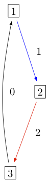
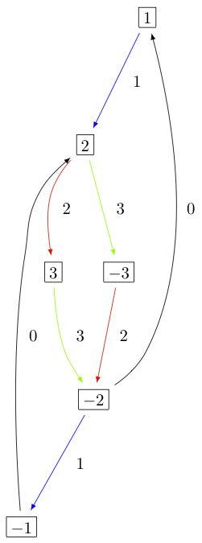
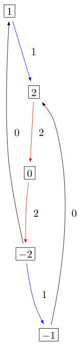
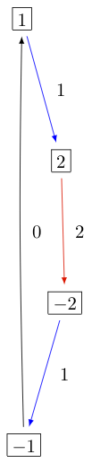
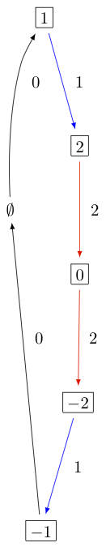
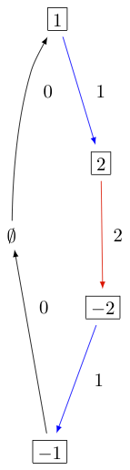
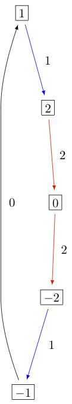
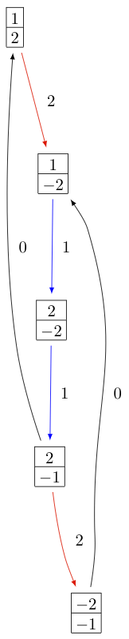
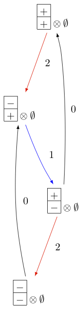
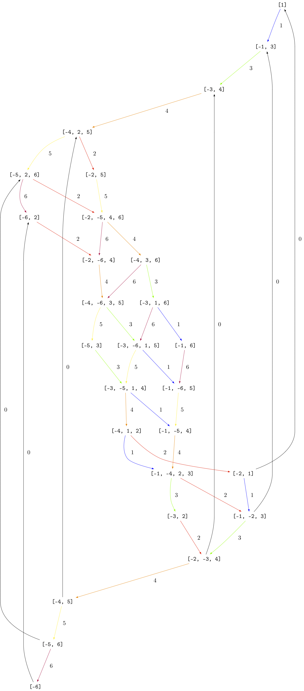

.. _AffineFinite:

======================
Affine Finite Crystals
======================

In this document we briefly explain the construction and implementation
of the Kirillov--Reshetikhin crystals of [FourierEtAl2009]_.

Kirillov--Reshetikhin (KR) crystals are finite-dimensional affine crystals
corresponding to Kirillov--Reshektikhin modules. They were first conjectured to
exist in [HatayamaEtAl2001]_. The proof of their existence for nonexceptional
types was given in [OkadoSchilling2008]_ and their combinatorial models were
constructed in [FourierEtAl2009]_. Kirillov-Reshetikhin crystals `B^{r,s}`
are indexed first by their type (like `A_n^{(1)}`, `B_n^{(1)}`, ...) with
underlying index set `I = \{0,1,\ldots, n\}` and two integers `r` and `s`.
The integers `s` only needs to satisfy `s >0`, whereas `r` is a node of the
finite Dynkin diagram `r \in I \setminus \{0\}`.

Their construction relies on several cases which we discuss separately. In
all cases when removing the zero arrows, the crystal decomposes as a (direct
sum of) classical crystals which gives the crystal structure for the index
set `I_0 = \{ 1,2,\ldots, n\}`. Then the zero arrows are added by either
exploiting a symmetry of the Dynkin diagram or by using embeddings of crystals.

Type `A_n^{(1)}`
----------------

The Dynkin diagram for affine type `A` has a rotational symmetry mapping
`\sigma: i \mapsto i+1` where we view the indices modulo `n+1`::

    sage: C = CartanType(['A',3,1])
    sage: C.dynkin_diagram()
    0
    O-------+
    |       |
    |       |
    O---O---O
    1   2   3
    A3~

The classical decomposition of `B^{r,s}` is the `A_n` highest weight
crystal `B(s\omega_r)` or equivalently the crystal of tableaux labelled
by the rectangular partition `(s^r)`:

.. MATH::

    B^{r,s} \cong B(s\omega_r) \quad \text{as a }
    \{1,2,\ldots,n\}\text{-crystal}

In Sage we can see this via::

    sage: K = crystals.KirillovReshetikhin(['A',3,1],1,1)
    sage: K.classical_decomposition()
    The crystal of tableaux of type ['A', 3] and shape(s) [[1]]
    sage: K.list()
    [[[1]], [[2]], [[3]], [[4]]]

    sage: K = crystals.KirillovReshetikhin(['A',3,1],2,1)
    sage: K.classical_decomposition()
    The crystal of tableaux of type ['A', 3] and shape(s) [[1, 1]]

One can change between the classical and affine crystal using
the methods ``lift`` and ``retract``::

    sage: K = crystals.KirillovReshetikhin(['A',3,1],2,1)
    sage: b = K(rows=[[1],[3]]); type(b)
    <class 'sage.combinat.crystals.kirillov_reshetikhin.KR_type_A_with_category.element_class'>
    sage: b.lift()
    [[1], [3]]
    sage: type(b.lift())
    <class 'sage.combinat.crystals.tensor_product.CrystalOfTableaux_with_category.element_class'>

    sage: b = crystals.Tableaux(['A',3], shape = [1,1])(rows=[[1],[3]])
    sage: K.retract(b)
    [[1], [3]]
    sage: type(K.retract(b))
    <class 'sage.combinat.crystals.kirillov_reshetikhin.KR_type_A_with_category.element_class'>

The `0`-arrows are obtained using the analogue of `\sigma`, called
the promotion operator `\mathrm{pr}`, on the level of crystals via:

.. MATH::

    f_0 = \mathrm{pr}^{-1} \circ f_1 \circ \mathrm{pr}

    e_0 = \mathrm{pr}^{-1} \circ e_1 \circ \mathrm{pr}

In Sage this can be achieved as follows::

    sage: K = crystals.KirillovReshetikhin(['A',3,1],2,1)
    sage: b = K.module_generator(); b
    [[1], [2]]
    sage: b.f(0)
    sage: b.e(0)
    [[2], [4]]

    sage: K.promotion()(b.lift())
    [[2], [3]]
    sage: K.promotion()(b.lift()).e(1)
    [[1], [3]]
    sage: K.promotion_inverse()(K.promotion()(b.lift()).e(1))
    [[2], [4]]

KR crystals are level `0` crystals, meaning that the weight of all
elements in these crystals is zero::

    sage: K = crystals.KirillovReshetikhin(['A',3,1],2,1)
    sage: b = K.module_generator(); b.weight()
    -Lambda[0] + Lambda[2]
    sage: b.weight().level()
    0

The KR crystal `B^{1,1}` of type `A_2^{(1)}` looks as follows:

In Sage this can be obtained via::

    sage: K = crystals.KirillovReshetikhin(['A',2,1],1,1)
    sage: G = K.digraph()
    sage: view(G, tightpage=True) # optional - dot2tex graphviz, not tested (opens external window)

Types `D_n^{(1)}`, `B_n^{(1)}`, `A_{2n-1}^{(2)}`
------------------------------------------------

The Dynkin diagrams for types `D_n^{(1)}`, `B_n^{(1)}`, `A_{2n-1}^{(2)}`
are invariant under interchanging nodes `0` and `1`::

    sage: n = 5
    sage: C = CartanType(['D',n,1]); C.dynkin_diagram()
      0 O   O 5
        |   |
        |   |
    O---O---O---O
    1   2   3   4
    D5~
    sage: C = CartanType(['B',n,1]); C.dynkin_diagram()
        O 0
        |
        |
    O---O---O---O=>=O
    1   2   3   4   5
    B5~
    sage: C = CartanType(['A',2*n-1,2]); C.dynkin_diagram()
        O 0
        |
        |
    O---O---O---O=<=O
    1   2   3   4   5
    B5~*

The underlying classical algebras obtained when removing node `0` are
type `\mathfrak{g}_0 = D_n, B_n, C_n`, respectively. The classical
decomposition into a `\mathfrak{g}_0` crystal is a direct sum:

.. MATH::

    B^{r,s} \cong \bigoplus_\lambda B(\lambda) \quad \text{as a }
    \{1,2,\ldots,n\}\text{-crystal}

where `\lambda` is obtained from `s\omega_r` (or equivalently a rectangular
partition of shape `(s^r)`) by removing vertical dominoes. This in fact
only holds in the ranges `1\le r\le n-2` for type `D_n^{(1)}`, and
`1 \le r \le n` for types `B_n^{(1)}` and `A_{2n-1}^{(2)}`::

    sage: K = crystals.KirillovReshetikhin(['D',6,1],4,2)
    sage: K.classical_decomposition()
    The crystal of tableaux of type ['D', 6] and shape(s)
     [[], [1, 1], [1, 1, 1, 1], [2, 2], [2, 2, 1, 1], [2, 2, 2, 2]]

For type `B_n^{(1)}` and `r=n`, one needs to be aware that `\omega_n`
is a spin weight and hence corresponds in the partition language to a
column of height `n` and width `1/2`::

    sage: K = crystals.KirillovReshetikhin(['B',3,1],3,1)
    sage: K.classical_decomposition()
    The crystal of tableaux of type ['B', 3] and shape(s) [[1/2, 1/2, 1/2]]

As for type `A_n^{(1)}`, the Dynkin automorphism induces a promotion-type
operator `\sigma` on the level of crystals. In this case in can however
happen that the automorphism changes between classical components::

    sage: K = crystals.KirillovReshetikhin(['D',4,1],2,1)
    sage: b = K.module_generator(); b
    [[1], [2]]
    sage: K.automorphism(b)
    [[2], [-1]]
    sage: b = K(rows=[[2],[-2]])
    sage: K.automorphism(b)
    []

This operator `\sigma` is used to define the affine crystal operators:

.. MATH::

    f_0 = \sigma \circ f_1 \circ \sigma

    e_0 = \sigma \circ e_1 \circ \sigma

The KR crystals `B^{1,1}` of types `D_3^{(1)}`, `B_2^{(1)}`,
and `A_5^{(2)}` are, respectively:

.. image:: ../media/KR_Atwisted.png
   :scale: 60

Type `C_n^{(1)}`
----------------

The Dynkin diagram of type `C_n^{(1)}` has a symmetry `\sigma(i) = n-i`::

    sage: C = CartanType(['C',4,1]); C.dynkin_diagram()
    O=>=O---O---O=<=O
    0   1   2   3   4
    C4~

The classical subalgebra when removing the 0 node is of type `C_n`.

However, in this case the crystal `B^{r,s}` is not constructed using
`\sigma`, but rather using a virtual crystal construction. `B^{r,s}` of type
`C_n^{(1)}` is realized inside `\hat{V}^{r,s}` of type `A_{2n+1}^{(2)}` using:

.. MATH::

    e_0 = \hat{e}_0 \hat{e}_1 \quad \text{and} \quad
    e_i = \hat{e}_{i+1} \quad \text{for} \quad 1\le i\le n

    f_0 = \hat{f}_0 \hat{f}_1 \quad \text{and} \quad
    f_i = \hat{f}_{i+1} \quad \text{for} \quad 1\le i\le n

where `\hat{e}_i` and `\hat{f}_i` are the crystal operator in the
ambient crystal `\hat{V}^{r,s}`::

    sage: K = crystals.KirillovReshetikhin(['C',3,1],1,2); K.ambient_crystal()
    Kirillov-Reshetikhin crystal of type ['B', 4, 1]^* with (r,s)=(1,2)

The classical decomposition for `1 \le r < n` is given by:

.. MATH::

    B^{r,s} \cong \bigoplus_\lambda B(\lambda) \quad \text{as a }
    \{1,2,\ldots,n\}\text{-crystal}

where `\lambda` is obtained from `s\omega_r` (or equivalently a rectangular
partition of shape `(s^r)`) by removing horizontal dominoes::

    sage: K = crystals.KirillovReshetikhin(['C',3,1],2,4)
    sage: K.classical_decomposition()
    The crystal of tableaux of type ['C', 3] and shape(s) [[], [2], [4], [2, 2], [4, 2], [4, 4]]

The KR crystal `B^{1,1}` of type `C_2^{(1)}` looks as follows:

Types `D_{n+1}^{(2)}`, `A_{2n}^{(2)}`
-------------------------------------

The Dynkin diagrams of types `D_{n+1}^{(2)}` and `A_{2n}^{(2)}`
look as follows::

    sage: C = CartanType(['D',5,2]); C.dynkin_diagram()
    O=<=O---O---O=>=O
    0   1   2   3   4
    C4~*

    sage: C = CartanType(['A',8,2]); C.dynkin_diagram()
    O=<=O---O---O=<=O
    0   1   2   3   4
    BC4~

The classical subdiagram is of type `B_n` for type `D_{n+1}^{(2)}` and
of type `C_n` for type `A_{2n}^{(2)}`. The classical decomposition for these
KR crystals for `1\le r < n` for type `D_{n+1}^{(2)}` and `1 \le r \le n`
for type `A_{2n}^{(2)}` is given by:

.. MATH::

    B^{r,s} \cong \bigoplus_\lambda B(\lambda) \quad \text{as a }
    \{1,2,\ldots,n\}\text{-crystal}

where `\lambda` is obtained from `s\omega_r` (or equivalently a rectangular
partition of shape `(s^r)`) by removing single boxes::

    sage: K = crystals.KirillovReshetikhin(['D',5,2],2,2)
    sage: K.classical_decomposition()
    The crystal of tableaux of type ['B', 4] and shape(s) [[], [1], [2], [1, 1], [2, 1], [2, 2]]

    sage: K = crystals.KirillovReshetikhin(['A',8,2],2,2)
    sage: K.classical_decomposition()
    The crystal of tableaux of type ['C', 4] and shape(s) [[], [1], [2], [1, 1], [2, 1], [2, 2]]

The KR crystals are constructed using an injective map into a KR crystal of type `C_n^{(1)}`

.. MATH::

    S : B^{r,s} \to B^{r,2s}_{C_n^{(1)}} \quad \text{such that }
    S(e_ib) = e_i^{m_i}S(b) \text{ and } S(f_ib) = f_i^{m_i}S(b)

where

.. MATH::

    (m_0,\ldots,m_n) = (1,2,\ldots,2,1) \text{ for type } D_{n+1}^{(2)}
    \quad \text{and} \quad
    (1,2,\ldots,2,2) \text{ for type } A_{2n}^{(2)}.

::

    sage: K = crystals.KirillovReshetikhin(['D',5,2],1,2); K.ambient_crystal()
    Kirillov-Reshetikhin crystal of type ['C', 4, 1] with (r,s)=(1,4)
    sage: K = crystals.KirillovReshetikhin(['A',8,2],1,2); K.ambient_crystal()
    Kirillov-Reshetikhin crystal of type ['C', 4, 1] with (r,s)=(1,4)

The KR crystals `B^{1,1}` of type `D_3^{(2)}` and `A_4^{(2)}` look as follows:

As you can see from the Dynkin diagram for type `A_{2n}^{(2)}`, mapping the
nodes `i\mapsto n-i` yields the same diagram, but with relabelled nodes. In
this case the classical subdiagram is of type `B_n` instead of `C_n`. One
can also construct the KR crystal `B^{r,s}` of type `A_{2n}^{(2)}` based on
this classical decomposition. In this case the classical decomposition is
the sum over all weights obtained from `s \omega_r` by removing
horizontal dominoes::

    sage: C = CartanType(['A',6,2]).dual()
    sage: Kdual = crystals.KirillovReshetikhin(C,2,2)
    sage: Kdual.classical_decomposition()
    The crystal of tableaux of type ['B', 3] and shape(s) [[], [2], [2, 2]]

Looking at the picture, one can see that this implementation is
isomorphic to the other implementation based on the `C_n` decomposition
up to a relabeling of the arrows::

    sage: C = CartanType(['A',4,2])
    sage: K = crystals.KirillovReshetikhin(C,1,1)
    sage: Kdual = crystals.KirillovReshetikhin(C.dual(),1,1)
    sage: G = K.digraph()
    sage: Gdual = Kdual.digraph()
    sage: f = { 1:1, 0:2, 2:0 }
    sage: for u,v,label in Gdual.edges(sort=False):
    ....:     Gdual.set_edge_label(u,v,f[label])
    sage: G.is_isomorphic(Gdual, edge_labels = True)
    True

Exceptional nodes
-----------------

The KR crystals `B^{n,s}` for types `C_n^{(1)}` and `D_{n+1}^{(2)}` were
excluded from the above discussion. They are associated to the exceptional
node `r=n` and in this case the classical decomposition is irreducible:

.. MATH::

    B^{n,s} \cong B(s\omega_n).

In Sage::

    sage: K = crystals.KirillovReshetikhin(['C',2,1],2,1)
    sage: K.classical_decomposition()
    The crystal of tableaux of type ['C', 2] and shape(s) [[1, 1]]

    sage: K = crystals.KirillovReshetikhin(['D',3,2],2,1)
    sage: K.classical_decomposition()
    The crystal of tableaux of type ['B', 2] and shape(s) [[1/2, 1/2]]

The KR crystals `B^{n,s}` and `B^{n-1,s}` of type `D_n^{(1)}` are also special. They decompose as:

.. MATH::

    B^{n,s} \cong B(s\omega_n)
    \quad \text{ and } \quad
    B^{n-1,s} \cong B(s\omega_{n-1}).

::

    sage: K = crystals.KirillovReshetikhin(['D',4,1],4,1)
    sage: K.classical_decomposition()
    The crystal of tableaux of type ['D', 4] and shape(s) [[1/2, 1/2, 1/2, 1/2]]
    sage: K = crystals.KirillovReshetikhin(['D',4,1],3,1)
    sage: K.classical_decomposition()
    The crystal of tableaux of type ['D', 4] and shape(s) [[1/2, 1/2, 1/2, -1/2]]

Type `E_6^{(1)}`
----------------

In [JonesEtAl2010]_ the KR crystals `B^{r,s}` for `r=1,2,6` in type `E_6^{(1)}`
were constructed exploiting again a Dynkin diagram automorphism, namely the
automorphism `\sigma` of order 3 which maps `0\mapsto 1 \mapsto 6 \mapsto 0`::

    sage: C = CartanType(['E',6,1]); C.dynkin_diagram()
            O 0
            |
            |
            O 2
            |
            |
    O---O---O---O---O
    1   3   4   5   6
    E6~

The crystals `B^{1,s}` and `B^{6,s}` are irreducible as classical crystals::

    sage: K = crystals.KirillovReshetikhin(['E',6,1],1,1)
    sage: K.classical_decomposition()
    Direct sum of the crystals Family (Finite dimensional highest weight crystal of type ['E', 6] and highest weight Lambda[1],)
    sage: K = crystals.KirillovReshetikhin(['E',6,1],6,1)
    sage: K.classical_decomposition()
    Direct sum of the crystals Family (Finite dimensional highest weight crystal of type ['E', 6] and highest weight Lambda[6],)

whereas for the adjoint node `r=2` we have the decomposition

.. MATH::

    B^{2,s} \cong \bigoplus_{k=0}^s B(k\omega_2)

::

    sage: K = crystals.KirillovReshetikhin(['E',6,1],2,1)
    sage: K.classical_decomposition()
    Direct sum of the crystals Family (Finite dimensional highest weight crystal of type ['E', 6] and highest weight 0,
    Finite dimensional highest weight crystal of type ['E', 6] and highest weight Lambda[2])

The promotion operator on the crystal corresponding to `\sigma` can be calculated explicitly::

    sage: K = crystals.KirillovReshetikhin(['E',6,1],1,1)
    sage: promotion = K.promotion()
    sage: u = K.module_generator(); u
    [(1,)]
    sage: promotion(u.lift())
    [(-1, 6)]

The crystal `B^{1,1}` is already of dimension 27. The elements `b` of this
crystal are labelled by tuples which specify their nonzero `\phi_i(b)` and
`\epsilon_i(b)`. For example, `[-6,2]` indicates that
`\phi_2([-6,2]) = \epsilon_6([-6,2]) = 1` and all others are equal to zero::

    sage: K = crystals.KirillovReshetikhin(['E',6,1],1,1)
    sage: K.cardinality()
    27

Single column KR crystals
-------------------------

A single column KR crystal is `B^{r,1}` for any `r \in I_0`.

In [LNSSS14I]_ and [LNSSS14II]_, it was shown that single column KR
crystals can be constructed by projecting level 0 crystals of LS paths onto
the classical weight lattice. We first verify that we do get an isomorphic
crystal for `B^{1,1}` in type `E_6^{(1)}`::

    sage: K = crystals.KirillovReshetikhin(['E',6,1], 1,1)
    sage: K2 = crystals.kirillov_reshetikhin.LSPaths(['E',6,1], 1,1)
    sage: K.digraph().is_isomorphic(K2.digraph(), edge_labels=True)
    True

Here is an example in `E_8^{(1)}` and we calculate its
classical decomposition::

    sage: K = crystals.kirillov_reshetikhin.LSPaths(['E',8,1], 8,1)
    sage: K.cardinality()
    249
    sage: L = [x for x in K if x.is_highest_weight([1,2,3,4,5,6,7,8])]
    sage: [x.weight() for x in L]
    [-2*Lambda[0] + Lambda[8], 0]

Applications
------------

An important notion for finite-dimensional affine crystals is perfectness.
The crucial property is that a crystal `B` is perfect of level `\ell` if there
is a bijection between level `\ell` dominant weights and elements in

.. MATH::

   B_{\mathrm{min}} = \{ b \in B \mid \mathrm{lev}(\varphi(b)) = \ell \}\;.

For a precise definition of perfect crystals see [HongKang2002]_ .
In [FourierEtAl2010]_ it was proven that for the nonexceptional types
`B^{r,s}` is perfect as long as `s/c_r` is an integer. Here `c_r=1` except
`c_r=2` for `1 \le r < n` in type `C_n^{(1)}` and `r=n` in type `B_n^{(1)}`.

Here we verify this using Sage for `B^{1,1}` of type `C_3^{(1)}`::

    sage: K = crystals.KirillovReshetikhin(['C',3,1],1,1)
    sage: Lambda = K.weight_lattice_realization().fundamental_weights(); Lambda
    Finite family {0: Lambda[0], 1: Lambda[1], 2: Lambda[2], 3: Lambda[3]}
    sage: [w.level() for w in Lambda]
    [1, 1, 1, 1]
    sage: Bmin = [b for b in K if b.Phi().level() == 1 ]; Bmin
    [[[1]], [[2]], [[3]], [[-3]], [[-2]], [[-1]]]
    sage: [b.Phi() for b in Bmin]
    [Lambda[1], Lambda[2], Lambda[3], Lambda[2], Lambda[1], Lambda[0]]

As you can see, both `b=1` and `b=-2` satisfy `\varphi(b)=\Lambda_1`.
Hence there is no bijection between the minimal elements in
`B_{\mathrm{min}}` and level 1 weights. Therefore,
`B^{1,1}` of type `C_3^{(1)}` is not perfect. However,
`B^{1,2}` of type `C_n^{(1)}` is a perfect crystal::

    sage: K = crystals.KirillovReshetikhin(['C',3,1],1,2)
    sage: Lambda = K.weight_lattice_realization().fundamental_weights()
    sage: Bmin = [b for b in K if b.Phi().level() == 1 ]
    sage: [b.Phi() for b in Bmin]
    [Lambda[0], Lambda[3], Lambda[2], Lambda[1]]

Perfect crystals can be used to construct infinite-dimensional highest weight
crystals and Demazure crystals using the Kyoto path model [KKMMNN1992]_.
We construct Example 10.6.5 in [HongKang2002]_::

    sage: K = crystals.KirillovReshetikhin(['A',1,1], 1,1)
    sage: La = RootSystem(['A',1,1]).weight_lattice().fundamental_weights()
    sage: B = crystals.KyotoPathModel(K, La[0])
    sage: B.highest_weight_vector()
    [[[2]]]

    sage: K = crystals.KirillovReshetikhin(['A',2,1], 1,1)
    sage: La = RootSystem(['A',2,1]).weight_lattice().fundamental_weights()
    sage: B = crystals.KyotoPathModel(K, La[0])
    sage: B.highest_weight_vector()
    [[[3]]]

    sage: K = crystals.KirillovReshetikhin(['C',2,1], 2,1)
    sage: La = RootSystem(['C',2,1]).weight_lattice().fundamental_weights()
    sage: B = crystals.KyotoPathModel(K, La[1])
    sage: B.highest_weight_vector()
    [[[2], [-2]]]

Energy function and one-dimensional configuration sum
-----------------------------------------------------

For tensor products of Kirillov-Reshehtikhin crystals, there also exists
the important notion of the energy function. It can be defined as the sum
of certain local energy functions and the `R`-matrix. In Theorem 7.5 in
[SchillingTingley2011]_ it was shown that for perfect crystals of the
same level the energy `D(b)` is the same as the affine grading (up to a
normalization). The affine grading is defined as the minimal number of
applications of `e_0` to `b` to reach a ground state path. Computationally,
this algorithm is a lot more efficient than the computation involving
the `R`-matrix and has been implemented in Sage::

    sage: K = crystals.KirillovReshetikhin(['A',2,1],1,1)
    sage: T = crystals.TensorProduct(K,K,K)
    sage: hw = [b for b in T if all(b.epsilon(i)==0 for i in [1,2])]
    sage: for b in hw:
    ....:     print("{} {}".format(b, b.energy_function()))
    [[[1]], [[1]], [[1]]] 0
    [[[1]], [[2]], [[1]]] 2
    [[[2]], [[1]], [[1]]] 1
    [[[3]], [[2]], [[1]]] 3

The affine grading can be computed even for nonperfect crystals::

    sage: K = crystals.KirillovReshetikhin(['C',4,1],1,2)
    sage: K1 = crystals.KirillovReshetikhin(['C',4,1],1,1)
    sage: T = crystals.TensorProduct(K,K1)
    sage: hw = [b for b in T if all(b.epsilon(i)==0 for i in [1,2,3,4])]
    sage: for b in hw:
    ....:     print("{} {}".format(b, b.affine_grading()))
    [[], [[1]]] 1
    [[[1, 1]], [[1]]] 2
    [[[1, 2]], [[1]]] 1
    [[[1, -1]], [[1]]] 0

The one-dimensional configuration sum of a crystal `B` is the graded sum
by energy of the weight of all elements `b \in B`:

.. MATH::

    X(B) = \sum_{b \in B} x^{\mathrm{weight}(b)} q^{D(b)}

Here is an example of how you can compute the one-dimensional
configuration sum in Sage::

    sage: K = crystals.KirillovReshetikhin(['A',2,1],1,1)
    sage: T = crystals.TensorProduct(K,K)
    sage: T.one_dimensional_configuration_sum()
    B[-2*Lambda[1] + 2*Lambda[2]] + (q+1)*B[-Lambda[1]]
     + (q+1)*B[Lambda[1] - Lambda[2]] + B[2*Lambda[1]]
     + B[-2*Lambda[2]] + (q+1)*B[Lambda[2]]

