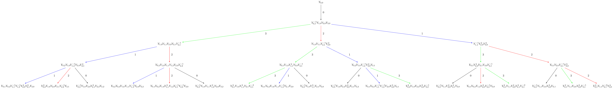

==============================
Affine Highest Weight Crystals
==============================

Affine highest weight crystals are infinite-dimensional. Hence, to work
with them in Sage, we need some further tools.

Littelmann path model
---------------------

The Littelmann path model for highest weight crystals is implemented
in Sage. It models finite highest crystals as well as affine highest weight
crystals which are infinite dimensional. The elements of the crystal are
piecewise linear maps in the weight space. For more information on the
Littelmann path model, see [L1995]_.

Since the affine highest weight crystals are infinite, it is not possible
to list all elements or draw the entire crystal graph. However, if the user
is only interested in the crystal up to a certain distance or depth from the
highest weight element, then one can work with the corresponding subcrystal.
To view the corresponding upper part of the crystal, one can build the
associated digraph::

    sage: R = RootSystem(['C',3,1])
    sage: La = R.weight_space().basis()
    sage: LS = crystals.LSPaths(2*La[1]); LS
    The crystal of LS paths of type ['C', 3, 1] and weight 2*Lambda[1]
    sage: C = LS.subcrystal(max_depth=3)
    sage: sorted(C, key=str)
    [(-Lambda[0] + 2*Lambda[1] - Lambda[2] + Lambda[3], Lambda[1]),
     (-Lambda[0] + Lambda[1] + Lambda[2], Lambda[0] - Lambda[1] + Lambda[2]),
     (-Lambda[0] + Lambda[1] + Lambda[2], Lambda[1]),
     (-Lambda[1] + 2*Lambda[2], Lambda[1]),
     (2*Lambda[0] - 2*Lambda[1] + 2*Lambda[2],),
     (2*Lambda[1],),
     (Lambda[0] + Lambda[2] - Lambda[3], Lambda[1]),
     (Lambda[0] - Lambda[1] + Lambda[2], Lambda[1]),
     (Lambda[0] - Lambda[2] + Lambda[3], Lambda[0] - Lambda[1] + Lambda[2]),
     (Lambda[0] - Lambda[2] + Lambda[3], Lambda[1])]

    sage: G = LS.digraph(subset = C)
    sage: view(G, pdflatex=True, tightpage=True)  #optional - dot2tex graphviz

.. image:: ../media/LScrystal.png
   :scale: 50
   :align: center

The Littelmann path model also lends itself as a model for level zero
crystals which are bi-infinite. To cut out a slice of these crystals, one
can use the direction option in subcrystal::

    sage: R = RootSystem(['A',2,1])
    sage: La = R.weight_space(extended = True).basis()
    sage: LS = crystals.LSPaths(La[1]-La[0]); LS
    The crystal of LS paths of type ['A', 2, 1] and weight -Lambda[0] + Lambda[1]
    sage: C = LS.subcrystal(max_depth=2, direction = 'both')
    sage: G = LS.digraph(subset = C)
    sage: G.set_latex_options(edge_options = lambda (u,v,label): ({}))
    sage: view(G, pdflatex=True, tightpage=True)  #optional - dot2tex graphviz

.. image:: ../media/level_zero_crystal.png
   :scale: 50
   :align: center

Modified Nakajima monomials
---------------------------

Modified Nakajima monomials have also been implemented in Sage and models
highest weight crystals in all symmetrizable types. The elements are given
in terms of commuting variables `Y_i(n)` where `i \in I` and
`n \in \ZZ_{\geq 0}`. For more information on the modified Nakajima
monomials, see [KKS2007]_.

We give an example in affine type and verify that up to depth 3, it agrees
with the Littelmann path model::

    sage: La = RootSystem(['C',3,1]).weight_space().fundamental_weights()
    sage: LS = crystals.LSPaths(2*La[1]+La[2])
    sage: SL = LS.subcrystal(max_depth=3)
    sage: GL = LS.digraph(subset=SL)

    sage: La = RootSystem(['C',3,1]).weight_lattice().fundamental_weights()
    sage: M = crystals.NakajimaMonomials(['C',3,1], 2*La[1]+La[2])
    sage: SM = M.subcrystal(max_depth=3)
    sage: GM = M.digraph(subset=SM)
    sage: GL.is_isomorphic(GM, edge_labels=True)
    True

Now we do an example of a simply-laced (so symmetrizable) hyperbolic
type `H_1^{(4)}`, which comes from the complete graph on 4 vertices::

    sage: CM = CartanMatrix([[2, -1, -1,-1],[-1,2,-1,-1],[-1,-1,2,-1],[-1,-1,-1,2]]); CM
    [ 2 -1 -1 -1]
    [-1  2 -1 -1]
    [-1 -1  2 -1]
    [-1 -1 -1  2]
    sage: La = RootSystem(CM).weight_lattice().fundamental_weights()
    sage: M = crystals.NakajimaMonomials(CM, La[0])
    sage: SM = M.subcrystal(max_depth=4)
    sage: GM = M.digraph(subset=SM) # long time

