==================
Classical Crystals
==================

A classical crystal is one coming from the finite (classical) types
`A_r, B_r, C_r, D_r, E_{6,7,8}, F_4`, and `G_2`. Here we
describe some background before going into the general theory of crystals
and the type dependent combinatorics.

Tableaux and representations of `GL(n)`
---------------------------------------

Let `\lambda` be a partition. The *Young diagram* of `\lambda` is the
array of boxes having `\lambda_i` boxes in the `i`-th row, left
adjusted. Thus if `\lambda = (3, 2)` the diagram is:

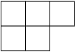

A *semi-standard Young tableau* of shape `\lambda` is a filling of the
box by integers in which the rows are weakly increasing and the
columns are strictly increasing. Thus

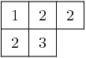

is a semistandard Young tableau. Sage has a :class:`Tableau` class,
and you may create this tableau as follows::

    sage: T = Tableau([[1,2,2], [2,3]]); T
    [[1, 2, 2], [2, 3]]

A partition of length `\le r+1` is a dominant weight for
`GL(r+1, \mathbf{C})` according to the description of the ambient
space in :ref:`standard-realizations`. Therefore it corresponds to an
irreducible representation `\pi_\lambda = \pi_\lambda^{GL(r+1)}` of
`GL(r+1, \mathbf{C})`.

It is true that not every dominant weight `\lambda` is a partition,
since a dominant weight might have some values `\lambda_i`
negative. The dominant weight `\lambda` is a partition if and only if
the character of `\lambda` is a polynomial as a function on the space
`\hbox{Mat}_n(\mathbf{C})`. Thus for example `\det^{-1} = \pi_\lambda`
with `\lambda = (-1, \dots, -1)`, which is a dominant weight but not
a partition, and the character is not a polynomial function on
`\hbox{Mat}_n(\mathbf{C})`.

**Theorem** [Littlewood] If `\lambda` is a partition, then the number
of semi-standard Young tableaux with shape `\lambda` and entries in
`\{1,2,\ldots,r+1\}` is the dimension of `\pi_\lambda`.

For example, if `\lambda = (3,2)` and `r = 2`, then we find 15
tableaux with shape `\lambda` and entries in `\{1,2,3\}`:

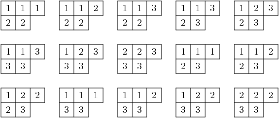

This is consistent with the theorem since the dimension of the
irreducible representation of `GL(3)` with highest weight `(3,2,0)`
has dimension 15::

    sage: A2 = WeylCharacterRing("A2")
    sage: A2(3,2,0).degree()
    15

In fact we may obtain the character of the representation from the set
of tableaux. Indeed, one of the definitions of the Schur polynomial
(due to Littlewood) is the following combinatorial one. If `T` is a
tableaux, define the *weight* of `T` to be
`\hbox{wt}(T) = (k_1,\dots,k_n)` where `k_i` is the number of `i`'s
in the tableaux. Then the multiplicity of `\mu` in the character
`\chi_\lambda` is the number of tableaux of weight `\lambda`. Thus if
`\mathbf{z} = (z_1,\dots,z_n)`, we have

.. MATH::

    \chi_\lambda(\mathbf{z}) = \sum_T \mathbf{z}^{\hbox{wt}(T)}

where the sum is over all semi-standard Young tableaux of shape
`\lambda` that have entries in `\{1, 2, \ldots, r+1\}`.

Frobenius-Schur Duality
-----------------------

Frobenius-Schur duality is a relationship between the representation
theories of the symmetric group and general linear group. We will relate this
to tableaux in the next section.

Representations of the symmetric group `S_k` are parametrized by
partitions `\lambda` of `k`. The parametrization may be characterized
as follows. Let `n` be any integer `\ge k`. Then both
`GL(n,\mathbf{C})` and `S_k` act on `\otimes^k V` where
`V = \mathbf{C}^n`. Indeed, `GL(n)` acts on each `V` and `S_k`
permutes them. Then if `\pi_\lambda^{GL(n)}` is the representation of
`GL(n,\mathbf{C})` with highest weight vector `\lambda` and
`\pi_\lambda^{S_k}` is the irreducible representation of `S_k`
parametrized by `\lambda` then

.. MATH::

    \otimes^k V
    \cong
    \bigoplus_{\lambda\vdash k}\pi^{GL(n)}_\lambda\otimes\pi^{S_k}_\lambda

as bimodules for the two groups. This is *Frobenius-Schur duality* and
it serves to characterize the parametrization of the irreducible
representations of `S_k` by partitions of `k`.

Counting pairs of tableaux
--------------------------

In both the representation theory of `GL(n)` and the representation
theory of `S_k`, the degrees of irreducible representations can be
expressed in terms of the number of tableaux of the appropriate
type. We have already stated the theorem for `GL(n)`. For `S_k`,
it goes as follows.

Let us say that a semistandard Young tableau `T` of shape `\lambda\vdash k` is
*standard* if `T` contains each entry `1,2,\dots,k` exactly once.
Thus both rows and columns are strictly increasing.

**Theorem** [Young, 1927] The degree of `\pi_\lambda` is the number of
standard tableaux of shape `\lambda`.

Now let us consider the implications of Frobenius-Schur duality.
The dimension of `\otimes^k V` is `n^k`. Therefore `n^k` is equal
to the number of pairs `(T1,T2)` of tableaux of the same shape
`\lambda\vdash k`, where the first tableaux is standard (in the
alphabet `1,2,\ldots,k`), and the second the second semistandard (in the
alphabet `1,2,\ldots,n`).

The Robinson-Schensted-Knuth correspondence
-------------------------------------------

The last purely combinatorial statement has a combinatorial proof,
based on the Robinson-Schensted-Knuth (RSK) correspondence.

References:

- [Knuth1998]_, section "Tableaux and Involutions".

- [Knuth1970]_

- [Fulton1997]_

- [Stanley1999]_

The RSK correspondence gives bijections between
pairs of tableaux of various types and combinatorial objects of
different types. We will not review the correspondence in detail here,
but see the references. We note that Schensted insertion is
implemented as the method ``schensted_insertion`` of Tableau class in
Sage.

Thus we have the following bijections:

- Pairs of tableaux `T_1` and `T_2` of shape `\lambda` where `\lambda`
  runs through the partitions of `k` such that `T_1` is a standard
  tableau and `T_2` is a semistandard tableau in `1,2,\dots,n` are in
  bijection with the `n^k` words of length `k` in `1,2,\dots,n`.

- Pairs of standard tableaux of the same shape `\lambda` as `\lambda`
  runs through the partitions of `k` are in bijection with the `k!`
  elements of `S_k`.

- Pairs of tableaux `T_1` and `T_2` of the same shape `\lambda` but
  arbitrary size in `1,2,3,\dots,n` are in bijection with `n \times n`
  positive integer matrices.

- Pairs of tableaux `T_1` and `T_2` of conjugate shapes `\lambda` and
  `\lambda'` are in bijection with `n \times n` matrices with entries
  `0` or `1`.

The second of these four bijection gives a combinatorial proof of
the fact explained above, that the number of pairs `(T1,T2)` of tableaux of
the same shape `\lambda\vdash k`, where the first tableaux is standard (in the
alphabet `1,2,\cdots,k`), and the second the second semistandard (in the
alphabet `1,2,\cdots,n`). So this second bijection is a *combinatorial
analog of Frobenius-Schur duality*.

Analogies between representation theory and combinatorics
---------------------------------------------------------

The four combinatorial bijections (variants of RSK) cited above have the
following analogs in representation theory.

- The first combinatorial fact corresponds to Frobenius-Schur duality, as we
  have already explained.

- The second combinatorial fact also has an analog in representation theory.
  The group algebra `\mathbf{C}[S_k]` is an `S_k \times S_k` bimodule with
  of dimension `k!`. It decomposes as a direct sum of
  `\pi_\lambda^{S_k} \otimes \pi_\lambda^{S_k}`.

Both the combinatorial fact and the decomposition of `\mathbf{C}[S_k]`
show that the number of pairs of standard tableaux of size `k` and
the same shape equals `k!`.

- The third combinatorial fact is analogous to the decomposition of the
  ring of polynomial functions on `\hbox{Mat}(n, \mathbf{C})` on which
  `GL(n, \mathbf{C}) \times GL(n, \mathbf{C})` acts by
  `(g_1, g_2)f(X) = f({^t g_1}X g_2)`. The polynomial ring decomposes
  into the direct sum of
  `\pi^{GL(n)}_\lambda \otimes \pi^{GL(n)}_\lambda`.

Taking traces gives the *Cauchy identity*:

.. MATH::

   \sum_\lambda s_\lambda(x_1,\cdots,x_n) s_\lambda(y_1,\cdots,y_n) =\prod_{i,j}(1-x_i y_j)^{-1}

where `x_i` are the eigenvalues of `g_1` and `y_j` are the eigenvalues of `g_2`. The sum
is over all partitions `\lambda`.

- The last combinatorial fact is analogous to the decomposition of
  the exterior algebra over `\hbox{Mat}(n, \mathbf{C})`.

Taking traces gives the *dual Cauchy identity*:

.. MATH::

   \sum_\lambda s_\lambda(x_1,\cdots,x_n) s_{\lambda'}(y_1,\cdots,y_n) =\prod_{i,j}(1+x_i y_j).

Again the sum is over partitions `\lambda` and here `\lambda'` is the conjugate partition.

Interpolating between representation theory and combinatorics
-------------------------------------------------------------

The theory of quantum groups interpolates between the representation
theoretic picture and the combinatorial picture, and thereby explains
these analogies. The representation `\pi_\lambda^{GL(n)}` is
reinterpreted as a module for the quantized enveloping algebra
`U_q(\mathfrak{gl}_n(\mathbf{C}))`, and the representation
`\pi_\lambda^{S_k}` is reinterpreted as a module for the Iwahori
Hecke algebra. Then Frobenius-Schur duality persists. See
[Jimbo1986]_. When `q \to 1`, we recover the representation
story. When `q \to 0`, we recover the combinatorial story.

Kashiwara crystals
------------------

References:

- [Kashiwara1995]_

- [KashiwaraNakashima1994]_

- [HongKang2002]_

Kashiwara considered the highest weight modules of quantized
enveloping algebras `U_q(\mathfrak{g})` in the limit when
`q \to 0`. The enveloping algebra cannot be defined when `q = 0`, but
a limiting structure can still be detected. This is the
*crystal basis* of the module.

Kashiwara's crystal bases have a combinatorial structure that sheds
light even on purely combinatorial constructions on tableaux that
predated quantum groups. It gives a good generalization to other
Cartan types (or more generally to Kac-Moody algebras).

Let `\Lambda` be the weight lattice of a Cartan type with root system `\Phi`.
We now define a *crystal* of type `\Phi`. Let `\mathcal{B}` be a set,
and let `0 \notin \mathcal{B}` be an auxiliary element. For each index
`1 \le i \le r` we assume there given maps
`e_i, f_i : \mathcal{B} \longrightarrow \mathcal{B} \cup \{0\}`, maps
`\varepsilon_i, \varphi_i : \mathcal{B} \longrightarrow \mathbf{Z}` and a
map `\hbox{wt} : \mathcal{B} \longrightarrow \Lambda` satisfying
certain assumptions, which we now describe. It is assumed that if
`x, y \in \mathcal{B}` then `e_i (x) = y` if and only if
`f_i (y) = x`. In this case, it is assumed that

.. MATH::

    \hbox{wt} (y) = \hbox{wt} (x) + \alpha_i,
    \qquad
    \varepsilon_i (x) = \varepsilon_i (y) + 1,
    \qquad \varphi_i (x) = \varphi_i (y) - 1.

Moreover, we assume that

.. MATH::

    \varphi_i (x) - \varepsilon_i (x)
    =
    \left\langle \hbox{wt} (x), \alpha^{\vee}_i \right\rangle

for all `x \in \mathcal{B}`.

We call a crystal *regular* if it satisfies the additional assumption that
`\varepsilon_i(v)` is the number of times that `e_i` may be applied to `v`, and
that `\phi_i(v)` is the number of times that `f_i` may be applied. That is,
`\varphi_i (x) = \max \{k | f_i^k x \neq 0\}` and `\varepsilon_i (x) =
\max \{k | e_i^k (x) \neq 0\}`. Kashiwara also allows `\varepsilon_i`
and `\varphi_i` to take the value `-\infty`.

.. NOTE::

    Most of the crystals that we are concerned with here are regular.

Given the crystal `\mathcal{B}`, the *character* `\chi_{\mathcal{B}}` is:

.. MATH::

    \sum_{v\in\mathcal{B}} {\mathbf{z}}^{wt(v)}.

Given any highest weight `\lambda`, constructions of Kashiwara and
Nakashima, Littelmann and others produce a crystal
`\chi_{\mathcal{B}_\lambda}` such that
`\chi_{\mathcal{B}_\lambda} = \chi_\lambda`, where `\chi_\lambda` is
the irreducible character with highest weight `\lambda`, as in
:ref:`representations`.

The crystal `\mathcal{B}_\lambda` is not uniquely characterized by the
properties that we have stated so far. For Cartan types `A, D, E`
(more generally, any simply-laced type) it may
be characterized by these properties together with certain other
*Stembridge axioms*. We will take it for granted that there is a
unique "correct" crystal `\mathcal{B}_\lambda` and discuss how these
are constructed in Sage.

Installing dot2tex
------------------

Before giving examples of crystals, we digress to help you install
``dot2tex``, which you will need in order to make latex images of
crystals.

``dot2tex`` is an optional package of sage and the latest version
can be installed via:

.. CODE-BLOCK:: shell-session

    $ sage -i dot2tex

This also requires various LaTeX packages. The following command
checks whether those are available::

    sage: from sage.graphs.graph_latex import check_tkz_graph
    sage: check_tkz_graph() # random

Crystals of tableaux in Sage
----------------------------

All crystals that are currently in Sage can be accessed by ``crystals.<tab>``.

For type `A_r`, Kashiwara and Nakashima put a crystal structure on the
set of tableaux with shape `\lambda` in `1, 2, \ldots, r+1`, and this is a
realization of `\mathcal{B}_{\lambda}`. Moreover, this construction
extends to other Cartan types, as we will explain. At the moment, we
will consider how to draw pictures of these crystals.

Once you have ``dot2tex`` installed, you may make images pictures of crystals
with a command such as this::

    sage: fn = tmp_filename(ext=".tex")
    sage: crystals.Tableaux("A2", shape=[2,1]).latex_file(fn)

Here `\lambda = (2,1)=(2,1,0)`. The crystal ``C`` is
`\mathcal{B}_{\lambda}`. The character `\chi_\lambda` will therefore
be the eight-dimensional irreducible character with this highest
weight. Then you may run pdflatex on the file ``a2rho.tex``.
This can also be achieved without the detour of saving the latex file via::

    sage: B = crystals.Tableaux(['A',2], shape=[2,1])
    sage: view(B, tightpage=True) # optional - dot2tex graphviz, not tested (opens external window)

This produces the crystal graph:

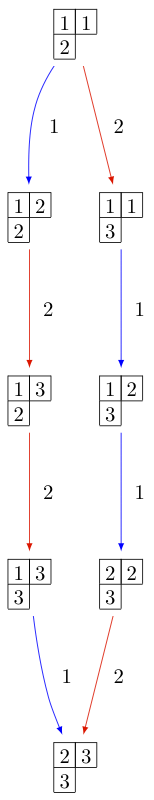

You may also wish to color the edges in different colors by specifying further latex options::

    sage: B = crystals.Tableaux(['A',2], shape=[2,1])
    sage: G = B.digraph()
    sage: G.set_latex_options(color_by_label = {1:"red", 2:"yellow"})
    sage: view(G, tightpage=True) # optional - dot2tex graphviz, not tested (opens external window)

As you can see, the elements of this crystal are exactly the eight
tableaux of shape `\lambda` with entries in `\{1,2,3\}`. The
convention is that if `x,y \in \mathcal{B}` and `f_i(x) = y`, or
equivalently `e_i(y) = x`, then we draw an arrow from `x \to y`. Thus
the highest weight tableau is the one with no incoming arrows. Indeed,
this is:

.. MATH::

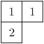

We recall that the weight of the tableau is `(k_1,k_2,k_3)` where
`k_i` is the number of `i`'s in the tableau, so this tableau has
weight `(2,1,0)`, which indeed equals `\lambda`.

Once the crystal is created, you have access to the ambient space and
its methods through the method ``weight_lattice_realization()``::

    sage: C = crystals.Tableaux("A2", shape=[2,1])
    sage: L = C.weight_lattice_realization(); L
    Ambient space of the Root system of type ['A', 2]
    sage: L.fundamental_weights()
    Finite family {1: (1, 0, 0), 2: (1, 1, 0)}

The highest weight vector is available as follows::

    sage: C = crystals.Tableaux("A2", shape=[2,1])
    sage: v = C.highest_weight_vector(); v
    [[1, 1], [2]]

or more simply::

    sage: C = crystals.Tableaux("A2", shape=[2,1])
    sage: C[0]
    [[1, 1], [2]]

Now we may apply the operators `e_i` and `f_i` to move around in the
crystal::

    sage: C = crystals.Tableaux("A2", shape=[2,1])
    sage: v = C.highest_weight_vector()
    sage: v.f(1)
    [[1, 2], [2]]
    sage: v.f(1).f(1)
    sage: v.f(1).f(1) is None
    True
    sage: v.f(1).f(2)
    [[1, 3], [2]]
    sage: v.f(1).f(2).f(2)
    [[1, 3], [3]]
    sage: v.f(1).f(2).f(2).f(1)
    [[2, 3], [3]]
    sage: v.f(1).f(2).f(2).f(1) == v.f(2).f(1).f(1).f(2)
    True

You can construct the character if you first make a Weyl character
ring::

    sage: A2 = WeylCharacterRing("A2")
    sage: C = crystals.Tableaux("A2", shape=[2,1])
    sage: C.character(A2)
    A2(2,1,0)

Crystals of letters
-------------------

For each of the classical Cartan types there is a *standard crystal*
`\mathcal{B}_{\hbox{standard}}` from which other crystals can be built
up by taking tensor products and extracting constituent irreducible
crystals. This procedure is sufficient for Cartan types `A_r` and
`C_r`. For types `B_r` and `D_r` the standard crystal must be
supplemented with *spin crystals*. See [KashiwaraNakashima1994]_ or
[HongKang2002]_ for further details.

Here is the standard crystal of type `A_r`.

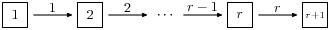

You may create the crystal and work with it as follows::

    sage: C = crystals.Letters("A6")
    sage: v0 = C.highest_weight_vector(); v0
    1
    sage: v0.f(1)
    2
    sage: v0.f(1).f(2)
    3
    sage: [v0.f(1).f(2).f(x) for x in [1..6]]
    [None, None, 4, None, None, None]
    sage: [v0.f(1).f(2).e(x) for x in [1..6]]
    [None, 2, None, None, None, None]

Here is the standard crystal of type `B_r`.

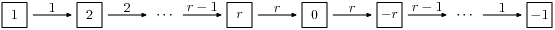

There is, additionally, a spin crystal for `B_r`, corresponding to
the `2^r`-dimensional spin representation. We will not draw it, but
we will describe it. Its elements are vectors
`\epsilon_1\otimes\cdots\otimes\epsilon_r`, where each ``spin``
`\epsilon_i=\pm`.

If `i<r`, then the effect of the operator
`f_i` is to annihilate `v = \epsilon_1 \otimes \cdots \otimes \epsilon_r`
unless `\epsilon_i \otimes \epsilon_{i+1} = + \otimes -`. If this is
so, then `f_i(v)` is obtained from `v` by replacing
`\epsilon_i \otimes \epsilon_{i+1}` by `- \otimes +`. If `i=r`, then
`f_r` annihilates `v` unless `\epsilon_r=+`, in which case it
replaces `\epsilon_r` by `-`.

Create the spin crystal as follows. The crystal elements are represented
in the signature representation listing the `\epsilon_i`::

    sage: C = crystals.Spins("B3")
    sage: C.list()
    [+++, ++-, +-+, -++, +--, -+-, --+, ---]

Here is the standard crystal of type `C_r`.

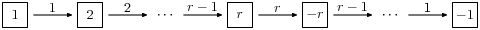

Here is the standard crystal of type `D_r`.

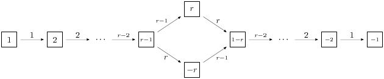

There are two spin crystals for type `D_r`. Each consists of
`\epsilon_1 \otimes \cdots \otimes \epsilon_r` with `\epsilon_i = \pm`, and
the number of spins either always even or always odd. We will not describe
the effect of the root operators `f_i`, but you are invited to create them
and play around with them to guess the rule::

    sage: Cplus = crystals.SpinsPlus("D4")
    sage: Cminus = crystals.SpinsMinus("D4")

It is also possible to construct the standard crystal for type
`G_2`, `E_6`, and `E_7`. Here is the one for type `G_2` (corresponding
to the representation of degree 7):

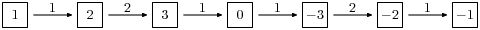

The crystal of letters is a special case of the crystal of tableaux
in the sense that `\mathcal{B}_{\hbox{standard}}` is isomorphic to
the crystal of tableaux whose highest weight `\lambda` is the highest
weight vector of the standard representation. Thus compare::

    sage: crystals.Letters("A3")
    The crystal of letters for type ['A', 3]
    sage: crystals.Tableaux("A3", shape=[1])
    The crystal of tableaux of type ['A', 3] and shape(s) [[1]]

These two crystals are different in implementation, but they are
isomorphic. In fact the second crystal is constructed from the
first. We can test isomorphisms between crystals as follows::

    sage: Cletter = crystals.Letters(['A',3])
    sage: Ctableaux = crystals.Tableaux(['A',3], shape = [1])
    sage: Cletter.digraph().is_isomorphic(Ctableaux.digraph())
    True
    sage: Cletter.digraph().is_isomorphic(Ctableaux.digraph(), certificate = True)
    (True, {1: [[1]], 2: [[2]], 3: [[3]], 4: [[4]]})

where in the last step the explicit map between the vertices of the crystals is given.

Crystals of letters have a special role in the theory since
they are particularly simple, yet as Kashiwara and Nakashima showed,
the crystals of tableaux can be created from them.  We will review how
this works.

Tensor products of crystals
---------------------------

Kashiwara defined the tensor product of crystals in a purely
combinatorial way. The beauty of this construction is that it exactly
parallels the tensor product of crystals of representations. That is,
if `\lambda` and `\mu` are dominant weights, then
`\mathcal{B}_\lambda \otimes \mathcal{B}_\mu` is a (usually
disconnected) crystal, which may contain multiple copies of
`\mathcal{B}_\nu` (for another dominant weight `\nu`), and the number
of copies of `\mathcal{B}_\nu` is exactly the multiplicity of
`\chi_\nu` in `\chi_\lambda \chi_\mu`.

We will describe two conventions for the tensor product of
crystals.

Kashiwara's definition
^^^^^^^^^^^^^^^^^^^^^^

As a set, the tensor product `\mathcal{B} \otimes \mathcal{C}` of
crystals `\mathcal{B}` and `\mathcal{C}` is the Cartesian product, but
we denote the ordered pair `(x, y)` with `x \in \mathcal{B}` and
`y \in \mathcal{C}` by `x \otimes y`. We define
`\hbox{wt} (x \otimes y) = \hbox{wt} (x) + \hbox{wt}(y)`. We define

.. MATH::

    f_i (x \otimes y)
    =
    \begin{cases}
    f_i (x) \otimes y & \text{if $\varphi_i (x) > \varepsilon_i (y)$},\\
    x \otimes f_i (y) & \text{if $\varphi_i (x) \le \varepsilon_i (y)$},
    \end{cases}

and

.. MATH::

    e_i (x \otimes y)
    =
    \begin{cases}
    e_i (x) \otimes y & \text{if $\varphi_i (x) \ge \varepsilon_i (y)$},\\
    x \otimes e_i (y) & \text{if $\varphi_i (x) < \varepsilon_i (y)$}.
    \end{cases}

It is understood that `x \otimes 0 = 0 \otimes x = 0`. We also define:

.. MATH::

    \varphi_i (x \otimes y)
    =
    \max (\varphi_i (y), \varphi_i (x) + \varphi_i (y) - \varepsilon_i (y)),

.. MATH::

    \varepsilon_i (x \otimes y)
    =
    \max (\varepsilon_i (x), \varepsilon_i (x) + \varepsilon_i (y)
    - \varphi_i (x)) .

Alternative definition
^^^^^^^^^^^^^^^^^^^^^^

As a set, the tensor product `\mathcal{B} \otimes \mathcal{C}` of
crystals `\mathcal{B}` and `\mathcal{C}` is the Cartesian product, but
we denote the ordered pair `(y, x)` with `y \in \mathcal{B}` and
`x \in \mathcal{C}` by `x \otimes y`. We define
`\hbox{wt} (x \otimes y) = \hbox{wt} (y) + \hbox{wt}(x)`. We define

.. MATH::

    f_i (x \otimes y)
    =
    \begin{cases}
    f_i (x) \otimes y & \text{if $\varphi_i (y) \le \varepsilon_i (x)$},\\
    x \otimes f_i (y) & \text{if $\varphi_i (y) > \varepsilon_i (x)$},
    \end{cases}

and

.. MATH::

    e_i (x \otimes y)
    =
    \begin{cases}
    e_i (x) \otimes y & \text{if $\varphi_i (y) < \varepsilon_i (x)$},\\
    x \otimes e_i (y) & \text{if $\varphi_i (y) \ge \varepsilon_i (x)$}.
    \end{cases}

It is understood that `y \otimes 0 = 0 \otimes y = 0`. We also define

.. MATH::

    \varphi_i (x \otimes y)
    =
    \max (\varphi_i (x), \varphi_i (y) + \varphi_i (x) - \varepsilon_i (x)),

.. MATH::

    \varepsilon_i (x \otimes y)
    =
    \max (\varepsilon_i (y), \varepsilon_i (y) + \varepsilon_i (x)
    - \varphi_i (y)).

The tensor product is associative:
`(x \otimes y) \otimes z \mapsto x \otimes(y \otimes z)` is an
isomorphism
`(\mathcal{B} \otimes \mathcal{C}) \otimes \mathcal{D} \to \mathcal{B} \otimes (\mathcal{C} \otimes \mathcal{D})`,
and so we may consider tensor products of arbitrary numbers of crystals.

The relationship between the two definitions
^^^^^^^^^^^^^^^^^^^^^^^^^^^^^^^^^^^^^^^^^^^^
The relationship between the two definitions is simply that the
Kashiwara tensor product `\mathcal{B} \otimes \mathcal{C}` is the
alternate tensor product `\mathcal{C} \otimes \mathcal{B}` in reverse
order. Sage uses the alternative tensor product. Even though the
tensor product construction is *a priori* asymmetrical, both
constructions produce isomorphic crystals, and in particular Sage's
crystals of tableaux are identical to Kashiwara's.

.. NOTE::

    Using abstract crystals (i.e. they satisfy the axioms but do not arise
    from a representation of `U_q(\mathfrak{g})`), we can construct crystals
    `\mathcal{B}, \mathcal{C}` such that `\mathcal{B} \otimes \mathcal{C}
    \neq \mathcal{C} \otimes \mathcal{B}` (of course, using the
    same convention).

Tensor products of crystals in Sage
^^^^^^^^^^^^^^^^^^^^^^^^^^^^^^^^^^^
You may construct the tensor product of several crystals in Sage using
``crystals.TensorProduct``::

    sage: C = crystals.Letters("A2")
    sage: T = crystals.TensorProduct(C,C,C); T
    Full tensor product of the crystals [The crystal of letters for type ['A', 2],
    The crystal of letters for type ['A', 2], The crystal of letters for type ['A', 2]]
    sage: T.cardinality()
    27
    sage: T.highest_weight_vectors()
    ([1, 1, 1], [2, 1, 1], [1, 2, 1], [3, 2, 1])

This crystal has four highest weight vectors. We may understand this
as follows::

    sage: A2 = WeylCharacterRing("A2")
    sage: C = crystals.Letters("A2")
    sage: T = crystals.TensorProduct(C,C,C)
    sage: chi_C = C.character(A2)
    sage: chi_T = T.character(A2)
    sage: chi_C
    A2(1,0,0)
    sage: chi_T
    A2(1,1,1) + 2*A2(2,1,0) + A2(3,0,0)
    sage: chi_T == chi_C^3
    True

As expected, the character of ``T`` is the cube of the character of
``C``, and representations with highest weight `(1,1,1)`, `(3,0,0)`
and `(2,1,0)`. This decomposition is predicted by Frobenius-Schur
duality: the multiplicity of `\pi_\lambda^{GL(n)}` in
`\otimes^3\mathbf{C}^3` is the degree of `\pi_\lambda^{S_3}`.

It is useful to be able to select one irreducible constitutent of
``T``. If we only want one of the irreducible constituents of ``T``,
we can specify a list of highest weight vectors by the option
``generators``. If the list has only one element, then we get an
irreducible crystal. We can make four such crystals::

    sage: A2 = WeylCharacterRing("A2")
    sage: C = crystals.Letters("A2")
    sage: T = crystals.TensorProduct(C,C,C)
    sage: [T1,T2,T3,T4] = \
      [crystals.TensorProduct(C,C,C,generators=[v]) for v in T.highest_weight_vectors()]
    sage: [B.cardinality() for B in [T1,T2,T3,T4]]
    [10, 8, 8, 1]
    sage: [B.character(A2) for B in [T1,T2,T3,T4]]
    [A2(3,0,0), A2(2,1,0), A2(2,1,0), A2(1,1,1)]

We see that two of these crystals are isomorphic, with character
``A2(2,1,0)``. Try::

    sage: A2 = WeylCharacterRing("A2")
    sage: C = crystals.Letters("A2")
    sage: T = crystals.TensorProduct(C,C,C)
    sage: [T1,T2,T3,T4] = \
      [crystals.TensorProduct(C,C,C,generators=[v]) for v in T.highest_weight_vectors()]
    sage: T1.plot()
    Graphics object consisting of 35 graphics primitives
    sage: T2.plot()
    Graphics object consisting of 25 graphics primitives
    sage: T3.plot()
    Graphics object consisting of 25 graphics primitives
    sage: T4.plot()
    Graphics object consisting of 2 graphics primitives

Elements of ``crystals.TensorProduct(A,B,C, ...)`` are represented by
sequences ``[a,b,c, ...]`` with ``a`` in ``A``, ``b`` in ``B``, etc.
This of course represents `a \otimes b \otimes c \otimes \cdots`.

Crystals of tableaux as tensor products of crystals
---------------------------------------------------

Sage implements the
:class:`~sage.combinat.crystals.tensor_product.CrystalOfTableaux` as
a subcrystal of a tensor product of the
:class:`~sage.combinat.crystals.letters.ClassicalCrystalOfLetters`.
You can see how its done as follows::

    sage: T = crystals.Tableaux("A4",shape=[3,2])
    sage: v = T.highest_weight_vector().f(1).f(2).f(3).f(2).f(1).f(4).f(2).f(3); v
    [[1, 2, 5], [3, 4]]
    sage: list(v)
    [3, 1, 4, 2, 5]

We've looked at the internal representation of `v`, where it is
represented as an element of the fourth tensor power of the
:class:`~sage.combinat.crystals.letters.ClassicalCrystalOfLetters`.
We see that the tableau:

.. MATH::

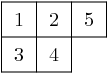

is interpreted as the tensor:

.. MATH::

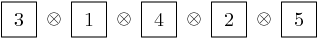

The elements of the tableau are read from bottom to top and from left
to right. This is the *inverse middle-Eastern reading* of the
tableau. See Hong and Kang, *loc. cit.* for discussion of the readings
of a tableau.

Spin crystals
-------------

For the Cartan types `A_r`, `C_r` or `G_2`,
:class:`~sage.combinat.crystals.tensor_product.CrystalOfTableaux` are
capable of making any finite crystal. (For type `A_r` it is necessary
that the highest weight `\lambda` be a partition.)

For Cartan types `B_r` and `D_r`, there also exist spin representations.
The corresponding crystals are implemented as *spin crystals*.
For these types,
:class:`~sage.combinat.crystals.tensor_product.CrystalOfTableaux` also allows
the input shape `\lambda` to be half-integral if it is of height `r`.
For example::

    sage: C = crystals.Tableaux(['B',2], shape = [3/2, 1/2])
    sage: C.list()
    [[++, [[1]]], [++, [[2]]], [++, [[0]]], [++, [[-2]]], [++, [[-1]]], [+-, [[-2]]],
    [+-, [[-1]]], [-+, [[-1]]], [+-, [[1]]], [+-, [[2]]], [-+, [[2]]], [+-, [[0]]],
    [-+, [[0]]], [-+, [[-2]]], [--, [[-2]]], [--, [[-1]]]]

Here the first list of `+` and `-` gives a spin column that is discussed in more detail
in the next section and the second entry is a crystal of tableau element for
`\lambda = (\lfloor \lambda_1 \rfloor, \lfloor \lambda_2 \rfloor, \ldots )`.
For type `D_r`, we have the additional feature that there are two types of spin
crystals. Hence in
:class:`~sage.combinat.crystals.tensor_product.CrystalOfTableaux`
the `r`-th entry of `\lambda` in this case can also take negative values::

    sage: C = crystals.Tableaux(['D',3], shape = [1/2, 1/2,-1/2])
    sage: C.list()
    [[++-, []], [+-+, []], [-++, []], [---, []]]

For rank two Cartan types, we also have ``crystals.FastRankTwo`` which gives
a different fast implementation of these crystals::

    sage: B = crystals.FastRankTwo(['B',2], shape=[3/2,1/2]); B
    The fast crystal for B2 with shape [3/2,1/2]
    sage: v = B.highest_weight_vector(); v.weight()
    (3/2, 1/2)

Type B spin crystal
^^^^^^^^^^^^^^^^^^^
The spin crystal has highest weight `(1/2,\dots,1/2)`. This is the
last fundamental weight. The irreducible representation with this
weight is the spin representation of degree `2^r`. Its crystal is
hand-coded in Sage::

    sage: Cspin = crystals.Spins("B3"); Cspin
    The crystal of spins for type ['B', 3]
    sage: Cspin.cardinality()
    8

The crystals with highest weight `\lambda`, where `\lambda` is a half-integral weight,
are constructed as a tensor product of a spin column and the highest weight crystal
of the integer part of `\lambda`. For example, suppose that `\lambda = (3/2, 3/2, 1/2)`.
The corresponding irreducible character will have degree 112::

    sage: B3 = WeylCharacterRing("B3")
    sage: B3(3/2,3/2,1/2).degree()
    112

So `\mathcal{B}_\lambda` will have 112 elements. We can find it as a
subcrystal of ``Cspin`` `\otimes \mathcal{B}_\mu`, where
`\mu = \lambda-(1/2,1/2,1/2) = (1,1,0)`::

    sage: B3 = WeylCharacterRing("B3")
    sage: B3(1,1,0)*B3(1/2,1/2,1/2)
    B3(1/2,1/2,1/2) + B3(3/2,1/2,1/2) + B3(3/2,3/2,1/2)

We see that just taking the tensor product of these two crystals will
produce a reducible crystal with three constitutents, and we want to
extract the one we want. We do that as follows::

    sage: B3 = WeylCharacterRing("B3")
    sage: C1 = crystals.Tableaux("B3", shape=[1,1])
    sage: Cspin = crystals.Spins("B3")
    sage: C = crystals.TensorProduct(C1, Cspin, generators=[[C1[0],Cspin[0]]])
    sage: C.cardinality()
    112

Alternatively, we can get this directly from
:class:`~sage.combinat.crystals.tensor_product.CrystalOfTableaux`::

    sage: C = crystals.Tableaux(['B',3], shape = [3/2,3/2,1/2])
    sage: C.cardinality()
    112

This is the desired crystal.

Type D spin crystals
^^^^^^^^^^^^^^^^^^^^
A similar situation pertains for type `D_r`, but now there are two
spin crystals, both of degree `2^{r-1}`. These are hand-coded in sage::

    sage: SpinPlus = crystals.SpinsPlus("D4")
    sage: SpinMinus = crystals.SpinsMinus("D4")
    sage: SpinPlus[0].weight()
    (1/2, 1/2, 1/2, 1/2)
    sage: SpinMinus[0].weight()
    (1/2, 1/2, 1/2, -1/2)
    sage: [C.cardinality() for C in [SpinPlus,SpinMinus]]
    [8, 8]

Similarly to type B crystal, we obtain crystal with spin weight by allowing for partitions
with half-integer values, and the last entry can be negative depending on the type of the spin.

Lusztig involution
------------------

The Lusztig involution on a finite-dimensional highest weight crystal `B(\lambda)` of highest weight `\lambda`
maps the highest weight vector to the lowest weight vector and the Kashiwara operator `f_i` to
`e_{i^*}`, where `i^*` is defined as `\alpha_{i^*} = -w_0(\alpha_i)`. Here `w_0` is the longest element
of the Weyl group acting on the `i`-th simple root `\alpha_i`. For example, for type `A_n` we have `i^*=n+1-i`,
whereas for type `C_n` we have `i^*=i`. For type `D_n` and `n` even also have `i^*=i`, but for `n` odd this
map interchanges nodes `n-1` and `n`. Here is how to achieve this in Sage::

    sage: B = crystals.Tableaux(['A',3],shape=[2,1])
    sage: b = B(rows=[[1,2],[3]])
    sage: b.lusztig_involution()
    [[2, 4], [3]]

For type `A_n`, the Lusztig involution is the same as the Schuetzenberger involution (which in Sage is
defined on tableaux)::

    sage: t = Tableau([[1,2],[3]])
    sage: t.schuetzenberger_involution(n=4)
    [[2, 4], [3]]

For all tableaux in a given crystal, this can be tested via::

    sage: B = crystals.Tableaux(['A',3],shape=[2])
    sage: all(b.lusztig_involution().to_tableau() == b.to_tableau().schuetzenberger_involution(n=4) for b in B)
    True

The Lusztig involution is also defined for finite-dimensional highest weight crystals of exceptional
type::

    sage: C = CartanType(['E',6])
    sage: La = C.root_system().weight_lattice().fundamental_weights()
    sage: T = crystals.HighestWeight(La[1])
    sage: t = T[4]; t
    [(-2, 5)]
    sage: t.lusztig_involution()
    [(-3, 2)]

Levi branching rules for crystals
---------------------------------

Let `G` be a Lie group and `H` a Levi subgroup. We have already seen
that the Dynkin diagram of `H` is obtained from that of `G` by erasing
one or more nodes.

If `\mathcal{C}` is a crystal for `G`, then we may obtain the
corresponding crystal for `H` by a similar process. For example if the
Dynkin diagram for `H` is obtained from the Dynkin diagram for `G` by
erasing the `i`-th node, then if we erase all the edges in the crystal
`\mathcal{C}` that are labeled with `i`, we obtain a crystal for `H`.

In Sage this is achieved by specifying the index set used in the digraph method::

    sage: T = crystals.Tableaux(['D',4],shape=[1])
    sage: G = T.digraph(index_set=[1,2,3])

We see that the type `D_4` crystal indeed decomposes into two type `A_3` components.

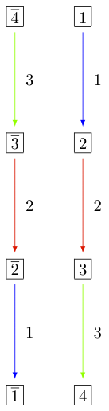

For more on branching rules, see :ref:`branch_rules` or
:ref:`levi_branch_rules` for specifics on the Levi subgroups.

Subcrystals
-----------

Sometimes it might be desirable to work with a subcrystal of a crystal. For example,
one might want to look at all `\{2,3,\ldots,n\}` highest elements of a crystal
and look at a particular such component::

    sage: T = crystals.Tableaux(['D',4],shape=[2,1])
    sage: hw = [ t for t in T if t.is_highest_weight(index_set = [2,3,4]) ]; hw
    [[[1, 1], [2]],
     [[1, 2], [2]],
     [[2, -1], [-2]],
     [[2, -1], [-1]],
     [[1, -1], [2]],
     [[2, -1], [3]],
     [[1, 2], [3]],
     [[2, 2], [3]],
     [[1, 2], [-2]],
     [[2, 2], [-2]],
     [[2, 2], [-1]]]
    sage: C = T.subcrystal(generators = [T(rows=[[2,-1],[3]])], index_set = [2,3,4])
    sage: G = T.digraph(subset = C, index_set=[2,3,4])
