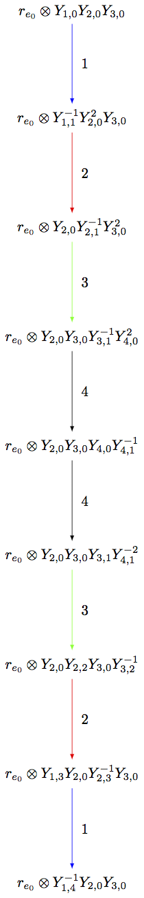

-------------------
Elementary crystals
-------------------

.. NOTE::

    Each of these crystals will work with any Cartan matrix input (with weights
    from the weight lattice corresponding to the Cartan matrix given).

T-crystal
---------

Let `\lambda` be a weight. As defined in [Kashiwara1993]_ the crystal
`T_{\lambda} = \{ t_{\lambda} \}` is a single element crystal with the
crystal structure defined by

.. MATH::

    \mathrm{wt}(t_\lambda) = \lambda, \quad
    e_i t_{\lambda} = f_i t_{\lambda} = 0, \quad
    \varepsilon_i(t_{\lambda}) = \varphi_i(t_{\lambda}) = -\infty.

The crystal `T_{\lambda}` shifts the weights of the vertices in a crystal
`B` by `\lambda` when tensored with `B`, but leaves the graph structure of
`B` unchanged. That is, for all `b \in B`, we have `\mathrm{wt}(t_\lambda
\otimes b) = \mathrm{wt}(b) + \lambda`::

    sage: B = crystals.Tableaux(['A',2],shape=[2,1])
    sage: T = crystals.elementary.T(['A',2], B.Lambda()[1] + B.Lambda()[2])
    sage: V = crystals.TensorProduct(T,B)
    sage: for x in V:
    ....:     print x.weight()
    ....:
    (4, 2, 0)
    (3, 3, 0)
    (3, 2, 1)
    (3, 1, 2)
    (2, 2, 2)
    (4, 1, 1)
    (3, 2, 1)
    (2, 3, 1)
    sage: for x in B:
    ....: print x.weight() + T[0].weight()
    ....:
    (4, 2, 0)
    (3, 3, 0)
    (3, 2, 1)
    (3, 1, 2)
    (2, 2, 2)
    (4, 1, 1)
    (3, 2, 1)
    (2, 3, 1)

Here is an example using an hyperbolic Cartan matrix::

    sage: A = CartanMatrix([[2,-4],[-4,2]])
    sage: La = RootSystem(A).weight_lattice().fundamental_weights()
    sage: La
    Finite family {0: Lambda[0], 1: Lambda[1]}
    sage: T = crystals.elementary.T(A,La[1])
    sage: T
    The T crystal of type [ 2 -4]
    [-4  2] and weight Lambda[1]

C-crystal
---------

Defined in [Kashiwara1993]_, the component crystal `C = \{c\}` is the single
element crystal whose crystal structure is defined by

.. MATH::

    \mathrm{wt}(c) = 0, \quad
    e_i c = f_i c = 0, \quad
    \varepsilon_i(c) = \varphi_i(c) = 0.

Note `C \cong B(0)`, where `B(0)` is the highest weight crystal of highest
weight `0`.

Here is an example using an hyperbolic Cartan matrix::

    sage: A = CartanMatrix([[2,-4],[-4,2]])
    sage: La = RootSystem(A).weight_lattice().fundamental_weights()
    sage: B = crystals.elementary.B(A,1)
    sage: C = crystals.elementary.Component(A)
    sage: C
    The component crystal of type [ 2 -4]
    [-4  2]

R-crystal
---------

For a fixed weight `\lambda`, the crystal `R_{\lambda} = \{ r_{\lambda} \}`
is a single element crystal with the crystal structure defined by

.. MATH::

    \mathrm{wt}(r_{\lambda}) = \lambda, \quad
    e_i r_{\lambda} = f_i r_{\lambda} = 0, \quad
    \varepsilon_i(r_{\lambda}) = -\langle h_i, \lambda\rangle, \quad
    \varphi_i(r_{\lambda}) = 0,

where `\{h_i\}` are the simple coroots.

Tensoring `R_{\lambda}` with a crystal `B` results in shifting the weights
of the vertices in `B` by `\lambda` and may also cut a subset out of the
original graph of `B`.

For example, suppose `\mu \le \lambda` in lexicographic ordering on weights,
and one wants to see `B(\mu)` as a subcrystal of `B(\lambda)`.  Then `B(\mu)`
may be realized as the connected component of `R_\mu \otimes B(\lambda)`
containing the highest weight `r_\lambda \otimes u_\lambda`, where `u_\lambda`
is the highest weight vector in `B(\lambda)`::

    sage: La = RootSystem(['B',4]).weight_lattice().fundamental_weights()
    sage: Blambda = crystals.NakajimaMonomials(['B',4], La[1]+La[2]+La[3])
    sage: Bmu = crystals.NakajimaMonomials(['B',4], La[1])
    sage: Rmu = crystals.elementary.R(['B',4], La[1])
    sage: T = crystals.TensorProduct(Rmu,Blambda)
    sage: S = T.subcrystal(generators=[T(Rmu[0],Blambda.highest_weight_vector())])
    sage: G = T.digraph(subset=S)
    sage: Gmu = Bmu.digraph()
    sage: G.is_isomorphic(Gmu,edge_labels=True)
    True
    sage: view(G, tightpage=True) # optional - dot2tex graphviz, not tested (opens external window)

Here is an example using an hyperbolic Cartan matrix::

    sage: A = CartanMatrix([[2,-4],[-4,2]])
    sage: La = RootSystem(A).weight_lattice().fundamental_weights()
    sage: R = crystals.elementary.R(A,La[1])
    sage: R
    The R crystal of weight Lambda[1] and type [ 2 -4]
    [-4  2]

`i`-th elementary crystal
-------------------------

For `i` an element of the index set of type `X`, the crystal `B_i` of type
`X` is the set

.. MATH::

    B_i = \{ b_i(m) : m \in \ZZ \},

where the crystal stucture is given by `\mathrm{wt}\bigl(b_i(m)\bigr) =
m\alpha_i` and

.. MATH::

    \begin{aligned}
    \varphi_j\bigl(b_i(m)\bigr) &= \begin{cases}
        m & \text{ if } j=i, \\
        -\infty & \text{ if } j\neq i,
    \end{cases} &
    \varepsilon_j\bigl(b_i(m)\bigr) &= \begin{cases}
        -m & \text{ if } j=i, \\
        -\infty & \text{ if } j\neq i,
    \end{cases} \\
    f_j b_i(m) &= \begin{cases}
        b_i(m-1) & \text{ if } j=i, \\
        0 & \text{ if } j\neq i,
    \end{cases} &
    e_j b_i(m) &= \begin{cases}
        b_i(m+1) & \text{ if } j=i, \\
        0 & \text{ if } j\neq i.
    \end{cases}
    \end{aligned}

Here is an example using an hyperbolic Cartan matrix::

    sage: A = CartanMatrix([[2,-4],[-4,2]])
    sage: B = crystals.elementary.B(A,1)
    sage: B
    The 1-elementary crystal of type [ 2 -4]
    [-4  2]
