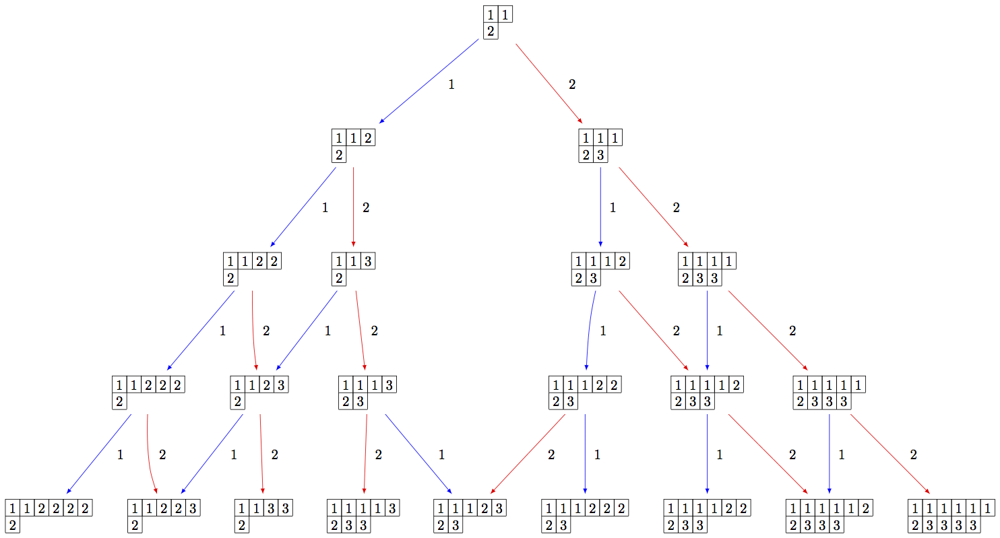
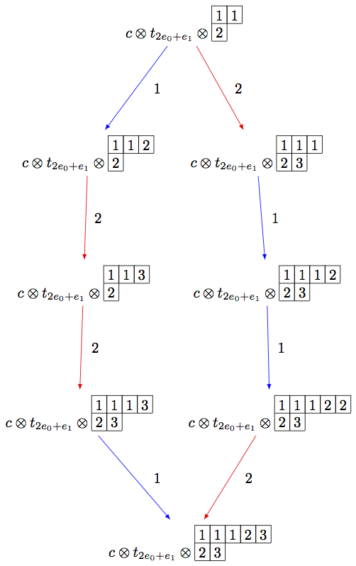
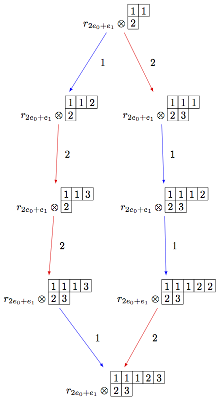
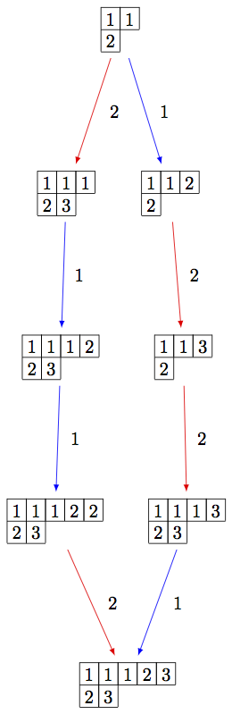
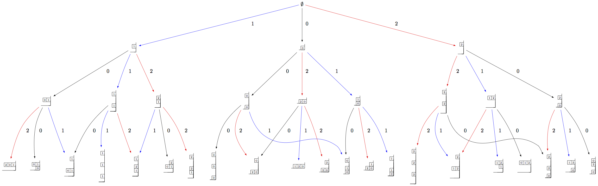

=================
Infinity Crystals
=================

Infinity crystals, denoted `\mathcal{B}(\infty)` and depend only on the
Cartan type, are the crystal analogue of Verma modules with highest
weight `0` associated to a symmetrizable Kac-Moody algebra (equivalently,
the lower half of the corresponding quantum group).  As such, they are
infinite-dimensional and any irreducible highest weight crystal may be obtained
from an infinity crystal via some cutting procedure.  On the other hand, the
crystal `B(\infty)` is the direct limit of all irreducible highest weight
crystals `B(\lambda)`, so there are natural embeddings of each `B(\lambda)` in
`B(\infty)`.  Below, we outline the various implementations of the crystal
`B(\infty)` in Sage and give examples of how `B(\lambda)` interacts with
`B(\infty)`.

All infinity crystals that are currently implemented in Sage can be accessed
by typing ``crystals.infinity.<tab>``.

Marginally large tableaux
-------------------------

Marginally large tableaux were introduced by J. Hong and H. Lee as a realization
of the crystal `B(\infty)` in types `A_n`, `B_n`, `C_n`, `D_{n+1}`, and `G_2`.
The marginally large condition guarantees that all tableau have exactly `n`
rows and that the number of `i`-boxes in the `i`-th row from the top (in
the English convention) is exactly one more than the total number of boxes in
the `(i+1)`-st row.  Other specific conditions on the tableaux vary by type.
See [HongLee2008]_ for more information.

Here is an example in type `A_2`::

    sage: B = crystals.infinity.Tableaux(['A',2])
    sage: b = B.highest_weight_vector()
    sage: b.pp()
      1  1
      2
    sage: b.f_string([1,2,2,1,2,1,2,2,2,2,2]).pp()
      1  1  1  1  1  1  1  1  1  2  2  3
      2  3  3  3  3  3  3  3

Since the crystal is infinite, we must specify the subcrystal we would like to
view::

    sage: B = crystals.infinity.Tableaux(['A',2])
    sage: S = B.subcrystal(max_depth=4)
    sage: G = B.digraph(subset=S)
    sage: view(G, tightpage=True) # optional - dot2tex graphviz, not tested (opens external window)

Using elementary crystals, we can cut irreducible highest weight crystals from
`B(\infty)` as the connected component of `C \otimes T_\lambda \otimes
B(\infty)` containing `c\otimes t_\lambda \otimes u_\infty`, where `u_\infty` is
the highest weight vector in `B(\infty)`.  In this example, we cut out `B(\rho)`
from `B(\infty)` in type `A_2`::

    sage: B = crystals.infinity.Tableaux(['A',2])
    sage: b = B.highest_weight_vector()
    sage: T = crystals.elementary.T(['A',2], B.Lambda()[1] + B.Lambda()[2])
    sage: t = T[0]
    sage: C = crystals.elementary.Component(['A',2])
    sage: c = C[0]
    sage: TP = crystals.TensorProduct(C,T,B)
    sage: t0 = TP(c,t,b)
    sage: STP = TP.subcrystal(generators=[t0])
    sage: GTP = TP.digraph(subset=STP)
    sage: view(GTP, tightpage=True) # optional - dot2tex graphviz, not tested (opens external window)

Note that the above code can be simplified using the R-crystal::

    sage: B = crystals.infinity.Tableaux(['A',2])
    sage: b = B.highest_weight_vector()
    sage: R = crystals.elementary.R(['A',2], B.Lambda()[1] + B.Lambda()[2])
    sage: r = R[0]
    sage: TP2 = crystals.TensorProduct(R,B)
    sage: t2 = TP2(r,b)
    sage: STP2 = TP2.subcrystal(generators=[t2])
    sage: GTP2 = TP2.digraph(subset=STP2)
    sage: view(GTP2, tightpage=True) # optional - dot2tex graphviz, not tested (opens external window)

On the other hand, we can embed the irreducible highest weight crystal
`B(\rho)` into `B(\infty)`::

    sage: Brho = crystals.Tableaux(['A',2],shape=[2,1])
    sage: brho = Brho.highest_weight_vector()
    sage: B = crystals.infinity.Tableaux(['A',2])
    sage: binf = B.highest_weight_vector()
    sage: wt = brho.weight()
    sage: T = crystals.elementary.T(['A',2],wt)
    sage: TlambdaBinf = crystals.TensorProduct(T,B)
    sage: hw = TlambdaBinf(T[0],binf)
    sage: Psi = Brho.crystal_morphism({brho : hw})
    sage: BG = B.digraph(subset=[Psi(x) for x in Brho])
    sage: view(BG, tightpage=True) # optional - dot2tex graphviz, not tested (opens external window)

Note that in the last example, we had to inject `B(\rho)` into the tensor
product `T_\lambda \otimes B(\infty)`, since otherwise, the map ``Psi`` would
not be a crystal morphism (as ``b.weight() != brho.weight()``).

Generalized Young walls
-----------------------

Generalized Young walls were introduced by J.-A. Kim and D.-U. Shin as a model
for `B(\infty)` and each `B(\lambda)` solely in affine type `A_n^{(1)}`. See
[KimShin2010]_ for more information on the construction of generalized Young
walls.

Since this model is only valid for one Cartan type, the input to initialize the
crystal is simply the rank of the underlying type::

    sage: Y = crystals.infinity.GeneralizedYoungWalls(2)
    sage: y = Y.highest_weight_vector()
    sage: y.f_string([0,1,2,2,2,1,0,0,1,2]).pp()
             2|
              |
              |
           1|2|
           0|1|
     2|0|1|2|0|

In the ``weight`` method for this model, we can choose whether to view weights
in the extended weight lattice (by default) or in the root lattice::

    sage: Y = crystals.infinity.GeneralizedYoungWalls(2)
    sage: y = Y.highest_weight_vector()
    sage: y.f_string([0,1,2,2,2,1,0,0,1,2]).weight()
    Lambda[0] + Lambda[1] - 2*Lambda[2] - 3*delta
    sage: y.f_string([0,1,2,2,2,1,0,0,1,2]).weight(root_lattice=True)
    -3*alpha[0] - 3*alpha[1] - 4*alpha[2]

As before, we need to indicate a specific subcrystal when attempting to view
the crystal graph::

    sage: Y = crystals.infinity.GeneralizedYoungWalls(2)
    sage: SY = Y.subcrystal(max_depth=3)
    sage: GY = Y.digraph(subset=SY)
    sage: view(GY, tightpage=True) # optional - dot2tex graphviz, not tested (opens external window)

One can also make irreducible highest weight crystals using generalized Young
walls::

    sage: La = RootSystem(['A',2,1]).weight_lattice(extended=True).fundamental_weights()
    sage: YLa = crystals.GeneralizedYoungWalls(2,La[0])
    sage: SYLa = YLa.subcrystal(max_depth=3)
    sage: GYLa = YLa.digraph(subset=SYLa)
    sage: view(GYLa, tightpage=True) # optional - dot2tex graphviz, not tested (opens external window)

.. image:: ../media/YLa0.png
   :scale: 50
   :align: center

In the highest weight crystals, however, weights are always elements of the
extended affine weight lattice::

    sage: La = RootSystem(['A',2,1]).weight_lattice(extended=True).fundamental_weights()
    sage: YLa = crystals.GeneralizedYoungWalls(2,La[0])
    sage: YLa.highest_weight_vector().f_string([0,1,2,0]).weight()
    -Lambda[0] + Lambda[1] + Lambda[2] - 2*delta

Modified Nakajima monomials
---------------------------

Let `Y_{i,k}`, for `i \in I` and `k \in \ZZ`, be a commuting set of
variables, and let `\boldsymbol{1}` be a new variable which commutes with
each `Y_{i,k}`.  (Here, `I` represents the index set of a Cartan datum.)  One
may endow the structure of a crystal on the set `\widehat{\mathcal{M}}` of
monomials of the form

.. MATH::

    M = \prod_{(i,k) \in I\times \ZZ_{\ge0}} Y_{i,k}^{y_i(k)}\boldsymbol{1}.

Elements of `\widehat{\mathcal{M}}` are called  *modified Nakajima monomials*.
We will omit the `\boldsymbol{1}` from the end of a monomial if there exists
at least one `y_i(k) \neq 0`.  The crystal structure on this set is defined by

.. MATH::

    \begin{aligned}
    \mathrm{wt}(M) &= \sum_{i\in I} \Bigl( \sum_{k\ge 0} y_i(k) \Bigr) \Lambda_i, \\
    \varphi_i(M) &= \max\Bigl\{ \sum_{0\le j \le k} y_i(j) : k\ge 0 \Bigr\}, \\
    \varepsilon_i(M) &= \varphi_i(M) - \langle h_i, \mathrm{wt}(M) \rangle, \\
    k_f = k_f(M) &= \min\Bigl\{ k\ge 0 : \varphi_i(M) = \sum_{0\le j\le k} y_i(j) \Bigr\}, \\
    k_e = k_e(M) &= \max\Bigl\{ k\ge 0 : \varphi_i(M) = \sum_{0\le j\le k} y_i(j) \Bigr\},
    \end{aligned}

where `\{h_i : i \in I\}` and `\{\Lambda_i : i \in I \}` are the simple
coroots and fundamental weights, respectively.  With a chosen set of integers
`C = (c_{ij})_{i\neq j}` such that `c_{ij}+c_{ji} =1`, one defines

.. MATH::

    A_{i,k} = Y_{i,k} Y_{i,k+1} \prod_{j\neq i} Y_{j,k+c_{ji}}^{a_{ji}},

where `(a_{ij})` is a Cartan matrix.  Then

.. MATH::

    \begin{aligned}
    e_iM &= \begin{cases} 0 & \text{if } \varepsilon_i(M) = 0, \\
    A_{i,k_e}M & \text{if } \varepsilon_i(M) > 0, \end{cases} \\
    f_iM &= A_{i,k_f}^{-1} M.
    \end{aligned}

.. NOTE::

    Monomial crystals depend on the choice of positive integers
    `C = (c_{ij})_{i\neq j}` satisfying the condition `c_{ij}+c_{ji}=1`.
    This choice has been made in Sage such that `c_{ij} = 1` if
    `i < j` and `c_{ij} = 0` if `i>j`, but other choices may be used if
    deliberately stated at the initialization of the crystal::

        sage: c = Matrix([[0,0,1],[1,0,0],[0,1,0]])
        sage: La = RootSystem(['C',3]).weight_lattice().fundamental_weights()
        sage: M = crystals.NakajimaMonomials(2*La[1], c=c)
        sage: M.c()
        [0 0 1]
        [1 0 0]
        [0 1 0]

It is shown in [KKS2007]_ that the connected component of `\widehat{\mathcal{M}}`
containing the element `\boldsymbol{1}`, which we denote by
`\mathcal{M}(\infty)`, is crystal isomorphic to the crystal `B(\infty)`::

    sage: Minf = crystals.infinity.NakajimaMonomials(['C',3,1])
    sage: minf = Minf.highest_weight_vector()
    sage: m = minf.f_string([0,1,2,3,2,1,0]); m
    Y(0,0)^-1 Y(0,4)^-1 Y(1,0) Y(1,3)
    sage: m.weight()
    -2*Lambda[0] + 2*Lambda[1] - 2*delta
    sage: m.weight_in_root_lattice()
    -2*alpha[0] - 2*alpha[1] - 2*alpha[2] - alpha[3]

We can also model `B(\infty)` using the variables `A_{i,k}` instead::

    sage: Minf = crystals.infinity.NakajimaMonomials(['C',3,1])
    sage: minf = Minf.highest_weight_vector()
    sage: Minf.set_variables('A')
    sage: m = minf.f_string([0,1,2,3,2,1,0]); m
    A(0,0)^-1 A(0,3)^-1 A(1,0)^-1 A(1,2)^-1 A(2,0)^-1 A(2,1)^-1 A(3,0)^-1
    sage: m.weight()
    -2*Lambda[0] + 2*Lambda[1] - 2*delta
    sage: m.weight_in_root_lattice()
    -2*alpha[0] - 2*alpha[1] - 2*alpha[2] - alpha[3]
    sage: Minf.set_variables('Y')

Building the crystal graph output for these monomial crystals is the same
as the constructions above::

    sage: Minf = crystals.infinity.NakajimaMonomials(['C',3,1])
    sage: Sinf = Minf.subcrystal(max_depth=2)
    sage: Ginf = Minf.digraph(subset=Sinf)
    sage: view(Ginf, tightpage=True) # optional - dot2tex graphviz, not tested (opens external window)

.. image:: ../media/MinfC31.png
   :scale: 50
   :align: center

Note that this model will also work for any symmetrizable Cartan matrix::

    sage: A = CartanMatrix([[2,-4],[-5,2]])
    sage: Linf = crystals.infinity.NakajimaMonomials(A); Linf
    Infinity Crystal of modified Nakajima monomials of type [ 2 -4]
    [-5  2]
    sage: Linf.highest_weight_vector().f_string([0,1,1,1,0,0,1,1,0])
    Y(0,0)^-1 Y(0,1)^9 Y(0,2)^5 Y(0,3)^-1 Y(1,0)^2 Y(1,1)^5 Y(1,2)^3

Rigged configurations
---------------------

Rigged configurations are sequences of partitions, one partition for each node
in the underlying Dynkin diagram, such that each part of each partition has a
label (or rigging).  A crystal structure was defined on these objects in
[Schilling2006]_, then later extended to work as a model for `B(\infty)`.
See [SalisburyScrimshaw2015]_ for more information::

    sage: RiggedConfigurations.options(display="horizontal")
    sage: RC = crystals.infinity.RiggedConfigurations(['C',3,1])
    sage: nu = RC.highest_weight_vector().f_string([0,1,2,3,2,1,0]); nu
    -2[ ]-1   2[ ]1   0[ ]0   0[ ]0
    -2[ ]-1   2[ ]1   0[ ]0
    sage: nu.weight()
    -2*Lambda[0] + 2*Lambda[1] - 2*delta
    sage: RiggedConfigurations.options._reset()

We can check this crystal is isomorphic to the crystal above using Nakajima
monomials::

    sage: Minf = crystals.infinity.NakajimaMonomials(['C',3,1])
    sage: Sinf = Minf.subcrystal(max_depth=2)
    sage: Ginf = Minf.digraph(subset=Sinf)
    sage: RC = crystals.infinity.RiggedConfigurations(['C',3,1])
    sage: RCS = RC.subcrystal(max_depth=2)
    sage: RCG = RC.digraph(subset=RCS)
    sage: RCG.is_isomorphic(Ginf, edge_labels=True)
    True

This model works in Sage for all finite and affine types, as well as any
simply laced Cartan matrix.
