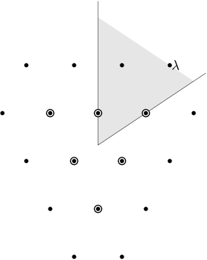

----------------
Lie Group Basics
----------------

Goals of this section
---------------------

Since we must be brief here, this is not really a place to learn about
Lie groups. Rather, the point of this section is to outline what you
need to know to use Sage effectively for Lie computations, and to fix
ideas and notations.

Semisimple and reductive groups
-------------------------------

If `g \in GL(n,\mathbf{C})`, then `g` may be uniquely factored as
`g_1 g_2` where `g_1` and `g_2` commute, with `g_1` semisimple
(diagonalizable) and `g_2` unipotent (all its eigenvalues equal to
1). This follows from the Jordan canonical form. If `g = g_1` then `g`
is called *semisimple* and if `g = g_2` then `g` is called
*unipotent*.

We consider a Lie group `G` and a class of representations such that
if an element `g \in G` is unipotent (resp. semisimple) in one
faithful representation from the class, then it is unipotent
(resp. semisimple) in every faithful representation of the class. Thus
the notion of being semisimple or unipotent is intrinsic. Examples:

- Compact Lie groups with continuous representations

- Complex analytic groups with analytic representations

- Algebraic groups over `\mathbf{R}` with algebraic representations.

A subgroup of `G` is called *unipotent* if it is connected and all its
elements are unipotent. It is called a *torus* if it is connected,
abelian, and all its elements are semisimple. The group `G` is called
*reductive* if it has no nontrivial normal unipotent subgroup. For
example, `GL(2,\mathbf{C})` is reductive, but its subgroup:

.. MATH::

    \left\{\left(
    \begin{array}{cc}
    a & b \\
    & d
    \end{array}
    \right)\right\}

is not since it has a normal unipotent subgroup

.. MATH::

    \left\{\left(
    \begin{array}{cc}
    1 & b \\
    & 1
    \end{array}
    \right)\right\}.

A group has a unique largest normal unipotent subgroup, called the
*unipotent radical*, so it is reductive if and only if the unipotent
radical is trivial.

A Lie group is called *semisimple* it is reductive and furthermore has
no nontrivial normal tori. For example `GL(2,\mathbf{C})` is reductive
but not semisimple because it has a normal torus:

.. MATH::

    \left\{\left(
    \begin{array}{cc}
    a \\
    & a
    \end{array}
    \right)\right\}.

The group `SL(2,\mathbf{C})` is semisimple.

Fundamental group and center
----------------------------

If `G` is a semisimple Lie group then its center and fundamental group
are finite abelian groups. The universal covering group `\tilde G` is
therefore a finite extension with the same Lie algebra. Any
representation of `G` may be reinterpreted as a representation of the
simply connected `\tilde G`. Therefore we may as well consider
representations of `\tilde G`, and restrict ourselves to the simply
connected group.

Parabolic subgroups and Levi subgroups
--------------------------------------

Let `G` be a reductive complex analytic group. A maximal solvable
subgroup of `G` is called a *Borel subgroup*. All Borel subgroups are
conjugate. Any subgroup `P` containing a Borel subgroup is called a
*parabolic subgroup*.  We may write `P` as a semidirect product of its
maximal normal unipotent subgroup or *unipotent radical* `P` and a
reductive subgroup `M`, which is determined up to conjugacy. The
subgroup `M` is called a *Levi subgroup*.

**Example:** Let `G = GL_n(\mathbf{C})` and let `r_1, \dots, r_k` be
integers whose sum is `n`. Then we may consider matrices of the form:

.. MATH::

    \left(\begin{array}{cccc}
    g_1 & * & \cdots & * \\
    & g_2 & & * \\
    && \ddots \\
    &&& g_r
    \end{array}\right)

where `g_i \in GL(r_i,\mathbf{C}`. The unipotent radical consists of
the subgroup in which all `g_i = I_{r_i}`. The Levi subgroup
(determined up to conjugacy) is:

.. MATH::

    M
    =
    \left\{\left(
    \begin{array}{cccc}
    g_1  \\
    & g_2 \\
    && \ddots \\
    &&& g_r
    \end{array}
    \right)\right\},

and is isomorphic to
`M = GL(r_1,\mathbf{C}) \times \cdots \times GL(r_k,\mathbf{C})`.
Therefore `M` is a Levi subgroup.

The notion of a Levi subgroup can be extended to compact Lie
groups. Thus `U(r_1) \times \cdots \times U(r_k)` is a Levi subgroup
of `U(n)`. However parabolic subgroups do not exist for compact Lie
groups.

Cartan types
------------

Semisimple Lie groups are classified by their *Cartan types*. There
are both reducible and irreducible Cartan types in Sage. Let us start
with the irreducible types. Such a type is implemented in Sage as a
pair ``['X',r]`` where 'X' is one of A, B, C, D, E, F or G and `r` is a
positive integer. If 'X' is 'D' then we must have `r > 1` and if 'X' is
one of the *exceptional types* 'E', 'F' or 'G' then `r` is limited to
only a few possibilities. The exceptional types are::

    ['G',2], ['F',4], ['E',6], ['E',7] or ['E',8].

A simply-connected semisimple group is a direct product of simple Lie
groups, which are given by the following table. The integer `r` is
called the *rank*, and is the dimension of the maximal torus.

Here are the Lie groups corresponding to the classical types:

+---------------+-------------------------+-------------+
| compact group | complex analytic group  | Cartan type |
+===============+=========================+=============+
| `SU(r+1)`     | `SL(r+1,\mathbf{C})`    |   `A_r`     |
+---------------+-------------------------+-------------+
| `spin(2r+1)`  | `spin(2r+1,\mathbf{C})` |   `B_r`     |
+---------------+-------------------------+-------------+
| `Sp(2r)`      | `Sp(2r,\mathbf{C})`     |   `C_r`     |
+---------------+-------------------------+-------------+
| `spin(2r)`    | `spin(2r,\mathbf{C})`   |   `D_r`     |
+---------------+-------------------------+-------------+

You may create these Cartan types and their Dynkin diagrams as follows::

    sage: ct = CartanType("D5"); ct
    ['D', 5]

Here ``"D5"`` is an abbreviation for ``['D',5]``. The group `spin(n)` is
the simply-connected double cover of the orthogonal group `SO(n)`.

Dual Cartan types
------------------

Every Cartan type has a dual, which you can get from within Sage::

    sage: CartanType("B4").dual()
    ['C', 4]

Types other than ``B`` and ``C`` are self-dual in the sense that the
dual is isomorphic to the original type; however the isomorphism of a
Cartan type with its dual might relabel the vertices. We can see this
as follows::

    sage: CartanType("F4").dynkin_diagram()
    O---O=>=O---O
    1   2   3   4
    F4
    sage: CartanType("F4").dual()
    ['F', 4] relabelled by {1: 4, 2: 3, 3: 2, 4: 1}
    sage: CartanType("F4").dual().dynkin_diagram()
    O---O=>=O---O
    4   3   2   1
    F4 relabelled by {1: 4, 2: 3, 3: 2, 4: 1}

Reducible Cartan types
----------------------

If `G` is a Lie group of finite index in `G_1 \times G_2`, where `G_1`
and `G_2` are Lie groups of dimension `>0`, then `G` is called
*reducible*. In this case, the root system of `G` is the disjoint
union of the root systems of `G_1` and `G_2`, which lie in orthogonal
subspaces of the ambient space of the weight space of `G`. The Cartan
type of `G` is thus *reducible*.

Reducible Cartan types are supported in Sage as follows::

    sage: RootSystem("A1xA1")
    Root system of type A1xA1
    sage: WeylCharacterRing("A1xA1")
    The Weyl Character Ring of Type A1xA1 with Integer Ring coefficients

Low dimensional Cartan types
----------------------------

There are some isomorphisms that occur in low degree.

+-------------+------------+-----------------+---------------------+
| Cartan Type | Group      | Equivalent Type | Isomorphic Group    |
+=============+============+=================+=====================+
| B2          | `spin(5)`  | C2              | `Sp(4)`             |
+-------------+------------+-----------------+---------------------+
| D3          | `spin(6)`  | A3              | `SL(4)`             |
+-------------+------------+-----------------+---------------------+
| D2          | `spin(4)`  | A1xA1           | `SL(2)\times SL(2)` |
+-------------+------------+-----------------+---------------------+
| B1          | `spin(3)`  | A1              | `SL(2)`             |
+-------------+------------+-----------------+---------------------+
| C1          | `Sp(2)`    | A1              | `SL(2)`             |
+-------------+------------+-----------------+---------------------+

Sometimes the redundant Cartan types such as D3 and D2 are excluded
from the list of Cartan types. However Sage allows them since excluding them
leads to exceptions having to be made in algorithms. A better approach, which
is followed by Sage, is to allow the redundant Cartan types, but to implement
the isomorphisms explicitly as special cases of branching rules. The utility
of this approach may be seen by considering that the rank one group `SL(2)`
has different natural weight lattices realizations depending on whether we
consider it to be `SL(2)`, `spin(2)` or `Sp(2)`::

    sage: RootSystem("A1").ambient_space().simple_roots()
    Finite family {1: (1, -1)}
    sage: RootSystem("B1").ambient_space().simple_roots()
    Finite family {1: (1)}
    sage: RootSystem("C1").ambient_space().simple_roots()
    Finite family {1: (2)}

Affine Cartan types
-------------------

There are also affine Cartan types, which correspond to (infinite)
affine Lie algebras. There is an affine Cartan type of the of the
form ``[`X`,r,1]`` if ``X=A,B,C,D,E,F,G`` and ``[`X`,r]`` is an ordinary
Cartan type. There are also *twisted affine types* of the form ``[X,r,k]``
where `k = 2` or 3 if the Dynkin diagram of the ordinary Cartan type
``[X,r]`` has an automorphism of degree `k`.

Illustrating some of the methods available for the untwisted affine
Cartan type ``['A',4,1]``::

    sage: ct = CartanType(['A',4,1]); ct
    ['A', 4, 1]
    sage: ct.dual()
    ['A', 4, 1]
    sage: ct.classical()
    ['A', 4]
    sage: ct.dynkin_diagram()
    0
    O-----------+
    |           |
    |           |
    O---O---O---O
    1   2   3   4
    A4~

The twisted affine Cartan types are relabeling of the duals of certain
untwisted Cartan types::

    sage: CartanType(['A',3,2])
    ['B', 2, 1]^*
    sage: CartanType(['D',4,3])
    ['G', 2, 1]^* relabelled by {0: 0, 1: 2, 2: 1}

Relabeled Cartan types
----------------------

By default Sage uses the labeling of the Dynkin Diagram from Bourbaki,
*Lie Groups and Lie Algebras* Chapters 4,5,6. There is another
labeling of the vertices due to Dynkin. Most of the literature follows
Bourbaki, though Kac's book *Infinite Dimensional Lie algebras*
follows Dynkin.

If you need to use Dynkin's labeling you should be aware that Sage
does support relabeled Cartan types. See the documentation in
``sage.combinat.root_system.type_relabel`` for further information.

.. _standard-realizations:

Standard realizations of the ambient spaces
-------------------------------------------

These realizations follow the Appendix in Bourbaki, *Lie Groups and
Lie Algebras, Chapters 4-6*. See the :ref:`Root system plot tutorial
<sage.combinat.root_system.plot>` for how to visualize them.

Type A
^^^^^^

For type `A_r` we use an `r+1` dimensional ambient space. This means
that we are modeling the Lie group `U(r+1)` or `GL(r+1,\mathbf{C})`
rather than `SU(r+1)` or `SL(r+1,\mathbf{C})`. The ambient space is
identified with `\mathbf{Q}^{r+1}`::

    sage: RootSystem("A3").ambient_space().simple_roots()
    Finite family {1: (1, -1, 0, 0), 2: (0, 1, -1, 0), 3: (0, 0, 1, -1)}
    sage: RootSystem("A3").ambient_space().fundamental_weights()
    Finite family {1: (1, 0, 0, 0), 2: (1, 1, 0, 0), 3: (1, 1, 1, 0)}
    sage: RootSystem("A3").ambient_space().rho()
    (3, 2, 1, 0)

The dominant weights consist of integer `r+1`-tuples
`\lambda = (\lambda_1,\dots,\lambda_{r+1})` such that
`\lambda_1 \ge \dots \ge \lambda_{r+1}`.

See :ref:`SLvsGL` for further remarks about Type A.

Type B
^^^^^^
For the remaining classical Cartan types `B_r`, `C_r` and `D_r` we use
an `r`-dimensional ambient space::

    sage: RootSystem("B3").ambient_space().simple_roots()
    Finite family {1: (1, -1, 0), 2: (0, 1, -1), 3: (0, 0, 1)}
    sage: RootSystem("B3").ambient_space().fundamental_weights()
    Finite family {1: (1, 0, 0), 2: (1, 1, 0), 3: (1/2, 1/2, 1/2)}
    sage: RootSystem("B3").ambient_space().rho()
    (5/2, 3/2, 1/2)

This is the Cartan type of `spin(2r+1)`. The last fundamental weight
``(1/2, 1/2, ..., 1/2)`` is the highest weight of the `2^r`
dimensional *spin representation*. All the other fundamental
representations factor through the homomorphism
`spin(2r+1) \to SO(2r+1)` and are representations of the orthogonal
group.

The dominant weights consist of `r`-tuples of integers or
half-integers `(\lambda_1,\dots,\lambda_r)` such that
`\lambda_1 \ge \lambda_2 \dots \ge \lambda_r \ge 0`, and such that the
differences `\lambda_i - \lambda_j \in \mathbf{Z}`.

Type C
^^^^^^
::

    sage: RootSystem("C3").ambient_space().simple_roots()
    Finite family {1: (1, -1, 0), 2: (0, 1, -1), 3: (0, 0, 2)}
    sage: RootSystem("C3").ambient_space().fundamental_weights()
    Finite family {1: (1, 0, 0), 2: (1, 1, 0), 3: (1, 1, 1)}
    sage: RootSystem("C3").ambient_space().rho()
    (3, 2, 1)

This is the Cartan type of the symplectic group `Sp(2r)`.

The dominant weights consist of `r`-tuples of integers
`\lambda = (\lambda_1,\dots,\lambda_{r+1})` such that
`\lambda_1 \ge \cdots \ge \lambda_r \ge 0`.

Type D
^^^^^^
::

    sage: RootSystem("D4").ambient_space().simple_roots()
    Finite family {1: (1, -1, 0, 0), 2: (0, 1, -1, 0), 3: (0, 0, 1, -1), 4: (0, 0, 1, 1)}
    sage: RootSystem("D4").ambient_space().fundamental_weights()
    Finite family {1: (1, 0, 0, 0), 2: (1, 1, 0, 0), 3: (1/2, 1/2, 1/2, -1/2), 4: (1/2, 1/2, 1/2, 1/2)}
    sage: RootSystem("D4").ambient_space().rho()
    (3, 2, 1, 0)

This is the Cartan type of `spin(2r)`.  The last two fundamental
weights are the highest weights of the two `2^{r-1}`-dimensional spin
representations.

The dominant weights consist of `r`-tuples of integers
`\lambda = (\lambda_1,\dots,\lambda_{r+1})` such that
`\lambda_1 \ge \cdots \ge \lambda_{r-1} \ge |\lambda_r|`.

We leave the reader to examine the exceptional types. You can use
Sage to list the fundamental dominant weights and simple roots.

Weights and the ambient space
-----------------------------

Let `G` be a reductive complex analytic group. Let `T` be a maximal
torus, `\Lambda = X^{\ast} (T)` be its group of analytic
characters. Then `T \cong (\mathbf{C}^{\times})^r` for some `r` and
`\Lambda \cong \mathbf{Z}^r`.

**Example 1:** Let `G = \hbox{GL}_{r+1} (\mathbf{C})`. Then `T` is the
diagonal subgroup and `X^{\ast} (T) \cong \mathbf{Z}^{r+1}`. If
`\lambda = (\lambda_1, \dots, \lambda_n)` then `\lambda` is identified
with the rational character

.. MATH::

    {\bf t}
    =
    \left(\begin{array}{ccc}
    t_1 &  & \\
    & \ddots & \\
    &  & t_n
    \end{array}\right)
    \longmapsto \prod t_i^{\lambda_i}.

**Example 2:** Let `G = \hbox{SL}_{r+1} (\mathbf{C})`. Again `T` is
the diagonal subgroup but now if
`\lambda \in \mathbf{Z}^{\Delta} = \{(d, \cdots, d) | d \in \mathbf{Z}\} \subseteq \mathbf{Z}^{r+1}`
then `\prod t_i^{\lambda_i} = \det ({\bf t})^d = 1`, so
`X^{\ast} (T) \cong \mathbf{Z}^{r+1} /\mathbf{Z}^{\Delta} \cong \mathbf{Z}^r`.

- Elements of `\Lambda` are called *weights*.

- If `\pi: G \to GL(V)` is any representation we may restrict `\pi` to
  `T`. Then the characters of `T` that occur in this restriction are
  called the *weights of* `\pi`.

- `G` acts on its Lie algebra by conjugation (the *adjoint representation*).

- The nonzero weights of the adjoint representation are called *roots*.

- The *ambient space* of `\Lambda` is `\mathbf{Q} \otimes \Lambda`.

The root system
---------------

As we have mentioned, `G` acts on its complexified Lie algebra
`\mathfrak{g}_{\mathbf{C}}` by the adjoint representation. The zero
weight space `\mathfrak{g}_{\mathbf{C}}(0)` is just the Lie algebra of
`T` itself. The other nonzero weights each appear with multiplicity
one and form an interesting configuration of vectors called the
*root system* `\Phi`.

It is convenient to partition `\Phi` into two sets `\Phi^+` and
`\Phi^-` such that `\Phi^+` consists of all roots lying on one side of
a hyperplane. Often we arrange things so that `G` is embedded in
`GL(n,\mathbf{C})` in such a way that the positive weights correspond
to upper triangular matrices. Thus if `\alpha` is a positive root, its
weight space `\mathfrak{g}_{\mathbf{C}}(\alpha)` is spanned by a
vector `X_\alpha`, and the exponential of this eigenspace in `G` is a
one-parameter subgroup of unipotent matrices. It is always possible to
arrange that this one-parameter subgroup consists of upper triangular
matrices.

If `\alpha` is a positive root that cannot be decomposed as a sum of
other positive roots, then `\alpha` is called a *simple root*. If `G`
is semisimple of rank `r`, then `r` is the number of positive
roots. Let `\alpha_1,\dots,\alpha_r` be these.

The Weyl group
--------------

Let `G` be a complex analytic group. Let `T` be a maximal torus, and
let `N(T)` be its normalizer. Let `W = N(T)/T` be the *Weyl group*. It
acts on `T` by conjugation; therefore it acts on the weight lattice
`\Lambda` and its ambient space.  The ambient space admits an inner
product that is invariant under this action. Let `\left<v,w\right>`
denote this inner product. If `\alpha` is a root let `r_\alpha` denote
the reflection in the hyperplane of the ambient space that is
perpendicular to `\alpha`. If `\alpha = \alpha_i` is a simple root,
then we use the notation `s_i` to denote `r_\alpha`.

Then `s_1,\dots,s_r` generate `W`, which is a *Coxeter group*. This
means that it is generated by elements `s_i` of order two and that
if `m(i,j)` is the order of `s_i s_j`, then

.. MATH::

    W = \left<s_i| s_i^2=1, (s_i s_j)^{m(i,j)} = 1\right>

is a presentation. An important function `l: W \to \mathbf{Z}` is the
*length* function, where `l(w)` is the length of the shortest
decomposition of `w` into a product of simple reflections.

The dual root system
--------------------

The *coroots* are certain linear functionals on the ambient space
that also form a root system. Since the ambient space admits a
`W`-invariant inner product, they may be identified with elements
of the ambient space itself. Then they are proportional to the
roots, though if the roots have different lengths, long roots
correspond to short coroots and conversely. The coroot corresponding
to the root `\alpha` is

.. MATH::

    \alpha^\vee = \frac{2\alpha}{\left<\alpha,\alpha\right>}.

The Dynkin diagram
------------------

The Dynkin diagram is a graph whose vertices are in bijection with the
set simple roots. We connect the vertices corresponding to roots that
are not orthogonal. Usually two such vertices make an angle of
`2\pi/3`, in which case we connect them with a single
bond. Occasionally they may make an angle of `3\pi/4` in which case we
connect them with a double bond, or `5\pi/6` in which case we connect
them with a triple bond. If the bond is single, the roots have the
same length with respect to the inner product on the ambient space. In
the case of a double or triple bond, the two simple roots in questions
have different length, and the bond is drawn as an arrow from the long
root to the short root. Only the exceptional group `G_2` has a triple
bond.

There are various ways to get the Dynkin diagram::

    sage: DynkinDiagram("D5")
            O 5
            |
            |
    O---O---O---O
    1   2   3   4
    D5
    sage: ct = CartanType("E6"); ct
    ['E', 6]
    sage: ct.dynkin_diagram()
            O 2
            |
            |
    O---O---O---O---O
    1   3   4   5   6
    E6
    sage: B4 = WeylCharacterRing("B4"); B4
    The Weyl Character Ring of Type B4 with Integer Ring coefficients
    sage: B4.dynkin_diagram()
    O---O---O=>=O
    1   2   3   4
    B4
    sage: RootSystem("G2").dynkin_diagram()
      3
    O=<=O
    1   2
    G2

The affine root and the extended Dynkin diagram
-----------------------------------------------

For the extended Dynkin diagram, we add one negative root
`\alpha_0`. This is the root whose negative is the highest weight in
the adjoint representation. Sometimes this is called the
*affine root*. We make the Dynkin diagram as before by measuring the
angles between the roots.  This extended Dynkin diagram is useful for
many purposes, such as finding maximal subgroups and for describing
the affine Weyl group.

The extended Dynkin diagram may be obtained as the Dynkin diagram of
the corresponding untwisted affine type::

    sage: ct = CartanType("E6"); ct
    ['E', 6]
    sage: ct.affine()
    ['E', 6, 1]
    sage: ct.affine() == CartanType(['E',6,1])
    True
    sage: ct.affine().dynkin_diagram()
            O 0
            |
            |
            O 2
            |
            |
    O---O---O---O---O
    1   3   4   5   6
    E6~

The extended Dynkin diagram is also a method of the ``WeylCharacterRing``::

    sage: WeylCharacterRing("E7").extended_dynkin_diagram()
                O 2
                |
                |
    O---O---O---O---O---O---O
    0   1   3   4   5   6   7
    E7~

Fundamental weights and the Weyl vector
---------------------------------------

There are certain weights `\omega_1,\dots,\omega_r` that:

.. MATH::

    \frac{2\left<\alpha_i,\omega_j\right>}{\left<\alpha_i,\alpha_i\right>}
    =
    \delta(i,j).

If `G` is semisimple then these are uniquely determined, whereas if
`G` is reductive but not semisimple we may choose them conveniently.

Let `\rho` be the sum of the fundamental dominant weights. If `G` is
semisimple, then `\rho` is half the sum of the positive roots. In case
`G` is not semisimple, we have noted, the fundamental weights are not
completely determined by the inner product condition given above. If
we make a different choice, then `\rho` is altered by a vector that is
orthogonal to all roots. This is a harmless change for many purposes
such as the Weyl character formula.

In Sage, this issue arises only for Cartan type A. See :ref:`SLvsGL`.

.. _representations:

Representations and characters
------------------------------

Let `\Lambda = X^{\ast} (T)` be the group of rational characters. Then
`\Lambda \cong \mathbf{Z}^r`.

- Recall that elements of `\Lambda \cong \mathbf{Z}^r` are called *weights*.

- The Weyl group `W = N(T)/T` acts on `T`, hence on `\Lambda` and its
  ambient space by conjugation.

- The ambient space `\mathbf{Q} \otimes X^{\ast} (T) \cong \mathbf{Q}^r`
  has a fundamental domain `\mathcal{C}^+` for the Weyl group `W`
  called the *positive Weyl chamber*. Weights in `\mathcal{C}^+` are
  called *dominant*.

- Then `\mathcal{C}^+` consists of all vectors such that
  `\left<\alpha,v\right> \ge 0` for all positive roots `\alpha`.

- It is useful to embed `\Lambda` in `\mathbf{R}^r` and consider
  weights as lattice points.

- If `(\pi, V)` is a representation then restricting to `T`, the
  module `V` decomposes into a direct sum of weight eigenspaces
  `V(\mu)` with  multiplicity `m (\mu)` for weight `\mu`.

- There is a unique *highest weight* `\lambda` with respect to the
  partial order. We have `\lambda \in \mathcal{C}` and `m (\lambda) = 1`.

- `V \longleftrightarrow \lambda` gives a bijection between
  irreducible representations and   weights `\lambda` in
  `\mathcal{C}^+`.

Assuming that `G` is simply-connected (or more generally, reductive
with a simply-connected derived group) every dominant weight `\lambda`
is the highest weight of a unique irreducible representation
`\pi_\lambda`, and `\lambda \mapsto \pi_\lambda` gives a
parametrization of the isomorphism classes of irreducible
representations of `G` by the dominant weights.

The *character* of `\pi_\lambda` is the function
`\chi_\lambda(g) = tr(\pi_\lambda(g))`. It is determined by its values
on `T`. If `\mathbf(z) \in T` and `\mu \in \Lambda`, let us write
`\mathbf{z}^\mu` for the value of `\mu` on `\mathbf{z}`. Then the
character:

.. MATH::

    \chi_\lambda(\mathbf{z})
    =
    \sum_{\mu\in\Lambda}m(\mu)\,\mathbf{z}^\lambda.

Sometimes this is written

.. MATH::

    \chi_\lambda = \sum_{\mu\in\Lambda}m(\mu)\,e^\lambda.

The meaning of `e^\lambda` is subject to interpretation, but we may
regard it as the image of the additive group `\Lambda` in its group
algebra. The character is then regarded as an element of this ring,
the group algebra of `\Lambda`.

Representations: an example
---------------------------

In this example, `G = \hbox{SL}(3,\mathbf{C})`. We have drawn the
weights of an irreducible representation with highest weight `\lambda`.
The shaded region is `\mathcal{C}^+`. `\lambda` is a dominant weight,
and the labeled vertices are the weights with positive multiplicity in
`V(\lambda)`. The weights weights on the outside have `m(\mu) = 1`,
while the six interior weights (with double circles) have `m(\mu) = 2`.

.. _`Schur Polynomials`:

Partitions and Schur polynomials
--------------------------------

The considerations of this section are particular to type A. We review
the relationship between characters of `GL(n,\mathbf{C})` and
symmetric function theory.

A *partition* `\lambda` is a sequence of descending nonnegative
integers:

.. MATH::

    \lambda
    =
    (\lambda_1, \lambda_2, \dots, \lambda_n),
    \qquad
    \lambda_1 \ge \lambda_2 \ge \cdots \ge \lambda_n \ge 0.

We do not distinguish between two partitions if they differ only by
some trailing zeros, so `(3, 2) = (3, 2, 0)`. If `l` is the last
integer such that `\lambda_l > 0` then we say that `l` is the *length*
of `\lambda`. If `k = \sum \lambda_i` then we say that `\lambda` is a
*partition* of `k` and write `\lambda \vdash k`.

A partition of length `\le n=r+1` is therefore a dominant weight of
type ``['A',r]``. Not every dominant weight is a partition, since the
coefficients in a dominant weight could be negative. Let us say that
an element `\mu = (\mu_1, \mu_2, \cdots, \mu_n)` of the ``['A',r]``
root lattice is *effective* if the `\mu_i \ge 0`. Thus an effective
dominant weight of ``['A',r]`` is a partition of length `\le n`, where
`n = r+1`.

Let `\lambda` be a dominant weight, and let `\chi_\lambda` be the
character of `GL(n,\mathbf{C})` with highest weight `\lambda`. If `k`
is any integer we may consider the weight
`\mu = (\lambda_1+k,\dots,\lambda_n+k)` obtained by adding `k` to
each entry. Then `\chi_{\mu} = \det^k \otimes \chi_\lambda`.
Clearly by choosing `k` large enough, we may make `\mu` effective.

So the characters of irreducible representations of `GL(n,\mathbf{C})`
do not all correspond to partitions, but the characters indexed by
partitions (effective dominant weights) are enough that we can
write any character `\det^{-k}\chi_{\mu}` where `\mu` is a
partition. If we take `k = -\lambda_n` we could also arrange that
the last entry in `\lambda` is zero.

If `\lambda` is an effective dominant weight, then every weight that
appears in `\chi_\lambda` is effective. (Indeed, it lies in the convex
hull of `w(\lambda)` where `w` runs through the Weyl group `W = S_n`.)
This means that if

.. MATH::

    g
    =
    \left(\begin{array}{ccc}
    z_1 \\
    & \ddots \\
    && z_n
    \end{array}\right)
    \in GL(n,\mathbf{C})

then `\chi_\lambda(g)` is a polynomial in the eigenvalues of `g`.
This is the *Schur polynomial* `s_\lambda(z_1,\dots,z_n)`.
