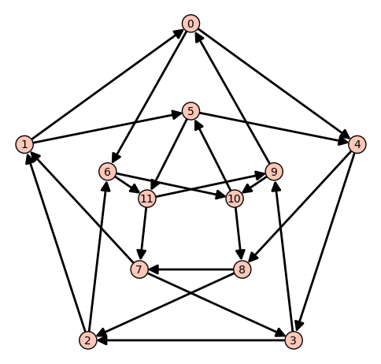
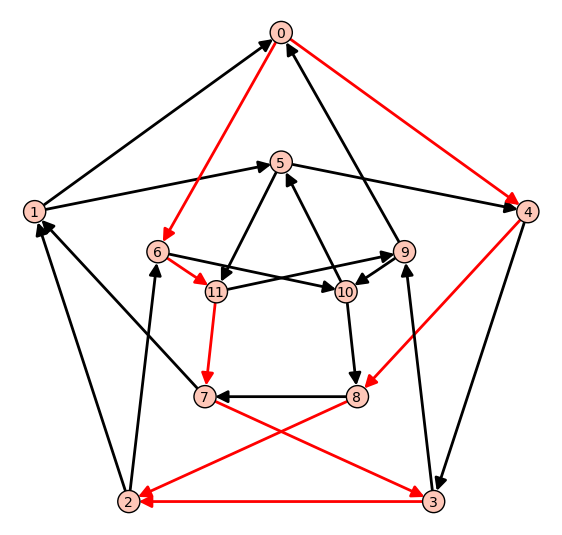

.. _linear_programming:

Linear Programming (Mixed Integer)
==================================

This document explains the use of linear programming (LP) -- and of
mixed integer linear programming (MILP) -- in Sage by illustrating it
with several problems it can solve. Most of the examples given are
motivated by graph-theoretic concerns, and should be understandable
without any specific knowledge of this field. As a tool in
Combinatorics, using linear programming amounts to understanding how
to reformulate an optimization (or existence) problem through linear
constraints.

This is a translation of a chapter from the book
`Calcul mathematique avec Sage <http://sagebook.gforge.inria.fr>`_.

Definition
----------

Here we present the usual definition of what a linear program is: it
is defined by a matrix `A: \mathbb{R}^m \mapsto \mathbb{R}^n`, along
with two vectors `b,c \in \mathbb{R}^n`. Solving a linear program is
searching for a vector `x` maximizing an *objective* function and
satisfying a set of constraints, i.e.

.. MATH::
    c^t x = \max_{x' \text{ such that } Ax' \leq b} c^t x'

where the ordering `u \leq u'` between two vectors means that the
entries of `u'` are pairwise greater than the entries of `u`. We also
write:

.. MATH::
    \text{Max: } & c^t x\\
    \text{Such that: } & Ax \leq b

Equivalently, we can also say that solving a linear program amounts to
maximizing a linear function defined over a polytope (preimage or
`A^{-1} (\leq b)`). These definitions, however, do not tell us how to
use linear programming in combinatorics. In the following, we will
show how to solve optimization problems like the Knapsack problem, the
Maximum Matching problem, and a Flow problem.

Mixed integer linear programming
--------------------------------

There are bad news coming along with this definition of linear
programming: an LP can be solved in polynomial time. This is indeed
bad news, because this would mean that unless we define LP of
exponential size, we cannot expect LP to solve NP-complete problems,
which would be a disappointment. On a brighter side, it becomes
NP-complete to solve a linear program if we are allowed to specify
constraints of a different kind: requiring that some variables be
integers instead of real values. Such an LP is actually called a "mixed
integer linear program" (some variables can be integers, some other
reals). Hence, we can expect to find in the MILP framework a *wide*
range of expressivity.

Practical
---------

The ``MILP`` class
^^^^^^^^^^^^^^^^^^

The ``MILP`` class in Sage represents a MILP! It is also used to
solve regular LP. It has a very small number of methods, meant to
define our set of constraints and variables, then to read the solution
found by the solvers once computed. It is also possible to export a
MILP defined with Sage to a ``.lp`` or ``.mps`` file, understood by most
solvers.

Let us ask Sage to solve the following LP:

.. MATH::
    \text{Max: } & x + y + 3z\\
    \text{Such that: } & x + 2y \leq 4\\
    \text{} & 5z - y \leq 8\\
    \text{} & x,y,z \geq 0\\

To achieve it, we need to define a corresponding ``MILP`` object, along with 3
variables ``x``, ``y`` and ``z``::

    sage: p = MixedIntegerLinearProgram()
    sage: v = p.new_variable(real=True, nonnegative=True)
    sage: x, y, z = v['x'], v['y'], v['z']

Next, we set the objective function

.. link

::

    sage: p.set_objective(x + y + 3*z)

And finally we set the constraints

.. link

::

    sage: p.add_constraint(x + 2*y <= 4)
    sage: p.add_constraint(5*z - y <= 8)

The ``solve`` method returns by default the optimal value reached by
the objective function

.. link

::

    sage: round(p.solve(), 2)
    8.8

We can read the optimal assignation found by the solver for `x`, `y` and
`z` through the ``get_values`` method

.. link

::

    sage: round(p.get_values(x), 2)
    4.0
    sage: round(p.get_values(y), 2)
    0.0
    sage: round(p.get_values(z), 2)
    1.6

Variables
^^^^^^^^^

In the previous example, we obtained variables through ``v['x']``, ``v['y']``
and ``v['z']``. This being said, larger LP/MILP will require us to associate an
LP variable to many Sage objects, which can be integers, strings, or even the
vertices and edges of a graph. For example:

.. link

::

    sage: x = p.new_variable(real=True, nonnegative=True)

With this new object ``x`` we can now write constraints using
``x[1],...,x[15]``.

.. link

::

    sage: p.add_constraint(x[1] + x[12] - x[14] >= 8)

Notice that we did not need to define the "length" of ``x``. Actually, ``x``
would accept any immutable object as a key, as a dictionary would. We can now
write

.. link

::

    sage: p.add_constraint(x["I am a valid key"] +
    ....:                  x[("a",pi)] <= 3)

And because any immutable object can be used as a key, doubly indexed variables
`x^{1,1}, ..., x^{1,15}, x^{2,1}, ..., x^{15,15}` can be referenced by
``x[1,1],...,x[1,15],x[2,1],...,x[15,15]``

.. link

::

    sage: p.add_constraint(x[3,2] + x[5] == 6)

Typed variables and bounds
""""""""""""""""""""""""""

**Types :** If you want a variable to assume only integer or binary values, use
the ``integer=True`` or ``binary=True`` arguments of the ``new_variable``
method. Alternatively, call the ``set_integer`` and ``set_binary`` methods.

**Bounds :** If you want your variables to only take nonnegative values, you can
say so when calling ``new_variable`` with the argument ``nonnegative=True``. If
you want to set a different upper/lower bound on a variable, add a constraint or
use the ``set_min``, ``set_max`` methods.

Basic linear programs
---------------------

Knapsack
^^^^^^^^

The *Knapsack* problem is the following: given a collection of items
having both a weight and a *usefulness*, we would like to fill a bag
whose capacity is constrained while maximizing the usefulness of the
items contained in the bag (we will consider the sum of the items'
usefulness). For the purpose of this tutorial, we set the restriction
that the bag can only carry a certain total weight.

To achieve this, we have to associate to each object `o` of our
collection `C` a binary variable ``taken[o]``, set to 1 when the
object is in the bag, and to 0 otherwise. We are trying to solve the
following MILP

.. MATH::
    \text{Max: } & \sum_{o \in L} \text{usefulness}_o \times \text{taken}_o\\
    \text{Such that: } & \sum_{o \in L} \text{weight}_o \times \text{taken}_o \leq C\\

Using Sage, we will give to our items a random weight::

    sage: C = 1

.. link

::

    sage: L = ["pan", "book", "knife", "gourd", "flashlight"]

.. link

::

    sage: L.extend(["random_stuff_" + str(i) for i in range(20)])

.. link

::

    sage: weight = {}
    sage: usefulness = {}

.. link

::

    sage: set_random_seed(685474)
    sage: for o in L:
    ....:     weight[o] = random()
    ....:     usefulness[o] = random()

We can now define the MILP itself

.. link

::

    sage: p = MixedIntegerLinearProgram()
    sage: taken = p.new_variable(binary=True)

.. link

::

    sage: p.add_constraint(sum(weight[o] * taken[o] for o in L) <= C)

.. link

::

    sage: p.set_objective(sum(usefulness[o] * taken[o] for o in L))

.. link

::

    sage: p.solve() # abs tol 1e-6
    3.1502766806530307
    sage: taken = p.get_values(taken)

The solution found is (of course) admissible

.. link

::

    sage: sum(weight[o] * taken[o] for o in L) # abs tol 1e-6
    0.6964959796619171

Should we take a flashlight?

.. link

::

    sage: taken["flashlight"]
    1.0

Wise advice. Based on purely random considerations.

Matching
--------

Given a graph `G`, a matching is a set of pairwise disjoint edges. The
empty set is a trivial matching. So we focus our attention on maximum
matchings: we want to find in a graph a matching whose cardinality is
maximal. Computing the maximum matching in a graph is a polynomial
problem, which is a famous result of Edmonds. Edmonds' algorithm is
based on local improvements and the proof that a given matching is
maximum if it cannot be improved. This algorithm is not the hardest to
implement among those graph theory can offer, though this problem can
be modeled with a very simple MILP.

To do it, we need -- as previously -- to associate a binary variable
to each one of our objects: the edges of our graph (a value of 1
meaning that the corresponding edge is included in the maximum
matching). Our constraint on the edges taken being that they are
disjoint, it is enough to require that, `x` and `y` being two edges
and `m_x, m_y` their associated variables, the inequality `m_x + m_y
\leq 1` is satisfied, as we are sure that the two of them cannot both
belong to the matching. Hence, we are able to write the MILP we
want. However, the number of inequalities can be easily decreased by
noticing that two edges cannot be taken simultaneously inside a
matching if and only if they have a common endpoint `v`. We can then
require instead that at most one edge incident to `v` be taken inside
the matching, which is a linear constraint. We will be solving:

.. MATH::
    \text{Max: } & \sum_{e \in E(G)} m_e\\
    \text{Such that: } & \forall v, \sum_{e \in E(G) \atop v \sim e} m_e \leq 1

Let us write the Sage code of this MILP::

    sage: g = graphs.PetersenGraph()
    sage: p = MixedIntegerLinearProgram()
    sage: matching = p.new_variable(binary=True)

.. link

::

    sage: p.set_objective(sum(matching[e] for e in g.edges(labels=False)))

.. link

::

    sage: for v in g:
    ....:     p.add_constraint(sum(matching[e]
    ....:         for e in g.edges_incident(v, labels=False)) <= 1)

.. link

::

    sage: p.solve()
    5.0

.. link

::

    sage: matching = p.get_values(matching)
    sage: [e for e,b in matching.iteritems() if b == 1]  # not tested
    [(0, 1), (6, 9), (2, 7), (3, 4), (5, 8)]

Flows
-----

Yet another fundamental algorithm in graph theory: maximum flow! It
consists, given a directed graph and two vertices `s, t`, in sending a
maximum *flow* from `s` to `t` using the edges of `G`, each of them
having a maximal capacity.

The definition of this problem is almost its LP formulation. We are
looking for real values associated to each edge, which would
represent the intensity of flow going through them, under two types of
constraints:

* The amount of flow arriving on a vertex (different from `s` or `t`)
  is equal to the amount of flow leaving it.
* The amount of flow going through an edge is bounded by the capacity
  of this edge.

This being said, we have to maximize the amount of flow leaving
`s`: all of it will end up in `t`, as the other vertices are sending
just as much as they receive. We can model the flow problem with the
following LP

.. MATH::
    \text{Max: } & \sum_{sv \in G} f_{sv}\\
    \text{Such that: } & \forall v \in G, {v \neq s \atop v \neq t}, \sum_{vu \in G} f_{vu} - \sum_{uv \in G} f_{uv} = 0\\
    & \forall uv \in G, f_{uv} \leq 1\\

We will solve the flow problem on an orientation of Chvatal's
graph, in which all the edges have a capacity of 1::

    sage: g = graphs.ChvatalGraph()
    sage: g = g.minimum_outdegree_orientation()

.. link

::

    sage: p = MixedIntegerLinearProgram()
    sage: f = p.new_variable(real=True, nonnegative=True)
    sage: s, t = 0, 2

.. link

::

    sage: for v in g:
    ....:     if v != s and v != t:
    ....:         p.add_constraint(
    ....:             sum(f[(v,u)] for u in g.neighbors_out(v))
    ....:             - sum(f[(u,v)] for u in g.neighbors_in(v)) == 0)

.. link

::

    sage: for e in g.edges(labels=False):
    ....:     p.add_constraint(f[e] <= 1)

.. link

::

    sage: p.set_objective(sum(f[(s,u)] for u in g.neighbors_out(s)))

.. link

::

    sage: p.solve()  # rel tol 2e-11
    2.0

Solvers
-------

Sage solves linear programs by calling specific libraries. The
following libraries are currently supported:

* `CBC <http://www.coin-or.org/projects/Cbc.xml>`_: A solver from
  `COIN-OR <http://www.coin-or.org/>`_

  Provided under the open source license CPL, but incompatible with
  GPL. CBC can be installed using the shell command
  ``sage -i cbc sagelib``.

* `CPLEX
  <http://www-01.ibm.com/software/integration/optimization/cplex/>`_:
  A solver from `ILOG <http://www.ilog.com/>`_

  Proprietary, but free for researchers and students.

* `CVXOPT <http://cvxopt.org/>`_: an LP solver from Python Software for
  Convex Optimization, uses an interior-point method, always installed in Sage.

  Licensed under the GPL.

* `GLPK <http://www.gnu.org/software/glpk/>`_: A solver from `GNU
  <http://www.gnu.org/>`_

  Licensed under the GPLv3. This solver is always installed, as the default one, in Sage.

* `GUROBI <http://www.gurobi.com/>`_

  Proprietary, but free for researchers and students.

* `PPL <http://bugseng.com/products/ppl>`_: A solver from bugSeng.

  This solver provides exact (arbitrary precision) computation, always installed in Sage.

  Licensed under the GPLv3.

Using CPLEX or GUROBI through Sage
----------------------------------

ILOG's CPLEX and GUROBI being proprietary softwares, you must be in possession
of several files to use it through Sage. In each case, the **expected** (it may
change !) filename is joined.

* A valid license file
    * CPLEX : a ``.ilm`` file
    * GUROBI : a ``.lic`` file

* A compiled version of the library
    * CPLEX : ``libcplex.a``
    * GUROBI : ``libgurobi55.so`` (or more recent)

* The library file
    * CPLEX : ``cplex.h``
    * GUROBI : ``gurobi_c.h``

The environment variable defining the licence's path must also be set when
running Sage. You can append to your ``.bashrc`` file one of the following :

    * For CPLEX ::

        export ILOG_LICENSE_FILE=/path/to/the/license/ilog/ilm/access_1.ilm

    * For GUROBI ::

        export GRB_LICENSE_FILE=/path/to/the/license/gurobi.lic

As Sage also needs the files library and header files the easiest way is to
create symbolic links to these files in the appropriate directories:

* For CPLEX:
    * ``libcplex.a`` -- in ``SAGE_ROOT/local/lib/``, type::

        ln -s /path/to/lib/libcplex.a .

    * ``cplex.h`` -- in ``SAGE_ROOT/local/include/``, type::

        ln -s /path/to/include/cplex.h .

    *  ``cpxconst.h`` (if it exists) -- in ``SAGE_ROOT/local/include/``, type::

        ln -s /path/to/include/cpxconst.h .

* For GUROBI

    * ``libgurobi56.so`` -- in ``SAGE_ROOT/local/lib/``, type::

        ln -s /path/to/lib/libgurobi56.so libgurobi.so

    * ``gurobi_c.h`` -- in ``SAGE_ROOT/local/include/``, type::

        ln -s /path/to/include/gurobi_c.h .

**It is very important that the names of the symbolic links in Sage's folders**
** be precisely as indicated. If the names differ, Sage will not notice that**
**the files are present**

Once this is done, Sage is to be asked to notice the changes by running::

    make
