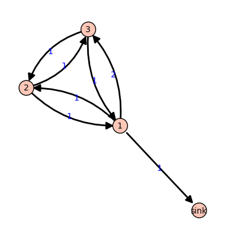
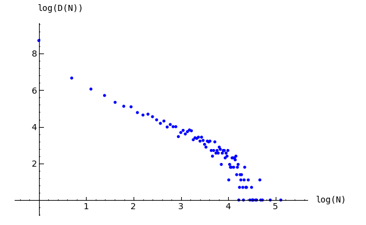
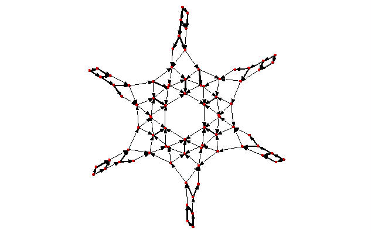
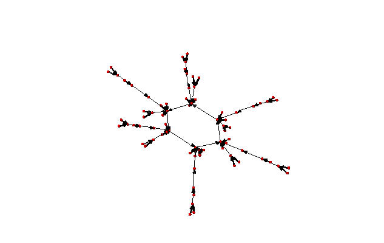
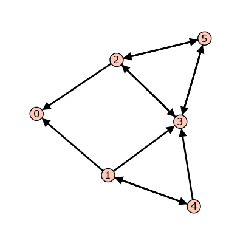
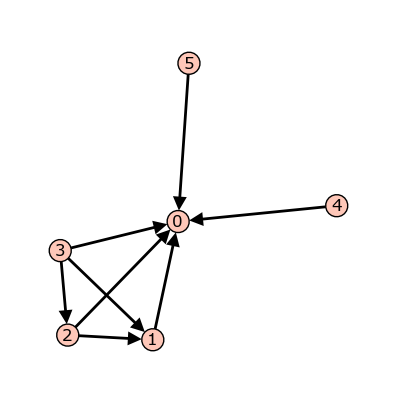

.. Sage Sandpiles documentation master file, created by sphinx-quickstart on Fri May 22 23:01:09 2009.
   You can adapt this file completely to your liking, but it should at least
   contain the root `toctree` directive.
.. _abelian_sandpile_model:

Abelian Sandpile Model
==========================================

.. MODULEAUTHOR:: David Perkinson, Reed College

.. toctree::
   :maxdepth: 2

.. linkall

Introduction
------------

These notes provide an introduction to Dhar's abelian sandpile model (ASM) and
to Sage Sandpiles, a collection of tools in Sage for doing sandpile
calculations.  For a more thorough introduction to the theory of the ASM, the
papers *Chip-Firing and Rotor-Routing on Directed Graphs* [H]_, by Holroyd et
al. and *Riemann-Roch and Abel-Jacobi Theory on a Finite Graph* by Baker and
Norine [BN]_ are recommended.

To describe the ASM, we start with a *sandpile graph*: a directed multigraph
`\Gamma` with a vertex `s` that is accessible from every vertex (except
possibly `s`, itself).  By *multigraph*, we mean that each edge of `\Gamma` is
assigned a nonnegative integer weight.  To say `s` is *accessible* from some
vertex `v` means that there is a sequence of directed edges starting at `v` and
ending at `s`.  We call `s` the *sink* of the sandpile graph, even though it might have outgoing edges, for reasons that will be made clear in a moment.

We denoted the vertices of `\Gamma` by `V` and define `\tilde{V} = V\setminus\{s\}`.

Configurations and divisors
^^^^^^^^^^^^^^^^^^^^^^^^^^^

A *configuration* on `\Gamma` is an element of `\mathbb{N}\tilde{V}`, i.e., the
assignment of a nonnegative integer to each nonsink vertex.  We think of each
integer as a number of grains of sand being placed at the corresponding
vertex.  A *divisor* on `\Gamma` is an element of `\mathbb{Z}V`, i.e., an
element in the free abelian group on *all* of the vertices.  In the context of
divisors, it is sometimes useful to think of assigning dollars to each vertex,
with negative integers signifying a debt.

Stabilization
^^^^^^^^^^^^^

A configuration `c` is *stable* at a vertex `v\in\tilde{V}` if
`c(v)<\mbox{out-degree}(v)`, and `c` itself is stable if it is stable at each
nonsink vertex.  Otherwise, `c` is *unstable*.  If `c` is unstable at `v`, the vertex `v` can be *fired*
(*toppled*) by removing `\mbox{out-degree}(v)` grains of sand from `v` and
adding grains of sand to the neighbors of sand, determined by the weights of
the edges leaving `v`.

Despite our best intentions, we sometimes consider firing a stable vertex,
resulting in a configuration with a "negative amount" of sand at that vertex.
We may also *reverse-firing* a vertex, absorbing sand from the vertex's
neighbors.

**Example.** Consider the graph:

   `\Gamma`

All edges have weight `1` except for the edge from vertex 1 to vertex 3,
which has weight `2`.  If we let `c=(5,0,1)` with the indicated number of
grains of sand on vertices 1, 2, and 3, respectively, then only vertex 1,
whose out-degree is 4, is unstable.  Firing vertex 1 gives a new
configuration `c'=(1,1,3)`.  Here, `4` grains have left vertex 1.  One of
these has gone to the sink vertex (and forgotten), one has gone to vertex 1,
and two have gone to vertex 2, since the edge from 1 to 2 has weight 2.
Vertex 3 in the new configuration is now unstable.  The Sage code for this
example follows. ::

    sage: g = {'sink':{},
    ....:      1:{'sink':1, 2:1, 3:2},
    ....:      2:{1:1, 3:1},
    ....:      3:{1:1, 2:1}}
    sage: S = Sandpile(g, 'sink')   # create the sandpile
    sage: S.show(edge_labels=true)  # display the graph

    Create the configuration:

    sage: c = SandpileConfig(S, {1:5, 2:0, 3:1})
    sage: S.out_degree()
    {1: 4, 2: 2, 3: 2, 'sink': 0}

    Fire vertex one:

    sage: c.fire_vertex(1)
    {1: 1, 2: 1, 3: 3}

    The configuration is unchanged:

    sage: c
    {1: 5, 2: 0, 3: 1}

    Repeatedly fire vertices until the configuration becomes stable:

    sage: c.stabilize()
    {1: 2, 2: 1, 3: 1}

    Alternatives:

    sage: ~c             # shorthand for c.stabilize()
    {1: 2, 2: 1, 3: 1}
    sage: c.stabilize(with_firing_vector=true)
    [{1: 2, 2: 1, 3: 1}, {1: 2, 2: 2, 3: 3}]

Since vertex 3 has become unstable after firing vertex 1, it can be fired,
which causes vertex 2 to become unstable, etc.  Repeated firings eventually
lead to a stable configuration.  The last line of the Sage code, above, is a
list, the first element of which is the resulting stable configuration,
`(2,1,1)`.  The second component records how many times each vertex fired in
the stabilization.

--------

Since the sink is accessible from each nonsink vertex and never fires, every
configuration will stabilize after a finite number of vertex-firings.  It is
not obvious, but the resulting stabilization is independent of the order in
which unstable vertices are fired.  Thus, each configuration stabilizes to a
unique stable configuration.

Laplacian
^^^^^^^^^

Fix an order on the vertices of `\Gamma`. The *Laplacian* of `\Gamma` is

.. math::

    L := D-A

where `D` is the diagonal matrix of out-degrees of the vertices and `A` is the
adjacency matrix whose `(i,j)`-th entry is the weight of the edge from vertex
`i` to vertex `j`, which we take to be `0` if there is no edge.  The *reduced
Laplacian*, `\tilde{L}`, is the submatrix of the Laplacian formed by removing
the row and column corresponding to the sink vertex.  Firing a vertex of a
configuration is the same as subtracting the corresponding row of the reduced
Laplacian.

**Example.** (Continued.) ::

    sage: S.vertices()  # the ordering of the vertices
    [1, 2, 3, 'sink']
    sage: S.laplacian()
    [ 4 -1 -2 -1]
    [-1  2 -1  0]
    [-1 -1  2  0]
    [ 0  0  0  0]
    sage: S.reduced_laplacian()
    [ 4 -1 -2]
    [-1  2 -1]
    [-1 -1  2]

    The configuration we considered previously:

    sage: c = SandpileConfig(S, [5,0,1])
    sage: c
    {1: 5, 2: 0, 3: 1}

    Firing vertex 1 is the same as subtracting the
    corresponding row from the reduced Laplacian:

    sage: c.fire_vertex(1).values()
    [1, 1, 3]
    sage: S.reduced_laplacian()[0]
    (4, -1, -2)
    sage: vector([5,0,1]) - vector([4,-1,-2])
    (1, 1, 3)

Recurrent elements
^^^^^^^^^^^^^^^^^^

Imagine an experiment in which grains of sand are dropped one-at-a-time onto a
graph, pausing to allow the configuration to stabilize between drops.  Some
configurations will only be seen once in this process.  For example, for most
graphs, once sand is dropped on the graph, no addition of sand+stabilization
will result in a graph empty of sand.  Other configurations---the so-called
*recurrent configurations*---will be seen infinitely often as the process is
repeated indefinitely.

To be precise, a configuration `c` is *recurrent* if (i) it is stable, and (ii)
given any configuration `a`, there is a configuration `b` such that
`c=\mbox{stab}(a+b)`, the stabilization of `a+b`.

The *maximal-stable* configuration, denoted `c_{\mathrm{max}}` is defined by
`c_{\mathrm{max}}(v)=\mbox{out-degree}(v)-1` for all nonsink vertices `v`.  It is clear that `c_{\mathrm{max}}` is recurrent.  Further, it is not hard to see that a configuration is recurrent if and only if it has the form `\mbox{stab}(a+c_{\mathrm{max}})` for some configuration `a`.

**Example.** (Continued.) ::

    sage: S.recurrents(verbose=false)
    [[3, 1, 1], [2, 1, 1], [3, 1, 0]]
    sage: c = SandpileConfig(S, [2,1,1])
    sage: c
    {1: 2, 2: 1, 3: 1}
    sage: c.is_recurrent()
    True
    sage: S.max_stable()
    {1: 3, 2: 1, 3: 1}

    Adding any configuration to the max-stable configuration and stabilizing
    yields a recurrent configuration.

    sage: x = SandpileConfig(S, [1,0,0])
    sage: x + S.max_stable()
    {1: 4, 2: 1, 3: 1}

    Use & to add and stabilize:

    sage: c = x & S.max_stable()
    sage: c
    {1: 3, 2: 1, 3: 0}
    sage: c.is_recurrent()
    True

    Note the various ways of performing addition + stabilization:

    sage: m = S.max_stable()
    sage: (x + m).stabilize() == ~(x + m)
    True
    sage: (x + m).stabilize() == x & m
    True

Burning Configuration
^^^^^^^^^^^^^^^^^^^^^

A *burning configuration* is a nonnegative integer-linear combination of the
rows of the reduced Laplacian matrix having nonnegative entries and such that
every vertex has a path from some vertex in its support.  The corresponding
*burning script* gives the integer-linear combination needed to obtain the
burning configuration.  So if `b` is the burning configuration, `\sigma` is its
script, and `\tilde{L}` is the reduced Laplacian, then `\sigma\,\tilde{L} = b`.
The *minimal burning configuration* is the one with the minimal script (its
components are no larger than the components of any other script for a burning
configuration).

The following are equivalent for a configuration `c` with burning
configuration `b` having script `\sigma`:

 - `c` is recurrent;
 - `c+b` stabilizes to `c`;
 - the firing vector for the stabilization of `c+b` is `\sigma`.

The burning configuration and script are computed using a modified
version of Speer's script algorithm.  This is a generalization to
directed multigraphs of Dhar's burning algorithm.

**Example.** ::

    sage: g = {0:{},1:{0:1,3:1,4:1},2:{0:1,3:1,5:1},
    ....:      3:{2:1,5:1},4:{1:1,3:1},5:{2:1,3:1}}
    sage: G = Sandpile(g,0)
    sage: G.burning_config()
    {1: 2, 2: 0, 3: 1, 4: 1, 5: 0}
    sage: G.burning_config().values()
    [2, 0, 1, 1, 0]
    sage: G.burning_script()
    {1: 1, 2: 3, 3: 5, 4: 1, 5: 4}
    sage: G.burning_script().values()
    [1, 3, 5, 1, 4]
    sage: matrix(G.burning_script().values())*G.reduced_laplacian()
    [2 0 1 1 0]

Sandpile group
^^^^^^^^^^^^^^

The collection of stable configurations forms a commutative monoid with
addition defined as ordinary addition followed by stabilization.  The identity
element is the all-zero configuration.  This monoid is a group
exactly when the underlying graph is a DAG (directed acyclic graph).

The recurrent elements form a submonoid which turns out to be a group.  This
group is called the *sandpile group* for `\Gamma`, denoted
`\mathcal{S}(\Gamma)`.  Its identity element is usually not the all-zero
configuration (again, only in the case that `\Gamma` is a DAG).  So finding the
identity element is an interesting problem.

Let `n=|V|-1` and fix an ordering of the nonsink vertices. Let
`\mathcal{\tilde{L}}\subset\mathbb{Z}^n` denote the column-span of
`\tilde{L}^t`, the transpose of the reduced Laplacian.  It is a theorem that

.. math::

    \mathcal{S}(\Gamma)\approx \mathbb{Z}^n/\mathcal{\tilde{L}}.

Thus, the number of elements of the sandpile group is `\det{\tilde{L}}`, which
by the matrix-tree theorem is the number of weighted trees directed into the
sink.

**Example.** (Continued.) ::

    sage: S.group_order()
    3
    sage: S.invariant_factors()
    [1, 1, 3]
    sage: S.reduced_laplacian().dense_matrix().smith_form()
    (
    [1 0 0]  [ 0  0  1]  [3 1 4]
    [0 1 0]  [ 1  0  0]  [4 1 6]
    [0 0 3], [ 0  1 -1], [4 1 5]
    )

    Adding the identity to any recurrent configuration and stabilizing yields
    the same recurrent configuration:

    sage: S.identity()
    {1: 3, 2: 1, 3: 0}
    sage: i = S.identity()
    sage: m = S.max_stable()
    sage: i & m == m
    True

Self-organized criticality
^^^^^^^^^^^^^^^^^^^^^^^^^^

The sandpile model was introduced by Bak, Tang, and Wiesenfeld in the paper,
*Self-organized criticality: an explanation of 1/ƒ noise* [BTW]_.  The term
*self-organized criticality* has no precise definition, but can be
loosely taken to describe a system that naturally evolves to a state that is
barely stable and such that the instabilities are described by a power law.
In practice, *self-organized criticality* is often taken to mean *like the
sandpile model on a grid-graph*.  The grid graph is just a grid with an extra
sink vertex.  The vertices on the interior of each side have one edge to the
sink, and the corner vertices have an edge of weight `2`.  Thus, every nonsink
vertex has out-degree `4`.

Imagine repeatedly dropping grains of sand on and empty grid graph, allowing
the sandpile to stabilize in between.  At first there is little activity, but
as time goes on, the size and extent of the avalanche caused by a single grain
of sand becomes hard to predict.  Computer experiments---I do not think there
is a proof, yet---indicate that the distribution of avalanche sizes obeys a
power law with exponent -1.  In the example below, the size of an avalanche is
taken to be the sum of the number of times each vertex fires.

**Example (distribution of avalanche sizes).** ::

    sage: S = sandpiles.Grid(10,10)
    sage: m = S.max_stable()
    sage: a = []
    sage: for i in range(10000):  # long time (15s on sage.math, 2012)
    ....:     m = m.add_random()
    ....:     m, f = m.stabilize(true)
    ....:     a.append(sum(f.values()))
    ...
    sage: p = list_plot([[log(i+1),log(a.count(i))] for i in [0..max(a)] if a.count(i)])  # long time
    sage: p.axes_labels(['log(N)','log(D(N))'])  # long time
    sage: p  # long time
    Graphics object consisting of 1 graphics primitive

   Distribution of avalanche sizes

Note: In the above code, ``m.stabilize(true)`` returns a list consisting of the
stabilized configuration and the firing vector.  (Omitting ``true`` would give
just the stabilized configuration.)

.. _discrete_riemann_surfaces:

Divisors and Discrete Riemann surfaces
^^^^^^^^^^^^^^^^^^^^^^^^^^^^^^^^^^^^^^

A reference for this section is *Riemann-Roch and Abel-Jacobi theory on a finite
graph* [BN]_.

A *divisor* on `\Gamma` is an element of the free abelian group on its
vertices, including the sink.  Suppose, as above, that the `n+1` vertices of
`\Gamma` have been ordered, and that `\mathcal{L}` is the column span of the
transpose of the Laplacian.  A divisor is then identified with an element
`D\in\mathbb{Z}^{n+1}` and two divisors are *linearly equivalent* if they
differ by an element of `\mathcal{L}`.  A divisor `E` is *effective*, written
`E\geq0`, if `E(v)\geq0` for each `v\in V`, i.e., if `E\in\mathbb{N}^{n+1}`.
The *degree* of a divisor, `D`, is `deg(D) := \sum_{v\in V}D(v)`.   The
divisors of degree zero modulo linear equivalence form the *Picard group*, or
*Jacobian* of the graph. For an undirected graph, the Picard group is
isomorphic to the sandpile group.

The *complete linear system* for a divisor `D`, denoted `|D|`, is the
collection of effective divisors linearly equivalent to `D.`

Riemann-Roch
~~~~~~~~~~~~
To describe the Riemann-Roch theorem in this context, suppose that `\Gamma` is
an undirected, unweighted graph. The *dimension*, `r(D)` of the linear system
`|D|` is `-1` if `|D|=\emptyset` and otherwise is the greatest integer `s` such
that `|D-E|\neq0` for all effective divisors `E` of degree `s`.  Define the
*canonical divisor* by `K=\sum_{v\in V}(\deg(v)-2)v` and the *genus* by `g =
\#(E) - \#(V) + 1`.  The Riemann-Roch theorem says that for any divisor `D`,

.. math::

    r(D)-r(K-D)=\deg(D)+1-g.

**Example.**::

    sage: G = sandpiles.Complete(5)  # the sandpile on the complete graph with 5 vertices

    A divisor on the graph:

    sage: D = SandpileDivisor(G, [1,2,2,0,2])

    Verify the Riemann-Roch theorem:

    sage: K = G.canonical_divisor()
    sage: D.rank() - (K - D).rank() == D.deg() + 1 - G.genus()
    True

    The effective divisors linearly equivalent to D:

    sage: D.effective_div(False)
    [[0, 1, 1, 4, 1], [1, 2, 2, 0, 2], [4, 0, 0, 3, 0]]

    The nonspecial divisors up to linear equivalence (divisors of degree
    g-1 with empty linear systems)

    sage: N = G.nonspecial_divisors()
    sage: [E.values() for E in N[:5]]   # the first few
    [[-1, 0, 1, 2, 3],
     [-1, 0, 1, 3, 2],
     [-1, 0, 2, 1, 3],
     [-1, 0, 2, 3, 1],
     [-1, 0, 3, 1, 2]]
    sage: len(N)
    24
    sage: len(N) == G.h_vector()[-1]
    True

Picturing linear systems
~~~~~~~~~~~~~~~~~~~~~~~~
Fix a divisor `D`.  There are at least two natural graphs associated with
linear system associated with `D`.  First, consider the directed graph with
vertex set `|D|` and with an edge from vertex `E` to vertex `F` if `F` is
attained from `E` by firing a single unstable vertex. ::

    sage: S = Sandpile(graphs.CycleGraph(6),0)
    sage: D = SandpileDivisor(S, [1,1,1,1,2,0])
    sage: D.is_alive()
    True
    sage: eff = D.effective_div()
    sage: firing_graph(S,eff).show3d(edge_size=.005,vertex_size=0.01,iterations=500)

   Complete linear system for (1,1,1,1,2,0) on `C_6`: single firings

The second graph has the same set of vertices but with an edge from `E` to `F`
if `F` is obtained from `E` by firing all unstable vertices of `E`. ::

    sage: S = Sandpile(graphs.CycleGraph(6),0)
    sage: D = SandpileDivisor(S, [1,1,1,1,2,0])
    sage: eff = D.effective_div() 
    sage: parallel_firing_graph(S,eff).show3d(edge_size=.005,vertex_size=0.01,iterations=500)

   Complete linear system for (1,1,1,1,2,0) on `C_6`: parallel firings

Note that in each of the examples, above, starting at any divisor in the linear
system and following edges, one is eventually led into a cycle of length 6
(cycling the divisor (1,1,1,1,2,0)).  Thus, ``D.alive()`` returns ``True``.  In
Sage, one would be able to rotate the above figures to get a better idea of the
structure.

Algebraic geometry of sandpiles
^^^^^^^^^^^^^^^^^^^^^^^^^^^^^^^

Affine
~~~~~~

Let `n=|V|-1`, and fix an ordering on the nonsink vertices of `\Gamma`.  let
`\tilde{\mathcal{L}}\subset\mathbb{Z}^n` denote the column-span of
`\tilde{L}^t`, the transpose of the reduced Laplacian.  Label vertex `i` with the
indeterminate `x_i`, and let `\mathbb{C}[\Gamma_s] = \mathbb{C}[x_1,\dots,x_n]`.
(Here, `s` denotes the sink vertex of `\Gamma`.) The *sandpile ideal* or
*toppling ideal*, first studied by Cori, Rossin, and Salvy [CRS]_ for undirected graphs, is the lattice ideal for `\tilde{\mathcal{L}}`:

.. math::

    I = I(\Gamma_s) := \{x^u-x^v: u-v\in
    \tilde{\mathcal{L}}\}\subset\mathbb{C}[\Gamma_s],

where `x^u := \prod_{i=1}^nx^{u_i}` for `u\in\mathbb{Z}^n`.

For each `c\in\mathbb{Z}^n` define `t(c) = x^{c^+} - x^{c^-}` where
`c^+_i=\max\{c_i,0\}` and `c^-=\max\{-c_i,0\}` so that `c=c^+-c^-`.
Then, for each `\sigma\in\mathbb{Z}^n`, define `T(\sigma) =
t(\tilde{L}^t\sigma)`.  It then turns out that

.. math::

    I = (T(e_1),\dots,T(e_n),x^b-1)

where `e_i` is the `i`-th standard basis vector and `b` is any burning
configuration.

The affine coordinate ring, `\mathbb{C}[\Gamma_s]/I,` is isomorphic to the group
algebra of the sandpile group, `\mathbb{C}[\mathcal{S}(\Gamma)].`

The standard term-ordering on `\mathbb{C}[\Gamma_s]` is graded reverse
lexigraphical order with `x_i>x_j` if vertex `v_i` is further from the sink than
vertex `v_j`. (There are choices to be made for vertices equidistant from the
sink). If `\sigma_b` is the script for a burning configuration (not
necessarily minimal), then

.. math::

    \{T(\sigma): \sigma\leq\sigma_b\}

is a Groebner basis for `I`.

Projective
~~~~~~~~~~

Now let `\mathbb{C}[\Gamma]=\mathbb{C}[x_0,x_1,\dots,x_n]`, where `x_0`
corresponds to the sink vertex.  The *homogeneous sandpile ideal*, denoted
`I^h`, is obtaining by homogenizing `I` with respect to `x_0`.  Let `L` be the
(full) Laplacian, and `\mathcal{L}\subset\mathbb{Z}^{n+1}` be the column span of
its transpose, `L^t.`  Then `I^h` is the lattice ideal for `\mathcal{L}`:

.. math::

    I^h = I^h(\Gamma) := \{x^u-x^v: u-v \in\mathcal{L}\}\subset\mathbb{C}[\Gamma].

This ideal can be calculated by saturating the ideal

.. math::

    (T(e_i): i=0,\dots n)

with respect to the product of the indeterminates: `\prod_{i=0}^nx_i` (extending
the `T` operator in the obvious way).  A Groebner basis with respect to the
degree lexicographic order describe above (with `x_0` the smallest vertex), is
obtained by homogenizing each element of the Groebner basis for the
non-homogeneous sandpile ideal with respect to `x_0.`

**Example.**  ::

    sage: g = {0:{},1:{0:1,3:1,4:1},2:{0:1,3:1,5:1},
    ....:      3:{2:1,5:1},4:{1:1,3:1},5:{2:1,3:1}}
    sage: S = Sandpile(g, 0)
    sage: S.ring()
    Multivariate Polynomial Ring in x5, x4, x3, x2, x1, x0 over Rational Field

    The homogeneous sandpile ideal:

    sage: S.ideal()
    Ideal (x2 - x0, x3^2 - x5*x0, x5*x3 - x0^2, x4^2 - x3*x1, x5^2 - x3*x0,
    x1^3 - x4*x3*x0, x4*x1^2 - x5*x0^2) of Multivariate Polynomial Ring
    in x5, x4, x3, x2, x1, x0 over Rational Field

    The generators of the ideal:

    sage: S.ideal(true)
    [x2 - x0,
     x3^2 - x5*x0,
     x5*x3 - x0^2,
     x4^2 - x3*x1,
     x5^2 - x3*x0,
     x1^3 - x4*x3*x0,
     x4*x1^2 - x5*x0^2]

    Its resolution:

    sage: S.resolution() # long time
    'R^1 <-- R^7 <-- R^19 <-- R^25 <-- R^16 <-- R^4'

    and Betti table:

    sage: S.betti() # long time
               0     1     2     3     4     5
    ------------------------------------------
        0:     1     1     -     -     -     -
        1:     -     4     6     2     -     -
        2:     -     2     7     7     2     -
        3:     -     -     6    16    14     4
    ------------------------------------------
    total:     1     7    19    25    16     4

    The Hilbert function:

    sage: S.hilbert_function()
    [1, 5, 11, 15]

    and its first differences (which counts the number of superstable
    configurations in each degree):

    sage: S.h_vector()
    [1, 4, 6, 4]
    sage: x = [i.deg() for i in S.superstables()]
    sage: sorted(x)
    [0, 1, 1, 1, 1, 2, 2, 2, 2, 2, 2, 3, 3, 3, 3]

    The degree in which the Hilbert function equals the Hilbert polynomial, the
    latter always being a constant in the case of a sandpile ideal:

    sage: S.postulation()
    3

Zeros
~~~~~

The *zero set* for the sandpile ideal `I` is

.. math::

    Z(I) = \{p\in\mathbb{C}^n: f(p)=0\mbox{ for all $f\in I$}\},

the set of simultaneous zeros of the polynomials in `I.`  Letting `S^1` denote
the unit circle in the complex plane, `Z(I)` is a finite
subgroup of `S^1\times\dots\times S^1\subset\mathbb{C}^n`, isomorphic to the
sandpile group.  The zero set is actually linearly isomorphic to a faithful representation of the sandpile group on `\mathbb{C}^n.`

**Example.** (Continued.) ::

    sage: S = Sandpile({0: {}, 1: {2: 2}, 2: {0: 4, 1: 1}}, 0)
    sage: S.ideal().gens()
    [x1^2 - x2^2, x1*x2^3 - x0^4, x2^5 - x1*x0^4]

    Approximation to the zero set (setting ``x_0 = 1``):

    sage: S.solve()
    [[-0.707107 + 0.707107*I, 0.707107 - 0.707107*I],
    [-0.707107 - 0.707107*I, 0.707107 + 0.707107*I],
    [-I, -I],
    [I, I],
    [0.707107 + 0.707107*I, -0.707107 - 0.707107*I],
    [0.707107 - 0.707107*I, -0.707107 + 0.707107*I],
    [1, 1],
    [-1, -1]]
    sage: len(_) == S.group_order()
    True

    The zeros are generated as a group by a single vector:

    sage: S.points()
    [[(1/2*I + 1/2)*sqrt(2), -(1/2*I + 1/2)*sqrt(2)]]

Resolutions
~~~~~~~~~~~

The homogeneous sandpile ideal, `I^h`, has a free resolution graded by the
divisors on `\Gamma` modulo linear equivalence.  (See the section on
:ref:`Discrete Riemann Surfaces <discrete_riemann_surfaces>` for the language of
divisors and linear equivalence.)  Let
`S=\mathbb{C}[\Gamma]=\mathbb{C}[x_0,\dots,x_n]`, as above, and let
`\mathfrak{S}` denote the group of divisors modulo rational equivalence.  Then
`S` is graded by `\mathfrak{S}` by letting `\deg(x^c)= c\in\mathfrak{S}` for
each monomial `x^c`.  The minimal free resolution of `I^h` has the form

.. math::

     0\leftarrow I^h
    \leftarrow\oplus_{D\in\mathfrak{S}}S(-D)^{\beta_{0,D}}\leftarrow\oplus_{D\in\mathfrak{S}}S(-D)^{\beta_{1,D}}
    \leftarrow\dots\leftarrow\oplus_{D\in\mathfrak{S}}S(-D)^{\beta_{r,D}}\leftarrow0.

where the `\beta_{i,D}` are the *Betti numbers* for `I^h`.

For each divisor class `D\in\mathfrak{S}`, define a simplicial complex,

.. math::

    \Delta_D := \{I\subseteq\{0,\dots,n\}: I\subseteq\mbox{supp}(E)\mbox{ for some}\
    E\in |D|\}.

The Betti number `\beta_{i,D}` equals the dimension over `\mathbb{C}` of the
`i`-th reduced homology group of `\Delta_D`:

.. math::

    \beta_{i,D} = \dim_{\mathbb{C}}\tilde{H}_i(\Delta_D;\mathbb{C}).

::

    sage: S = Sandpile({0:{},1:{0: 1, 2: 1, 3: 4},2:{3: 5},3:{1: 1, 2: 1}},0)

    Representatives of all divisor classes with nontrivial homology:

    sage: p = S.betti_complexes()
    sage: p[0]
    [{0: -8, 1: 5, 2: 4, 3: 1},
     Simplicial complex with vertex set (1, 2, 3) and facets {(1, 2), (3,)}]

    The homology associated with the first divisor in the list:

    sage: D = p[0][0]
    sage: D.effective_div()
    [{0: 0, 1: 0, 2: 0, 3: 2}, {0: 0, 1: 1, 2: 1, 3: 0}]
    sage: [E.support() for E in D.effective_div()]
    [[3], [1, 2]]
    sage: D.Dcomplex()
    Simplicial complex with vertex set (1, 2, 3) and facets {(1, 2), (3,)}
    sage: D.Dcomplex().homology()
    {0: Z, 1: 0}

    The minimal free resolution:

    sage: S.resolution()
    'R^1 <-- R^5 <-- R^5 <-- R^1'
    sage: S.betti()
               0     1     2     3
    ------------------------------
        0:     1     -     -     -
        1:     -     5     5     -
        2:     -     -     -     1
    ------------------------------
    total:     1     5     5     1
    sage: len(p)
    11

    The degrees and ranks of the homology groups for each element of the list p
    (compare with the Betti table, above):

    sage: [[sum(d[0].values()),d[1].betti()] for d in p]
    [[2, {0: 2, 1: 0}],
    [3, {0: 1, 1: 1, 2: 0}],
    [2, {0: 2, 1: 0}],
    [3, {0: 1, 1: 1, 2: 0}],
    [2, {0: 2, 1: 0}],
    [3, {0: 1, 1: 1, 2: 0}],
    [2, {0: 2, 1: 0}],
    [3, {0: 1, 1: 1}],
    [2, {0: 2, 1: 0}],
    [3, {0: 1, 1: 1, 2: 0}],
    [5, {0: 1, 1: 0, 2: 1}]]

Complete Intersections and Arithmetically Gorenstein toppling ideals
~~~~~~~~~~~~~~~~~~~~~~~~~~~~~~~~~~~~~~~~~~~~~~~~~~~~~~~~~~~~~~~~~~~~

NOTE: in the previous section note that the resolution always has length `n` since
the ideal is Cohen-Macaulay.

To do.

Betti numbers for undirected graphs
~~~~~~~~~~~~~~~~~~~~~~~~~~~~~~~~~~~~~~~~~~~~~~~~~~~~~~~~~~~~~~~~~~~~

To do.

Usage
-----

Initialization
^^^^^^^^^^^^^^

There are three main classes for sandpile structures in Sage: ``Sandpile``,
``SandpileConfig``, and ``SandpileDivisor``.  Initialization for ``Sandpile``
has the form

.. code-block:: python

    sage: S = Sandpile(graph, sink)

where ``graph`` represents a graph and ``sink`` is the key for the sink
vertex.  There are four possible forms for ``graph``:

1. a Python dictionary of dictionaries::

    sage: g = {0: {}, 1: {0: 1, 3: 1, 4: 1}, 2: {0: 1, 3: 1, 5: 1},
    ....:      3: {2: 1, 5: 1}, 4: {1: 1, 3: 1}, 5: {2: 1, 3: 1}}

   Graph from dictionary of dictionaries.

Each key is the name of a vertex.  Next to each vertex name `v` is a dictionary
consisting of pairs: ``vertex: weight``.  Each pair represents a directed edge
emanating from `v` and ending at ``vertex`` having (non-negative integer) weight
equal to ``weight``.  Loops are allowed. In the example above, all of the weights are 1.

2. a Python dictionary of lists::

    sage: g = {0: [], 1: [0, 3, 4], 2: [0, 3, 5],
    ....:      3: [2, 5], 4: [1, 3], 5: [2, 3]}

This is a short-hand when all of the edge-weights are equal to 1.  The above
example is for the same displayed graph.

3. a Sage graph (of type ``sage.graphs.graph.Graph``)::

    sage: g = graphs.CycleGraph(5)
    sage: S = Sandpile(g, 0)
    sage: type(g)
    <class 'sage.graphs.graph.Graph'>

To see the types of built-in graphs, type ``graphs.``, including the period,
and hit TAB.

4. a Sage digraph::

    sage: S = Sandpile(digraphs.RandomDirectedGNC(6), 0)
    sage: S.show()

   A random graph.

See
`sage.graphs.graph_generators <../reference/sage/graphs/graph_generators.html>`_ for
more information on the Sage graph library and graph constructors.

Each of these four formats is preprocessed by the Sandpile class so that,
internally, the graph is represented by the dictionary of dictionaries format
first presented.  This internal format is returned by  ``dict()``::

    sage: S = Sandpile({0:[], 1:[0, 3, 4], 2:[0, 3, 5], 3: [2, 5], 4: [1, 3], 5: [2, 3]},0)
    sage: S.dict()
    {0: {},
     1: {0: 1, 3: 1, 4: 1},
     2: {0: 1, 3: 1, 5: 1},
     3: {2: 1, 5: 1},
     4: {1: 1, 3: 1},
     5: {2: 1, 3: 1}}

.. note::

   The user is responsible for assuring that each vertex has a directed path
   into the designated sink.  If the sink has out-edges, these will be ignored
   for the purposes of sandpile calculations (but not calculations on divisors).

Code for checking whether a given vertex is a sink: ::

    sage: S = Sandpile({0:[], 1:[0, 3, 4], 2:[0, 3, 5], 3: [2, 5], 4: [1, 3], 5: [2, 3]},0)
    sage: [S.distance(v,0) for v in S.vertices()] # 0 is a sink
    [0, 1, 1, 2, 2, 2]
    sage: [S.distance(v,1) for v in S.vertices()] # 1 is not a sink
    [+Infinity, 0, +Infinity, +Infinity, 1, +Infinity]

Methods
^^^^^^^

Here are summaries of ``Sandpile``, ``SandpileConfig``, and ``SandpileDivisor`` methods
(functions).  Each summary is followed by a list of complete descriptions of
the methods.  There are many more methods available for a Sandpile, e.g.,
those inherited from the class DiGraph.  To see them all, enter
``dir(Sandpile)`` or type ``Sandpile.``, including the period, and hit TAB.

Sandpile
~~~~~~~~

**Summary of methods.**

- :ref:`all_k_config <all_k_config>` --- The constant configuration with all values set to k.

- :ref:`all_k_div <all_k_div>` --- The divisor with all values set to k.

- :ref:`avalanche_polynomial <avalanche_polynomial>` --- The avalanche polynomial.

- :ref:`betti <betti>` --- The Betti table for the homogeneous toppling ideal.

- :ref:`betti_complexes <betti_complexes>` --- The support-complexes with non-trivial homology.

- :ref:`burning_config <burning_config>` --- The minimal burning configuration.

- :ref:`burning_script <burning_script>` --- A script for the minimal burning configuration.

- :ref:`canonical_divisor <canonical_divisor>` --- The canonical divisor.

- :ref:`dict <dict>` --- A dictionary of dictionaries representing a directed graph.

- :ref:`genus <genus>` --- The genus: (# non-loop edges) - (# vertices) + 1.

- :ref:`groebner <groebner>` --- A Groebner basis for the homogeneous toppling ideal.

- :ref:`group_gens <group_gens>` --- A minimal list of generators for the sandpile group.

- :ref:`group_order <group_order>` --- The size of the sandpile group.

- :ref:`h_vector <h_vector>` --- The number of superstable configurations in each degree.

- :ref:`help <help>` --- List of Sandpile-specific methods (not inherited from Graph).

- :ref:`hilbert_function <hilbert_function>` --- The Hilbert function of the homogeneous toppling ideal.

- :ref:`ideal <ideal>` --- The saturated homogeneous toppling ideal.

- :ref:`identity <identity>` --- The identity configuration.

- :ref:`in_degree <in_degree>` --- The in-degree of a vertex or a list of all in-degrees.

- :ref:`invariant_factors <invariant_factors>` --- The invariant factors of the sandpile group.

- :ref:`is_undirected <is_undirected>` --- Is the underlying graph undirected?

- :ref:`jacobian_representatives <jacobian_representatives>` --- Representatives for the elements of the Jacobian group.

- :ref:`laplacian <laplacian>` --- The Laplacian matrix of the graph.

- :ref:`markov_chain <markov_chain>` --- The sandpile Markov chain for configurations or divisors.

- :ref:`max_stable <max_stable>` --- The maximal stable configuration.

- :ref:`max_stable_div <max_stable_div>` --- The maximal stable divisor.

- :ref:`max_superstables <max_superstables>` --- The maximal superstable configurations.

- :ref:`min_recurrents <min_recurrents>` --- The minimal recurrent elements.

- :ref:`nonsink_vertices <nonsink_vertices>` --- The nonsink vertices.

- :ref:`nonspecial_divisors <nonspecial_divisors>` --- The nonspecial divisors.

- :ref:`out_degree <out_degree>` --- The out-degree of a vertex or a list of all out-degrees.

- :ref:`picard_representatives <picard_representatives>` --- Representatives of the divisor classes of degree d in the Picard group.

- :ref:`points <points>` --- Generators for the multiplicative group of zeros of the sandpile ideal.

- :ref:`postulation <postulation>` --- The postulation number of the toppling ideal.

- :ref:`recurrents <recurrents>` --- The recurrent configurations.

- :ref:`reduced_laplacian <reduced_laplacian>` --- The reduced Laplacian matrix of the graph.

- :ref:`reorder_vertices <reorder_vertices>` --- A copy of the sandpile with vertex names permuted.

- :ref:`resolution <resolution>` --- A minimal free resolution of the homogeneous toppling ideal.

- :ref:`ring <ring>` --- The ring containing the homogeneous toppling ideal.

- :ref:`show <show>` --- Draw the underlying graph.

- :ref:`show3d <show3d>` --- Draw the underlying graph.

- :ref:`sink <sink>` --- The sink vertex.

- :ref:`smith_form <smith_form>` --- The Smith normal form for the Laplacian.

- :ref:`solve <solve>` --- Approximations of the complex affine zeros of the sandpile ideal.

- :ref:`stable_configs <stable_configs>` --- Generator for all stable configurations.

- :ref:`stationary_density <stationary_density>` --- The stationary density of the sandpile.

- :ref:`superstables <superstables>` --- The superstable configurations.

- :ref:`symmetric_recurrents <symmetric_recurrents>` --- The symmetric recurrent configurations.

- :ref:`tutte_polynomial <tutte_polynomial>` --- The Tutte polynomial.

- :ref:`unsaturated_ideal <unsaturated_ideal>` --- The unsaturated, homogeneous toppling ideal.

- :ref:`version <version>` --- The version number of Sage Sandpiles.

- :ref:`zero_config <zero_config>` --- The all-zero configuration.

- :ref:`zero_div <zero_div>` --- The all-zero divisor.

--------

**Complete descriptions of Sandpile methods.**

---

.. _all_k_config:

**all_k_config(k)**

The constant configuration with all values set to `k`.

INPUT:

``k`` -- integer

OUTPUT:

SandpileConfig

EXAMPLES::

    sage: s = sandpiles.Diamond()
    sage: s.all_k_config(7)
    {1: 7, 2: 7, 3: 7}

---

.. _all_k_div:

**all_k_div(k)**

The divisor with all values set to `k`.

INPUT:

``k`` -- integer

OUTPUT:

SandpileDivisor

EXAMPLES::

    sage: S = sandpiles.House()
    sage: S.all_k_div(7)
    {0: 7, 1: 7, 2: 7, 3: 7, 4: 7}

---

.. _avalanche_polynomial:

**avalanche_polynomial(multivariable=True)**

The avalanche polynomial.  See NOTE for details.

INPUT:

``multivariable`` -- (default: ``True``) boolean

OUTPUT:

polynomial

EXAMPLES::

    sage: s = sandpiles.Complete(4)
    sage: s.avalanche_polynomial()
    9*x0*x1*x2 + 2*x0*x1 + 2*x0*x2 + 2*x1*x2 + 3*x0 + 3*x1 + 3*x2 + 24
    sage: s.avalanche_polynomial(False)
    9*x0^3 + 6*x0^2 + 9*x0 + 24

.. NOTE::

    For each nonsink vertex `v`, let `x_v` be an indeterminate.
    If `(r,v)` is a pair consisting of a recurrent `r` and nonsink
    vertex `v`, then for each nonsink vertex `w`, let `n_w` be the
    number of times vertex `w` fires in the stabilization of `r + v`.
    Let `M(r,v)` be the monomial `\prod_w x_w^{n_w}`, i.e., the exponent
    records the vector of `n_w` as `w` ranges over the nonsink vertices.
    The avalanche polynomial is then the sum of `M(r,v)` as `r` ranges
    over the recurrents and `v` ranges over the nonsink vertices.  If
    ``multivariable`` is ``False``, then set all the indeterminates equal
    to each other (and, thus, only count the number of vertex firings in the
    stabilizations, forgetting which particular vertices fired).

---

.. _betti:

**betti(verbose=True)**

The Betti table for the homogeneous toppling ideal.  If
``verbose`` is ``True``, it prints the standard Betti table, otherwise,
it returns a less formated table.

INPUT:

``verbose`` -- (default: ``True``) boolean

OUTPUT:

Betti numbers for the sandpile

EXAMPLES::

    sage: S = sandpiles.Diamond()
    sage: S.betti()
               0     1     2     3
    ------------------------------
        0:     1     -     -     -
        1:     -     2     -     -
        2:     -     4     9     4
    ------------------------------
    total:     1     6     9     4
    sage: S.betti(False)
    [1, 6, 9, 4]

---

.. _betti_complexes:

**betti_complexes()**

The support-complexes with non-trivial homology.  (See NOTE.)

OUTPUT:

list (of pairs [divisors, corresponding simplicial complex])

EXAMPLES::

    sage: S = Sandpile({0:{},1:{0: 1, 2: 1, 3: 4},2:{3: 5},3:{1: 1, 2: 1}},0)
    sage: p = S.betti_complexes()
    sage: p[0]
    [{0: -8, 1: 5, 2: 4, 3: 1}, Simplicial complex with vertex set (1, 2, 3) and facets {(1, 2), (3,)}]
    sage: S.resolution()
    'R^1 <-- R^5 <-- R^5 <-- R^1'
    sage: S.betti()
               0     1     2     3
    ------------------------------
        0:     1     -     -     -
        1:     -     5     5     -
        2:     -     -     -     1
    ------------------------------
    total:     1     5     5     1
    sage: len(p)
    11
    sage: p[0][1].homology()
    {0: Z, 1: 0}
    sage: p[-1][1].homology()
    {0: 0, 1: 0, 2: Z}

.. NOTE::

    A ``support-complex`` is the simplicial complex formed from the
    supports of the divisors in a linear system.

---

.. _burning_config:

**burning_config()**

The minimal burning configuration.

OUTPUT:

dict (configuration)

EXAMPLES::

    sage: g = {0:{},1:{0:1,3:1,4:1},2:{0:1,3:1,5:1}, \
               3:{2:1,5:1},4:{1:1,3:1},5:{2:1,3:1}}
    sage: S = Sandpile(g,0)
    sage: S.burning_config()
    {1: 2, 2: 0, 3: 1, 4: 1, 5: 0}
    sage: S.burning_config().values()
    [2, 0, 1, 1, 0]
    sage: S.burning_script()
    {1: 1, 2: 3, 3: 5, 4: 1, 5: 4}
    sage: script = S.burning_script().values()
    sage: script
    [1, 3, 5, 1, 4]
    sage: matrix(script)*S.reduced_laplacian()
    [2 0 1 1 0]

.. NOTE::

    The burning configuration and script are computed using a modified
    version of Speer's script algorithm.  This is a generalization to
    directed multigraphs of Dhar's burning algorithm.

    A *burning configuration* is a nonnegative integer-linear
    combination of the rows of the reduced Laplacian matrix having
    nonnegative entries and such that every vertex has a path from some
    vertex in its support.  The corresponding *burning script* gives
    the integer-linear combination needed to obtain the burning
    configuration.  So if `b` is the burning configuration, `\sigma` is its
    script, and `\tilde{L}` is the reduced Laplacian, then `\sigma\cdot
    \tilde{L} = b`.  The *minimal burning configuration* is the one
    with the minimal script (its components are no larger than the
    components of any other script
    for a burning configuration).

    The following are equivalent for a configuration `c` with burning
    configuration `b` having script `\sigma`:

     - `c` is recurrent;
     - `c+b` stabilizes to `c`;
     - the firing vector for the stabilization of `c+b` is `\sigma`.

---

.. _burning_script:

**burning_script()**

A script for the minimal burning configuration.

OUTPUT:

dict

EXAMPLES::

    sage: g = {0:{},1:{0:1,3:1,4:1},2:{0:1,3:1,5:1},\
    3:{2:1,5:1},4:{1:1,3:1},5:{2:1,3:1}}
    sage: S = Sandpile(g,0)
    sage: S.burning_config()
    {1: 2, 2: 0, 3: 1, 4: 1, 5: 0}
    sage: S.burning_config().values()
    [2, 0, 1, 1, 0]
    sage: S.burning_script()
    {1: 1, 2: 3, 3: 5, 4: 1, 5: 4}
    sage: script = S.burning_script().values()
    sage: script
    [1, 3, 5, 1, 4]
    sage: matrix(script)*S.reduced_laplacian()
    [2 0 1 1 0]

.. NOTE::

    The burning configuration and script are computed using a modified
    version of Speer's script algorithm.  This is a generalization to
    directed multigraphs of Dhar's burning algorithm.

    A *burning configuration* is a nonnegative integer-linear
    combination of the rows of the reduced Laplacian matrix having
    nonnegative entries and such that every vertex has a path from some
    vertex in its support.  The corresponding *burning script* gives the
    integer-linear combination needed to obtain the burning configuration.
    So if `b` is the burning configuration, `s` is its script, and
    `L_{\mathrm{red}}` is the reduced Laplacian, then `s\cdot
    L_{\mathrm{red}}= b`.  The *minimal burning configuration* is the one
    with the minimal script (its components are no larger than the
    components of any other script
    for a burning configuration).

    The following are equivalent for a configuration `c` with burning
    configuration `b` having script `s`:

     - `c` is recurrent;
     - `c+b` stabilizes to `c`;
     - the firing vector for the stabilization of `c+b` is `s`.

---

.. _canonical_divisor:

**canonical_divisor()**

The canonical divisor.  This is the divisor with `\deg(v)-2` grains of
sand on each vertex (not counting loops).  Only for undirected graphs.

OUTPUT:

SandpileDivisor

EXAMPLES::

    sage: S = sandpiles.Complete(4)
    sage: S.canonical_divisor()
    {0: 1, 1: 1, 2: 1, 3: 1}
    sage: s = Sandpile({0:[1,1],1:[0,0,1,1,1]},0)
    sage: s.canonical_divisor()  # loops are disregarded
    {0: 0, 1: 0}

.. WARNING::

    The underlying graph must be undirected.

---

.. _dict:

**dict()**

A dictionary of dictionaries representing a directed graph.

OUTPUT:

dict

EXAMPLES::

    sage: S = sandpiles.Diamond()
    sage: S.dict()
    {0: {1: 1, 2: 1},
     1: {0: 1, 2: 1, 3: 1},
     2: {0: 1, 1: 1, 3: 1},
     3: {1: 1, 2: 1}}
    sage: S.sink()
    0

---

.. _genus:

**genus()**

The genus: (# non-loop edges) - (# vertices) + 1.  Only defined for undirected graphs.

OUTPUT:

integer

EXAMPLES::

    sage: sandpiles.Complete(4).genus()
    3
    sage: sandpiles.Cycle(5).genus()
    1

---

.. _groebner:

**groebner()**

A Groebner basis for the homogeneous toppling ideal.  It is computed
with respect to the standard sandpile ordering (see ``ring``).

OUTPUT:

Groebner basis

EXAMPLES::

    sage: S = sandpiles.Diamond()
    sage: S.groebner()
    [x3*x2^2 - x1^2*x0, x2^3 - x3*x1*x0, x3*x1^2 - x2^2*x0, x1^3 - x3*x2*x0, x3^2 - x0^2, x2*x1 - x0^2]

---

.. _group_gens:

**group_gens(verbose=True)**

A minimal list of generators for the sandpile group.  If ``verbose`` is ``False``
then the generators are represented as lists of integers.

INPUT:

``verbose`` -- (default: ``True``) boolean

OUTPUT:

list of SandpileConfig (or of lists of integers if ``verbose`` is ``False``)

EXAMPLES::

    sage: s = sandpiles.Cycle(5)
    sage: s.group_gens()
    [{1: 1, 2: 1, 3: 1, 4: 0}]
    sage: s.group_gens()[0].order()
    5
    sage: s = sandpiles.Complete(5)
    sage: s.group_gens(False)
    [[2, 2, 3, 2], [2, 3, 2, 2], [3, 2, 2, 2]]
    sage: [i.order() for i in s.group_gens()]
    [5, 5, 5]
    sage: s.invariant_factors()
    [1, 5, 5, 5]

---

.. _group_order:

**group_order()**

The size of the sandpile group.

OUTPUT:

integer

EXAMPLES::

    sage: S = sandpiles.House()
    sage: S.group_order()
    11

---

.. _h_vector:

**h_vector()**

The number of superstable configurations in each degree.  Equivalently,
this is the list of first differences of the Hilbert function of the
(homogeneous) toppling ideal.

OUTPUT:

list of nonnegative integers

EXAMPLES::

    sage: s = sandpiles.Grid(2,2)
    sage: s.hilbert_function()
    [1, 5, 15, 35, 66, 106, 146, 178, 192]
    sage: s.h_vector()
    [1, 4, 10, 20, 31, 40, 40, 32, 14]

---

.. _help:

**help(verbose=True)**

List of Sandpile-specific methods (not inherited from Graph).  If ``verbose``, include short descriptions.

INPUT:

``verbose`` -- (default: ``True``) boolean

OUTPUT:

printed string

EXAMPLES::

    sage: Sandpile.help()
    For detailed help with any method FOO listed below,
    enter "Sandpile.FOO?" or enter "S.FOO?" for any Sandpile S.
    <BLANKLINE>
    all_k_config             -- The constant configuration with all values set to k.
    all_k_div                -- The divisor with all values set to k.
    avalanche_polynomial     -- The avalanche polynomial.
    betti                    -- The Betti table for the homogeneous toppling ideal.
    betti_complexes          -- The support-complexes with non-trivial homology.
    burning_config           -- The minimal burning configuration.
    burning_script           -- A script for the minimal burning configuration.
    canonical_divisor        -- The canonical divisor.
    dict                     -- A dictionary of dictionaries representing a directed graph.
    genus                    -- The genus: (# non-loop edges) - (# vertices) + 1.
    groebner                 -- A Groebner basis for the homogeneous toppling ideal.
    group_gens               -- A minimal list of generators for the sandpile group.
    group_order              -- The size of the sandpile group.
    h_vector                 -- The number of superstable configurations in each degree.
    help                     -- List of Sandpile-specific methods (not inherited from Graph).
    hilbert_function         -- The Hilbert function of the homogeneous toppling ideal.
    ideal                    -- The saturated homogeneous toppling ideal.
    identity                 -- The identity configuration.
    in_degree                -- The in-degree of a vertex or a list of all in-degrees.
    invariant_factors        -- The invariant factors of the sandpile group.
    is_undirected            -- Is the underlying graph undirected?
    jacobian_representatives -- Representatives for the elements of the Jacobian group.
    laplacian                -- The Laplacian matrix of the graph.
    markov_chain             -- The sandpile Markov chain for configurations or divisors.
    max_stable               -- The maximal stable configuration.
    max_stable_div           -- The maximal stable divisor.
    max_superstables         -- The maximal superstable configurations.
    min_recurrents           -- The minimal recurrent elements.
    nonsink_vertices         -- The nonsink vertices.
    nonspecial_divisors      -- The nonspecial divisors.
    out_degree               -- The out-degree of a vertex or a list of all out-degrees.
    picard_representatives   -- Representatives of the divisor classes of degree d in the Picard group.
    points                   -- Generators for the multiplicative group of zeros of the sandpile ideal.
    postulation              -- The postulation number of the toppling ideal.
    recurrents               -- The recurrent configurations.
    reduced_laplacian        -- The reduced Laplacian matrix of the graph.
    reorder_vertices         -- A copy of the sandpile with vertex names permuted.
    resolution               -- A minimal free resolution of the homogeneous toppling ideal.
    ring                     -- The ring containing the homogeneous toppling ideal.
    show                     -- Draw the underlying graph.
    show3d                   -- Draw the underlying graph.
    sink                     -- The sink vertex.
    smith_form               -- The Smith normal form for the Laplacian.
    solve                    -- Approximations of the complex affine zeros of the sandpile ideal.
    stable_configs           -- Generator for all stable configurations.
    stationary_density       -- The stationary density of the sandpile.
    superstables             -- The superstable configurations.
    symmetric_recurrents     -- The symmetric recurrent configurations.
    tutte_polynomial         -- The Tutte polynomial.
    unsaturated_ideal        -- The unsaturated, homogeneous toppling ideal.
    version                  -- The version number of Sage Sandpiles.
    zero_config              -- The all-zero configuration.
    zero_div                 -- The all-zero divisor.

---

.. _hilbert_function:

**hilbert_function()**

The Hilbert function of the homogeneous toppling ideal.

OUTPUT:

list of nonnegative integers

EXAMPLES::

    sage: s = sandpiles.Wheel(5)
    sage: s.hilbert_function()
    [1, 5, 15, 31, 45]
    sage: s.h_vector()
    [1, 4, 10, 16, 14]

---

.. _ideal:

**ideal(gens=False)**

The saturated homogeneous toppling ideal.  If ``gens`` is ``True``, the
generators for the ideal are returned instead.

INPUT:

``gens`` -- (default: ``False``) boolean

OUTPUT:

ideal or, optionally, the generators of an ideal

EXAMPLES::

    sage: S = sandpiles.Diamond()
    sage: S.ideal()
    Ideal (x2*x1 - x0^2, x3^2 - x0^2, x1^3 - x3*x2*x0, x3*x1^2 - x2^2*x0, x2^3 - x3*x1*x0, x3*x2^2 - x1^2*x0) of Multivariate Polynomial Ring in x3, x2, x1, x0 over Rational Field
    sage: S.ideal(True)
    [x2*x1 - x0^2, x3^2 - x0^2, x1^3 - x3*x2*x0, x3*x1^2 - x2^2*x0, x2^3 - x3*x1*x0, x3*x2^2 - x1^2*x0]
    sage: S.ideal().gens()  # another way to get the generators
    [x2*x1 - x0^2, x3^2 - x0^2, x1^3 - x3*x2*x0, x3*x1^2 - x2^2*x0, x2^3 - x3*x1*x0, x3*x2^2 - x1^2*x0]

---

.. _identity:

**identity(verbose=True)**

The identity configuration.  If ``verbose`` is ``False``, the
configuration are converted to a list of integers.

INPUT:

``verbose`` -- (default: ``True``) boolean

OUTPUT:

SandpileConfig or a list of integers  If ``verbose`` is ``False``, the
configuration are converted to a list of integers.

EXAMPLES::

    sage: s = sandpiles.Diamond()
    sage: s.identity()
    {1: 2, 2: 2, 3: 0}
    sage: s.identity(False)
    [2, 2, 0]
    sage: s.identity() & s.max_stable() == s.max_stable()
    True

---

.. _in_degree:

**in_degree(v=None)**

The in-degree of a vertex or a list of all in-degrees.

INPUT:

``v`` -- (optional) vertex name

OUTPUT:

integer or dict

EXAMPLES::

    sage: s = sandpiles.House()
    sage: s.in_degree()
    {0: 2, 1: 2, 2: 3, 3: 3, 4: 2}
    sage: s.in_degree(2)
    3

---

.. _invariant_factors:

**invariant_factors()**

The invariant factors of the sandpile group.

OUTPUT:

list of integers

EXAMPLES::

    sage: s = sandpiles.Grid(2,2)
    sage: s.invariant_factors()
    [1, 1, 8, 24]

---

.. _is_undirected:

**is_undirected()**

Is the underlying graph undirected?  ``True`` if `(u,v)` is and edge if
and only if `(v,u)` is an edge, each edge with the same weight.

OUTPUT:

boolean

EXAMPLES::

    sage: sandpiles.Complete(4).is_undirected()
    True
    sage: s = Sandpile({0:[1,2], 1:[0,2], 2:[0]}, 0)
    sage: s.is_undirected()
    False

---

.. _jacobian_representatives:

**jacobian_representatives(verbose=True)**

Representatives for the elements of the Jacobian group. If ``verbose``
is ``False``, then lists representing the divisors are returned.

INPUT:

``verbose`` -- (default: ``True``) boolean

OUTPUT:

list of SandpileDivisor (or of lists representing divisors)

EXAMPLES:

For an undirected graph, divisors of the form ``s - deg(s)*sink`` as
``s`` varies over the superstables forms a distinct set of
representatives for the Jacobian group.::

    sage: s = sandpiles.Complete(3)
    sage: s.superstables(False)
    [[0, 0], [0, 1], [1, 0]]
    sage: s.jacobian_representatives(False)
    [[0, 0, 0], [-1, 0, 1], [-1, 1, 0]]

If the graph is directed, the representatives described above may by
equivalent modulo the rowspan of the Laplacian matrix::

    sage: s = Sandpile({0: {1: 1, 2: 2}, 1: {0: 2, 2: 4}, 2: {0: 4, 1: 2}},0)
    sage: s.group_order()
    28
    sage: s.jacobian_representatives()
    [{0: -5, 1: 3, 2: 2}, {0: -4, 1: 3, 2: 1}]

Let `\tau` be the nonnegative generator of the kernel of the transpose of
the Laplacian, and let `tau_s` be it sink component, then the sandpile
group is isomorphic to the direct sum of the cyclic group of order
`\tau_s` and the Jacobian group.  In the example above, we have::

    sage: s.laplacian().left_kernel()
    Free module of degree 3 and rank 1 over Integer Ring
    Echelon basis matrix:
    [14  5  8]

.. NOTE::

    The Jacobian group is the set of all divisors of degree zero modulo the
    integer rowspan of the Laplacian matrix.

---

.. _laplacian:

**laplacian()**

The Laplacian matrix of the graph.  Its *rows* encode the vertex firing rules.

OUTPUT:

matrix

EXAMPLES::

    sage: G = sandpiles.Diamond()
    sage: G.laplacian()
    [ 2 -1 -1  0]
    [-1  3 -1 -1]
    [-1 -1  3 -1]
    [ 0 -1 -1  2]

.. WARNING::

    The function ``laplacian_matrix`` should be avoided.  It returns the
    indegree version of the Laplacian.

---

.. _markov_chain:

**markov_chain(state, distrib=None)**

The sandpile Markov chain for configurations or divisors.
The chain starts at ``state``.  See NOTE for details.

INPUT:

- ``state``  -- SandpileConfig, SandpileDivisor, or list representing one of these

- ``distrib`` -- (optional) list of nonnegative numbers summing to 1 (representing a prob. dist.)

OUTPUT:

generator for Markov chain (see NOTE)

EXAMPLES::

    sage: s = sandpiles.Complete(4)
    sage: m = s.markov_chain([0,0,0])
    sage: m.next()          # random
    {1: 0, 2: 0, 3: 0}
    sage: m.next().values() # random
    [0, 0, 0]
    sage: m.next().values() # random
    [0, 0, 0]
    sage: m.next().values() # random
    [0, 0, 0]
    sage: m.next().values() # random
    [0, 1, 0]
    sage: m.next().values() # random
    [0, 2, 0]
    sage: m.next().values() # random
    [0, 2, 1]
    sage: m.next().values() # random
    [1, 2, 1]
    sage: m.next().values() # random
    [2, 2, 1]
    sage: m = s.markov_chain(s.zero_div(), [0.1,0.1,0.1,0.7])
    sage: m.next().values() # random
    [0, 0, 0, 1]
    sage: m.next().values() # random
    [0, 0, 1, 1]
    sage: m.next().values() # random
    [0, 0, 1, 2]
    sage: m.next().values() # random
    [1, 1, 2, 0]
    sage: m.next().values() # random
    [1, 1, 2, 1]
    sage: m.next().values() # random
    [1, 1, 2, 2]
    sage: m.next().values() # random
    [1, 1, 2, 3]
    sage: m.next().values() # random
    [1, 1, 2, 4]
    sage: m.next().values() # random
    [1, 1, 3, 4]

.. NOTE::

    The ``closed sandpile Markov chain`` has state space consisting of the configurations
    on a sandpile.  It transitions from a state by choosing a vertex at random
    (according to the probability distribution ``distrib``), dropping a grain of sand at
    that vertex, and stabilizing.  If the chosen vertex is the sink, the chain stays
    at the current state.

    The ``open sandpile Markov chain`` has state space consisting of the recurrent elements,
    i.e., the state space is the sandpile group.  It transitions from the configuration `c`
    by choosing a vertex `v` at random according to ``distrib``.  The next state is the
    stabilization of `c+v`.  If `v` is the sink vertex, then the stabilization of `c+v`
    is defined to be `c`.

    Note that in either case, if ``distrib`` is specified, its length is equal to
    the total number of vertices (including the sink).

REFERENCES:

.. [Levine2014] Lionel Levine. Threshold state and a conjecture of Poghosyan, Poghosyan,
   Priezzhev and Ruelle, Communications in Mathematical Physics.

---

.. _max_stable:

**max_stable()**

The maximal stable configuration.

OUTPUT:

SandpileConfig (the maximal stable configuration)

EXAMPLES::

    sage: S = sandpiles.House()
    sage: S.max_stable()
    {1: 1, 2: 2, 3: 2, 4: 1}

---

.. _max_stable_div:

**max_stable_div()**

The maximal stable divisor.

OUTPUT:

SandpileDivisor (the maximal stable divisor)

EXAMPLES::

    sage: s = sandpiles.Diamond()
    sage: s.max_stable_div()
    {0: 1, 1: 2, 2: 2, 3: 1}
    sage: s.out_degree()
    {0: 2, 1: 3, 2: 3, 3: 2}

---

.. _max_superstables:

**max_superstables(verbose=True)**

The maximal superstable configurations.  If the underlying graph is
undirected, these are the superstables of highest degree.  If
``verbose`` is ``False``, the configurations are converted to lists of
integers.

INPUT:

``verbose`` -- (default: ``True``) boolean

OUTPUT:

tuple of SandpileConfig

EXAMPLES::

    sage: s = sandpiles.Diamond()
    sage: s.superstables(False)
    [[0, 0, 0],
     [0, 0, 1],
     [1, 0, 1],
     [0, 2, 0],
     [2, 0, 0],
     [0, 1, 1],
     [1, 0, 0],
     [0, 1, 0]]
    sage: s.max_superstables(False)
    [[1, 0, 1], [0, 2, 0], [2, 0, 0], [0, 1, 1]]
    sage: s.h_vector()
    [1, 3, 4]

---

.. _min_recurrents:

**min_recurrents(verbose=True)**

The minimal recurrent elements.  If the underlying graph is
undirected, these are the recurrent elements of least degree.
If ``verbose`` is ``False``, the configurations are converted 
to lists of integers.

INPUT:

``verbose`` -- (default: ``True``) boolean

OUTPUT:

list of SandpileConfig

EXAMPLES::

    sage: s = sandpiles.Diamond()
    sage: s.recurrents(False)
    [[2, 2, 1],
     [2, 2, 0],
     [1, 2, 0],
     [2, 0, 1],
     [0, 2, 1],
     [2, 1, 0],
     [1, 2, 1],
     [2, 1, 1]]
    sage: s.min_recurrents(False)
    [[1, 2, 0], [2, 0, 1], [0, 2, 1], [2, 1, 0]]
    sage: [i.deg() for i in s.recurrents()]
    [5, 4, 3, 3, 3, 3, 4, 4]

---

.. _nonsink_vertices:

**nonsink_vertices()**

The nonsink vertices.

OUTPUT:

list of vertices

EXAMPLES::

    sage: s = sandpiles.Grid(2,3)
    sage: s.nonsink_vertices()
    [(1, 1), (1, 2), (1, 3), (2, 1), (2, 2), (2, 3)]

---

.. _nonspecial_divisors:

**nonspecial_divisors(verbose=True)**

The nonspecial divisors. Only for undirected graphs.  (See NOTE.)

INPUT:

``verbose`` -- (default: ``True``) boolean

OUTPUT:

list (of divisors)

EXAMPLES::

    sage: S = sandpiles.Complete(4)
    sage: ns = S.nonspecial_divisors()
    sage: D = ns[0]
    sage: D.values()
    [-1, 0, 1, 2]
    sage: D.deg()
    2
    sage: [i.effective_div() for i in ns]
    [[], [], [], [], [], []]

.. NOTE::

    The "nonspecial divisors" are those divisors of degree `g-1` with
    empty linear system.  The term is only defined for undirected graphs.
    Here, `g = |E| - |V| + 1` is the genus of the graph (not counted loops
    as part of `|E|`).  If ``verbose`` is ``False``, the divisors are converted
    to lists of integers.

.. WARNING::

    The underlying graph must be undirected.

---

.. _out_degree:

**out_degree(v=None)**

The out-degree of a vertex or a list of all out-degrees.

INPUT:

``v`` - (optional) vertex name

OUTPUT:

integer or dict

EXAMPLES::

    sage: s = sandpiles.House()
    sage: s.out_degree()
    {0: 2, 1: 2, 2: 3, 3: 3, 4: 2}
    sage: s.out_degree(2)
    3

---

.. _picard_representatives:

**picard_representatives(d, verbose=True)**

Representatives of the divisor classes of degree `d` in the Picard group.  (Also
see the documentation for ``jacobian_representatives``.)

INPUT:

- ``d`` -- integer

- ``verbose`` -- (default: ``True``) boolean

OUTPUT:

list of SandpileDivisors (or lists representing divisors)

EXAMPLES::

    sage: s = sandpiles.Complete(3)
    sage: s.superstables(False)
    [[0, 0], [0, 1], [1, 0]]
    sage: s.jacobian_representatives(False)
    [[0, 0, 0], [-1, 0, 1], [-1, 1, 0]]
    sage: s.picard_representatives(3,False)
    [[3, 0, 0], [2, 0, 1], [2, 1, 0]]

---

.. _points:

**points()**

Generators for the multiplicative group of zeros of the sandpile
ideal.

OUTPUT:

list of complex numbers

EXAMPLES:

The sandpile group in this example is cyclic, and hence there is a
single generator for the group of solutions.

::

    sage: S = sandpiles.Complete(4)
    sage: S.points()
    [[1, I, -I], [I, 1, -I]]

---

.. _postulation:

**postulation()**

The postulation number of the toppling ideal.  This is the
largest weight of a superstable configuration of the graph.

OUTPUT:

nonnegative integer

EXAMPLES::

    sage: s = sandpiles.Complete(4)
    sage: s.postulation()
    3

---

.. _recurrents:

**recurrents(verbose=True)**

The recurrent configurations. If ``verbose`` is ``False``, the
configurations are converted to lists of integers.

INPUT:

``verbose`` -- (default: ``True``) boolean

OUTPUT:

list of recurrent configurations

EXAMPLES::

    sage: r = Sandpile(graphs.HouseXGraph(),0).recurrents()
    sage: r[:3]
    [{1: 2, 2: 3, 3: 3, 4: 1}, {1: 1, 2: 3, 3: 3, 4: 0}, {1: 1, 2: 3, 3: 3, 4: 1}]
    sage: sandpiles.Complete(4).recurrents(False)
    [[2, 2, 2],
     [2, 2, 1],
     [2, 1, 2],
     [1, 2, 2],
     [2, 2, 0],
     [2, 0, 2],
     [0, 2, 2],
     [2, 1, 1],
     [1, 2, 1],
     [1, 1, 2],
     [2, 1, 0],
     [2, 0, 1],
     [1, 2, 0],
     [1, 0, 2],
     [0, 2, 1],
     [0, 1, 2]]
    sage: sandpiles.Cycle(4).recurrents(False)
    [[1, 1, 1], [0, 1, 1], [1, 0, 1], [1, 1, 0]]

---

.. _reduced_laplacian:

**reduced_laplacian()**

The reduced Laplacian matrix of the graph.

OUTPUT:

matrix

EXAMPLES::

    sage: S = sandpiles.Diamond()
    sage: S.laplacian()
    [ 2 -1 -1  0]
    [-1  3 -1 -1]
    [-1 -1  3 -1]
    [ 0 -1 -1  2]
    sage: S.reduced_laplacian()
    [ 3 -1 -1]
    [-1  3 -1]
    [-1 -1  2]

.. NOTE::

    This is the Laplacian matrix with the row and column indexed by the
    sink vertex removed.

---

.. _reorder_vertices:

**reorder_vertices()**

A copy of the sandpile with vertex names permuted.  After reordering,
vertex `u` comes before vertex `v` in the list of vertices if `u` is
closer to the sink.

OUTPUT:

Sandpile

EXAMPLES::

    sage: S = Sandpile({0:[1], 2:[0,1], 1:[2]})
    sage: S.dict()
    {0: {1: 1}, 1: {2: 1}, 2: {0: 1, 1: 1}}
    sage: T = S.reorder_vertices()

The vertices 1 and 2 have been swapped::

    sage: T.dict() 
    {0: {1: 1}, 1: {0: 1, 2: 1}, 2: {0: 1}}

---

.. _resolution:

**resolution(verbose=False)**

A minimal free resolution of the homogeneous toppling ideal.  If
``verbose`` is ``True``, then all of the mappings are returned.
Otherwise, the resolution is summarized.

INPUT:

``verbose`` -- (default: ``False``) boolean

OUTPUT:

free resolution of the toppling ideal

EXAMPLES::

    sage: S = Sandpile({0: {}, 1: {0: 1, 2: 1, 3: 4}, 2: {3: 5}, 3: {1: 1, 2: 1}},0)
    sage: S.resolution()  # a Gorenstein sandpile graph
    'R^1 <-- R^5 <-- R^5 <-- R^1'
    sage: S.resolution(True)
    [
    [ x1^2 - x3*x0 x3*x1 - x2*x0  x3^2 - x2*x1  x2*x3 - x0^2  x2^2 - x1*x0],
    <BLANKLINE>
    [ x3  x2   0  x0   0]  [ x2^2 - x1*x0]
    [-x1 -x3  x2   0 -x0]  [-x2*x3 + x0^2]
    [ x0  x1   0  x2   0]  [-x3^2 + x2*x1]
    [  0   0 -x1 -x3  x2]  [x3*x1 - x2*x0]
    [  0   0  x0  x1 -x3], [ x1^2 - x3*x0]
    ]
    sage: r = S.resolution(True)
    sage: r[0]*r[1]
    [0 0 0 0 0]
    sage: r[1]*r[2]
    [0]
    [0]
    [0]
    [0]
    [0]

---

.. _ring:

**ring()**

The ring containing the homogeneous toppling ideal.

OUTPUT:

ring

EXAMPLES::

    sage: S = sandpiles.Diamond()
    sage: S.ring()
    Multivariate Polynomial Ring in x3, x2, x1, x0 over Rational Field
    sage: S.ring().gens()
    (x3, x2, x1, x0)

.. NOTE::

    The indeterminate ``xi`` corresponds to the `i`-th vertex as listed my
    the method ``vertices``. The term-ordering is degrevlex with
    indeterminates ordered according to their distance from the sink (larger
    indeterminates are further from the sink).

---

.. _show:

**show(**kwds)**

Draw the underlying graph.

INPUT:

``kwds`` -- (optional) arguments passed to the show method for Graph or DiGraph

EXAMPLES::

    sage: S = Sandpile({0:[], 1:[0,3,4], 2:[0,3,5], 3:[2,5], 4:[1,1], 5:[2,4]})
    sage: S.show()
    sage: S.show(graph_border=True, edge_labels=True)

---

.. _show3d:

**show3d(**kwds)**

Draw the underlying graph.

INPUT:

``kwds`` -- (optional) arguments passed to the show method for Graph or DiGraph

EXAMPLES::

    sage: S = sandpiles.House()
    sage: S.show3d()

---

.. _sink:

**sink()**

The sink vertex.

OUTPUT:

sink vertex

EXAMPLES::

    sage: G = sandpiles.House()
    sage: G.sink()
    0
    sage: H = sandpiles.Grid(2,2)
    sage: H.sink()
    (0, 0)
    sage: type(H.sink())
    <type 'tuple'>

---

.. _smith_form:

**smith_form()**

The Smith normal form for the Laplacian.  In detail: a list of integer
matrices `D, U, V` such that `ULV = D` where `L` is the transpose of the
Laplacian, `D` is diagonal, and  `U` and `V` are invertible over the
integers.

OUTPUT:

list of integer matrices

EXAMPLES::

    sage: s = sandpiles.Complete(4)
    sage: D,U,V = s.smith_form()
    sage: D
    [1 0 0 0]
    [0 4 0 0]
    [0 0 4 0]
    [0 0 0 0]
    sage: U*s.laplacian()*V == D  # laplacian symmetric => tranpose not necessary
    True

---

.. _solve:

**solve()**

Approximations of the complex affine zeros of the sandpile
ideal.

OUTPUT:

list of complex numbers

EXAMPLES::

    sage: S = Sandpile({0: {}, 1: {2: 2}, 2: {0: 4, 1: 1}}, 0)
    sage: S.solve()
    [[-0.707107 + 0.707107*I, 0.707107 - 0.707107*I], [-0.707107 - 0.707107*I, 0.707107 + 0.707107*I], [-I, -I], [I, I], [0.707107 + 0.707107*I, -0.707107 - 0.707107*I], [0.707107 - 0.707107*I, -0.707107 + 0.707107*I], [1, 1], [-1, -1]]
    sage: len(_)
    8
    sage: S.group_order()
    8

.. NOTE::

    The solutions form a multiplicative group isomorphic to the sandpile
    group.  Generators for this group are given exactly by ``points()``.

---

.. _stable_configs:

**stable_configs(smax=None)**

Generator for all stable configurations.  If ``smax`` is provided, then
the generator gives all stable configurations less than or equal to
``smax``.  If ``smax`` does not represent a stable configuration, then each
component of ``smax`` is replaced by the corresponding component of the
maximal stable configuration.

INPUT:

``smax`` -- (optional) SandpileConfig or list representing a SandpileConfig

OUTPUT:

generator for all stable configurations

EXAMPLES::

    sage: s = sandpiles.Complete(3)
    sage: a = s.stable_configs()
    sage: a.next()
    {1: 0, 2: 0}
    sage: [i.values() for i in a]
    [[0, 1], [1, 0], [1, 1]]
    sage: b = s.stable_configs([1,0])
    sage: list(b)
    [{1: 0, 2: 0}, {1: 1, 2: 0}]

---

.. _stationary_density:

**stationary_density()**

The stationary density of the sandpile.

OUTPUT:

rational number

EXAMPLES::

    sage: s = sandpiles.Complete(3)
    sage: s.stationary_density()
    10/9
    sage: s = Sandpile(digraphs.DeBruijn(2,2),'00')
    sage: s.stationary_density()
    9/8

.. NOTE::

    The stationary density of a sandpile is the sum `\sum_c (\deg(c) + \deg(s))`
    where `\deg(s)` is the degree of the sink and the sum is over all
    recurrent configurations.

REFERENCES:

.. [Levine2014]_ Lionel Levine. Threshold state and a conjecture of Poghosyan, Poghosyan,
   Priezzhev and Ruelle, Communications in Mathematical Physics.

---

.. _superstables:

**superstables(verbose=True)**

The superstable configurations.  If ``verbose`` is ``False``, the
configurations are converted to lists of integers.  Superstables for
undirected graphs are also known as ``G-parking functions``.

INPUT:

``verbose`` -- (default: ``True``) boolean

OUTPUT:

list of SandpileConfig

EXAMPLES::

    sage: sp = Sandpile(graphs.HouseXGraph(),0).superstables()
    sage: sp[:3]
    [{1: 0, 2: 0, 3: 0, 4: 0}, {1: 1, 2: 0, 3: 0, 4: 1}, {1: 1, 2: 0, 3: 0, 4: 0}]
    sage: sandpiles.Complete(4).superstables(False)
    [[0, 0, 0],
     [0, 0, 1],
     [0, 1, 0],
     [1, 0, 0],
     [0, 0, 2],
     [0, 2, 0],
     [2, 0, 0],
     [0, 1, 1],
     [1, 0, 1],
     [1, 1, 0],
     [0, 1, 2],
     [0, 2, 1],
     [1, 0, 2],
     [1, 2, 0],
     [2, 0, 1],
     [2, 1, 0]]
    sage: sandpiles.Cycle(4).superstables(False)
    [[0, 0, 0], [1, 0, 0], [0, 1, 0], [0, 0, 1]]

---

.. _symmetric_recurrents:

**symmetric_recurrents(orbits)**

The symmetric recurrent configurations.

INPUT:

``orbits`` - list of lists partitioning the vertices

OUTPUT:

list of recurrent configurations

EXAMPLES::

    sage: S = Sandpile({0: {},
    ....:              1: {0: 1, 2: 1, 3: 1},
    ....:              2: {1: 1, 3: 1, 4: 1},
    ....:              3: {1: 1, 2: 1, 4: 1},
    ....:              4: {2: 1, 3: 1}})
    sage: S.symmetric_recurrents([[1],[2,3],[4]])
    [{1: 2, 2: 2, 3: 2, 4: 1}, {1: 2, 2: 2, 3: 2, 4: 0}]
    sage: S.recurrents()
    [{1: 2, 2: 2, 3: 2, 4: 1},
     {1: 2, 2: 2, 3: 2, 4: 0},
     {1: 2, 2: 1, 3: 2, 4: 0},
     {1: 2, 2: 2, 3: 0, 4: 1},
     {1: 2, 2: 0, 3: 2, 4: 1},
     {1: 2, 2: 2, 3: 1, 4: 0},
     {1: 2, 2: 1, 3: 2, 4: 1},
     {1: 2, 2: 2, 3: 1, 4: 1}]

.. NOTE::

    The user is responsible for ensuring that the list of orbits comes from
    a group of symmetries of the underlying graph.

---

.. _tutte_polynomial:

**tutte_polynomial()**

The Tutte polynomial.  Only defined for undirected sandpile graphs.

OUTPUT:

polynomial

EXAMPLES::

    sage: s = sandpiles.Complete(4)
    sage: s.tutte_polynomial()
    x^3 + y^3 + 3*x^2 + 4*x*y + 3*y^2 + 2*x + 2*y
    sage: s.tutte_polynomial().subs(x=1)
    y^3 + 3*y^2 + 6*y + 6
    sage: s.tutte_polynomial().subs(x=1).coefficients() == s.h_vector()
    True

---

.. _unsaturated_ideal:

**unsaturated_ideal()**

The unsaturated, homogeneous toppling ideal.

OUTPUT:

ideal

EXAMPLES::

    sage: S = sandpiles.Diamond()
    sage: S.unsaturated_ideal().gens()
    [x1^3 - x3*x2*x0, x2^3 - x3*x1*x0, x3^2 - x2*x1]
    sage: S.ideal().gens()
    [x2*x1 - x0^2, x3^2 - x0^2, x1^3 - x3*x2*x0, x3*x1^2 - x2^2*x0, x2^3 - x3*x1*x0, x3*x2^2 - x1^2*x0]

---

.. _version:

**version()**

The version number of Sage Sandpiles.

OUTPUT:

string

EXAMPLES::

    sage: Sandpile.version()
    Sage Sandpiles Version 2.4
    sage: S = sandpiles.Complete(3)
    sage: S.version()
    Sage Sandpiles Version 2.4

---

.. _zero_config:

**zero_config()**

The all-zero configuration.

OUTPUT:

SandpileConfig

EXAMPLES::

    sage: s = sandpiles.Diamond()
    sage: s.zero_config()
    {1: 0, 2: 0, 3: 0}

---

.. _zero_div:

**zero_div()**

The all-zero divisor.

OUTPUT:

SandpileDivisor

EXAMPLES::

    sage: S = sandpiles.House()
    sage: S.zero_div()
    {0: 0, 1: 0, 2: 0, 3: 0, 4: 0}

---

SandpileConfig
~~~~~~~~~~~~~~

**Summary of methods.**

- :ref:`+ <+>` --- Addition of configurations.

- :ref:`& <&>` --- The stabilization of the sum.

- :ref:`greater-equal <greater-equal>` --- ``True`` if every component of ``self`` is at least that of ``other``.

- :ref:`greater <greater>` --- ``True`` if every component of ``self`` is at least that of ``other`` and the two configurations are not equal.

- :ref:`~ <~>` --- The stabilized configuration.

- :ref:`less-equal <less-equal>` --- ``True`` if every component of ``self`` is at most that of ``other``.

- :ref:`less <less>` --- ``True`` if every component of ``self`` is at most that of ``other`` and the two configurations are not equal.

- :ref:`\* <mul>` --- The recurrent element equivalent to the sum.

- :ref:`^ <pow>` --- Exponentiation for the \*-operator.

- :ref:`- <neg>` --- The additive inverse of the configuration.

- :ref:`- <->` --- Subtraction of configurations.

- :ref:`add_random <add_random-config>` --- Add one grain of sand to a random vertex.

- :ref:`burst_size <burst_size-config>` --- The burst size of the configuration with respect to the given vertex.

- :ref:`deg <deg-config>` --- The degree of the configuration.

- :ref:`dualize <dualize-config>` --- The difference with the maximal stable configuration.

- :ref:`equivalent_recurrent <equivalent_recurrent-config>` --- The recurrent configuration equivalent to the given configuration.

- :ref:`equivalent_superstable <equivalent_superstable-config>` --- The equivalent superstable configuration.

- :ref:`fire_script <fire_script-config>` --- Fire the given script.

- :ref:`fire_unstable <fire_unstable-config>` --- Fire all unstable vertices.

- :ref:`fire_vertex <fire_vertex-config>` --- Fire the given vertex.

- :ref:`help <help-config>` --- List of SandpileConfig methods.

- :ref:`is_recurrent <is_recurrent-config>` --- Is the configuration recurrent?

- :ref:`is_stable <is_stable-config>` --- Is the configuration stable?

- :ref:`is_superstable <is_superstable-config>` --- Is the configuration superstable?

- :ref:`is_symmetric <is_symmetric-config>` --- Is the configuration symmetric?

- :ref:`order <order-config>` --- The order of the equivalent recurrent element.

- :ref:`sandpile <sandpile-config>` --- The configuration's underlying sandpile.

- :ref:`show <show-config>` --- Show the configuration.

- :ref:`stabilize <stabilize-config>` --- The stabilized configuration.

- :ref:`support <support-config>` --- The vertices containing sand.

- :ref:`unstable <unstable-config>` --- The unstable vertices.

- :ref:`values <values-config>` --- The values of the configuration as a list.

--------

**Complete descriptions of SandpileConfig methods.**

---

.. _+:

**+**

   Addition of configurations.

   INPUT:

   ``other`` -- SandpileConfig

   OUTPUT:

   sum of ``self`` and ``other``

   EXAMPLES::

      sage: S = sandpiles.Cycle(3)
      sage: c = SandpileConfig(S, [1,2])
      sage: d = SandpileConfig(S, [3,2])
      sage: c + d
      {1: 4, 2: 4}

---

.. _&:

**&**

   The stabilization of the sum.

   INPUT:

   ``other`` -- SandpileConfig

   OUTPUT:

   SandpileConfig

   EXAMPLES::

      sage: S = sandpiles.Cycle(4)
      sage: c = SandpileConfig(S, [1,0,0])
      sage: c + c  # ordinary addition
      {1: 2, 2: 0, 3: 0}
      sage: c & c  # add and stabilize
      {1: 0, 2: 1, 3: 0}
      sage: c*c  # add and find equivalent recurrent
      {1: 1, 2: 1, 3: 1}
      sage: ~(c + c) == c & c
      True

---

.. _greater-equal:

**>=**

   ``True`` if every component of ``self`` is at least that of
   ``other``.

   INPUT:

   ``other`` -- SandpileConfig

   OUTPUT:

   boolean

   EXAMPLES::

      sage: S = sandpiles.Cycle(3)
      sage: c = SandpileConfig(S, [1,2])
      sage: d = SandpileConfig(S, [2,3])
      sage: e = SandpileConfig(S, [2,0])
      sage: c >= c
      True
      sage: d >= c
      True
      sage: c >= d
      False
      sage: e >= c
      False
      sage: c >= e
      False

---

.. _greater:

**>**

   ``True`` if every component of ``self`` is at least that of
   ``other`` and the two configurations are not equal.

   INPUT:

   ``other`` -- SandpileConfig

   OUTPUT:

   boolean

   EXAMPLES::

      sage: S = sandpiles.Cycle(3)
      sage: c = SandpileConfig(S, [1,2])
      sage: d = SandpileConfig(S, [1,3])
      sage: c > c
      False
      sage: d > c
      True
      sage: c > d
      False

---

.. _~:

**~**

   The stabilized configuration.

   OUTPUT:

   ``SandpileConfig``

   EXAMPLES::

      sage: S = sandpiles.House()
      sage: c = S.max_stable() + S.identity()
      sage: ~c == c.stabilize()
      True

---

.. _less-equal:

**<=**

   ``True`` if every component of ``self`` is at most that of
   ``other``.

   INPUT:

   ``other`` -- SandpileConfig

   OUTPUT:

   boolean

   EXAMPLES::

      sage: S = sandpiles.Cycle(3)
      sage: c = SandpileConfig(S, [1,2])
      sage: d = SandpileConfig(S, [2,3])
      sage: e = SandpileConfig(S, [2,0])
      sage: c <= c
      True
      sage: c <= d
      True
      sage: d <= c
      False
      sage: c <= e
      False
      sage: e <= c
      False

---

.. _less:

**<**

   ``True`` if every component of ``self`` is at most that of
   ``other`` and the two configurations are not equal.

   INPUT:

   ``other`` -- SandpileConfig

   OUTPUT:

   boolean

   EXAMPLES::

      sage: S = sandpiles.Cycle(3)
      sage: c = SandpileConfig(S, [1,2])
      sage: d = SandpileConfig(S, [2,3])
      sage: c < c
      False
      sage: c < d
      True
      sage: d < c
      False
      sage: S = Sandpile(graphs.CycleGraph(3), 0)
      sage: c = SandpileConfig(S, [1,2])
      sage: d = SandpileConfig(S, [2,3])
      sage: c < c
      False
      sage: c < d
      True
      sage: d < c
      False

---

.. _mul:

**\***

   If ``other`` is an configuration, the recurrent element equivalent
   to the sum.  If ``other`` is an integer, the sum of configuration with
   itself ``other`` times.

   INPUT:

   ``other`` -- SandpileConfig or Integer

   OUTPUT:

   SandpileConfig

   EXAMPLES::

      sage: S = sandpiles.Cycle(4)
      sage: c = SandpileConfig(S, [1,0,0])
      sage: c + c  # ordinary addition
      {1: 2, 2: 0, 3: 0}
      sage: c & c  # add and stabilize
      {1: 0, 2: 1, 3: 0}
      sage: c*c  # add and find equivalent recurrent
      {1: 1, 2: 1, 3: 1}
      sage: (c*c).is_recurrent()
      True
      sage: c*(-c) == S.identity()
      True
      sage: c
      {1: 1, 2: 0, 3: 0}
      sage: c*3
      {1: 3, 2: 0, 3: 0}

---

.. _pow:

**^**

   The recurrent element equivalent to the sum of the
   configuration with itself `k` times.  If `k` is negative, do the
   same for the negation of the configuration.  If `k` is zero, return
   the identity of the sandpile group.

   INPUT:

   ``k`` -- SandpileConfig

   OUTPUT:

   SandpileConfig

   EXAMPLES::

       sage: S = sandpiles.Cycle(4)
       sage: c = SandpileConfig(S, [1,0,0])
       sage: c^3
       {1: 1, 2: 1, 3: 0}
       sage: (c + c + c) == c^3
       False
       sage: (c + c + c).equivalent_recurrent() == c^3
       True
       sage: c^(-1)
       {1: 1, 2: 1, 3: 0}
       sage: c^0 == S.identity()
       True

---

.. _neg:

**_**

   The additive inverse of the configuration.

   OUTPUT:

   SandpileConfig

   EXAMPLES::

      sage: S = sandpiles.Cycle(3)
      sage: c = SandpileConfig(S, [1,2])
      sage: -c
      {1: -1, 2: -2}

---

.. _-:

**-**

   Subtraction of configurations.

   INPUT:

   ``other`` -- SandpileConfig

   OUTPUT:

   sum of ``self`` and ``other``

   EXAMPLES::

      sage: S = sandpiles.Cycle(3)
      sage: c = SandpileConfig(S, [1,2])
      sage: d = SandpileConfig(S, [3,2])
      sage: c - d
      {1: -2, 2: 0}

---

.. _add_random-config:

**add_random(distrib=None)**

Add one grain of sand to a random vertex.  Optionally, a probability
distribution, ``distrib``, may be placed on the vertices or the nonsink vertices.
See NOTE for details.

INPUT:

``distrib`` -- (optional) list of nonnegative numbers summing to 1 (representing a prob. dist.)

OUTPUT:

SandpileConfig

EXAMPLES::

    sage: s = sandpiles.Complete(4)
    sage: c = s.zero_config()
    sage: c.add_random() # random
    {1: 0, 2: 1, 3: 0}
    sage: c
    {1: 0, 2: 0, 3: 0}
    sage: c.add_random([0.1,0.1,0.8]) # random
    {1: 0, 2: 0, 3: 1}
    sage: c.add_random([0.7,0.1,0.1,0.1]) # random
    {1: 0, 2: 0, 3: 0}

We compute the "sizes" of the avalanches caused by adding random grains
of sand to the maximal stable configuration on a grid graph.  The
function ``stabilize()`` returns the firing vector of the
stabilization, a dictionary whose values say how many times each vertex
fires in the stabilization.::

    sage: S = sandpiles.Grid(10,10)
    sage: m = S.max_stable()
    sage: a = []
    sage: for i in range(1000):
    ...       m = m.add_random()
    ...       m, f = m.stabilize(True)
    ...       a.append(sum(f.values()))
    ...
    sage: p = list_plot([[log(i+1),log(a.count(i))] for i in [0..max(a)] if a.count(i)])
    sage: p.axes_labels(['log(N)','log(D(N))'])
    sage: t = text("Distribution of avalanche sizes", (2,2), rgbcolor=(1,0,0))
    sage: show(p+t,axes_labels=['log(N)','log(D(N))'])

.. NOTE::

    If ``distrib`` is ``None``, then the probability is the uniform probability on the nonsink
    vertices.  Otherwise, there are two possibilities:

    (i) the length of ``distrib`` is equal to the number of vertices, and ``distrib`` represents
    a probability distribution on all of the vertices.  In that case, the sink may be chosen
    at random, in which case, the  configuration is unchanged.

    (ii) Otherwise, the length of ``distrib`` must be equal to the number of nonsink vertices,
    and ``distrib`` represents a probability distribution on the nonsink vertices.

.. WARNING::

    If ``distrib != None``, the user is responsible for assuring the sum of its entries is
    1 and that its length is equal to the number of sink vertices or the number of nonsink vertices.

---

.. _burst_size-config:

**burst_size(v)**

The burst size of the configuration with respect to the given vertex.

INPUT:

``v`` -- vertex

OUTPUT:

integer

EXAMPLES::

    sage: s = sandpiles.Diamond()
    sage: [i.burst_size(0) for i in s.recurrents()]
    [1, 1, 1, 1, 1, 1, 1, 1]
    sage: [i.burst_size(1) for i in s.recurrents()]
    [0, 0, 1, 2, 1, 2, 0, 2]

.. NOTE::

    To define ``c.burst(v)``, if `v` is not the sink, let `c'` be the unique
    recurrent for which the the stabilization of `c' + v` is `c`.  The
    burst size is then the amount of sand that goes into the sink during this
    stabilization.  If `v` is the sink, the burst size is defined to be 1.

REFERENCES:

.. [Levine2014]_ Lionel Levine. Threshold state and a conjecture of Poghosyan, Poghosyan,
   Priezzhev and Ruelle, Communications in Mathematical Physics.

---

.. _deg-config:

**deg()**

The degree of the configuration.

OUTPUT:

integer

EXAMPLES::

    sage: S = sandpiles.Complete(3)
    sage: c = SandpileConfig(S, [1,2])
    sage: c.deg()
    3

---

.. _dualize-config:

**dualize()**

The difference with the maximal stable configuration.

OUTPUT:

SandpileConfig

EXAMPLES::

    sage: S = sandpiles.Cycle(3)
    sage: c = SandpileConfig(S, [1,2])
    sage: S.max_stable()
    {1: 1, 2: 1}
    sage: c.dualize()
    {1: 0, 2: -1}
    sage: S.max_stable() - c == c.dualize()
    True

---

.. _equivalent_recurrent-config:

**equivalent_recurrent(with_firing_vector=False)**

The recurrent configuration equivalent to the given configuration.
Optionally, return the corresponding firing vector.

INPUT:

``with_firing_vector`` -- (default: ``False``)  boolean

OUTPUT:

SandpileConfig or [SandpileConfig, firing_vector]

EXAMPLES::

    sage: S = sandpiles.Diamond()
    sage: c = SandpileConfig(S, [0,0,0])
    sage: c.equivalent_recurrent() == S.identity()
    True
    sage: x = c.equivalent_recurrent(True)
    sage: r = vector([x[0][v] for v in S.nonsink_vertices()])
    sage: f = vector([x[1][v] for v in S.nonsink_vertices()])
    sage: cv = vector(c.values())
    sage: r == cv - f*S.reduced_laplacian()
    True

.. NOTE::

    Let `L` be the reduced Laplacian, `c` the initial configuration, `r` the
    returned configuration, and `f` the firing vector.  Then `r = c - f\cdot
    L`.

---

.. _equivalent_superstable-config:

**equivalent_superstable(with_firing_vector=False)**

The equivalent superstable configuration. Optionally, return the
corresponding firing vector.

INPUT:

``with_firing_vector`` -- (default: ``False``) boolean

OUTPUT:

SandpileConfig or [SandpileConfig, firing_vector]

EXAMPLES::

    sage: S = sandpiles.Diamond()
    sage: m = S.max_stable()
    sage: m.equivalent_superstable().is_superstable()
    True
    sage: x = m.equivalent_superstable(True)
    sage: s = vector(x[0].values())
    sage: f = vector(x[1].values())
    sage: mv = vector(m.values())
    sage: s == mv - f*S.reduced_laplacian()
    True

.. NOTE::

    Let `L` be the reduced Laplacian, `c` the initial configuration, `s` the
    returned configuration, and `f` the firing vector.  Then `s = c - f\cdot
    L`.

---

.. _fire_script-config:

**fire_script(sigma)**

Fire the given script.  In other words,  fire each vertex the number of
times indicated by ``sigma``.

INPUT:

``sigma`` -- SandpileConfig or (list or dict representing a SandpileConfig)

OUTPUT:

SandpileConfig

EXAMPLES::

    sage: S = sandpiles.Cycle(4)
    sage: c = SandpileConfig(S, [1,2,3])
    sage: c.unstable()
    [2, 3]
    sage: c.fire_script(SandpileConfig(S,[0,1,1]))
    {1: 2, 2: 1, 3: 2}
    sage: c.fire_script(SandpileConfig(S,[2,0,0])) == c.fire_vertex(1).fire_vertex(1)
    True

---

.. _fire_unstable-config:

**fire_unstable()**

Fire all unstable vertices.

OUTPUT:

SandpileConfig

EXAMPLES::

    sage: S = sandpiles.Cycle(4)
    sage: c = SandpileConfig(S, [1,2,3])
    sage: c.fire_unstable()
    {1: 2, 2: 1, 3: 2}

---

.. _fire_vertex-config:

**fire_vertex(v)**

Fire the given vertex.

INPUT:

``v`` -- vertex

OUTPUT:

SandpileConfig

EXAMPLES::

    sage: S = sandpiles.Cycle(3)
    sage: c = SandpileConfig(S, [1,2])
    sage: c.fire_vertex(2)
    {1: 2, 2: 0}

---

.. _help-config:

**help(verbose=True)**

List of SandpileConfig methods.  If ``verbose``, include short descriptions.

INPUT:

``verbose`` -- (default: ``True``) boolean

OUTPUT:

printed string

EXAMPLES::

    sage: SandpileConfig.help()
    Shortcuts for SandpileConfig operations:
    ~c    -- stabilize
    c & d -- add and stabilize
    c * c -- add and find equivalent recurrent
    c^k   -- add k times and find equivalent recurrent
             (taking inverse if k is negative)
    <BLANKLINE>
    For detailed help with any method FOO listed below,
    enter "SandpileConfig.FOO?" or enter "c.FOO?" for any SandpileConfig c.
    <BLANKLINE>
    add_random             -- Add one grain of sand to a random vertex.
    burst_size             -- The burst size of the configuration with respect to the given vertex.
    deg                    -- The degree of the configuration.
    dualize                -- The difference with the maximal stable configuration.
    equivalent_recurrent   -- The recurrent configuration equivalent to the given configuration.
    equivalent_superstable -- The equivalent superstable configuration.
    fire_script            -- Fire the given script.
    fire_unstable          -- Fire all unstable vertices.
    fire_vertex            -- Fire the given vertex.
    help                   -- List of SandpileConfig methods.
    is_recurrent           -- Is the configuration recurrent?
    is_stable              -- Is the configuration stable?
    is_superstable         -- Is the configuration superstable?
    is_symmetric           -- Is the configuration symmetric?
    order                  -- The order of the equivalent recurrent element.
    sandpile               -- The configuration's underlying sandpile.
    show                   -- Show the configuration.
    stabilize              -- The stabilized configuration.
    support                -- The vertices containing sand.
    unstable               -- The unstable vertices.
    values                 -- The values of the configuration as a list.

---

.. _is_recurrent-config:

**is_recurrent()**

Is the configuration recurrent?

OUTPUT:

boolean

EXAMPLES::

    sage: S = sandpiles.Diamond()
    sage: S.identity().is_recurrent()
    True
    sage: S.zero_config().is_recurrent()
    False

---

.. _is_stable-config:

**is_stable()**

Is the configuration stable?

OUTPUT:

boolean

EXAMPLES::

    sage: S = sandpiles.Diamond()
    sage: S.max_stable().is_stable()
    True
    sage: (2*S.max_stable()).is_stable()
    False
    sage: (S.max_stable() & S.max_stable()).is_stable()
    True

---

.. _is_superstable-config:

**is_superstable()**

Is the configuration superstable?

OUTPUT:

boolean

EXAMPLES::

    sage: S = sandpiles.Diamond()
    sage: S.zero_config().is_superstable()
    True

---

.. _is_symmetric-config:

**is_symmetric(orbits)**

Is the configuration symmetric?  Return ``True`` if the values of the
configuration are constant over the vertices in each sublist of
``orbits``.

INPUT:

 ``orbits`` -- list of lists of vertices

OUTPUT:

boolean

EXAMPLES::

    sage: S = Sandpile({0: {},
    ....:              1: {0: 1, 2: 1, 3: 1},
    ....:              2: {1: 1, 3: 1, 4: 1},
    ....:              3: {1: 1, 2: 1, 4: 1},
    ....:              4: {2: 1, 3: 1}})
    sage: c = SandpileConfig(S, [1, 2, 2, 3])
    sage: c.is_symmetric([[2,3]])
    True

---

.. _order-config:

**order()**

The order of the equivalent recurrent element.

OUTPUT:

integer

EXAMPLES::

    sage: S = sandpiles.Diamond()
    sage: c = SandpileConfig(S,[2,0,1])
    sage: c.order()
    4
    sage: ~(c + c + c + c) == S.identity()
    True
    sage: c = SandpileConfig(S,[1,1,0])
    sage: c.order()
    1
    sage: c.is_recurrent()
    False
    sage: c.equivalent_recurrent() == S.identity()
    True

---

.. _sandpile-config:

**sandpile()**

The configuration's underlying sandpile.

OUTPUT:

Sandpile

EXAMPLES::

    sage: S = sandpiles.Diamond()
    sage: c = S.identity()
    sage: c.sandpile()
    Diamond sandpile graph: 4 vertices, sink = 0
    sage: c.sandpile() == S
    True

---

.. _show-config:

**show(sink=True, colors=True, heights=False, directed=None, **kwds)**

Show the configuration.

INPUT:

- ``sink`` -- (default: ``True``) whether to show the sink

- ``colors`` -- (default: ``True``) whether to color-code the amount of sand on each vertex

- ``heights`` -- (default: ``False``) whether to label each vertex with the amount of sand

- ``directed`` -- (optional) whether to draw directed edges

- ``kwds`` -- (optional) arguments passed to the show method for Graph

EXAMPLES::

    sage: S = sandpiles.Diamond()
    sage: c = S.identity()
    sage: c.show()
    sage: c.show(directed=False)
    sage: c.show(sink=False,colors=False,heights=True)

---

.. _stabilize-config:

**stabilize(with_firing_vector=False)**

The stabilized configuration. Optionally returns the
corresponding firing vector.

INPUT:

``with_firing_vector`` -- (default: ``False``)  boolean

OUTPUT:

``SandpileConfig`` or ``[SandpileConfig, firing_vector]``

EXAMPLES::

    sage: S = sandpiles.House()
    sage: c = 2*S.max_stable()
    sage: c._set_stabilize()
    sage: '_stabilize' in c.__dict__
    True
    sage: S = sandpiles.House()
    sage: c = S.max_stable() + S.identity()
    sage: c.stabilize(True)
    [{1: 1, 2: 2, 3: 2, 4: 1}, {1: 2, 2: 2, 3: 3, 4: 3}]
    sage: S.max_stable() & S.identity() == c.stabilize()
    True
    sage: ~c == c.stabilize()
    True

---

.. _support-config:

**support()**

The vertices containing sand.

OUTPUT:

list - support of the configuration

EXAMPLES::

    sage: S = sandpiles.Diamond()
    sage: c = S.identity()
    sage: c
    {1: 2, 2: 2, 3: 0}
    sage: c.support()
    [1, 2]

---

.. _unstable-config:

**unstable()**

The unstable vertices.

OUTPUT:

list of vertices

EXAMPLES::

    sage: S = sandpiles.Cycle(4)
    sage: c = SandpileConfig(S, [1,2,3])
    sage: c.unstable()
    [2, 3]

---

.. _values-config:

**values()**

The values of the configuration as a list.  The list is sorted in the
order of the vertices.

OUTPUT:

list of integers

boolean

EXAMPLES::

    sage: S = Sandpile({'a':[1,'b'], 'b':[1,'a'], 1:['a']},'a')
    sage: c = SandpileConfig(S, {'b':1, 1:2})
    sage: c
    {1: 2, 'b': 1}
    sage: c.values()
    [2, 1]
    sage: S.nonsink_vertices()
    [1, 'b']

---

SandpileDivisor
~~~~~~~~~~~~~~~

**Summary of methods.**

- :ref:`+ <+-divisor>` --- Addition of divisors.

- :ref:`greater-equal <greater-equal-divisor>` --- ``True`` if every component of ``self`` is at least that of ``other``.

- :ref:`greater <greater-divisor>` --- ``True`` if every component of ``self`` is at least that of ``other`` and the two divisors are not equal.

- :ref:`less-equal <less-equal-divisor>` --- ``True`` if every component of ``self`` is at most that of ``other``.

- :ref:`less <less-divisor>` --- ``True`` if every component of ``self`` is at most that of ``other`` and the two divisors are not equal.

- :ref:`- <neg-divisor>` --- The additive inverse of the divisor.

- :ref:`- <sub-divisor>` --- Subtraction of divisors.

- :ref:`Dcomplex <Dcomplex-divisor>` --- The support-complex.

- :ref:`add_random <add_random-divisor>` --- Add one grain of sand to a random vertex.

- :ref:`betti <betti-divisor>` --- The Betti numbers for the support-complex.

- :ref:`deg <deg-divisor>` --- The degree of the divisor.

- :ref:`dualize <dualize-divisor>` --- The difference with the maximal stable divisor.

- :ref:`effective_div <effective_div-divisor>` --- All linearly equivalent effective divisors.

- :ref:`fire_script <fire_script-divisor>` --- Fire the given script.

- :ref:`fire_unstable <fire_unstable-divisor>` --- Fire all unstable vertices.

- :ref:`fire_vertex <fire_vertex-divisor>` --- Fire the given vertex.

- :ref:`help <help-divisor>` --- List of SandpileDivisor methods.

- :ref:`is_alive <is_alive-divisor>` --- Is the divisor stabilizable?

- :ref:`is_linearly_equivalent <is_linearly_equivalent-divisor>` --- Is the given divisor linearly equivalent?

- :ref:`is_q_reduced <is_q_reduced-divisor>` --- Is the divisor q-reduced?

- :ref:`is_symmetric <is_symmetric-divisor>` --- Is the divisor symmetric?

- :ref:`is_weierstrass_pt <is_weierstrass_pt-divisor>` --- Is the given vertex a Weierstrass point?

- :ref:`polytope <polytope-divisor>` --- The polytope determinining the complete linear system.

- :ref:`polytope_integer_pts <polytope_integer_pts-divisor>` --- The integer points inside divisor's polytope.

- :ref:`q_reduced <q_reduced-divisor>` --- The linearly equivalent q-reduced divisor.

- :ref:`rank <rank-divisor>` --- The rank of the divisor.

- :ref:`sandpile <sandpile-divisor>` --- The divisor's underlying sandpile.

- :ref:`show <show-divisor>` --- Show the divisor.

- :ref:`simulate_threshold <simulate_threshold-divisor>` --- The first unstabilizable divisor in the closed Markov chain.

- :ref:`stabilize <stabilize-divisor>` --- The stabilization of the divisor.

- :ref:`support <support-divisor>` --- List of vertices at which the divisor is nonzero.

- :ref:`unstable <unstable-divisor>` --- The unstable vertices.

- :ref:`values <values-divisor>` --- The values of the divisor as a list.

- :ref:`weierstrass_div <weierstrass_div-divisor>` --- The Weierstrass divisor.

- :ref:`weierstrass_gap_seq <weierstrass_gap_seq-divisor>` --- The Weierstrass gap sequence at the given vertex.

- :ref:`weierstrass_pts <weierstrass_pts-divisor>` --- The Weierstrass points (vertices).

- :ref:`weierstrass_rank_seq <weierstrass_rank_seq-divisor>` --- The Weierstrass rank sequence at the given vertex.

--------

**Complete descriptions of SandpileDivisor methods.**

---

.. _+-divisor:

**+**

   Addition of divisors.

   INPUT:

   ``other`` -- SandpileDivisor

   OUTPUT:

   sum of ``self`` and ``other``

   EXAMPLES::

      sage: S = sandpiles.Cycle(3)
      sage: D = SandpileDivisor(S, [1,2,3])
      sage: E = SandpileDivisor(S, [3,2,1])
      sage: D + E
      {0: 4, 1: 4, 2: 4}

---

.. _greater-equal-divisor:

**>=**

   ``True`` if every component of ``self`` is at least that of
   ``other``.

   INPUT:

   ``other`` -- SandpileDivisor

   OUTPUT:

   boolean

   EXAMPLES::

      sage: S = sandpiles.Cycle(3)
      sage: D = SandpileDivisor(S, [1,2,3])
      sage: E = SandpileDivisor(S, [2,3,4])
      sage: F = SandpileDivisor(S, [2,0,4])
      sage: D >= D
      True
      sage: E >= D
      True
      sage: D >= E
      False
      sage: F >= D
      False
      sage: D >= F
      False

---

.. _greater-divisor:

**>**

   ``True`` if every component of ``self`` is at least that of
   ``other`` and the two divisors are not equal.

   INPUT:

   ``other`` -- SandpileDivisor

   OUTPUT:

   boolean

   EXAMPLES::

      sage: S = sandpiles.Cycle(3)
      sage: D = SandpileDivisor(S, [1,2,3])
      sage: E = SandpileDivisor(S, [1,3,4])
      sage: D > D
      False
      sage: E > D
      True
      sage: D > E
      False

---

.. _less-equal-divisor:

**<=**

   ``True`` if every component of ``self`` is at most that of
   ``other``.

   INPUT:

   ``other`` -- SandpileDivisor

   OUTPUT:

   boolean

   EXAMPLES::

      sage: S = sandpiles.Cycle(3)
      sage: D = SandpileDivisor(S, [1,2,3])
      sage: E = SandpileDivisor(S, [2,3,4])
      sage: F = SandpileDivisor(S, [2,0,4])
      sage: D <= D
      True
      sage: D <= E
      True
      sage: E <= D
      False
      sage: D <= F
      False
      sage: F <= D
      False

---

.. _less-divisor:

**<**

   ``True`` if every component of ``self`` is at most that of
   ``other`` and the two divisors are not equal.

   INPUT:

   ``other`` -- SandpileDivisor

   OUTPUT:

   boolean

   EXAMPLES::

      sage: S = sandpiles.Cycle(3)
      sage: D = SandpileDivisor(S, [1,2,3])
      sage: E = SandpileDivisor(S, [2,3,4])
      sage: D < D
      False
      sage: D < E
      True
      sage: E < D
      False

---

.. _neg-divisor:

**-**

   The additive inverse of the divisor.

   OUTPUT:

   SandpileDivisor

   EXAMPLES::

      sage: S = sandpiles.Cycle(3)
      sage: D = SandpileDivisor(S, [1,2,3])
      sage: -D
      {0: -1, 1: -2, 2: -3}

---

.. _sub-divisor:

**-**

   Subtraction of divisors.

   INPUT:

   ``other`` -- SandpileDivisor

   OUTPUT:

   Difference of ``self`` and ``other``

   EXAMPLES::

      sage: S = sandpiles.Cycle(3)
      sage: D = SandpileDivisor(S, [1,2,3])
      sage: E = SandpileDivisor(S, [3,2,1])
      sage: D - E
      {0: -2, 1: 0, 2: 2}

---

.. _Dcomplex-divisor:

**Dcomplex()**

The support-complex. (See NOTE.)

OUTPUT:

simplicial complex

EXAMPLES::

    sage: S = sandpiles.House()
    sage: p = SandpileDivisor(S, [1,2,1,0,0]).Dcomplex()
    sage: p.homology()
    {0: 0, 1: Z x Z, 2: 0}
    sage: p.f_vector()
    [1, 5, 10, 4]
    sage: p.betti()
    {0: 1, 1: 2, 2: 0}

.. NOTE::

    The "support-complex" is the simplicial complex determined by the
    supports of the linearly equivalent effective divisors.

---

.. _add_random-divisor:

**add_random(distrib=None)**

Add one grain of sand to a random vertex.

INPUT:

``distrib`` -- (optional) list of nonnegative numbers representing a probability distribution on the vertices

OUTPUT:

SandpileDivisor

EXAMPLES::

    sage: s = sandpiles.Complete(4)
    sage: D = s.zero_div()
    sage: D.add_random() # random
    {0: 0, 1: 0, 2: 1, 3: 0}
    sage: D.add_random([0.1,0.1,0.1,0.7]) # random
    {0: 0, 1: 0, 2: 0, 3: 1}

.. WARNING::

    If ``distrib`` is not ``None``, the user is responsible for assuring the sum of its entries is 1.

---

.. _betti-divisor:

**betti()**

The Betti numbers for the support-complex.  (See NOTE.)

OUTPUT:

dictionary of integers

EXAMPLES::

    sage: S = sandpiles.Cycle(3)
    sage: D = SandpileDivisor(S, [2,0,1])
    sage: D.betti()
    {0: 1, 1: 1}

.. NOTE::

    The "support-complex" is the simplicial complex determined by the
    supports of the linearly equivalent effective divisors.

---

.. _deg-divisor:

**deg()**

The degree of the divisor.

OUTPUT:

integer

EXAMPLES::

    sage: S = sandpiles.Cycle(3)
    sage: D = SandpileDivisor(S, [1,2,3])
    sage: D.deg()
    6

---

.. _dualize-divisor:

**dualize()**

The difference with the maximal stable divisor.

OUTPUT:

SandpileDivisor

EXAMPLES::
    sage: S = sandpiles.Cycle(3)
    sage: D = SandpileDivisor(S, [1,2,3])
    sage: D.dualize()
    {0: 0, 1: -1, 2: -2}
    sage: S.max_stable_div() - D == D.dualize()
    True

---

.. _effective_div-divisor:

**effective_div(verbose=True, with_firing_vectors=False)**

All linearly equivalent effective divisors.  If ``verbose``
is ``False``, the divisors are converted to lists of integers.
If ``with_firing_vectors`` is ``True`` then a list of firing vectors
is also given, each of which prescribes the vertices to be fired
in order to obtain an effective divisor.

INPUT:

- ``verbose`` -- (default: ``True``) boolean

- ``with_firing_vectors`` -- (default: ``False``) boolean

OUTPUT:

list (of divisors)

EXAMPLES::

    sage: s = sandpiles.Complete(4)
    sage: D = SandpileDivisor(s,[4,2,0,0])
    sage: D.effective_div()
    [{0: 0, 1: 6, 2: 0, 3: 0},
     {0: 0, 1: 2, 2: 4, 3: 0},
     {0: 0, 1: 2, 2: 0, 3: 4},
     {0: 1, 1: 3, 2: 1, 3: 1},
     {0: 2, 1: 0, 2: 2, 3: 2},
     {0: 4, 1: 2, 2: 0, 3: 0}]
    sage: D.effective_div(False)
    [[0, 6, 0, 0],
     [0, 2, 4, 0],
     [0, 2, 0, 4],
     [1, 3, 1, 1],
     [2, 0, 2, 2],
     [4, 2, 0, 0]]
    sage: D.effective_div(with_firing_vectors=True)
    [({0: 0, 1: 6, 2: 0, 3: 0}, (0, -2, -1, -1)),
     ({0: 0, 1: 2, 2: 4, 3: 0}, (0, -1, -2, -1)),
     ({0: 0, 1: 2, 2: 0, 3: 4}, (0, -1, -1, -2)),
     ({0: 1, 1: 3, 2: 1, 3: 1}, (0, -1, -1, -1)),
     ({0: 2, 1: 0, 2: 2, 3: 2}, (0, 0, -1, -1)),
     ({0: 4, 1: 2, 2: 0, 3: 0}, (0, 0, 0, 0))]
    sage: a = _[0]
    sage: a[0].values()
    [0, 6, 0, 0]
    sage: vector(D.values()) - s.laplacian()*a[1]
    (0, 6, 0, 0)
    sage: D.effective_div(False, True)
    [([0, 6, 0, 0], (0, -2, -1, -1)),
     ([0, 2, 4, 0], (0, -1, -2, -1)),
     ([0, 2, 0, 4], (0, -1, -1, -2)),
     ([1, 3, 1, 1], (0, -1, -1, -1)),
     ([2, 0, 2, 2], (0, 0, -1, -1)),
     ([4, 2, 0, 0], (0, 0, 0, 0))]
    sage: D = SandpileDivisor(s,[-1,0,0,0])
    sage: D.effective_div(False,True)
    []

---

.. _fire_script-divisor:

**fire_script(sigma)**

Fire the given script.  In other words, fire each vertex the number of
times indicated by ``sigma``.

INPUT:

``sigma`` -- SandpileDivisor or (list or dict representing a SandpileDivisor)

OUTPUT:

SandpileDivisor

EXAMPLES::

    sage: S = sandpiles.Cycle(3)
    sage: D = SandpileDivisor(S, [1,2,3])
    sage: D.unstable()
    [1, 2]
    sage: D.fire_script([0,1,1])
    {0: 3, 1: 1, 2: 2}
    sage: D.fire_script(SandpileDivisor(S,[2,0,0])) == D.fire_vertex(0).fire_vertex(0)
    True

---

.. _fire_unstable-divisor:

**fire_unstable()**

Fire all unstable vertices.

OUTPUT:

SandpileDivisor

EXAMPLES::

    sage: S = sandpiles.Cycle(3)
    sage: D = SandpileDivisor(S, [1,2,3])
    sage: D.fire_unstable()
    {0: 3, 1: 1, 2: 2}

---

.. _fire_vertex-divisor:

**fire_vertex(v)**

Fire the given vertex.

INPUT:

``v`` -- vertex

OUTPUT:

SandpileDivisor

EXAMPLES::

    sage: S = sandpiles.Cycle(3)
    sage: D = SandpileDivisor(S, [1,2,3])
    sage: D.fire_vertex(1)
    {0: 2, 1: 0, 2: 4}

---

.. _help-divisor:

**help(verbose=True)**

List of SandpileDivisor methods.  If ``verbose``, include short descriptions.

INPUT:

``verbose`` -- (default: ``True``) boolean

OUTPUT:

printed string

EXAMPLES::

    sage: SandpileDivisor.help()
    For detailed help with any method FOO listed below,
    enter "SandpileDivisor.FOO?" or enter "D.FOO?" for any SandpileDivisor D.
    <BLANKLINE>
    Dcomplex               -- The support-complex.
    add_random             -- Add one grain of sand to a random vertex.
    betti                  -- The Betti numbers for the support-complex.
    deg                    -- The degree of the divisor.
    dualize                -- The difference with the maximal stable divisor.
    effective_div          -- All linearly equivalent effective divisors.
    fire_script            -- Fire the given script.
    fire_unstable          -- Fire all unstable vertices.
    fire_vertex            -- Fire the given vertex.
    help                   -- List of SandpileDivisor methods.
    is_alive               -- Is the divisor stabilizable?
    is_linearly_equivalent -- Is the given divisor linearly equivalent?
    is_q_reduced           -- Is the divisor q-reduced?
    is_symmetric           -- Is the divisor symmetric?
    is_weierstrass_pt      -- Is the given vertex a Weierstrass point?
    linear_system          -- The complete linear system (deprecated: use "polytope_integer_pts").
    polytope               -- The polytope determinining the complete linear system.
    polytope_integer_pts   -- The integer points inside divisor's polytope.
    q_reduced              -- The linearly equivalent q-reduced divisor.
    r_of_D                 -- The rank of the divisor (deprecated: use "rank", instead).
    rank                   -- The rank of the divisor.
    sandpile               -- The divisor's underlying sandpile.
    show                   -- Show the divisor.
    simulate_threshold     -- The first unstabilizable divisor in the closed Markov chain.
    stabilize              -- The stabilization of the divisor.
    support                -- List of vertices at which the divisor is nonzero.
    unstable               -- The unstable vertices.
    values                 -- The values of the divisor as a list.
    weierstrass_div        -- The Weierstrass divisor.
    weierstrass_gap_seq    -- The Weierstrass gap sequence at the given vertex.
    weierstrass_pts        -- The Weierstrass points (vertices).
    weierstrass_rank_seq   -- The Weierstrass rank sequence at the given vertex.

---

.. _is_alive-divisor:

**is_alive(cycle=False)**

Is the divisor stabilizable?  In other words, will the divisor stabilize
under repeated firings of all unstable vertices?  Optionally returns the
resulting cycle.

INPUT:

``cycle`` -- (default: ``False``) boolean

OUTPUT:

boolean or optionally, a list of SandpileDivisors

EXAMPLES::

    sage: S = sandpiles.Complete(4)
    sage: D = SandpileDivisor(S, {0: 4, 1: 3, 2: 3, 3: 2})
    sage: D.is_alive()
    True
    sage: D.is_alive(True)
    [{0: 4, 1: 3, 2: 3, 3: 2}, {0: 3, 1: 2, 2: 2, 3: 5}, {0: 1, 1: 4, 2: 4, 3: 3}]

---

.. _is_linearly_equivalent-divisor:

**is_linearly_equivalent(D, with_firing_vector=False)**

Is the given divisor linearly equivalent?  Optionally, returns the
firing vector.  (See NOTE.)

INPUT:

- ``D`` -- SandpileDivisor or list, tuple, etc. representing a divisor

- ``with_firing_vector`` -- (default: ``False``) boolean

OUTPUT:

boolean or integer vector

EXAMPLES::

    sage: s = sandpiles.Complete(3)
    sage: D = SandpileDivisor(s,[2,0,0])
    sage: D.is_linearly_equivalent([0,1,1])
    True
    sage: D.is_linearly_equivalent([0,1,1],True)
    (1, 0, 0)
    sage: v = vector(D.is_linearly_equivalent([0,1,1],True))
    sage: vector(D.values()) - s.laplacian()*v
    (0, 1, 1)
    sage: D.is_linearly_equivalent([0,0,0])
    False
    sage: D.is_linearly_equivalent([0,0,0],True)
    ()

.. NOTE::

    - If ``with_firing_vector`` is ``False``, returns either ``True`` or ``False``.

    - If ``with_firing_vector`` is ``True`` then: (i) if ``self`` is linearly
      equivalent to `D`, returns a vector `v` such that ``self - v*self.laplacian().transpose() = D``.
      Otherwise, (ii) if ``self`` is not linearly equivalent to `D`, the output is the empty vector, ``()``.

---

.. _is_q_reduced-divisor:

**is_q_reduced()**

Is the divisor `q`-reduced?  This would mean that `self = c + kq` where
`c` is superstable, `k` is an integer, and `q` is the sink vertex.

OUTPUT:

boolean

EXAMPLES::

    sage: s = sandpiles.Complete(4)
    sage: D = SandpileDivisor(s,[2,-3,2,0])
    sage: D.is_q_reduced()
    False
    sage: SandpileDivisor(s,[10,0,1,2]).is_q_reduced()
    True

For undirected or, more generally, Eulerian graphs, `q`-reduced divisors are
linearly equivalent if and only if they are equal.  The same does not hold for
general directed graphs:

::

    sage: s = Sandpile({0:[1],1:[1,1]})
    sage: D = SandpileDivisor(s,[-1,1])
    sage: Z = s.zero_div()
    sage: D.is_q_reduced()
    True
    sage: Z.is_q_reduced()
    True
    sage: D == Z
    False
    sage: D.is_linearly_equivalent(Z)
    True

---

.. _is_symmetric-divisor:

**is_symmetric(orbits)**

Is the divisor symmetric?  Return ``True`` if the values of the
configuration are constant over the vertices in each sublist of
``orbits``.

INPUT:

``orbits`` -- list of lists of vertices

OUTPUT:

boolean

EXAMPLES::

    sage: S = sandpiles.House()
    sage: S.dict()
    {0: {1: 1, 2: 1},
     1: {0: 1, 3: 1},
     2: {0: 1, 3: 1, 4: 1},
     3: {1: 1, 2: 1, 4: 1},
     4: {2: 1, 3: 1}}
    sage: D = SandpileDivisor(S, [0,0,1,1,3])
    sage: D.is_symmetric([[2,3], [4]])
    True

---

.. _is_weierstrass_pt-divisor:

**is_weierstrass_pt(v='sink')**

Is the given vertex a Weierstrass point?

INPUT:

``v`` -- (default: ``sink``) vertex

OUTPUT:

boolean

EXAMPLES::

    sage: s = sandpiles.House()
    sage: K = s.canonical_divisor()
    sage: K.weierstrass_rank_seq()  # sequence at the sink vertex, 0
    (1, 0, -1)
    sage: K.is_weierstrass_pt()
    False
    sage: K.weierstrass_rank_seq(4)
    (1, 0, 0, -1)
    sage: K.is_weierstrass_pt(4)
    True

.. NOTE::

    The vertex `v` is a (generalized) Weierstrass point for divisor `D` if the sequence of ranks `r(D - nv)`
    for `n = 0, 1, 2, \dots` is not `r(D), r(D)-1, \dots, 0, -1, -1, \dots`

---

.. _polytope-divisor:

**polytope()**

The polytope determinining the complete linear system.

OUTPUT:

polytope

EXAMPLES::

    sage: s = sandpiles.Complete(4)
    sage: D = SandpileDivisor(s,[4,2,0,0])
    sage: p = D.polytope()
    sage: p.inequalities()
    (An inequality (-3, 1, 1) x + 2 >= 0,
     An inequality (1, 1, 1) x + 4 >= 0,
     An inequality (1, -3, 1) x + 0 >= 0,
     An inequality (1, 1, -3) x + 0 >= 0)
    sage: D = SandpileDivisor(s,[-1,0,0,0])
    sage: D.polytope()
    The empty polyhedron in QQ^3

.. NOTE::

    For a divisor `D`, this is the intersection of (i) the polyhedron
    determined by the system of inequalities `L^t x \leq D` where `L^t`
    is the transpose of the Laplacian with (ii) the hyperplane
    `x_{\mathrm{sink\_vertex}} = 0`. The polytope is thought of as sitting in
    `(n-1)`-dimensional Euclidean space where `n` is the number of
    vertices.

---

.. _polytope_integer_pts-divisor:

**polytope_integer_pts()**

The integer points inside divisor's polytope.  The polytope referred to
here is the one determining the divisor's complete linear system (see the
documentation for ``polytope``).

OUTPUT:

tuple of integer vectors

EXAMPLES::

    sage: s = sandpiles.Complete(4)
    sage: D = SandpileDivisor(s,[4,2,0,0])
    sage: D.polytope_integer_pts()
    ((-2, -1, -1),
     (-1, -2, -1),
     (-1, -1, -2),
     (-1, -1, -1),
     (0, -1, -1),
     (0, 0, 0))
    sage: D = SandpileDivisor(s,[-1,0,0,0])
    sage: D.polytope_integer_pts()
    ()

---

.. _q_reduced-divisor:

**q_reduced(verbose=True)**

The linearly equivalent `q`-reduced divisor.

INPUT:

``verbose`` -- (default: ``True``) boolean

OUTPUT:

SandpileDivisor or list representing SandpileDivisor

EXAMPLES::

    sage: s = sandpiles.Complete(4)
    sage: D = SandpileDivisor(s,[2,-3,2,0])
    sage: D.q_reduced()
    {0: -2, 1: 1, 2: 2, 3: 0}
    sage: D.q_reduced(False)
    [-2, 1, 2, 0]

.. NOTE::

    The divisor `D` is `qreduced if `D = c + kq` where `c`
    is superstable, `k` is an integer, and `q` is the sink.

---

.. _rank-divisor:

**rank(with_witness=False)**

The rank of the divisor.  Optionally returns an effective divisor `E` such
that `D - E` is not winnable (has an empty complete linear system).

INPUT:

``with_witness`` -- (default: ``False``) boolean

OUTPUT:

integer or (integer, SandpileDivisor)

EXAMPLES::

    sage: S = sandpiles.Complete(4)
    sage: D = SandpileDivisor(S,[4,2,0,0])
    sage: D.rank()
    3
    sage: D.rank(True)
    (3, {0: 3, 1: 0, 2: 1, 3: 0})
    sage: E = _[1]
    sage: (D - E).rank()
    -1

 Riemann-Roch theorem::

    sage: D.rank() - (S.canonical_divisor()-D).rank() == D.deg() + 1 - S.genus()
    True

 Riemann-Roch theorem::

    sage: D.rank() - (S.canonical_divisor()-D).rank() == D.deg() + 1 - S.genus()
    True
    sage: S = Sandpile({0:[1,1,1,2],1:[0,0,0,1,1,1,2,2],2:[2,2,1,1,0]},0) # multigraph with loops
    sage: D = SandpileDivisor(S,[4,2,0])
    sage: D.rank(True)
    (2, {0: 1, 1: 1, 2: 1})
    sage: S = Sandpile({0:[1,2], 1:[0,2,2], 2: [0,1]},0) # directed graph
    sage: S.is_undirected()
    False
    sage: D = SandpileDivisor(S,[0,2,0])
    sage: D.effective_div()
    [{0: 0, 1: 2, 2: 0}, {0: 2, 1: 0, 2: 0}]
    sage: D.rank(True)
    (0, {0: 0, 1: 0, 2: 1})
    sage: E = D.rank(True)[1]
    sage: (D - E).effective_div()
    []

.. NOTE::

    The rank of a divisor `D` is -1 if `D` is not linearly equivalent to an effective divisor
    (i.e., the dollar game represented by `D` is unwinnable).  Otherwise, the rank of `D` is
    the largest integer `r` such that `D - E` is linearly equivalent to an effective divisor
    for all effective divisors `E` with `\deg(E) = r`.

---

.. _sandpile-divisor:

**sandpile()**

The divisor's underlying sandpile.

OUTPUT:

Sandpile

EXAMPLES::

    sage: S = sandpiles.Diamond()
    sage: D = SandpileDivisor(S,[1,-2,0,3])
    sage: D.sandpile()
    Diamond sandpile graph: 4 vertices, sink = 0
    sage: D.sandpile() == S
    True

---

.. _show-divisor:

**show(heights=True, directed=None, **kwds)**

Show the divisor.

INPUT:

- ``heights`` -- (default: ``True``) whether to label each vertex with the amount of sand

- ``directed`` -- (optional) whether to draw directed edges

- ``kwds`` -- (optional) arguments passed to the show method for Graph

EXAMPLES::

    sage: S = sandpiles.Diamond()
    sage: D = SandpileDivisor(S,[1,-2,0,2])
    sage: D.show(graph_border=True,vertex_size=700,directed=False)

---

.. _simulate_threshold-divisor:

**simulate_threshold(distrib=None)**

The first unstabilizable divisor in the closed Markov chain.
(See NOTE.)

INPUT:

``distrib`` -- (optional)  list of nonnegative numbers representing a probability distribution on the vertices

OUTPUT:

SandpileDivisor

EXAMPLES::

    sage: s = sandpiles.Complete(4)
    sage: D = s.zero_div()
    sage: D.simulate_threshold()  # random
    {0: 2, 1: 3, 2: 1, 3: 2}
    sage: n(mean([D.simulate_threshold().deg() for _ in range(10)]))  # random
    7.10000000000000
    sage: n(s.stationary_density()*s.num_verts())
    6.93750000000000

.. NOTE::

    Starting at ``self``, repeatedly choose a vertex and add a grain of
    sand to it.  Return the first unstabilizable divisor that is
    reached.  Also see the ``markov_chain`` method for the underlying
    sandpile.

---

.. _stabilize-divisor:

**stabilize(with_firing_vector=False)**

The stabilization of the divisor.  If not stabilizable, return an error.

INPUT:

``with_firing_vector`` -- (default: ``False``) boolean

EXAMPLES::

    sage: s = sandpiles.Complete(4)
    sage: D = SandpileDivisor(s,[0,3,0,0])
    sage: D.stabilize()
    {0: 1, 1: 0, 2: 1, 3: 1}
    sage: D.stabilize(with_firing_vector=True)
    [{0: 1, 1: 0, 2: 1, 3: 1}, {0: 0, 1: 1, 2: 0, 3: 0}]

---

.. _support-divisor:

**support()**

List of vertices at which the divisor is nonzero.

OUTPUT:

list representing the support of the divisor

EXAMPLES::

    sage: S = sandpiles.Cycle(4)
    sage: D = SandpileDivisor(S, [0,0,1,1])
    sage: D.support()
    [2, 3]
    sage: S.vertices()
    [0, 1, 2, 3]

---

.. _unstable-divisor:

**unstable()**

The unstable vertices.

OUTPUT:

list of vertices

EXAMPLES::

    sage: S = sandpiles.Cycle(3)
    sage: D = SandpileDivisor(S, [1,2,3])
    sage: D.unstable()
    [1, 2]

---

.. _values-divisor:

**values()**

The values of the divisor as a list.  The list is sorted in the order of
the vertices.

OUTPUT:

list of integers

boolean

EXAMPLES::

    sage: S = Sandpile({'a':[1,'b'], 'b':[1,'a'], 1:['a']},'a')
    sage: D = SandpileDivisor(S, {'a':0, 'b':1, 1:2})
    sage: D
    {'a': 0, 1: 2, 'b': 1}
    sage: D.values()
    [2, 0, 1]
    sage: S.vertices()
    [1, 'a', 'b']

---

.. _weierstrass_div-divisor:

**weierstrass_div(verbose=True)**

The Weierstrass divisor.  Its value at a vertex is the weight of that
vertex as a Weierstrass point.  (See
``SandpileDivisor.weierstrass_gap_seq``.)

INPUT:

``verbose`` -- (default: ``True``) boolean

OUTPUT:

SandpileDivisor

EXAMPLES::

    sage: s = sandpiles.Diamond()
    sage: D = SandpileDivisor(s,[4,2,1,0])
    sage: [D.weierstrass_rank_seq(v) for v in s]
    [(5, 4, 3, 2, 1, 0, 0, -1),
     (5, 4, 3, 2, 1, 0, -1),
     (5, 4, 3, 2, 1, 0, 0, 0, -1),
     (5, 4, 3, 2, 1, 0, 0, -1)]
    sage: D.weierstrass_div()
    {0: 1, 1: 0, 2: 2, 3: 1}
    sage: k5 = sandpiles.Complete(5)
    sage: K = k5.canonical_divisor()
    sage: K.weierstrass_div()
    {0: 9, 1: 9, 2: 9, 3: 9, 4: 9}

---

.. _weierstrass_gap_seq-divisor:

**weierstrass_gap_seq(v='sink', weight=True)**

The Weierstrass gap sequence at the given vertex.  If ``weight`` is
``True``, then also compute the weight of each gap value.

INPUT:

- ``v`` -- (default: ``sink``) vertex

- ``weight`` -- (default: ``True``) boolean

OUTPUT:

list or (list of list) of integers

EXAMPLES::

    sage: s = sandpiles.Cycle(4)
    sage: D = SandpileDivisor(s,[2,0,0,0])
    sage: [D.weierstrass_gap_seq(v,False) for v in s.vertices()]
    [(1, 3), (1, 2), (1, 3), (1, 2)]
    sage: [D.weierstrass_gap_seq(v) for v in s.vertices()]
    [((1, 3), 1), ((1, 2), 0), ((1, 3), 1), ((1, 2), 0)]
    sage: D.weierstrass_gap_seq()  # gap sequence at sink vertex, 0
    ((1, 3), 1)
    sage: D.weierstrass_rank_seq()  # rank sequence at the sink vertex
    (1, 0, 0, -1)

.. NOTE::

    The integer `k` is a Weierstrass gap for the divisor `D` at vertex `v` if the rank
    of `D - (k-1)v` does not equal the rank of `D - kv`.  Let `r` be the rank of `D` and
    let `k_i` be the `i`-th gap at `v`.  The Weierstrass weight of `v` for `D` is the
    sum of `(k_i - i)` as `i` ranges from `1` to `r + 1`.  It measure the difference
    between the sequence `r, r - 1, ..., 0, -1, -1, ...` and the rank sequence
    `\mathrm{rank}(D), \mathrm{rank}(D - v), \mathrm{rank}(D - 2v), \dots`

---

.. _weierstrass_pts-divisor:

**weierstrass_pts(with_rank_seq=False)**

The Weierstrass points (vertices). Optionally, return the corresponding rank sequences.

INPUT:

``with_rank_seq`` -- (default: ``False``) boolean

OUTPUT:

tuple of vertices or list of (vertex, rank sequence)

EXAMPLES::

    sage: s = sandpiles.House()
    sage: K = s.canonical_divisor()
    sage: K.weierstrass_pts()
    (4,)
    sage: K.weierstrass_pts(True)
    [(4, (1, 0, 0, -1))]

.. NOTE::

    The vertex `v` is a (generalized) Weierstrass point for divisor `D` if the sequence of ranks `r(D - nv)`
    for `n = 0, 1, 2, \dots`` is not `r(D), r(D)-1, \dots, 0, -1, -1, \dots`

---

.. _weierstrass_rank_seq-divisor:

**weierstrass_rank_seq(v='sink')**

The Weierstrass rank sequence at the given vertex.  Computes the rank of
the divisor `D - nv` starting with `n=0` and ending when the rank is
`-1`.

INPUT:

``v`` -- (default: ``sink``) vertex

OUTPUT:

tuple of int

EXAMPLES::

    sage: s = sandpiles.House()
    sage: K = s.canonical_divisor()
    sage: [K.weierstrass_rank_seq(v) for v in s.vertices()]
    [(1, 0, -1), (1, 0, -1), (1, 0, -1), (1, 0, -1), (1, 0, 0, -1)]

---

Other
~~~~~

- :ref:`firing_graph <firing_graph>` --- The firing graph.

- :ref:`parallel_firing_graph <parallel_firing_graph>` --- The parallel-firing graph.

- :ref:`random_DAG <random_DAG>` --- A random directed acyclic graph.

- :ref:`sandpiles <sandpiles>` --- Some examples of sandpiles.

- :ref:`wilmes_algorithm <wilmes_algorithm>` --- Find matrix with the
  same integer row span as ``M`` that is the reduced Laplacian of a digraph.

--------

**Complete descriptions of methods.**

.. _firing_graph:

**firing_graph(S, eff)**

    Creates a digraph with divisors as vertices and edges between two divisors
    `D` and `E` if firing a single vertex in `D` gives `E`.

    INPUT:

    ``S`` -- Sandpile
    ``eff`` -- list of divisors

    OUTPUT:

    DiGraph

    EXAMPLES::

        sage: S = sandpiles.Cycle(6)
        sage: D = SandpileDivisor(S, [1,1,1,1,2,0])
        sage: eff = D.effective_div()
        sage: firing_graph(S,eff).show3d(edge_size=.005,vertex_size=0.01)

---

.. _parallel_firing_graph:

**parallel_firing_graph(S,eff)**

    Creates a digraph with divisors as vertices and edges between two
    divisors ``D`` and ``E`` if firing all unstable vertices in ``D`` gives
    ``E``.

    INPUT:

    ``S`` - Sandpile
    ``eff`` - list of divisors

    OUTPUT:

    DiGraph

    EXAMPLES::

        sage: S = Sandpile(graphs.CycleGraph(6),0)
        sage: D = SandpileDivisor(S, [1,1,1,1,2,0])
        sage: eff = D.effective_div()
        sage: parallel_firing_graph(S,eff).show3d(edge_size=.005,vertex_size=0.01)

---

.. _random_DAG:

**random_DAG(num_verts,p=1/2,weight_max=1)**

    Returns a random directed acyclic graph with ``num_verts`` vertices.
    The method starts with the sink vertex and adds vertices one at a time.
    Each vertex is connected only to only previously defined vertices, and the
    probability of each possible connection is given by the argument ``p``.
    The weight of an edge is a random integer between ``1`` and
    ``weight_max``.

    INPUT:

     - ``num_verts`` - positive integer
     - ``p`` - number between `0` and `1`
     - ``weight_max`` -- integer greater than `0`

    OUTPUT:

    directed acyclic graph with sink `0`

    EXAMPLES::

        sage: S = random_DAG(5, 0.3)

---

.. _sandpiles:

**sandpiles**

   Some examples of sandpiles.

   Here are the available examples; you can also type "sandpiles."
   and hit tab to get a list:

   * "Complete()"

   * "Cycle()"

   * "Diamond()"

   * "Grid()"

   * "House()"

   EXAMPLES::

      sage: s = sandpiles.Complete(4)
      sage: s.invariant_factors()
      [1, 4, 4]
      sage: s.laplacian()
      [ 3 -1 -1 -1]
      [-1  3 -1 -1]
      [-1 -1  3 -1]
      [-1 -1 -1  3]

---

.. _wilmes_algorithm:

**wilmes_algorithm(M)**

    Computes an integer matrix ``L`` with the same integer row span as ``M``
    and such that ``L`` is the reduced laplacian of a directed multigraph.

    INPUT:

    ``M`` - square integer matrix of full rank

    OUTPUT:

    ``L`` - integer matrix

    EXAMPLES::

        sage: P = matrix([[2,3,-7,-3],[5,2,-5,5],[8,2,5,4],[-5,-9,6,6]])
        sage: wilmes_algorithm(P)
        [ 1642   -13 -1627    -1]
        [   -1  1980 -1582  -397]
        [    0    -1  1650 -1649]
        [    0     0 -1658  1658]

    NOTES:

    The algorithm is due to John Wilmes.

Help
^^^^^^^^^^^

Documentation for each method is available through the Sage online help system:

.. code-block:: python

    sage: SandpileConfig.fire_vertex?
    Base Class:     <type 'instancemethod'>
    String Form:    <unbound method SandpileConfig.fire_vertex>
    Namespace:      Interactive
    File:           /usr/local/sage-4.7/local/lib/python2.6/site-packages/sage/sandpiles/sandpile.py
    Definition:     SandpileConfig.fire_vertex(self, v)
    Docstring:
           Fire the vertex ``v``.

           INPUT:

           ``v`` - vertex

           OUTPUT:

           SandpileConfig

           EXAMPLES:

              sage: S = Sandpile(graphs.CycleGraph(3), 0)
              sage: c = SandpileConfig(S, [1,2])
              sage: c.fire_vertex(2)
              {1: 2, 2: 0}

.. note::

    An alternative to ``SandpileConfig.fire_vertex?`` in the preceding code example
    would be ``c.fire_vertex?``, if ``c`` is any SandpileConfig.

Enter ``Sandpile.help()``, ``SandpileConfig.help()``, and ``SandpileDivisor.help()`` for lists of available Sandpile-specific methods. 

General Sage documentation can be found at http://sagemath.org/doc/.

Contact
-------
Please contact davidp@reed.edu with questions, bug reports, and suggestions for
additional features and other improvements.

.. [BN] Matthew Baker, Serguei Norine, `Riemann-Roch and Abel-Jacobi Theory on a Finite Graph <http://people.math.gatech.edu/~mbaker/papers.html>`_, Advances in Mathematics 215 (2007), 766--788.

.. [BTW] Per Bak, Chao Tang and Kurt Wiesenfeld (1987). *Self-organized criticality: an explanation of 1/ƒ noise*, Physical Review Letters 60: 381–384 `Wikipedia article <http://en.wikipedia.org/wiki/Bak-Tang-Wiesenfeld_sandpile>`_.

.. [CRS] Robert Cori, Dominique Rossin, and Bruno Salvy, *Polynomial ideals for sandpiles and their Gröbner bases*, Theoretical Computer Science, 276 (2002) no. 1--2, 1--15.

.. [H] Holroyd, Levine, Meszaros, Peres, Propp, Wilson, `Chip-Firing and Rotor-Routing on Directed Graphs <http://front.math.ucdavis.edu/0801.3306>`_. The final version of this paper appears in *In and out of Equilibrium II*, Eds. V. Sidoravicius, M. E. Vares, in the Series Progress in Probability, Birkhauser (2008).
