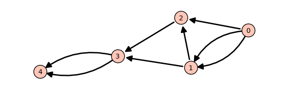

.. _tutorial-programming-python:

========================================
Tutorial: Programming in Python and Sage
========================================

.. linkall

.. MODULEAUTHOR:: Florent Hivert <florent.hivert@univ-rouen.fr>, Franco Saliola <saliola@gmail.com>, et al.

This tutorial is an introduction to basic programming in Python and Sage, for
readers with elementary notions of programming but not familiar with the Python
language. It is far from exhaustive. For a more complete tutorial, have a look
at the `Python Tutorial
<http://docs.python.org/release/2.6.4/tutorial/index.html>`_. Also Python's
`documentation <http://docs.python.org/release/2.6.4/>`_ and in particular the
`standard library <http://docs.python.org/release/2.6.4/library>`_ can be
useful.

A :ref:`more advanced tutorial <tutorial-objects-and-classes>` presents the
notions of objects and classes in Python.

Here are further resources to learn Python:

* `Learn Python in 10 minutes
  <http://www.korokithakis.net/tutorials/python>`_ ou en français
  `Python en 10 minutes
  <http://mat.oxyg3n.org/index.php?post/2009/07/26/Python-en-10-minutes>`_
* `Dive into Python <http://diveintopython.net/>`_
  is a Python book for experienced programmers. Also available in
  `other languages <http://diveintopython.net/#languages>`_.
* `Discover Python
  <http://www.ibm.com/developerworks/views/opensource/libraryview.jsp?search_by=Discover+Python+Part|>`_
  is a series of articles published in IBM's `developerWorks
  <http://www.ibm.com/developerworks/>`_ technical resource center.

Data structures
===============

In Python, *typing is dynamic*; there is no such thing as declaring variables.
The function :func:`type` returns the type of an object ``obj``. To convert an
object to a type ``typ`` just write ``typ(obj)`` as in ``int("123")``. The
command ``isinstance(ex, typ)`` returns whether the expression ``ex`` is of
type ``typ``. Specifically, any value is *an instance of a class* and there is
no difference between classes and types.

The symbol ``=`` denotes the affectation to a variable; it should not be
confused with ``==`` which denotes mathematical equality. Inequality is ``!=``.

The *standard types* are :class:`bool`, :class:`int`, :class:`list`,
:class:`tuple`, :class:`set`, :class:`dict`, :class:`str`.

* The type :class:`bool` (*booleans*) has two values: ``True`` and ``False``. The
  boolean operators are denoted by their names ``or``, ``and``, ``not``.

* The Python types :class:`int` and :class:`long` are used to
  represent integers of limited size. To handle arbitrary large
  integers with exact arithmetic, Sage uses its own type named
  :class:`Integer`.

* A *list* is a data structure which groups values. It is constructed using
  brackets as in ``[1, 3, 4]``. The :func:`range` function creates integer
  lists. One can also create lists using *list comprehension*::

      [ <expr> for <name> in <iterable> (if <condition>) ]

  For example::

      sage: [ i^2 for i in range(10) if i % 2 == 0 ]
      [0, 4, 16, 36, 64]

* A *tuple* is very similar to a list; it is constructed using
  parentheses. The empty tuple is obtained by ``()`` or by the
  constructor :class:`tuple`. If there is only one element, one has to
  write ``(a,)``. A tuple is *immutable* (one cannot change it) but it
  is *hashable* (see below). One can also create tuples using
  comprehensions::

      sage: tuple(i^2 for i in range(10) if i % 2 == 0)
      (0, 4, 16, 36, 64)

* A *set* is a data structure which contains values without
  multiplicities or order. One creates it from a list (or any
  iterable) with the constructor :class:`set`. The elements of a set
  must be hashable::

      sage: set([2,2,1,4,5])
      {1, 2, 4, 5}

      sage: set([ [1], [2] ])
      Traceback (most recent call last):
      ...
      TypeError: unhashable type: 'list'

* A *dictionary* is an association table, which associates values to
  keys. Keys must be hashable. One creates dictionaries using the
  constructor :class:`dict`, or using the syntax::

      {key1 : value1, key2 : value2 ...}

  For example::

      sage: age = {'toto' : 8, 'mom' : 27}; age
      {'mom': 27, 'toto': 8}

* Quotes (simple ``' '`` or double ``" "``) enclose *character
  strings*. One can concatenate them using ``+``.

* For lists, tuples, strings, and dictionaries, the *indexing
  operator* is written ``l[i]``. For lists, tuples, and strings one
  can also uses *slices* as ``l[:]``, ``l[:b]``, ``l[a:]``, or
  ``l[a:b]``. Negative indices start from the end.

* The :func:`len` function returns the number of elements of a list, a
  tuple, a set, a string, or a dictionary. One writes ``x in C`` to
  tests whether ``x`` is in ``C``.

* Finally there is a special value called ``None`` to denote the
  absence of a value.

Control structures
==================

In Python, there is no keyword for the beginning and the end of an
instructions block. Blocks are delimited solely by means of
indentation. Most of the time a new block is introduced by
``:``. Python has the following control structures:

* Conditional instruction::

     if <condition>:
         <instruction sequence>
     [elif <condition>:
         <instruction sequence>]*
     [else:
         <instruction sequence>]

* Inside expression exclusively, one can write::

   <value> if <condition> else <value>

* Iterative instructions::

     for <name> in <iterable>:
         <instruction sequence>
     [else:
         <instruction sequence>]

  ::

     while <condition>:
         <instruction sequence>
     [else:
         <instruction sequence>]

  The ``else`` block is executed at the end of the loop if the loop is
  ended normally, that is neither by a ``break`` nor an exception.

* In a loop, ``continue`` jumps to the next iteration.

* An iterable is an object which can be iterated through. Iterable
  types include lists, tuples, dictionaries, and strings.

* An error (also called exception) is raised by::

     raise <ErrorType> [, error message]

  Usual errors include ``ValueError`` and ``TypeError``.

Functions
=========

.. NOTE:: Python functions vs. mathematical functions

    In what follows, we deal with *functions* is the sense of
    *programming languages*. Mathematical functions, as manipulated in
    calculus, are handled by Sage in a different way. In particular it
    doesn't make sense to do mathematical manipulation such as
    additions or derivations on Python functions.

One defines a function using the keyword ``def`` as::

    def <name>(<argument list>):
         <instruction sequence>

The result of the function is given by the instruction
``return``. Very short functions can be created anonymously using
``lambda`` (remark that there is no instruction ``return`` here)::

    lambda <arguments>: <expression>

.. NOTE:: Functional programming

    Functions are objects as any other objects. One can assign them to
    variables or return them. For details, see the tutorial on
    :ref:`functional_programming`.

Exercises
=========

Lists
-----

Creating Lists I: [Square brackets]
^^^^^^^^^^^^^^^^^^^^^^^^^^^^^^^^^^^

**Example:**

::

    sage: L = [3, Permutation([5,1,4,2,3]), 17, 17, 3, 51]
    sage: L
    [3, [5, 1, 4, 2, 3], 17, 17, 3, 51]

**Exercise:** Create the list :math:`[63, 12, -10, \text{``a''}, 12]`,
assign it to the variable ``L``, and print the list.

::

    sage: # edit here

**Exercise:** Create the empty list (you will often need to do this).

::

    sage: # edit here

Creating Lists II: range
^^^^^^^^^^^^^^^^^^^^^^^^

The :func:`range` function provides an easy way to construct a list of
integers. Here is the documentation of the :func:`range` function::

    range([start,] stop[, step]) -> list of integers

    Return a list containing an arithmetic progression of integers.
    range(i, j) returns [i, i+1, i+2, ..., j-1]; start (!) defaults to 0.
    When step is given, it specifies the increment (or decrement). For
    example, range(4) returns [0, 1, 2, 3].  The end point is omitted!
    These are exactly the valid indices for a list of 4 elements.

**Exercise:** Use :func:`range` to construct the list `[1,2,\ldots,50]`.

::

    sage: # edit here

**Exercise:** Use :func:`range` to construct the list of *even*
numbers between 1 and 100 (including 100).

::

    sage: # edit here

**Exercise:** The ``step`` argument for the :func:`range` command can
be negative. Use range to construct the list `[10, 7, 4, 1, -2]`.

::

    sage: # edit here

.. SEEALSO::

    - :func:`xrange`: returns an iterator rather than building a list.
    - :func:`srange`: like range but with Sage integers; see below.
    - :func:`xsrange`: like xrange but with Sage integers.

Creating Lists III: list comprehensions
^^^^^^^^^^^^^^^^^^^^^^^^^^^^^^^^^^^^^^^

*List comprehensions* provide a concise way to create lists from other lists
(or other data types).

**Example** We already know how to create the list `[1, 2, \dots, 16]`::

    sage: range(1,17)
    [1, 2, 3, 4, 5, 6, 7, 8, 9, 10, 11, 12, 13, 14, 15, 16]

Using a *list comprehension*, we can now create the list
`[1^2, 2^2, 3^2, \dots, 16^2]` as follows::

    sage: [i^2 for i in range(1,17)]
    [1, 4, 9, 16, 25, 36, 49, 64, 81, 100, 121, 144, 169, 196, 225, 256]

::

    sage: sum([i^2 for i in range(1,17)])
    1496

**Exercise:** [`Project Euler, Problem 6 <http://projecteuler.net/index.php?section=problems&id=6>`_]

The sum of the squares of the first ten natural numbers is

.. math:: (1^2 + 2^2 + ... + 10^2) = 385

The square of the sum of the first ten natural numbers is

.. math:: (1 + 2 + ... + 10)^2 = 55^2 = 3025

Hence the difference between the sum of the squares of the first ten natural
numbers and the square of the sum is

.. math:: 3025 - 385 = 2640

Find the difference between the sum of the squares of the first one hundred
natural numbers and the square of the sum.

::

    sage: # edit here

::

    sage: # edit here

::

    sage: # edit here

Filtering lists with a list comprehension
~~~~~~~~~~~~~~~~~~~~~~~~~~~~~~~~~~~~~~~~~

A list can be *filtered* using a list comprehension.

**Example:** To create a list of the squares of the prime numbers between 1
and 100, we use a list comprehension as follows.

::

    sage: [p^2 for p in [1,2,..,100] if is_prime(p)]
    [4, 9, 25, 49, 121, 169, 289, 361, 529, 841, 961, 1369, 1681, 1849, 2209, 2809, 3481, 3721, 4489, 5041, 5329, 6241, 6889, 7921, 9409]

**Exercise:** Use a *list comprehension* to list all the natural numbers below
20 that are multiples of 3 or 5. Hint:

* To get the remainder of 7 divided by 3 use ``7%3``.
* To test for equality use two equal signs (``==``); for example, ``3 == 7``.

::

    sage: # edit here

`Project Euler, Problem 1 <http://projecteuler.net/index.php?section=problems&id=1>`_:
Find the sum of all the multiples of 3 or 5 below 1000.

::

    sage: # edit here

Nested list comprehensions
~~~~~~~~~~~~~~~~~~~~~~~~~~

List comprehensions can be nested!

**Examples:**

::

    sage: [(x,y) for x in range(5) for y in range(3)]
    [(0, 0), (0, 1), (0, 2), (1, 0), (1, 1), (1, 2), (2, 0), (2, 1), (2, 2), (3, 0), (3, 1), (3, 2), (4, 0), (4, 1), (4, 2)]

::

    sage: [[i^j for j in range(1,4)] for i in range(6)]
    [[0, 0, 0], [1, 1, 1], [2, 4, 8], [3, 9, 27], [4, 16, 64], [5, 25, 125]]

::

    sage: matrix([[i^j for j in range(1,4)] for i in range(6)])
    [  0   0   0]
    [  1   1   1]
    [  2   4   8]
    [  3   9  27]
    [  4  16  64]
    [  5  25 125]

**Exercise:**

1.  A *Pythagorean triple* is a triple `(x,y,z)` of *positive* integers satisfying
    `x^2+y^2=z^2`. The Pythagorean triples whose components are at most `10` are:

    .. math:: [(3, 4, 5), (4, 3, 5), (6, 8, 10), (8, 6, 10)]\,.

    Using a filtered list comprehension, construct the list of
    Pythagorean triples whose components are at most `50`::

        sage: # edit here

    ::

        sage: # edit here

#.  `Project Euler, Problem 9 <http://projecteuler.net/index.php?section=problems&id=9>`_:
    There exists exactly one Pythagorean triple for which `a + b + c = 1000`.
    Find the product `abc`::

        sage: # edit here

Accessing individual elements of lists
^^^^^^^^^^^^^^^^^^^^^^^^^^^^^^^^^^^^^^

To access an element of the list ``L``, use the syntax ``L[i]``, where `i` is the
index of the item.

**Exercise:**

1.  Construct the list ``L = [1,2,3,4,3,5,6]``. What is ``L[3]``?

    ::

        sage: # edit here

#.  What is ``L[1]``?

    ::

        sage: # edit here

#.  What is the index of the first element of ``L``?

    ::

        sage: # edit here

#.  What is ``L[-1]``? What is ``L[-2]``?

    ::

        sage: # edit here

#.  What is ``L.index(2)``? What is ``L.index(3)``?

    ::

        sage: # edit here

Modifying lists: changing an element in a list
^^^^^^^^^^^^^^^^^^^^^^^^^^^^^^^^^^^^^^^^^^^^^^

To change the item in position ``i`` of a list ``L``::

    sage: L = ["a", 4, 1, 8]
    sage: L
    ['a', 4, 1, 8]

::

    sage: L[2] = 0
    sage: L
    ['a', 4, 0, 8]

Modifying lists: append and extend
^^^^^^^^^^^^^^^^^^^^^^^^^^^^^^^^^^

To *append* an object to a list::

    sage: L = ["a", 4, 1, 8]
    sage: L
    ['a', 4, 1, 8]

::

    sage: L.append(17)
    sage: L
    ['a', 4, 1, 8, 17]

To *extend* a list by another list::

    sage: L1 = [1,2,3]
    sage: L2 = [7,8,9,0]
    sage: print L1
    [1, 2, 3]
    sage: print L2
    [7, 8, 9, 0]

::

    sage: L1.extend(L2)
    sage: L1
    [1, 2, 3, 7, 8, 9, 0]

Modifying lists: reverse, sort, ...
^^^^^^^^^^^^^^^^^^^^^^^^^^^^^^^^^^^

::

    sage: L = [4,2,5,1,3]
    sage: L
    [4, 2, 5, 1, 3]

::

    sage: L.reverse()
    sage: L
    [3, 1, 5, 2, 4]

::

    sage: L.sort()
    sage: L
    [1, 2, 3, 4, 5]

::

    sage: L = [3,1,6,4]
    sage: sorted(L)
    [1, 3, 4, 6]

::

    sage: L
    [3, 1, 6, 4]

Concatenating Lists
^^^^^^^^^^^^^^^^^^^

To concatenate two lists, add them with the operator ``+``. This is
not a commutative operation!

::

    sage: L1 = [1,2,3]
    sage: L2 = [7,8,9,0]
    sage: L1 + L2
    [1, 2, 3, 7, 8, 9, 0]

Slicing Lists
^^^^^^^^^^^^^

You can slice a list using the syntax ``L[start : stop : step]``. This will
return a sublist of ``L``.

**Exercise:** Below are some examples of slicing lists. Try to guess
what the output will be before evaluating the cell::

    sage: L = range(20)
    sage: L
    [0, 1, 2, 3, 4, 5, 6, 7, 8, 9, 10, 11, 12, 13, 14, 15, 16, 17, 18, 19]

::

    sage: L[3:15]
    [3, 4, 5, 6, 7, 8, 9, 10, 11, 12, 13, 14]

::

    sage: L[3:15:2]
    [3, 5, 7, 9, 11, 13]

::

    sage: L[15:3:-1]
    [15, 14, 13, 12, 11, 10, 9, 8, 7, 6, 5, 4]

::

    sage: L[:4]
    [0, 1, 2, 3]

::

    sage: L[:]
    [0, 1, 2, 3, 4, 5, 6, 7, 8, 9, 10, 11, 12, 13, 14, 15, 16, 17, 18, 19]

::

    sage: L[::-1]
    [19, 18, 17, 16, 15, 14, 13, 12, 11, 10, 9, 8, 7, 6, 5, 4, 3, 2, 1, 0]

**Exercise (Advanced):** The following function combines a loop with
some of the list operations above. What does the function do?

::

    sage: def f(number_of_iterations):
    ....:     L = [1]
    ....:     for n in range(2, number_of_iterations):
    ....:         L = [sum(L[:i]) for i in range(n-1, -1, -1)]
    ....:     return numerical_approx(2*L[0]*len(L)/sum(L), digits=50)

.. ::

..    sage: f(10)
..    3.1413810483870967741935483870967741935483870967742

::

    sage: # edit here

Tuples
------

A *tuple* is an *immutable* list. That is, it cannot be changed once
it is created. This can be useful for code safety and foremost because
it makes tuple *hashable*. To create a tuple, use parentheses instead
of brackets::

    sage: t = (3, 5, [3,1], (17,[2,3],17), 4)
    sage: t
    (3, 5, [3, 1], (17, [2, 3], 17), 4)

To create a singleton tuple, a comma is required to resolve the
ambiguity::

    sage: (1)
    1
    sage: (1,)
    (1,)

We can create a tuple from a list, and vice-versa.

::

    sage: tuple(range(5))
    (0, 1, 2, 3, 4)

::

    sage: list(t)
    [3, 5, [3, 1], (17, [2, 3], 17), 4]

Tuples behave like lists in many respects:

+--------------------+-----------------------+-----------------------+
| Operation          | Syntax for lists      | Syntax for tuples     |
+====================+=======================+=======================+
| Accessing a letter | ``list[3]``           | ``tuple[3]``          |
+--------------------+-----------------------+-----------------------+
| Concatenation      | ``list1 + list2``     | ``tuple1 + tuple2``   |
+--------------------+-----------------------+-----------------------+
| Slicing            | ``list[3:17:2]``      | ``tuple[3:17:2]``     |
+--------------------+-----------------------+-----------------------+
| A reversed copy    | ``list[::-1]``        | ``tuple[::-1]``       |
+--------------------+-----------------------+-----------------------+
| Length             | ``len(list)``         | ``len(tuple)``        |
+--------------------+-----------------------+-----------------------+

Trying to modify a tuple will fail::

    sage: t = (5, 'a', 6/5)
    sage: t
    (5, 'a', 6/5)

::

    sage: t[1] = 'b'
    Traceback (most recent call last):
    ...
    TypeError: 'tuple' object does not support item assignment

Generators
----------

"Tuple-comprehensions" do not exist. Instead, the syntax produces
something called a generator. A generator allows you to process a
sequence of items one at a time. Each item is created when it is
needed, and then forgotten. This can be very efficient if we only need
to use each item once.

::

    sage: (i^2 for i in range(5))
    <generator object <genexpr> at 0x...>

::

    sage: g = (i^2 for i in range(5))
    sage: g[0]
    Traceback (most recent call last):
    ...
    TypeError: 'generator' object has no attribute '__getitem__'

::

    sage: [x for x in g]
    [0, 1, 4, 9, 16]

``g`` is now empty.

::

    sage: [x for x in g]
    []

A nice 'pythonic' trick is to use generators as argument of
functions. We do *not* need double parentheses for this::

    sage: sum( i^2 for i in srange(100001) )
    333338333350000

Dictionaries
------------

A *dictionary* is another built-in data type. Unlike lists, which are
indexed by a range of numbers starting at 0, dictionaries are indexed
by *keys*, which can be any immutable objects. Strings and numbers can
always be keys (because they are immutable). Dictionaries are
sometimes called "associative arrays" in other programming languages.

There are several ways to define dictionaries. One method is to use
braces, ``{}``, with comma-separated entries given in the form
*key:value*::

    sage: d = {3:17, 0.5:[4,1,5,2,3], 0:"goo", 3/2 : 17}
    sage: d
    {0: 'goo', 0.500000000000000: [4, 1, 5, 2, 3], 3/2: 17, 3: 17}

A second method is to use the constructor :class:`dict` which admits a
list (or actually any iterable) of 2-tuples *(key, value)*::

    sage: dd = dict((i,i^2) for i in xrange(10))
    sage: dd
    {0: 0, 1: 1, 2: 4, 3: 9, 4: 16, 5: 25, 6: 36, 7: 49, 8: 64, 9: 81}

Dictionaries behave as lists and tuples for several important operations.

+--------------------+-----------------------+-----------------------------+
| Operation          | Syntax for lists      | Syntax for dictionaries     |
+====================+=======================+=============================+
| Accessing elements | ``list[3]``           | ``D["key"]``                |
+--------------------+-----------------------+-----------------------------+
| Length             | ``len(list)``         | ``len(D)``                  |
+--------------------+-----------------------+-----------------------------+
| Modifying          | ``L[3] = 17``         | ``D["key"] = 17``           |
+--------------------+-----------------------+-----------------------------+
| Deleting items     | ``del L[3]``          | ``del D["key"]``            |
+--------------------+-----------------------+-----------------------------+

::

    sage: d[10]='a'
    sage: d
    {0: 'goo', 0.500000000000000: [4, 1, 5, 2, 3], 3/2: 17, 3: 17, 10: 'a'}

A dictionary can have the same value multiple times, but each key must only
appear once and must be immutable::

    sage: d = {3: 14, 4: 14}
    sage: d
    {3: 14, 4: 14}

::

    sage: d = {3: 13, 3: 14}
    sage: d
    {3: 14}

::

    sage: d = {[1,2,3] : 12}
    Traceback (most recent call last):
    ...
    TypeError: unhashable type: 'list'

Another way to add items to a dictionary is with the ``update()`` method which
updates the dictionary from another dictionary::

    sage: d = {}
    sage: d
    {}

::

    sage: d.update({10 : 'newvalue', 20: 'newervalue', 3: 14, 0.5:[1,2,3]})
    sage: d
    {0.500000000000000: [1, 2, 3], 3: 14, 10: 'newvalue', 20: 'newervalue'}

We can iterate through the *keys*, or *values*, or both, of a
dictionary. Note that, internally, there is no sorting of keys
done. In general, the order of keys/values will depend on memory
locations can and will differ between different computers and / or
repeated runs on the same computer. However, Sage sort the dictionary
entries by key when printing the dictionary specifically to make the
docstrings more reproducible. However, the Python methods ``keys()``
and ``values()`` do not sort for you. If you want your output to be
reproducable, then you have to sort it first just like in the examples
below::

    sage: d = {10 : 'newvalue', 20: 'newervalue', 3: 14, 0.5:(1,2,3)}

::

    sage: sorted([key for key in d])
    [0.500000000000000, 3, 10, 20]

::

    sage: d.keys()   # random order
    [0.500000000000000, 10, 3, 20]
    sage: sorted(d.keys())
    [0.500000000000000, 3, 10, 20]

::

    sage: d.values()   # random order
    [(1, 2, 3), 'newvalue', 14, 'newervalue']
    sage: set(d.values()) == set([14, (1, 2, 3), 'newvalue', 'newervalue'])
    True

::

    sage: d.items()    # random order
    [(0.500000000000000, (1, 2, 3)), (10, 'newvalue'), (3, 14), (20, 'newervalue')]
    sage: sorted([(key, value) for key, value in d.items()])
    [(0.500000000000000, (1, 2, 3)), (3, 14), (10, 'newvalue'), (20, 'newervalue')]

**Exercise:** Consider the following directed graph.

Create a dictionary whose keys are the vertices of the above directed graph,
and whose values are the lists of the vertices that it points to. For
instance, the vertex 1 points to the vertices 2 and 3, so the dictionary will
look like::

    d = { ..., 1:[2,3], ... }

::

    sage: # edit here

Then try:

.. skip

::

    sage: g = DiGraph(d)
    sage: g.plot()

Using Sage types: The srange command
------------------------------------

**Example:** Construct a `3 \times 3` matrix whose `(i,j)` entry is
the rational number `\frac{i}{j}`. The integers generated by
:func:`range` are Python :class:`int`'s. As a consequence, dividing
them does euclidean division::

    sage: matrix([[ i/j for j in range(1,4)] for i in range(1,4)])
    [1 0 0]
    [2 1 0]
    [3 1 1]

Whereas dividing a Sage :class:`Integer` by a Sage :class:`Integer`
produces a rational number::

    sage: matrix([[ i/j for j in srange(1,4)] for i in srange(1,4)])
    [  1 1/2 1/3]
    [  2   1 2/3]
    [  3 3/2   1]

Modifying lists has consequences!
---------------------------------

Try to predict the results of the following commands::

    sage: a = [1, 2, 3]
    sage: L = [a, a, a]
    sage: L
    [[1, 2, 3], [1, 2, 3], [1, 2, 3]]

::

    sage: a.append(4)
    sage: L
    [[1, 2, 3, 4], [1, 2, 3, 4], [1, 2, 3, 4]]

Now try these::

    sage: a = [1, 2, 3]
    sage: L = [a, a, a]
    sage: L
    [[1, 2, 3], [1, 2, 3], [1, 2, 3]]

::

    sage: a = [1, 2, 3, 4]
    sage: L
    [[1, 2, 3], [1, 2, 3], [1, 2, 3]]

::

    sage: L[0].append(4)
    sage: L
    [[1, 2, 3, 4], [1, 2, 3, 4], [1, 2, 3, 4]]

This is known as the *reference effect*. You can use the command
:func:`deepcopy` to avoid this effect::

    sage: a = [1,2,3]
    sage: L = [deepcopy(a), deepcopy(a)]
    sage: L
    [[1, 2, 3], [1, 2, 3]]

::

    sage: a.append(4)
    sage: L
    [[1, 2, 3], [1, 2, 3]]

The same effect occurs with dictionaries::

    sage: d = {1:'a', 2:'b', 3:'c'}
    sage: dd = d
    sage: d.update( { 4:'d' } )
    sage: dd
    {1: 'a', 2: 'b', 3: 'c', 4: 'd'}

Loops and Functions
===================

For more verbose explanation of what's going on here, a good place to look at
is the following section of the Python tutorial:
http://docs.python.org/tutorial/controlflow.html

*While* Loops
-------------

*While* loops tend not to be used nearly as much as *for* loops in Python code::

    sage: i = 0
    sage: while i < 10:
    ....:     print i
    ....:     i += 1
    0
    1
    2
    3
    4
    5
    6
    7
    8
    9

::

    sage: i = 0
    sage: while i < 10:
    ....:     if i % 2 == 1:
    ....:         i += 1
    ....:         continue
    ....:     print i
    ....:     i += 1
    0
    2
    4
    6
    8

Note that the truth value of the clause expression in the *while* loop
is evaluated using :class:`bool`::

    sage: bool(True)
    True

::

    sage: bool('a')
    True

::

    sage: bool(1)
    True

::

    sage: bool(0)
    False

.. skip

::

    sage: i = 4
    sage: while i:
    ....:     print i
    ....:     i -= 1
    4
    3
    2
    1

*For* Loops
-----------

Here is a basic *for* loop iterating over all of the elements in the list ``l``::

    sage: l = ['a', 'b', 'c']
    sage: for letter in l:
    ....:     print letter
    a
    b
    c

The :func:`range` function is very useful when you want to generate
arithmetic progressions to loop over. Note that the end point is never
included:

.. skip

::

    sage: range?

::

    sage: range(4)
    [0, 1, 2, 3]

::

    sage: range(1, 5)
    [1, 2, 3, 4]

::

    sage: range(1, 11, 2)
    [1, 3, 5, 7, 9]

::

    sage: range(10, 0, -1)
    [10, 9, 8, 7, 6, 5, 4, 3, 2, 1]

::

    sage: for i in range(4):
    ....:     print i, i*i
    0 0
    1 1
    2 4
    3 9

You can use the *continue* keyword to immediately go to the next item
in the loop::

    sage: for i in range(10):
    ....:     if i % 2 == 0:
    ....:         continue
    ....:     print i
    1
    3
    5
    7
    9

If you want to break out of the loop, use the *break* keyword::

    sage: for i in range(10):
    ....:     if i % 2 == 0:
    ....:         continue
    ....:     if i == 7:
    ....:         break
    ....:     print i
    1
    3
    5

If you need to keep track of both the position in the list and its
value, one (not so elegant) way would be to do the following::

    sage: l = ['a', 'b', 'c']
    sage: for i in range(len(l)):
    ....:     print i, l[i]
    0 a
    1 b
    2 c

It's cleaner to use :func:`enumerate` which provides the index as well
as the value::

    sage: l = ['a', 'b', 'c']
    sage: for i, letter in enumerate(l):
    ....:     print i, letter
    0 a
    1 b
    2 c

You could get a similar result to the result of the :func:`enumerate`
function by using :func:`zip` to zip two lists together:

::

    sage: l = ['a', 'b', 'c']
    sage: for i, letter in zip(range(len(l)), l):
    ....:     print i, letter
    0 a
    1 b
    2 c

*For* loops work using Python's iterator protocol. This allows all
sorts of different objects to be looped over. For example::

    sage: for i in GF(5):
    ....:     print i, i*i
    0 0
    1 1
    2 4
    3 4
    4 1

How does this work?

::

    sage: it = iter(GF(5)); it
    <generator object __iter__ at 0x...>

    sage: next(it)
    0

    sage: next(it)
    1

    sage: next(it)
    2

    sage: next(it)
    3

    sage: next(it)
    4

    sage: next(it)
    Traceback (most recent call last):
    ...
    StopIteration

.. skip

::

    sage: R = GF(5)
    sage: R.__iter__??

The command *yield* provides a very convenient way to produce
iterators.  We'll see more about it in a bit.

Exercises
^^^^^^^^^

For each of the following sets, compute the list of its elements and
their sum. Use two different ways, if possible: with a loop, and using
a list comprehension.

1.  The first `n` terms of the harmonic series:

    .. MATH:: \sum_{i=1}^n \frac{1}{i}

    ::

        sage: # edit here

#.  The odd integers between `1` and `n`::

        sage: # edit here

#.  The first `n` odd integers::

        sage: # edit here

#.  The integers between `1` and `n` that are neither divisible by `2`
    nor by `3` nor by `5`::

        sage: # edit here

#.  The first `n` integers between `1` and `n` that are neither
    divisible by `2` nor by `3` nor by `5`::

       sage: # edit here

Functions
---------

Functions are defined using the *def* statement, and values are
returned using the *return* keyword::

    sage: def f(x):
    ....:     return x*x

::

    sage: f(2)
    4

Functions can be recursive::

    sage: def fib(n):
    ....:     if n <= 1:
    ....:         return 1
    ....:     else:
    ....:         return fib(n-1) + fib(n-2)

::

    sage: [fib(i) for i in range(10)]
    [1, 1, 2, 3, 5, 8, 13, 21, 34, 55]

Functions are first class objects like any other. For example, they
can be passed in as arguments to other functions::

    sage: f
    <function f at 0x...>

::

    sage: def compose(f, x, n):   # computes f(f(...f(x)))
    ....:     for i in range(n):
    ....:         x = f(x)        # this change is local to this function call!
    ....:     return x

::

    sage: compose(f, 2, 3)
    256

::

    sage: def add_one(x):
    ....:     return x + 1

::

    sage: compose(add_one, 2, 3)
    5

You can give default values for arguments in functions::

    sage: def add_n(x, n=1):
    ....:     return x + n

::

    sage: add_n(4)
    5

::

    sage: add_n(4, n=100)
    104

::

    sage: add_n(4, 1000)
    1004

You can return multiple values from a function::

    sage: def g(x):
    ....:     return x, x*x

::

    sage: g(2)
    (2, 4)

::

    sage: type(g)
    <type 'function'>

::

    sage: a,b = g(100)

::

    sage: a
    100

::

    sage: b
    10000

You can also take a variable number of arguments and keyword arguments
in a function::

    sage: def h(*args, **kwds):
    ....:     print type(args), args
    ....:     print type(kwds), kwds

::

    sage: h(1,2,3,n=4)
    <type 'tuple'> (1, 2, 3)
    <type 'dict'> {'n': 4}

Let's use the *yield* instruction to make a generator for the
Fibonacci numbers up to `n`::

    sage: def fib_gen(n):
    ....:     if n < 1:
    ....:         return
    ....:     a = b = 1
    ....:     yield b
    ....:     while b < n:
    ....:         yield b
    ....:         a, b = b, b+a

::

    sage: for i in fib_gen(50):
    ....:     print i
    1
    1
    2
    3
    5
    8
    13
    21
    34

Exercises
^^^^^^^^^

1.  Write a function ``is_even`` which returns ``True`` if ``n`` is
    even and ``False`` otherwise.

#.  Write a function ``every_other`` which takes a list ``l`` as input
    and returns a list containing every other element of ``l``.

#.  Write a generator ``every_other`` which takes an iterable ``l`` as
    input, and returns every other element of ``l``, one after the
    other.

#.  Write a function which computes the `n`-th Fibonacci number. Try
    to improve performance.

.. TODO::

    - Definition of ``hashable``
    - Introduction to the debugger.

